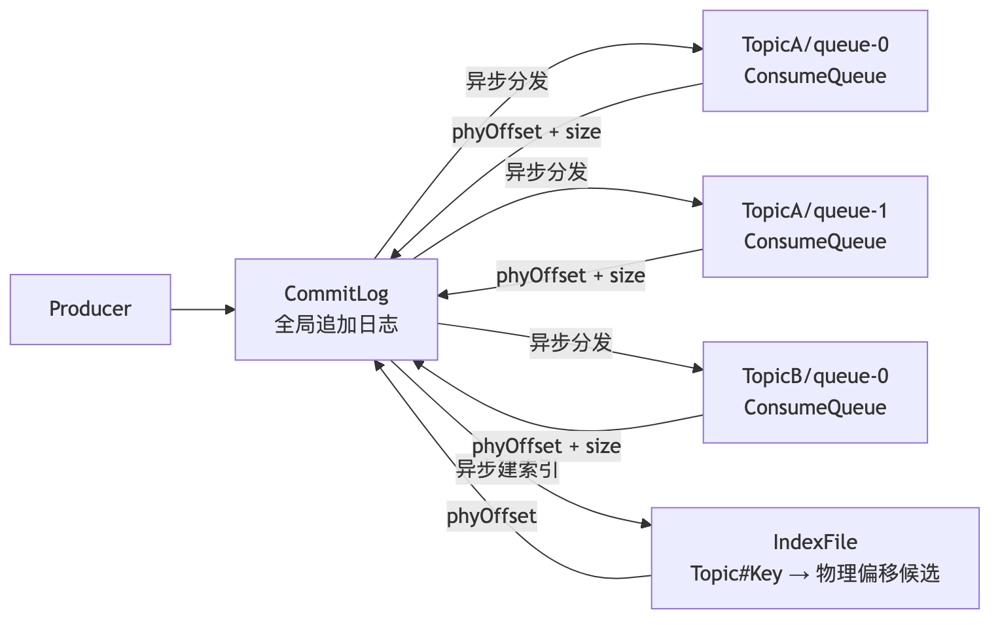
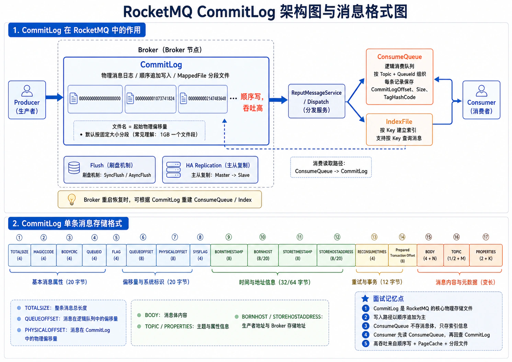
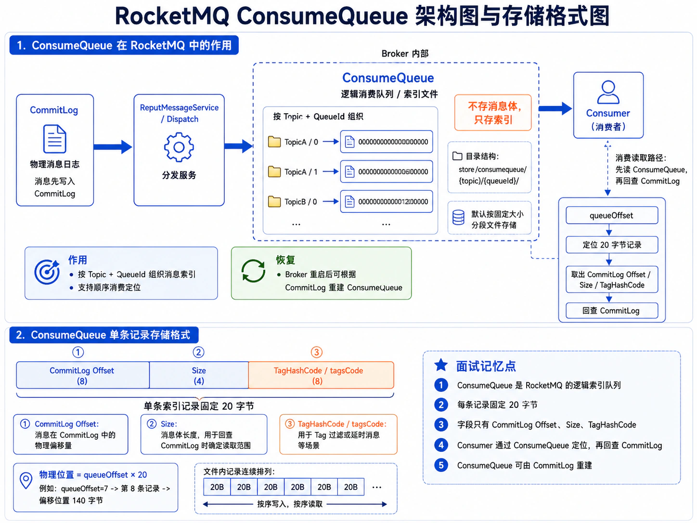
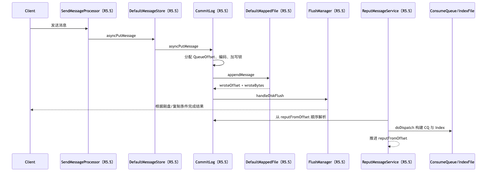
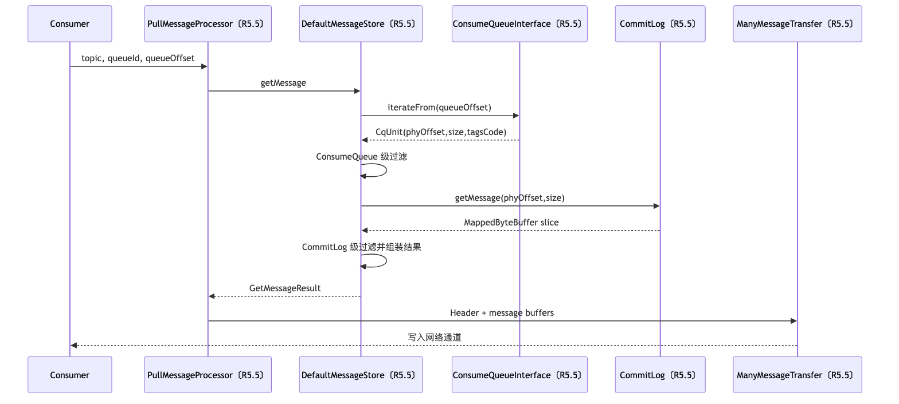
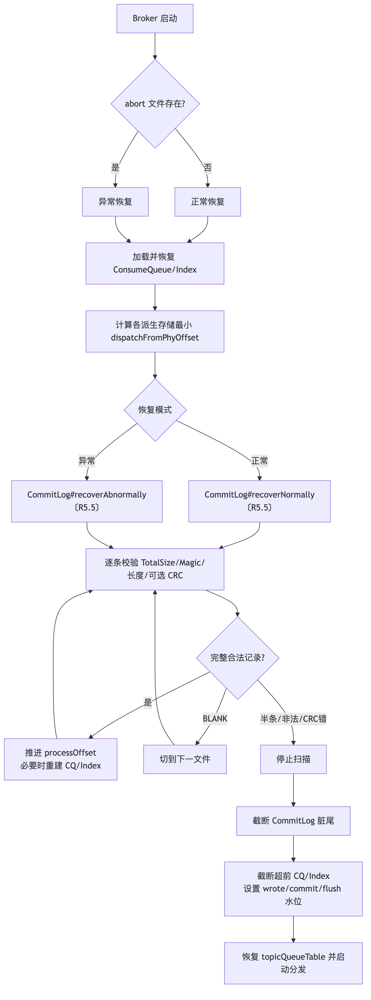

# 第 7 章：RocketMQ 存储引擎：CommitLog、ConsumeQueue、IndexFile 与文件恢复

> **版本基线**：Apache RocketMQ **5.5.0**，源码 tag：`rocketmq-all-5.5.0`。本文用 `〔R5.5〕` 标记该 tag 下的 Java 源码类与方法；没有该标记的代码仅为概念或 Go 教学代码。经典文件型 ConsumeQueue 是本章主线，RocksDB ConsumeQueue 的现状单独说明。

## 本章去重边界与跳转

本章是 CommitLog、ConsumeQueue、IndexFile、MappedFile、刷盘和文件恢复的主讲章节。上层可靠性和运维问题只从存储机制角度解释。

| 重复主题 | 本章处理方式 |
| --- | --- |
| Broker 在整体架构中的职责 | 本章只讲 Broker 的存储面；组件全景看 [第 2 章：整体架构、核心组件与领域模型](/blog/tech/RocketMQ/02.RocketMQ整体架构、核心组件与领域模型)。 |
| 发送成功、刷盘、复制与不丢消息 | 本章讲本地写入和刷盘；端到端可靠性看 [第 8 章](/blog/tech/RocketMQ/08.端到端消息可靠性、重试、死信队列与消费幂等)，主从复制和 ACK 时机看 [第 13 章：高可用](/blog/tech/RocketMQ/13.RocketMQ高可用)。 |
| MessageKey、IndexFile 查询语义和资源治理 | 本章讲索引文件结构；Key 的业务定位看 [第 12 章：资源治理](/blog/tech/RocketMQ/12.Topic、Tag、Key、SQL92、MessageQueue与资源治理)。 |
| Page Cache、冷读、容量和压测 | 本章讲机制；性能调优和容量规划看 [第 14 章：性能优化、流控、压测与容量规划](/blog/tech/RocketMQ/14.RocketMQ性能优化、流控、压测与容量规划)。 |
| 源码调用链 | 本章讲机制模型；源码入口看 [第 18 章：源码阅读](/blog/tech/RocketMQ/18.RocketMQ源码阅读：发送、存储、消费、事务与高可用调用链)。 |

## 7.1 学习目标与场景导入

学完本章，你应当能够在白板上解释四件事：消息为什么先写一份全局 CommitLog；消费者为何不直接扫描 CommitLog；Broker 异常退出后如何找到最后一条完整消息；同步刷盘、异步刷盘、Page Cache 与“零拷贝”分别保证了什么、又没有保证什么。

设想一个订单 Topic 有 8 个 MessageQueue。生产者持续向 8 个队列写入，消费者组按队列并行消费，同时运维人员还会按 MessageKey 查询订单。若为每个队列各维护一份包含完整消息体的日志，Broker 将面对大量文件、随机写和重复存储。RocketMQ 的经典方案是：**所有普通消息先顺序追加到 CommitLog；每个逻辑队列只保存轻量定位条目；按 Key 查询再维护独立哈希索引。** CommitLog 是事实来源，ConsumeQueue 与 IndexFile 都是可由它重新构建的派生结构。



## 7.2 三类文件与关键数据结构

默认根目录是 `${user.home}/store`。经典文件布局可抽象为：

```text
store/
├── commitlog/
│   ├── 00000000000000000000
│   └── 00000000001073741824
├── consumequeue/
│   └── TopicA/
│       ├── 0/00000000000000000000
│       └── 1/00000000000000000000
├── index/
│   └── 20260620123000123
├── checkpoint
└── abort
```

文件名不是消息编号，而是该文件覆盖区域的**起始字节偏移**。默认 CommitLog 单文件大小为 1 GiB，因此第二个文件名是 `1073741824` 的 20 位十进制补零形式。经典 ConsumeQueue 单文件默认 6,000,000 字节，每条 20 字节，可容纳 300,000 个定位条目。

| 结构 | 单元布局 | 主要用途 | 关键源码〔R5.5〕 |
|---|---|---|---|
| CommitLog 文件 | 变长消息记录，文件尾可能有 BLANK 填充 | 保存完整消息，是恢复与重建的依据 | `CommitLog〔R5.5〕`、`MessageExtEncoder〔R5.5〕` |
| Simple ConsumeQueue | `phyOffset:8 + size:4 + tagsCode:8 = 20B` | 由队列逻辑位点快速定位 CommitLog，并做 Tag 预过滤 | `ConsumeQueue〔R5.5〕`、`ConsumeQueueStore〔R5.5〕` |
| IndexFile Header | 40B：起止时间、起止物理偏移、slot 数、index 数 | 描述单个索引文件 | `IndexHeader〔R5.5〕` |
| Hash Slot | 4B，保存该槽最新 index 序号 | 哈希桶入口 | `IndexFile〔R5.5〕` |
| Index Unit | `keyHash:4 + phyOffset:8 + timeDiff:4 + prevIndex:4 = 20B` | 形成同槽反向链表 | `IndexFile〔R5.5〕` |
| MappedFile 状态 | `wrotePosition / committedPosition / flushedPosition` | 区分写入、提交到文件通道、刷入稳定介质的进度 | `DefaultMappedFile〔R5.5〕` |
| StoreCheckpoint | 物理、逻辑、索引等时间戳与确认位点 | 缩小恢复扫描范围 | `StoreCheckpoint〔R5.5〕` |


### 7.2.1 主记录与派生记录的三个不变量

理解存储引擎时，不要只背目录结构，还要抓住三个贯穿写入、读取与恢复的不变量。

第一，**任何可见的 ConsumeQueue 条目都必须指向一条边界完整的 CommitLog 记录**。CQ 不能只写物理 offset 而不确认 size，也不能越过当前允许分发的 CommitLog 水位。若 CQ 超前，消费者会读到不存在、未确认或已经被截断的物理位置；因此恢复结束时必须用 `DefaultMessageStore#truncateDirtyLogicFiles〔R5.5〕` 把逻辑索引收回到物理合法边界。

第二，**同一 Topic、同一 queueId 的 QueueOffset 必须单调且无乱序提交**。消息在 CommitLog 中可以与其他队列交错，但写入某条 CQ 时，期望逻辑位置始终是 `queueOffset × unitSize`。`ConsumeQueue#putMessagePositionInfo〔R5.5〕` 会比较期望位置与当前写位置；重复构建可以幂等跳过，真正的缺口或倒序则意味着状态不一致。并发 Reput 能并行解析，却仍必须在提交阶段维护这个顺序约束。

第三，**IndexFile 只提供候选集合，不改变消息事实**。索引缺失、重复或哈希碰撞不会让 CommitLog 中的消息消失，也不应改变队列消费结果。这个不变量决定了故障处理优先级：先保护和验证 CommitLog，再对齐 CQ，最后处理可选索引。

还应区分三个经常被混为一谈的概念：写入成功是 API 结果；持久化成功是刷盘或复制条件已满足；消费可见是 CQ 已构建并进入可读水位。三者在同步刷盘、异步刷盘和 Reput 落后时可能发生在不同时间点。

## 7.3 CommitLog：为什么选择全局追加写

下面这张图把 CommitLog 的主写路径、Reput 分发、ConsumeQueue / IndexFile 派生结构，以及单条消息记录格式放在同一张图中，后续小节会逐层拆开。



### 7.3.1 追加写的核心收益

磁盘和文件系统最擅长处理大块、连续、可合并的写入。RocketMQ 把来自不同 Topic、不同 MessageQueue 的消息汇聚到少量 CommitLog 文件尾部，避免“每个队列一个完整日志”带来的多文件随机写。追加模型还让物理偏移天然单调递增，复制、刷盘、恢复和过期删除都能围绕一个连续水位工作。

**为什么 CommitLog 顺序写性能高？** 不是因为顺序写“没有磁盘开销”，而是因为它减少寻址和元数据更新，便于操作系统合并脏页、块层调度和设备内部并行；同时，单调偏移使锁竞争、批量刷盘与主从复制更容易组织。在 SSD 上虽然没有机械寻道，连续大块写仍通常比大量小随机写更利于队列深度、写放大控制和吞吐稳定性。

但“顺序写”只描述逻辑访问模式。若磁盘饱和、频繁强制刷盘、Page Cache 回写拥塞、文件系统抖动或同盘混部严重，追加写同样会出现长尾。

### 7.3.2 文件组织与逻辑物理偏移

`MappedFileQueue#getLastMappedFile〔R5.5〕` 维护按起始偏移排序的固定大小文件。全局物理偏移满足：

```text
physicalOffset = fileFromOffset + positionInFile
fileIndex ≈ (physicalOffset - firstFileFromOffset) / mappedFileSize
```

写入时若当前文件放不下完整消息，`DefaultAppendMessageCallback#doAppend〔R5.5〕` 写入 `BLANK_MAGIC_CODE` 和剩余长度，返回 `END_OF_FILE`；`CommitLog#asyncPutMessage〔R5.5〕` 切换到下一个文件后重新写整条消息。因此，正常情况下消息不会跨两个 CommitLog 文件。

需要区分三个 offset：

| Offset | 含义 |
|---|---|
| CommitLog physical offset | 消息记录在全局 CommitLog 中的字节位置，能唯一定位物理记录 |
| QueueOffset | 某 Topic、某 queueId 内的逻辑消息序号，消费者进度以它为核心 |
| ConsumerOffset | 某 ConsumerGroup 已提交到某 MessageQueue 的消费进度，不存于消息记录本身 |

### 7.3.3 消息记录格式

`MessageExtEncoder#calMsgLength〔R5.5〕` 与 `MessageExtEncoder#encode〔R5.5〕` 给出的单消息布局如下。V1 Topic 长度占 1 字节，V2 占 2 字节；IPv4 地址段为 8 字节，IPv6 为 20 字节。

| 顺序 | 字段 | 长度 | 作用 |
|---:|---|---:|---|
| 1 | TOTALSIZE | 4 | 整条记录长度，是顺序扫描与跳转的基础 |
| 2 | MAGICCODE | 4 | 区分合法消息、V2 消息和文件尾 BLANK |
| 3 | BODYCRC | 4 | 默认恢复时可校验消息体 |
| 4–5 | QUEUEID、FLAG | 4 + 4 | 逻辑队列和应用标记 |
| 6 | QUEUEOFFSET | 8 | 队列内逻辑位点 |
| 7 | PHYSICALOFFSET | 8 | 该记录在 CommitLog 的绝对偏移 |
| 8 | SYSFLAG | 4 | 事务、压缩、主机地址版本等标志 |
| 9–12 | Born/Store 时间与地址 | 变长 | 产生与落库元数据 |
| 13–14 | RECONSUMETIMES、PreparedTransactionOffset | 4 + 8 | 重试与事务关联 |
| 15 | BODYLEN + BODY | 4 + N | 消息体 |
| 16 | TOPICLEN + TOPIC | 1/2 + N | Topic |
| 17 | PROPERTIESLEN + PROPERTIES | 2 + N | Key、Tag、延迟、事务等属性 |

记录的 TOTALSIZE、MagicCode、字段长度和 CRC 共同构成恢复边界。只看文件长度并不能判断尾部是否是一条完整消息。

## 7.4 ConsumeQueue：从队列位点到物理消息

下面这张图把 ConsumeQueue 的派生路径、按 Topic + QueueId 组织的目录结构、20 字节定长索引记录，以及 Consumer 通过 queueOffset 回查 CommitLog 的读取路径放在一起。



### 7.4.1 为什么不让消费者扫描 CommitLog

CommitLog 中不同 Topic 和队列交错排列。消费者请求 `TopicA/queue-3` 的第 10000 个逻辑位点时，若扫描 CommitLog，需要解析并跳过海量无关记录。经典 Simple ConsumeQueue 为每个 `topic + queueId` 建一条定长逻辑索引：第 `N` 条记录位于字节位置 `N × 20`，其中保存物理偏移、记录长度和 Tag 哈希。

`ConsumeQueue#getIndexBuffer〔R5.5〕` 或当前抽象接口的迭代路径可直接计算文件与文件内位置；取出 `phyOffset + size` 后，再由 `CommitLog#getMessage〔R5.5〕` 定位完整消息。这相当于把昂贵的“在混合日志里查找”变成“读一个紧凑定长条目，再读目标消息”。

**ConsumeQueue 为什么能提高消费效率？** 因为它具备四个特征：条目小、定长、按队列连续、可先用 tagsCode 过滤。一次顺序扫描可覆盖大量逻辑位点，缓存命中率远高于扫描变长 CommitLog；只有候选消息才触碰消息体。它不是消息副本，而是从逻辑队列到物理日志的稀疏程度为 1:1 的定位表。

### 7.4.2 一个 Topic 的多个 MessageQueue 如何落盘

同一 Topic 的多个队列共用 CommitLog，但每个 queueId 拥有独立 ConsumeQueue 目录和逻辑 offset 空间。例如：

```text
TopicA queue-0: CQ[0] -> CommitLog@1200
TopicA queue-1: CQ[0] -> CommitLog@1470
TopicA queue-0: CQ[1] -> CommitLog@1760
```

CommitLog 仍按 Broker 接收顺序交错；queue-0 的 CQ 则只串联属于 queue-0 的物理位置。队列扩容会创建新的逻辑索引序列，不会把旧消息重新分片，也不会把 CommitLog 按 Topic 拆开。

## 7.5 IndexFile、MessageKey 与哈希冲突

`IndexService#buildIndex〔R5.5〕` 会把唯一键和业务 Keys 组合成 `topic#key`，交给 `IndexFile#putKey〔R5.5〕`。哈希槽计算可概括为：

```text
slot = positiveHash(topic#key) % hashSlotNum
```

每个槽只保存最新 index 序号；新 Index Unit 的 `prevIndex` 指向该槽之前的记录，形成反向链。查询时，`IndexFile#selectPhyOffset〔R5.5〕` 从槽头向旧记录回溯，同时用时间窗口裁剪。

哈希冲突不能被“链表”消除。Index Unit 只保存 32 位 keyHash，不保存完整 Key；不同 Key 若 hash 相同，会成为同一候选。5.5.0 的 `DefaultMessageStore#queryMessage〔R5.5〕` 根据候选物理偏移读取 CommitLog 并返回消息，但该方法本身没有对完整业务 Key 做最终等值过滤。因此，**按 Key 查询是辅助检索，不应承担数据库唯一索引语义；要求严格匹配时，调用方应核验消息属性中的 Key。** IndexFile 损坏或滞后也不影响按队列消费，但会影响按 Key 检索。

默认配置下，一个 IndexFile 包含 40 字节 Header、500 万个 4 字节槽、最多 2000 万个 20 字节索引单元，文件约 420,000,040 字节。文件满后创建新文件，查询通常从新文件向旧文件回溯。

## 7.6 写入与异步分发链路



主写调用链可记为：

```text
SendMessageProcessor#processRequest〔R5.5〕
→ DefaultMessageStore#asyncPutMessage〔R5.5〕
→ CommitLog#asyncPutMessage〔R5.5〕
→ DefaultMessageStore#assignOffset〔R5.5〕
→ MessageExtEncoder#encode〔R5.5〕
→ MappedFileQueue#getLastMappedFile〔R5.5〕
→ DefaultMappedFile#appendMessage〔R5.5〕
→ DefaultAppendMessageCallback#doAppend〔R5.5〕
→ DefaultFlushManager#handleDiskFlush〔R5.5〕
→ CommitLog#handleHA〔R5.5〕（需要复制确认时）
```

CommitLog 写成功后，`DefaultMessageStore.ReputMessageService#doReput〔R5.5〕` 从 `reputFromOffset` 调用 `CommitLog#getData〔R5.5〕`，再用 `CommitLog#checkMessageAndReturnSize〔R5.5〕` 解析记录，最后由 `DefaultMessageStore#doDispatch〔R5.5〕` 依次执行：

```text
CommitLogDispatcherBuildConsumeQueue#dispatch〔R5.5〕
→ ConsumeQueueStore#putMessagePositionInfoWrapper〔R5.5〕
→ ConsumeQueue#putMessagePositionInfoWrapper〔R5.5〕

CommitLogDispatcherBuildIndex#dispatch〔R5.5〕
→ IndexService#buildIndex〔R5.5〕
→ IndexFile#putKey〔R5.5〕
```

因此“发送成功”与“CQ/索引已追平”不是同一个时刻。正常负载下差距很小；分发线程落后时，消息体已经在 CommitLog，但消费者暂时看不到对应逻辑位点。可用 `commitLogMaxOffset - reputFromOffset` 观察字节级分发落后。

5.5.0 默认仍使用单线程 `ReputMessageService〔R5.5〕`。开启 `enableBuildConsumeQueueConcurrently` 后，使用 `ConcurrentReputMessageService〔R5.5〕`，先按约 4 MiB 批次预检记录，再由批处理与分发服务并行解析，最终保持有序提交。并发化提高构建吞吐，但不能破坏同一逻辑队列 offset 的顺序。


### 7.6.1 一条消息经历的可见性窗口

把一次写入拆成时间点更容易判断故障影响。设 `T0` 为编码完成，`T1` 为 CommitLog 追加完成，`T2` 为刷盘条件满足，`T3` 为 Reput 构建 CQ，`T4` 为长轮询消费者收到到达通知。异步刷盘下，Producer 可能在 `T1` 后得到成功；同步刷盘下通常要等到 `T2`；消费者按队列拉取则至少要等到 `T3`。IndexFile 的构建也由分发链路触发，所以按 Key 查询同样可能在短时间内落后于发送结果。

这解释了两类看似矛盾的现象。其一，发送接口返回成功，但立即按 Key 查询没有结果：可能是 Index 尚未追平，而不是消息未写入。其二，CommitLog 磁盘空间持续增长，消费最大 offset 却停住：可能是 Reput 或 CQ 存储被阻塞。排查时应分别观察追加水位、刷盘水位、确认水位和 Reput 水位，而不能只看一个“最大 offset”。

`CommitLog#getConfirmOffset〔R5.5〕` 还会根据同步刷盘、复制或 Controller 模式决定当前允许确认的物理边界。默认不读取未提交数据时，Reput 不应越过该边界；开启 `readUnCommitted` 会扩大可见范围，却也意味着客户端可能读取尚未满足持久化或复制确认条件的消息。这个开关改变的是一致性边界，不是单纯的吞吐优化项。

### 7.6.2 分发慢时为什么会反压整个 Broker

Reput 表面上只是“补索引”，实际上它串联了 CQ、Index、事务索引、压缩日志等多个分发器。任一同步执行的分发器变慢，都会拖慢 `reputFromOffset`。当差距持续扩大，消费者可见性延迟增加，长轮询通知减少，旧 CommitLog 又不能过早回收；最终可能表现为磁盘占用上升和读写延迟共同恶化。

因此优化 Index 或 RocksDB CQ 时不能只看其单项吞吐，还要看它是否处于 CommitLog 的关键分发路径。可靠的容量设计需要让派生结构的持续构建能力高于峰值写入能力，并给短时抖动保留追赶余量。

## 7.7 MappedFile、预分配、mmap 与 Page Cache

一句话先压住这几个词：

> **MappedFile 是 RocketMQ 对“固定大小磁盘文件段”的封装；预分配是提前创建后续文件段；mmap 是把文件映射到进程虚拟内存；Page Cache 是操作系统用内存缓存文件页。RocketMQ 主要靠顺序写 + Page Cache + 批量刷盘，把磁盘 IO 做得足够快。**

把它们放到一次 CommitLog 写入里，就是下面这条链：

```text
Producer 消息
  ↓
CommitLog 文件
  ↓
MappedFile 封装当前固定大小文件段
  ↓
mmap 映射成 MappedByteBuffer
  ↓
写入文件对应的 Page Cache 脏页
  ↓
异步或同步 flush 到磁盘
```

所以不要把四个词背成并列定义。更自然的理解方式是：RocketMQ 先把无限增长的日志切成一个个文件段，`MappedFile` 负责管理这些文件段；为了切文件不卡住写入线程，后台提前预分配下一个文件段；为了让 Java 像写内存一样追加文件，文件段会通过 mmap 映射；真正被改动的首先是操作系统 Page Cache 中的文件页，最后才由刷盘动作推进到存储设备。

### 7.7.1 MappedFile 是 RocketMQ 的文件段对象

`MappedFile〔R5.5〕` 在 5.5.0 中是接口，默认实现为 `DefaultMappedFile〔R5.5〕`。它不是 Linux 概念，而是 RocketMQ 存储层自己的抽象：**一个 `MappedFile` 对应一个固定大小的 CommitLog、ConsumeQueue 或索引文件段，并维护这个文件段的写入、提交、刷盘和生命周期状态。**

以 CommitLog 为例，磁盘上不是一个无限增长的大文件，而是一组按起始物理偏移命名的文件：

```text
store/commitlog/
  00000000000000000000
  00000000001073741824
  00000000002147483648
```

这些文件名表示每个文件段的全局起始字节偏移。`MappedFileQueue〔R5.5〕` 再把多个 `MappedFile` 按起始偏移组织成一条连续逻辑空间。查找某条消息时，RocketMQ 可以先根据全局物理 offset 定位到哪个文件段，再计算文件内偏移。

可以把 `DefaultMappedFile〔R5.5〕` 简化成这样理解：

```java
class DefaultMappedFile {
    File file;
    FileChannel fileChannel;
    MappedByteBuffer mappedByteBuffer;

    int wrotePosition;      // 追加写到哪里
    int committedPosition;  // 提交到文件通道哪里
    int flushedPosition;    // 刷到磁盘哪里
}
```

真实源码还要处理引用计数、文件销毁、TransientStorePool、读写映射模式、预热等细节。但对理解存储主线来说，记住这句话就够了：**MappedFile 是 RocketMQ 存储层的文件段对象，不是“mmap 本身”。**

### 7.7.2 预分配是为了把切文件延迟移出写入路径

CommitLog 默认按固定大小滚动。当前文件快满时，如果 Broker 才在发送线程里创建下一个文件，会把下面这些动作塞进消息写入关键路径：

```text
创建文件
扩展文件长度
打开 FileChannel
建立 mmap 映射
可能触发文件系统元数据更新
可能在首次访问时触发缺页
```

这些动作单次看不一定很慢，但出现在高并发写入路径上，就会变成发送 RT 的长尾。RocketMQ 因此使用 `AllocateMappedFileService#putRequestAndReturnMappedFile〔R5.5〕` 在后台提前创建文件，通常同时准备“下一个”和“下下个”文件。业务线程真正需要切换时，理想情况下只是拿到已经创建好的 `MappedFile`。

```text
当前 CommitLog 持续追加
  ↓
快到文件尾
  ↓
后台线程提前创建 next / nextNext MappedFile
  ↓
创建 FileChannel 并建立 mmap
  ↓
需要切文件时直接切到新文件段
```

可选的 `warmMappedFile` 是更进一步的预热：提前触碰映射页，必要时配合锁页，减少后续真正写入时的缺页抖动。但它会消耗启动或创建时间，也会占用更多内存资源，因此不能无脑开启。

还要注意一个边界：**预分配不等于预持久化。** 预分配后的 1 GiB 文件即使长度完整，也可能一条有效消息都没有；预热也只是提前触页或锁页，不会把未来消息写入，更不会提高已经返回成功消息的持久化等级。

### 7.7.3 mmap 是访问方式，Page Cache 是缓存位置

这是最容易混淆的一组概念：

> **mmap 不是 Page Cache。mmap 是把文件映射到进程虚拟地址空间的访问方式；Page Cache 是操作系统用内存缓存文件内容的地方。**

普通文件写入大致可以理解成：

```text
应用程序缓冲区
  ↓ write / FileChannel.write
内核 Page Cache
  ↓ writeback / fsync
磁盘
```

mmap 写入则更像：

```text
应用程序虚拟地址
  ↓ 页表映射
文件对应的 Page Cache 页
  ↓ writeback / force
磁盘
```

RocketMQ 默认 `writeWithoutMmap=false` 时，`DefaultMappedFile〔R5.5〕` 会把文件映射成可写的 `MappedByteBuffer`。追加消息时，编码后的二进制记录被写入映射区域；这个映射区域背后关联的是该文件的 Page Cache 页。页面被修改后会变成脏页，之后再由 `MappedByteBuffer#force`、`FileChannel#force` 或内核回写机制推进到存储设备。

因此：

```java
mappedByteBuffer.put(data);
```

不是“直接写进磁盘”，而是“修改文件映射区域对应的内存页”。这也是为什么发送成功不一定等于物理落盘：是否等待 `force`，取决于同步刷盘、异步刷盘以及复制确认策略。

### 7.7.4 三个位置是在描述不同水位

`MappedFile` 里经常出现三个位置，分别回答三个不同问题：

| 位置 | 回答的问题 | 简化理解 |
|---|---|---|
| `wrotePosition` | 应用已经把数据写到哪里 | 写入水位 |
| `committedPosition` | 临时缓冲中的数据提交到 FileChannel / Page Cache 哪里 | 提交水位 |
| `flushedPosition` | 已通过 `force` 推进到稳定介质哪里 | 刷盘水位 |

不开启 TransientStorePool 时，常见路径可以简化为：

```text
MappedByteBuffer.put
  ↓
wrotePosition 前进
  ↓
flush / force
  ↓
flushedPosition 前进
```

开启 TransientStorePool 时，路径多了一层堆外临时缓冲：

```text
writeBuffer
  ↓ commit
FileChannel / Page Cache
  ↓ flush
Disk
```

这时 `DefaultMappedFile#commit〔R5.5〕` 先把 `writeBuffer` 中已写区间提交给 FileChannel，刷盘线程再调用 force。于是 `wrotePosition`、`committedPosition`、`flushedPosition` 之间会真实存在窗口。这个设计的价值是把写入、提交和刷盘分成可批量推进的阶段；代价是额外内存、一次缓冲搬运和更复杂的水位监控。

5.5.0 还提供 `writeWithoutMmap=true`：写侧使用 FileChannel，读侧仍建立只读 mmap，且与 TransientStorePool 互斥。这一选项本身就说明：**mmap 是重要优化手段，但不是 RocketMQ 存储语义唯一成立的前提。**

### 7.7.5 mmap、Page Cache 与零拷贝的边界

mmap 的优势是减少显式 `read()` 到用户态数组的步骤，可以按地址访问文件并复用 Page Cache；但它不是“用了就一定快”。首次访问映射页仍可能触发缺页；冷数据随机读会增加 major fault、TLB 压力和内存回收压力；工作集大于内存时，映射范围再大也不会凭空获得缓存。普通 FileChannel 配合直接缓冲和批量读写，在访问模式可控时同样可能更稳定。

“零拷贝”也要谨慎表述：

- **mmap**：避免应用先 `read` 到额外用户态数组，但数据仍要从存储设备进入内存，访问仍经历页表、缺页和缓存一致性处理。
- **sendfile**：典型语义是让内核在文件与 socket 之间搬运，减少“内核文件缓存 → 用户缓冲 → 内核 socket 缓冲”的往返；仍可能存在设备到内存、内核到网卡路径上的 DMA 或复制。
- **RocketMQ 5.5.0 的经典拉取路径**：`ManyMessageTransfer#transferTo〔R5.5〕` 实现 Netty `FileRegion`，但源码是把 Header 和映射得到的 ByteBuffer 写入 `WritableByteChannel`，并非直接调用 `FileChannel#transferTo`。因此更准确的说法是：RocketMQ 尽量避免不必要的用户态中间拷贝，具体复制次数取决于缓冲类型、Netty 传输实现、TLS、压缩和操作系统。

最后再用一句口诀收住：

```text
MappedFile 是 RocketMQ 的文件段对象；
预分配是提前准备文件段，降低切文件抖动；
mmap 是访问文件的入口；
Page Cache 是文件页所在的内存缓存；
flush 才是把脏页推向磁盘的动作。
```

## 7.8 同步刷盘、异步刷盘与 GroupCommit

`CommitLog.DefaultFlushManager〔R5.5〕` 根据 `flushDiskType` 选择服务：

| 模式 | 服务〔R5.5〕 | Producer 何时得到成功 | 主要权衡 |
|---|---|---|---|
| SYNC_FLUSH | `GroupCommitService〔R5.5〕` | 等待 `flushedWhere >= nextOffset`，超时返回 FLUSH_DISK_TIMEOUT | 更低单机丢失窗口，更高延迟与抖动 |
| ASYNC_FLUSH | `FlushRealTimeService〔R5.5〕` | 追加完成后通常即可继续，后台周期刷盘 | 吞吐高，但断电时可能丢失尚未持久化的数据 |
| TransientStorePool | `CommitRealTimeService〔R5.5〕` + 刷盘服务 | 先从堆外缓冲提交到 FileChannel，再刷盘 | 多一道 commit 水位，便于控制写路径 |

GroupCommit 的“Group”不是每条消息分别 fsync。请求先进入写列表，线程交换读写列表后执行刷盘；一次 `MappedFileQueue#flush〔R5.5〕` 若把水位推进到最大请求 offset，就能同时唤醒多个等待者。这样摊薄 force 成本，但同步刷盘的尾延迟仍受设备、文件系统回写和队列等待影响。

异步刷盘默认周期约 500 ms，默认最少脏页阈值为 4 页；后台还会周期做彻底刷盘。配置值不等于最大丢失时间：内核回写、进程崩溃、操作系统崩溃和整机断电的边界不同，主从复制策略也会改变最终 RPO。


### 7.8.1 不同故障下的保证边界

| 故障 | 仅异步刷盘 | 同步刷盘返回成功 | 已由独立副本确认 |
|---|---|---|---|
| Broker 进程崩溃，OS 仍运行 | Page Cache 中数据通常仍在，重启进程后多半可见，但不能把“通常”当协议保证 | 已 force 到文件系统要求的持久化边界 | 副本仍可提供额外恢复来源 |
| OS 崩溃或机器掉电 | 尚未落稳的脏页可能丢失 | 风险显著降低，但仍取决于设备缓存、文件系统和硬件是否兑现持久化语义 | 只要故障域独立且副本已落稳，可进一步降低 RPO |
| 磁盘介质损坏 | 单盘数据可能不可恢复 | 同步刷盘也无法修复介质损坏 | 需要健康副本、备份或跨故障域复制 |
| CQ/Index 局部损坏 | 可由 CommitLog 重建 | 同左 | 同左；前提是主记录仍完整 |

同步刷盘解决的是“返回成功前是否等待本机刷盘水位”，不是所有故障的万能证明；复制确认解决的是副本数量与故障域问题，也不自动替代本地文件校验。可靠性设计必须同时回答：数据何时落稳、落稳到几份、这些副本是否共享电源与磁盘，以及客户端超时重试如何去重。

### 7.8.2 超时不等于确定失败

同步刷盘等待超过 `syncFlushTimeout` 时，Broker 可返回 `FLUSH_DISK_TIMEOUT`。这个结果表示在等待窗口内没有观察到目标刷盘水位，并不严格证明消息最终没有落盘；刷盘线程可能稍后完成。Producer 若直接重试，就可能产生重复消息。因此业务端仍需使用唯一业务键、幂等消费或事务状态来处理“结果未知”窗口。这一点与网络超时相同：超时是观察失败，不一定是操作失败。

## 7.9 消费读取、直接查询与按 Key 查询



消费调用链：

```text
PullMessageProcessor#processRequest〔R5.5〕
→ DefaultMessageStore#getMessage〔R5.5〕
→ ConsumeQueueInterface#iterateFrom〔R5.5〕
→ CqUnit〔R5.5〕
→ CommitLog#getMessage〔R5.5〕
→ DefaultMappedFile#selectMappedBuffer〔R5.5〕
→ DefaultPullMessageResultHandler#handle〔R5.5〕
→ ManyMessageTransfer#transferTo〔R5.5〕
```

直接按物理偏移或 MsgId 查询时，核心是 `DefaultMessageStore#lookMessageByOffset〔R5.5〕 → CommitLog#getMessage〔R5.5〕`。MsgId 中通常可解析出 Broker 地址与 CommitLog offset，所以不需要扫描 CQ。

按 Key 查询调用链：

```text
QueryMessageProcessor#processRequest〔R5.5〕
→ DefaultMessageStore#queryMessage〔R5.5〕
→ IndexService#queryOffset〔R5.5〕
→ IndexFile#selectPhyOffset〔R5.5〕
→ CommitLog#getData〔R5.5〕
→ QueryMessageResult〔R5.5〕
```

IndexFile 返回的是物理 offset 候选；查询时间范围过宽、Key 哈希冲突多或索引文件很多时，延迟会上升。它适合运维追踪与有限范围检索，不适合替代业务数据库查询。


### 7.9.1 消费读取为何是“两级过滤、二次定位”

`DefaultMessageStore#getMessage〔R5.5〕` 并不是拿到一个 CQ 条目就立即返回。它会从请求 queueOffset 开始迭代一批 `CqUnit〔R5.5〕`，先检查位点是否合法，再用 tagsCode 执行 ConsumeQueue 级预过滤；命中的条目才按 `phyOffset + size` 读取 CommitLog。若使用 SQL92 或更复杂过滤，还要在消息属性层做第二次判断。CQ 过滤减少消息体 I/O，CommitLog 过滤保证最终语义，两层职责不同。

一次拉取还受消息条数、总字节数以及“消息位于内存还是磁盘”的传输阈值限制。热消息可批量返回更多，冷消息通常采用更保守的字节和条数上限，以免一次请求放大随机读和网络占用。返回状态如 `OFFSET_TOO_SMALL`、`OFFSET_OVERFLOW_ONE` 或 `NO_MATCHED_MESSAGE` 也携带位点修正含义；消费者不能简单把所有非 FOUND 都当成空队列。

### 7.9.2 Key 查询的时间与容量边界

`IndexService#queryOffset〔R5.5〕` 从最新 IndexFile 向旧文件扫描，只访问与查询时间窗相交的文件，并把返回数量限制在配置上限。Index Unit 的 `timeDiff` 以相对文件起始时间的秒数保存，所以时间条件是高效裁剪手段，也是避免跨大量索引文件回溯的关键。生产排障时应尽量提供窄时间窗、Topic 和准确 Key；“全历史、模糊键、海量返回”并不是这个索引的数据模型目标。

## 7.10 Broker 宕机后的文件恢复

Broker 启动时，`DefaultMessageStore#load〔R5.5〕` 检查 `abort` 文件。正常关闭且分发追平时会删除 abort；文件仍存在，说明上次可能异常退出。随后依次加载 CommitLog、ConsumeQueue、Checkpoint 和 Index，并进入 `DefaultMessageStore#recover〔R5.5〕`。



### 7.10.1 正常恢复与异常恢复的差别

`CommitLog#recoverNormally〔R5.5〕` 假设正常停机时内存数据已刷出，会从最近若干文件中选择满足各派生存储恢复条件的文件开始扫描；对已构建部分可不重复分发，最后仍以合法记录边界修正水位并截断多余逻辑数据。

`CommitLog#recoverAbnormally〔R5.5〕` 更保守。它依据 ConsumeQueue、Index 等注册的 `CommitLogDispatchStore〔R5.5〕` 状态和 Checkpoint，向前寻找安全起点，然后逐条解析并重新分发。5.5.0 还可选择校验记录内的 physical offset；加速恢复开关只有在前次同步刷盘等前提满足时才建议使用。

### 7.10.2 半条消息、脏页和损坏如何处理

`CommitLog#checkMessageAndReturnSize〔R5.5〕` 的核心判定如下：

```text
若剩余字节不足 TOTALSIZE         → 非法尾部
若 TOTALSIZE 超过当前可读范围      → 半条消息
若 MagicCode 是消息值             → 继续解析
若 MagicCode 是 BLANK             → 当前文件结束
若字段计算长度 != TOTALSIZE        → 损坏
若启用恢复 CRC 且校验失败          → 损坏
```

扫描在第一个不可信边界停止，以 `processOffset` 调用 `MappedFileQueue#truncateDirtyFiles〔R5.5〕`：当前文件的 wrote/committed/flushed position 回退到合法位置，后续文件被删除；`DefaultMessageStore#truncateDirtyLogicFiles〔R5.5〕` 同时移除指向该位置之后的 CQ 数据。异常恢复还能从 CommitLog 重新 dispatch，补齐“消息体已写入但 CQ/Index 尚未构建”的窗口。

**Broker 宕机后消息如何恢复？** 核心不是“把内存对象反序列化回来”，而是把 CommitLog 当作日志真相：找到可信扫描起点，按二进制协议逐条验证，停在最后完整记录边界，截断脏尾，再让所有派生索引与该边界对齐。是否会丢消息取决于宕机前数据是否已刷盘、是否复制确认，以及故障是否涉及磁盘介质损坏；恢复算法不能恢复从未到达稳定介质或副本的数据。


### 7.10.3 一次异常恢复推演

假设宕机前 CommitLog 的运行期 `wrotePosition` 已到 120 MiB，`flushedPosition` 只到 119.6 MiB，Reput 已构建到 119 MiB。重启后不能直接采用这三个内存值，因为它们已经丢失。Broker 先加载固定大小文件，再依据 abort、Checkpoint 和各派生存储的物理进度选择一个不晚于 119 MiB 的安全扫描点。

扫描到 119 MiB 后，前几条消息都满足 TOTALSIZE、MagicCode 和字段长度校验，于是重新 dispatch，补齐 CQ 与 Index。到 119.8 MiB 时发现记录声明长度为 900 字节，但当前可信区域只剩 500 字节，说明尾部是半条记录；恢复在该位置停止，把当前 MappedFile 的 wrote、committed、flushed position 都设回 119.8 MiB，并删除其后的文件段或脏数据。若某条 CQ 已指向 119.9 MiB，它也会被截断。

注意，恢复结果可能高于旧的 Reput 水位，因为完整但尚未建索引的记录可以重放；也可能低于旧的 wrote 水位，因为未刷稳的尾部可能不完整。最终边界来自磁盘记录校验，而不是选择三个旧水位中的某一个。

### 7.10.4 为什么不能用文件大小判断恢复结束

CommitLog 文件创建时通常已经扩展到固定大小，尚未使用的区域可能全零，文件尾也可能包含 BLANK。操作系统看到的 `stat.size` 只能说明文件容器有多大，不能说明有效消息写到了哪里。恢复必须从可信位置顺序读取记录头，用 TOTALSIZE 跳转，并识别合法消息 MagicCode、BLANK 与损坏值。固定文件名和固定文件长解决的是寻址问题，记录协议解决的才是有效边界问题。

## 7.11 文件保留、磁盘水位与冷读抖动

`DefaultMessageStore.CleanCommitLogService〔R5.5〕` 以文件段为单位删除，不会在 CommitLog 中逐条打洞。默认保留时间为 72 小时，默认清理时刻为凌晨 4 点；达到时间条件、人工触发或磁盘使用超过阈值时，调用 `CommitLog#deleteExpiredFile〔R5.5〕` 删除过期旧文件。默认 `diskMaxUsedSpaceRatio` 为 75%，更高的强制/告警水位会触发立即清理或把 Broker 标记为磁盘满。活动中的最后一个文件通常不会作为普通过期文件删除。

CommitLog 最小物理偏移前移后，`ConsumeQueueStore〔R5.5〕` 会校正或删除已经全部指向过期 CommitLog 的 CQ 文件；IndexFile 也按文件时间和物理范围清理。故而消息保留本质上是多个结构围绕 CommitLog 最小 offset 协同推进。

冷读是指读取远离当前写入点、已不在 Page Cache 的旧消息。大量消费者随机回溯历史 CommitLog 会产生缺页和磁盘随机读；若 Linux 预读把相邻但无用的页也装入内存，可能淘汰热 CQ、最新 CommitLog 和网络缓冲相关页，形成 Page Cache 抖动。症状通常是 major page fault、磁盘读延迟、pull RT 和发送 RT 同时升高。

常见缓解方向包括：热冷数据分层、冷读限流、SSD、将历史查询与在线消费隔离、缩小随机查询时间窗、合理设置读预取，以及保证 Broker 有足够内存容纳热点工作集。5.5.0 提供 cold data flow control、cold data scan、data read-ahead 等相关配置，但调参前应先用缺页、块设备延迟和 working set 证据定位，而不是机械关闭 mmap。


### 7.11.1 容量估算不能只乘保留时间

若单 Broker 平均写入 50 MiB/s，72 小时仅 CommitLog 理论数据量约为 `50 × 86400 × 3 ≈ 12.36 TiB`。这还没有计入文件段保留误差、索引、事务与定时消息结构、文件系统预留、复制副本和突发流量。若平均单消息记录约 1 KiB，经典 CQ 的 20 字节条目约占主记录的 2%；消息越小，CQ 比例越高。启用大量业务 Key 后，IndexFile 容量也需单独估算，因为一条消息可能产生唯一键和多个普通 Key 索引。

实际磁盘规划还要保留清理安全余量。把 `diskMaxUsedSpaceRatio` 设置得过高，会使清理线程在接近满盘时才工作，文件删除、Page Cache 回收和其他系统日志都可能争抢最后空间。容量评审至少应使用峰值写入、最长保留、复制倍数、派生结构比例和故障追赶窗口，而不是平均 TPS 单点估算。

### 7.11.2 典型症状与诊断方向

| 症状 | 优先比较的水位/指标 | 常见原因 |
|---|---|---|
| Producer RT 高，CQ 基本追平 | wrote 与 flushed 差值、force 延迟、磁盘 await | 同步刷盘慢、设备回写拥塞、同盘竞争 |
| Producer 正常，Consumer 看不到新消息 | CommitLog max/confirm 与 reputFromOffset 差值 | Reput、Index、CQ 或 RocksDB 批写变慢 |
| Pull RT 周期性尖刺，major fault 增长 | Page Cache 命中、读 IOPS、冷数据比例 | 历史回溯、随机 Key 查询、工作集超内存 |
| 磁盘持续上涨但保留时间已到 | 最小物理 offset、文件引用计数、删除日志 | 文件仍被引用、清理水位未触发、挂起文件删除失败 |
| 重启耗时异常长 | 恢复起点、需扫描文件数、Checkpoint 有效性 | 异常退出、派生索引落后、加速恢复条件不满足 |
| Key 查询偶发多条或误命中 | hash 冲突、查询时间窗、返回候选数 | IndexFile 只保存 keyHash，调用方未核验完整 Key |

诊断顺序应从“水位差”开始，再落到线程与设备。先判断问题处在追加、commit、flush、confirm、reput 还是消费读取阶段，能避免把所有延迟都归咎于磁盘。随后再看对应线程栈、队列长度、Page Cache、块设备和 GC；这种分层方法比盲目调大线程数更可靠。

## 7.12 5.5.0 中的 RocksDB ConsumeQueue

5.5.0 的默认 `rocksdbCQDoubleWriteEnable=false`，仍创建文件型 `ConsumeQueueStore〔R5.5〕`。启用双写后，`DefaultMessageStore#createConsumeQueueStore〔R5.5〕` 创建 `CombineConsumeQueueStore〔R5.5〕`，可同时加载文件型 `ConsumeQueueStore〔R5.5〕` 与 `RocksDBConsumeQueueStore〔R5.5〕`，并分别配置“读取优先存储”和“分配 offset 的权威存储”。这更像迁移、双写验证和特定规模场景能力，而不是默认把 CommitLog 换成 RocksDB。

`RocksDBConsumeQueueStore〔R5.5〕` 使用不同 Column Family 保存 CqUnit 与 topic-queue 的最大 offset 元数据，并通过 `RocksGroupCommitService〔R5.5〕` 批量写入。其 CqUnit 还可携带 store time。无论 CQ 是文件还是 RocksDB，**完整消息体仍在 CommitLog**；RocksDB 改变的是逻辑索引组织、批写、压缩与查询方式，也引入 WAL、compaction、Column Family 和迁移一致性等运维成本。

面试中不要把“支持 RocksDB CQ”回答成“RocketMQ 5.x 默认使用 RocksDB 存消息”。准确说法是：5.5.0 默认仍是经典文件 CQ；RocksDB CQ 是可选能力，当前源码通过 Combine 模式支持双写、读偏好和 offset 权威选择。


### 7.12.1 双写迁移最重要的是 offset 权威

双写期间两个 CQ 存储可能因历史数据、恢复起点或临时故障出现最大 offset 差异。`CombineConsumeQueueStore〔R5.5〕` 因而把“用于读取的首选存储”和“用于分配 QueueOffset 的存储”分开配置，并在启动时校验、必要时初始化另一侧进度。迁移不能只看 RocksDB 已经产生文件就切读；应比较每个 Topic/Queue 的最大逻辑位点、最小物理位点和抽样消息映射，确认追平后再改变读取偏好。

如果把未追平的一侧设为 offset 权威，后续消息可能出现逻辑位点冲突或缺口；若只切读不校验历史覆盖，消费者可能看到 offset 范围骤变。双写的价值正是提供在线核对窗口，其代价则是额外写放大和更复杂的恢复矩阵。

## 7.13 Go 教学示例：Append-Only Log + 稀疏索引

下面的单文件程序只演示三种思想：追加记录、每 N 条建立一个稀疏索引、启动扫描并截断半条尾记录。它使用自定义格式和小端序，**不是 RocketMQ 文件格式，也不能用于生产**。

```go
package main

import (
	"encoding/binary"
	"errors"
	"fmt"
	"hash/crc32"
	"io"
	"os"
	"sort"
	"sync"
)

const (
	magic      uint32 = 0xA01A0A01
	headerSize        = 4 + 4 + 4 + 8 // magic, payloadLen, crc32, seq
	maxPayload        = 16 << 20
)

type indexEntry struct {
	Seq    uint64
	Offset int64
}

type Log struct {
	mu      sync.Mutex
	data    *os.File
	index   *os.File
	every   uint64
	nextSeq uint64
	sparse  []indexEntry
}

func Open(dataPath, indexPath string, every uint64) (*Log, error) {
	if every == 0 {
		return nil, errors.New("index interval must be positive")
	}
	data, err := os.OpenFile(dataPath, os.O_CREATE|os.O_RDWR, 0o644)
	if err != nil {
		return nil, err
	}
	idx, err := os.OpenFile(indexPath, os.O_CREATE|os.O_RDWR, 0o644)
	if err != nil {
		data.Close()
		return nil, err
	}
	l := &Log{data: data, index: idx, every: every}
	if err := l.recoverAndRebuildIndex(); err != nil {
		l.Close()
		return nil, err
	}
	return l, nil
}

func (l *Log) recoverAndRebuildIndex() error {
	if err := l.index.Truncate(0); err != nil {
		return err
	}
	if _, err := l.index.Seek(0, io.SeekStart); err != nil {
		return err
	}

	var offset int64
	var next uint64
	for {
		hdr := make([]byte, headerSize)
		n, err := l.data.ReadAt(hdr, offset)
		if errors.Is(err, io.EOF) && n == 0 {
			break // 恰好位于完整记录边界
		}
		if err != nil && !errors.Is(err, io.EOF) {
			return err
		}
		if n != headerSize {
			break // 尾部半个 header
		}

		m := binary.LittleEndian.Uint32(hdr[0:4])
		size := binary.LittleEndian.Uint32(hdr[4:8])
		wantCRC := binary.LittleEndian.Uint32(hdr[8:12])
		seq := binary.LittleEndian.Uint64(hdr[12:20])
		if m != magic || size > maxPayload || seq != next {
			break
		}

		body := make([]byte, size)
		n, err = l.data.ReadAt(body, offset+headerSize)
		if err != nil && !errors.Is(err, io.EOF) {
			return err
		}
		if n != int(size) || crc32.ChecksumIEEE(body) != wantCRC {
			break // 半条 body 或校验失败
		}

		if seq%l.every == 0 {
			e := indexEntry{Seq: seq, Offset: offset}
			l.sparse = append(l.sparse, e)
			if err := writeIndexEntry(l.index, e); err != nil {
				return err
			}
		}
		offset += int64(headerSize) + int64(size)
		next++
	}

	// 丢弃第一条不可信记录及其后面的脏尾。
	if err := l.data.Truncate(offset); err != nil {
		return err
	}
	l.nextSeq = next
	return l.index.Sync()
}

func writeIndexEntry(f *os.File, e indexEntry) error {
	var buf [16]byte
	binary.LittleEndian.PutUint64(buf[0:8], e.Seq)
	binary.LittleEndian.PutUint64(buf[8:16], uint64(e.Offset))
	_, err := f.Write(buf[:])
	return err
}

func (l *Log) Append(payload []byte) (uint64, error) {
	l.mu.Lock()
	defer l.mu.Unlock()
	if len(payload) > maxPayload {
		return 0, errors.New("payload too large")
	}

	offset, err := l.data.Seek(0, io.SeekEnd)
	if err != nil {
		return 0, err
	}
	seq := l.nextSeq
	hdr := make([]byte, headerSize)
	binary.LittleEndian.PutUint32(hdr[0:4], magic)
	binary.LittleEndian.PutUint32(hdr[4:8], uint32(len(payload)))
	binary.LittleEndian.PutUint32(hdr[8:12], crc32.ChecksumIEEE(payload))
	binary.LittleEndian.PutUint64(hdr[12:20], seq)

	if _, err = l.data.Write(hdr); err != nil {
		return 0, err
	}
	if _, err = l.data.Write(payload); err != nil {
		return 0, err
	}
	if seq%l.every == 0 {
		e := indexEntry{Seq: seq, Offset: offset}
		l.sparse = append(l.sparse, e)
		if err = writeIndexEntry(l.index, e); err != nil {
			return 0, err
		}
	}
	// 教学上直接同步；生产系统通常会批量化并提供刷盘策略。
	if err = l.data.Sync(); err != nil {
		return 0, err
	}
	l.nextSeq++
	return seq, nil
}

func (l *Log) Read(seq uint64) ([]byte, error) {
	l.mu.Lock()
	defer l.mu.Unlock()
	if seq >= l.nextSeq {
		return nil, os.ErrNotExist
	}

	i := sort.Search(len(l.sparse), func(i int) bool {
		return l.sparse[i].Seq > seq
	})
	var offset int64
	if i > 0 {
		offset = l.sparse[i-1].Offset
	}
	for {
		hdr := make([]byte, headerSize)
		if _, err := l.data.ReadAt(hdr, offset); err != nil {
			return nil, err
		}
		size := binary.LittleEndian.Uint32(hdr[4:8])
		current := binary.LittleEndian.Uint64(hdr[12:20])
		body := make([]byte, size)
		if _, err := l.data.ReadAt(body, offset+headerSize); err != nil {
			return nil, err
		}
		if current == seq {
			return body, nil
		}
		offset += int64(headerSize) + int64(size)
	}
}

func (l *Log) Close() error {
	err1 := l.data.Close()
	err2 := l.index.Close()
	if err1 != nil {
		return err1
	}
	return err2
}

func main() {
	_ = os.Remove("tiny.log")
	_ = os.Remove("tiny.idx")
	l, err := Open("tiny.log", "tiny.idx", 2)
	if err != nil {
		panic(err)
	}
	defer l.Close()

	for _, s := range []string{"order-created", "paid", "shipped"} {
		seq, err := l.Append([]byte(s))
		if err != nil {
			panic(err)
		}
		fmt.Printf("append seq=%d payload=%q\n", seq, s)
	}
	body, err := l.Read(1)
	if err != nil {
		panic(err)
	}
	fmt.Printf("read seq=1 payload=%q\n", body)
}
```

将它映射回 RocketMQ：`tiny.log` 类似追加日志；`seq → offset` 类似逻辑位点到物理位置的索引思想；CRC 与启动扫描类似合法边界判断。但 RocketMQ 的 CQ 是每个逻辑队列一条定长索引，且还有事务、批消息、HA、文件预分配、过滤、过期清理等大量生产约束。

## 7.14 四个必答问题的面试版结论

> **题目去重**：本节是存储机制的高频问法压缩版，负责给出本章主讲题的短答案；跨章题库和追问链统一跳转到 [第 20 章：资深面试题库、追问链与模拟面试](/blog/tech/RocketMQ/20.RocketMQ资深面试题库、追问链与模拟面试)。

### 7.14.1 为什么 CommitLog 顺序写性能高

全 Broker 汇聚追加，减少多队列随机写；连续大块 I/O 易被 Page Cache、文件系统和设备合并；单调 offset 让批量刷盘、复制和恢复围绕水位推进。它提升的是吞吐与可预测性，不代表没有刷盘和设备瓶颈。

### 7.14.2 ConsumeQueue 为什么提高消费效率

它把变长、混合的 CommitLog 转为按 `topic + queueId` 连续排列的 20 字节定长定位表。消费者可通过 `queueOffset × unitSize` 直接寻址，并先按 tagsCode 过滤，再读取少量 CommitLog 候选。

### 7.14.3 mmap 是否一定比普通 IO 快

不一定。热点局部访问时 mmap 可减少显式数据搬运；冷随机读、内存不足、缺页频繁或 TLB/回收压力大时可能更慢。5.5.0 的 `writeWithoutMmap` 也证明写侧可选择 FileChannel。应以缺页、缓存命中、I/O 延迟和尾延迟数据判断。

### 7.14.4 Broker 宕机后消息如何恢复

通过 abort 判断恢复模式，加载 Checkpoint/CQ/Index，选择 CommitLog 扫描起点；逐条校验长度、Magic、字段和可选 CRC，停在最后完整记录，截断物理脏尾与超前逻辑索引，再从 CommitLog 补建缺失 CQ/Index。未刷盘且无副本的数据无法靠恢复算法找回。


### 7.14.5 六个常见误区

1. **“发送成功就能立即消费。”** 发送成功由追加、刷盘和复制策略决定，消费可见还依赖 CQ 分发水位。
2. **“CQ 是 CommitLog 的另一份消息副本。”** 经典 CQ 只有 20 字节定位与过滤信息，不含完整消息体。
3. **“同步刷盘后绝对不丢。”** 它主要收窄本机未落盘窗口，不能覆盖介质损坏和共享故障域。
4. **“mmap 把数据直接放进磁盘。”** mmap 映射的是文件页，脏页仍需回写和 force；缺页也会产生真实 I/O。
5. **“IndexFile 命中就等于 Key 精确相等。”** 索引只保存哈希，命中是候选，严格语义需要核验完整属性。
6. **“启用 RocksDB CQ 就不再需要 CommitLog。”** RocksDB 改变逻辑索引存储，消息正文和恢复主线仍围绕 CommitLog。

## 7.15 资深面试题

> **题目去重**：本节作为本章存储自测，只保留 CommitLog、ConsumeQueue、IndexFile、刷盘和恢复题。跨章重复题、完整追问链和模拟面试统一跳转到 [第 20 章：资深面试题库、追问链与模拟面试](/blog/tech/RocketMQ/20.RocketMQ资深面试题库、追问链与模拟面试)。

### 1. CommitLog、ConsumeQueue、IndexFile 谁是事实来源？
**答**：经典模型中 CommitLog 保存完整消息，是事实来源；CQ 和 Index 是可重建派生结构。**追问**：CQ 丢失后会怎样？可从 CommitLog 重新分发，但恢复时间取决于日志规模。**易错**：把 CQ 当消息正文文件。

### 2. 为什么不按 Topic 各写一个 CommitLog？
**答**：全局日志可把多 Topic 小写合并为连续追加，减少文件数、随机写和刷盘线程。**追问**：代价是什么？消费必须经 CQ 二次定位，冷读可能随机触碰 CommitLog。

### 3. CommitLog offset 与 QueueOffset 有何区别？
**答**：前者是全局字节物理位置，后者是某 Topic/Queue 内逻辑序号。**易错**：把消费者提交 offset 当 CommitLog offset。

### 4. 为什么消息不跨 CommitLog 文件？
**答**：剩余空间不足时写 BLANK 并切文件，整条消息在新文件重写，简化定位和恢复。**追问**：BLANK 的作用是区分合法文件尾与损坏。

### 5. CQ 固定 20 字节有什么价值？
**答**：可 O(1) 计算逻辑位点的字节位置，顺序批量读取且缓存密度高。**追问**：20 字节分别是什么？8 字节物理 offset、4 字节大小、8 字节 tagsCode。

### 6. CQ 已写入但 CommitLog 被删除会怎样？
**答**：CQ 条目成为无效引用，清理服务需按 CommitLog 最小物理 offset 校正或删除旧 CQ 文件。**易错**：认为 CQ 能独立恢复消息体。

### 7. IndexFile 如何处理哈希冲突？
**答**：同一 slot 的 Index Unit 通过 prevIndex 反向成链，并比较 keyHash 与时间。**追问**：能保证精确 Key 吗？不能，32 位哈希仍可能碰撞，调用方应核验完整 Key。

### 8. ReputMessageService 的意义是什么？
**答**：从 CommitLog 顺序解析并异步构建 CQ、Index 等派生结构，推进 reputFromOffset。**追问**：它落后时发送与消费分别怎样？发送可能已成功，消费可见性滞后。

### 9. 5.5.0 如何并发构建 CQ？
**答**：可启用 `ConcurrentReputMessageService〔R5.5〕`，批量预检与并行解析，再按顺序分发。**易错**：并发不等于允许同队列 offset 乱序。

### 10. wrote、committed、flushed 三个位置为何分开？
**答**：分别表示写入应用缓冲、提交到文件通道/Page Cache、推进到稳定介质的进度；无 transient pool 时前两者可近似重合。**追问**：Producer 成功对应哪个位置？由刷盘与复制配置决定。

### 11. 同步刷盘是否等于消息绝不丢失？
**答**：不等于。它降低单机进程/断电窗口，但仍可能有介质损坏、控制器缓存、错误配置或未同步副本等风险。端到端还需复制、确认和业务幂等。

### 12. GroupCommit 为什么比每条消息单独 force 高效？
**答**：多个等待请求共享一次水位推进，一次刷盘可满足一组 offset。**追问**：仍可能为何抖动？设备 force 延迟、排队和内核回写阻塞。

### 13. mmap 为什么不是“完全零拷贝”？
**答**：它省去一次显式用户缓冲复制，但设备到内存、页故障、缓存到网络路径仍存在数据移动。**易错**：把少一次 copy 说成没有任何 copy。

### 14. RocketMQ 5.5.0 拉取是否一定调用 sendfile？
**答**：不能这样概括。经典 `ManyMessageTransfer#transferTo〔R5.5〕` 向通道写 ByteBuffer，并非直接 `FileChannel#transferTo`；TLS 等还会改变路径。

### 15. 正常恢复与异常恢复差异是什么？
**答**：正常恢复相信正常停机和刷盘状态，可从较近安全点扫描；异常恢复更保守地结合 Checkpoint 与派生存储状态寻找起点，并重做分发。两者最终都要对齐合法记录边界。

### 16. 尾部只有半条消息时为何不能跳过继续扫描？
**答**：变长记录失去可信边界后，后续字节无法可靠解释；正确策略是在首个不可信点停止并截断，而不是猜测下一条 Magic。

### 17. 磁盘达到清理水位时会逐条删除消息吗？
**答**：不会，CommitLog 按旧文件段删除，CQ/Index 再围绕最小物理 offset 清理。**追问**：为什么保留策略不精确到单条？文件段回收成本低且不破坏追加结构。

### 18. 冷读为什么会影响生产写入？
**答**：冷页缺页和随机读会占用块设备、Page Cache 与内存回收资源，淘汰写入热点页，导致 pull 与 put 延迟同时升高。**易错**：只看磁盘写带宽，不看读 IOPS 和 major fault。

### 19. RocksDB CQ 是否替代 CommitLog？
**答**：否。它替代或双写的是逻辑消费索引，完整消息仍在 CommitLog。5.5.0 默认关闭 RocksDB CQ 双写。**追问**：新增成本包括 WAL、compaction、迁移校验和更多恢复状态。

### 20. 如何判断 Broker 是刷盘慢还是 reput 慢？
**答**：刷盘慢看 wrote/committed/flushed 差值、force 延迟和磁盘 await；reput 慢看 CommitLog max/confirm offset 与 reputFromOffset 差值、CQ 构建线程和 RocksDB/索引写入。两者可能互相影响，但指标含义不同。

## 7.16 本章总结

RocketMQ 经典存储引擎的核心不是三个孤立文件，而是一条因果链：CommitLog 用全局追加换取高吞吐和单调物理水位；ConsumeQueue 把混合物理日志投影成每个逻辑队列的定长访问路径；IndexFile 为 MessageKey 提供允许哈希碰撞的辅助候选索引；Reput 服务让派生结构最终追上主日志；MappedFile、Page Cache、预分配和分组刷盘优化 I/O；恢复则以 CommitLog 的最后完整记录为边界，截断脏尾并重建派生状态。

面试时最重要的不是背文件大小，而是说清楚每个结构解决了什么矛盾：**写入要集中且连续，消费要按队列定位，查询要有辅助索引，持久化要有水位，异常后要有可验证边界。**

## 7.17 源码 tag 与官方来源

- Apache RocketMQ 5.5.0 Release Notes：<https://rocketmq.apache.org/release-notes/2026/04/10/5.5.0/>
- Apache RocketMQ 源码 tag：<https://github.com/apache/rocketmq/tree/rocketmq-all-5.5.0>
- `CommitLog〔R5.5〕`：<https://github.com/apache/rocketmq/blob/rocketmq-all-5.5.0/store/src/main/java/org/apache/rocketmq/store/CommitLog.java>
- `MessageExtEncoder〔R5.5〕`：<https://github.com/apache/rocketmq/blob/rocketmq-all-5.5.0/store/src/main/java/org/apache/rocketmq/store/MessageExtEncoder.java>
- `DefaultMessageStore〔R5.5〕`：<https://github.com/apache/rocketmq/blob/rocketmq-all-5.5.0/store/src/main/java/org/apache/rocketmq/store/DefaultMessageStore.java>
- `ConsumeQueue〔R5.5〕`：<https://github.com/apache/rocketmq/blob/rocketmq-all-5.5.0/store/src/main/java/org/apache/rocketmq/store/ConsumeQueue.java>
- `ConsumeQueueStore〔R5.5〕`：<https://github.com/apache/rocketmq/blob/rocketmq-all-5.5.0/store/src/main/java/org/apache/rocketmq/store/queue/ConsumeQueueStore.java>
- `RocksDBConsumeQueueStore〔R5.5〕`：<https://github.com/apache/rocketmq/blob/rocketmq-all-5.5.0/store/src/main/java/org/apache/rocketmq/store/queue/RocksDBConsumeQueueStore.java>
- `CombineConsumeQueueStore〔R5.5〕`：<https://github.com/apache/rocketmq/blob/rocketmq-all-5.5.0/store/src/main/java/org/apache/rocketmq/store/queue/CombineConsumeQueueStore.java>
- `IndexService〔R5.5〕`、`IndexFile〔R5.5〕`：<https://github.com/apache/rocketmq/tree/rocketmq-all-5.5.0/store/src/main/java/org/apache/rocketmq/store/index>
- `MappedFile〔R5.5〕` 与 `DefaultMappedFile〔R5.5〕`：<https://github.com/apache/rocketmq/tree/rocketmq-all-5.5.0/store/src/main/java/org/apache/rocketmq/store/logfile>
- `MappedFileQueue〔R5.5〕`：<https://github.com/apache/rocketmq/blob/rocketmq-all-5.5.0/store/src/main/java/org/apache/rocketmq/store/MappedFileQueue.java>
- `AllocateMappedFileService〔R5.5〕`：<https://github.com/apache/rocketmq/blob/rocketmq-all-5.5.0/store/src/main/java/org/apache/rocketmq/store/AllocateMappedFileService.java>
- Linux man-pages：`mmap(2)`、`madvise(2)`、`sendfile(2)`、`fsync(2)`：<https://man7.org/linux/man-pages/>
