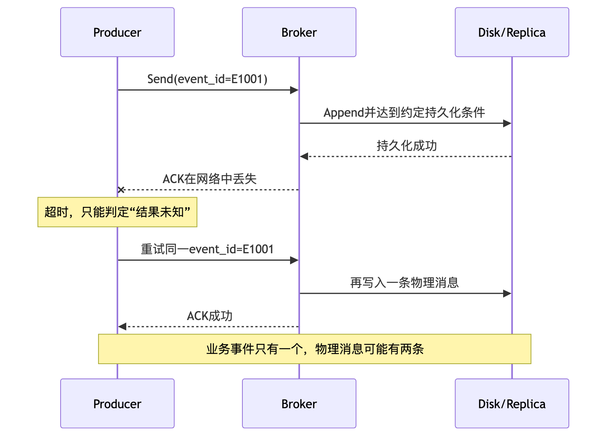
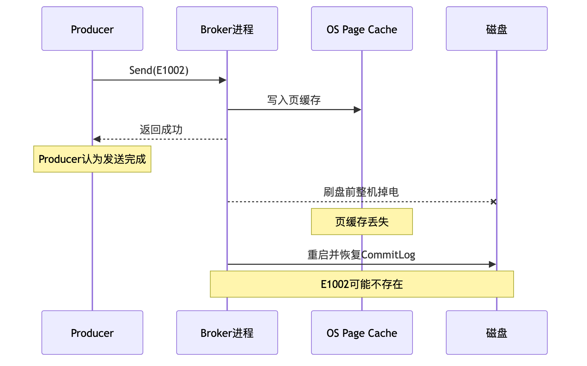
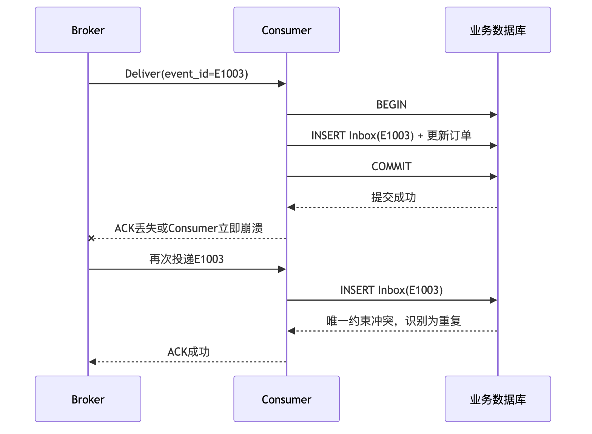
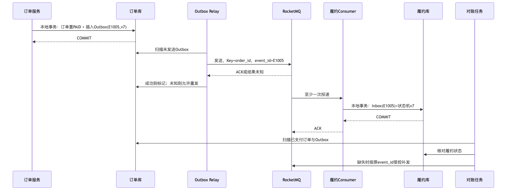

# 第 8 章：端到端消息可靠性、重试、死信队列与消费幂等

> **技术口径**：本章以 Apache RocketMQ 5.x 的消息模型、PushConsumer、SimpleConsumer、Proxy 与 Controller 体系为主，并在涉及经典 Remoting 客户端时明确标注 4.x 语义。截至 2026 年 6 月 20 日，Apache RocketMQ 最新稳定服务端版本为 5.5.0。任何“消息不丢失”结论都必须同时说明故障模型、刷盘方式、复制方式、确认边界、数据保留期和补偿机制，不能脱离假设作绝对承诺。[10]

---

## 本章去重边界与跳转

本章是“至少一次、重复消息、重试、DLQ、Poison Message、Outbox/Inbox、消费幂等”的主讲章节。其他章节遇到“可靠”“幂等”“不丢”时应跳回本章，再补充各自专题差异。

| 重复主题 | 本章处理方式 |
| --- | --- |
| MQ 投递语义的基础定义 | 本章默认已了解 at-most-once、at-least-once、exactly-once；基础看 [第 1 章：MQ 基础与技术定位](/blog/tech/RocketMQ/01.消息队列基础、业务价值与RocketMQ技术定位)。 |
| Producer 发送重试和结果未知 | 本章讲可靠性后果；发送链路细节看 [第 4 章：Producer 发送模型](/blog/tech/RocketMQ/04.Producer发送模型、路由选择、重试机制与底层发送链路)。 |
| Consumer ACK、不可见时间与 Listener 边界 | 本章讲 ACK 与重试后果；消费状态机看 [第 5 章：Consumer 完整消费链路](/blog/tech/RocketMQ/05.Consumer类型、长轮询、POP、ACK与完整消费链路)。 |
| 事务消息与最终一致性 | 本章讲 Outbox/Inbox 对比；RocketMQ 事务消息专项看 [第 11 章：事务消息](/blog/tech/RocketMQ/11.事务消息、HalfMessage、事务回查与最终一致性)。 |
| 主从复制、刷盘和 RPO | 本章讲可靠性目标；高可用机制看 [第 13 章：高可用](/blog/tech/RocketMQ/13.RocketMQ高可用)。 |

## 8.1 学习目标

完成本章后，你应当能够：

1. 从 Producer、网络、Broker、磁盘、复制、Consumer 和业务数据库七个层次定位消息故障点。
2. 区分发送成功、明确失败、超时和结果未知，解释重试为什么会产生重复消息。
3. 说明同步刷盘、异步刷盘、同步复制和异步复制分别保护了什么，又没有保护什么。
4. 解释消费重试、不可见时间、死信队列和 Poison Message 的关系。
5. 使用数据库唯一约束、Inbox 表和业务状态机实现可证明的消费幂等。
6. 设计一套有明确假设、可观测、可重放、可对账的订单消息方案。

---

## 8.2 场景导入：支付成功之后到底可能丢在哪里

假设订单服务把订单 `O1001` 从“待支付”改为“已支付”，随后发送 `OrderPaid` 事件。库存、履约、积分和通知服务分别消费该事件。

最容易犯的错误是把问题简化为：“RocketMQ 开启同步刷盘，所以消息不会丢。”这只回答了 Broker 本机的一个持久化窗口，没有回答以下问题：

- 订单数据库已经提交，但 Producer 还没发送，进程就宕机怎么办？
- Broker 已经保存消息，但 ACK 在网络中丢失，Producer 重发怎么办？
- Master 已写入本机，但消息尚未复制到可接管的副本，Master 永久损坏怎么办？
- Consumer 已完成扣库存，但 ACK 丢失，消息被再次投递怎么办？
- Consumer 返回成功后，异步线程才真正处理业务，异步线程失败怎么办？
- 消息进入死信队列后无人告警，是否还算“不丢”？
- 消息保存期已过，业务直到一周后才发现缺数，如何恢复？

因此，**端到端可靠性不是一个 Broker 参数，而是一条跨越多个状态机和持久化系统的证据链**。

### 8.2.1 可靠性的四个层次

| 层次 | 含义 | 典型证据 |
|---|---|---|
| 接收可靠 | Broker 接受了发送请求 | Producer 收到成功响应或可查询发送记录 |
| 存储可靠 | 消息达到约定的刷盘、复制条件 | CommitLog、刷盘结果、副本确认 |
| 投递可靠 | 消息在失败后仍会重投或进入隔离区 | 消费进度、重试状态、DLQ |
| 业务可靠 | 下游业务效果最终正确且可审计 | Inbox、业务状态、对账与补偿记录 |

面试中说“保证消息不丢”之前，至少要补一句：**这里的“不丢”是指在约定故障模型和保留期内，消息或等价业务事实能够被持久化、重投、查询或重建，并最终驱动正确的业务状态。**

---

## 8.3 七层故障模型与故障矩阵

### 8.3.1 七个层次

1. **Producer 层**：本地事务已提交但尚未发送；进程崩溃；重试耗尽；发送线程被阻塞；错误地忽略异常。
2. **网络层**：请求丢失、响应丢失、连接重置、网络分区、超时和乱序到达。
3. **Broker 层**：进程崩溃、请求拒绝、线程池拥塞、磁盘水位过高、配置或路由错误。
4. **磁盘层**：只写入页缓存但未落盘；磁盘损坏；文件系统或控制器异常；恢复时截断不完整记录。
5. **复制层**：Master 与副本存在复制滞后；故障切换选到缺少最新数据的副本；多数派或同步副本条件未满足。
6. **Consumer 层**：处理超时、进程崩溃、提前 ACK、ACK 丢失、重平衡、批量处理中部分成功。
7. **业务数据库层**：事务回滚、提交结果未知、唯一约束缺失、状态机越迁、外部副作用无法回滚。

### 8.3.2 端到端故障矩阵

| 层次与故障 | 客户端看到的现象 | 主要风险 | 首要控制手段 | 仍需接受的残余风险 |
|---|---|---|---|---|
| 本地事务提交后、发送前崩溃 | 订单已支付但无发送日志 | 消息缺失 | Transactional Outbox 或事务消息 | Outbox 转发器长期停机仍会延迟 |
| 请求根本未到 Broker | 连接失败或超时 | 未发送 | 有界重试、Outbox 保留 | 重试耗尽后需人工或定时补发 |
| Broker 已写入，响应丢失 | Producer 超时 | 重复消息 | 使用稳定业务事件 ID，允许重发 | Broker 可能保存多个物理消息 |
| 异步刷盘后机器掉电 | Producer 已收到成功 | 最近一小段消息丢失 | 同步刷盘或可接受的 RPO | 磁盘硬件和文件系统仍可能失败 |
| Master 已写，副本未同步即永久损坏 | 发送可能成功 | 故障切换后数据回退 | 同步复制、合理选主策略 | 同步副本同时故障仍可能丢失 |
| Broker 磁盘满或高水位 | 发送被拒绝、延迟升高 | 新消息无法进入 | 容量规划、告警、限流、扩容 | 突发流量可能先于扩容到达 |
| Consumer 业务未提交即 ACK | Broker 认为成功 | 永久漏处理 | 事务提交后再 ACK | 提交与 ACK 之间仍有重复窗口 |
| 业务提交后 ACK 丢失 | 再次收到同一业务事件 | 重复扣减、重复通知 | Inbox/唯一约束/状态机 | 非事务外部调用仍需幂等接口 |
| 数据库 COMMIT 返回错误但实际成功 | Consumer 认为失败并重试 | 重复处理 | 以业务 ID 查询状态，幂等重试 | 查询也可能暂时不可用 |
| 多次重试仍失败 | 消息进入 DLQ | 业务长期不一致 | DLQ 告警、隔离、审批重放 | 无人治理的 DLQ 等同于静默丢失 |
| 消息超过保存期被清理 | 无法从原 Topic 回溯 | 无法直接重放 | 归档、Outbox、业务事实重建 | 保存成本与恢复窗口需权衡 |

这张表说明了一个关键结论：**至少一次投递消除了部分“漏处理”风险，却主动引入了“重复处理”风险；重复不是异常边角，而是可靠设计的正常输入。**RocketMQ 官方 FAQ 也以至少一次作为投递语义，不能把“通常不重复”解释为“绝不会重复”。[8]

---

## 8.4 Producer：成功、失败、超时和结果未知

### 8.4.1 四种结果不能混为一谈

| 结果 | 可以证明什么 | 不能证明什么 | 推荐动作 |
|---|---|---|---|
| 发送成功 | Producer 收到 Broker 成功响应 | 不一定代表已同步落盘或复制，取决于配置和协议 | 记录业务事件 ID、发送结果和时间 |
| 明确失败 | 某一环节明确拒绝或请求尚未发出 | 部分网络错误仍可能发生在 Broker 处理之后 | 按错误类型决定重试或修复配置 |
| 超时 | 本地截止时间已到 | 不能证明 Broker 未收到或未写入 | 按“结果未知”处理并允许幂等重发 |
| 结果未知 | 无法证明成功，也无法证明失败 | 不能靠猜测更新业务状态 | 保留发送事实、重试、查询与对账 |

RocketMQ 的发送重试可以由网络异常、请求超时、Broker 错误码或限流触发。官方文档同时明确指出：内置重试不保证最终一定发送成功；重发时 Producer 无法知道上一次请求在 Broker 的真实处理结果，因此 Broker 中可能出现重复消息。[1]

### 8.4.2 Broker 已写入但响应丢失



这里不能通过“超时后不重试”来避免重复，因为不重试会把“请求确实未到 Broker”的情况变成消息丢失。正确策略是：

- 重试时保持稳定的 `event_id`，不要每次生成新的业务事件 ID。
- 让 Consumer 以 `event_id` 或“业务主键 + 事件版本”做幂等。
- Producer 的重试次数和总超时必须有上限，避免同步调用长时间阻塞。[1][9]
- 最终失败后，把待发送事实留在 Outbox 或可靠补发任务中，而不是只写一条错误日志。

### 8.4.3 源数据库与消息发送之间的双写问题

下面两种直觉写法都不可靠：

- **先提交订单，再发送消息**：提交后、发送前崩溃会漏消息。
- **先发送消息，再提交订单**：消息已被消费但订单事务回滚，会产生幽灵事件。

解决方向有三类：

1. **Transactional Outbox**：在同一个数据库本地事务中更新订单并插入 Outbox；独立 Relay 持续投递，发送成功后标记。它把“数据库 + MQ 双写”转换为“数据库内单写 + 异步投递”。
2. **RocketMQ 事务消息**：先发送 Half Message，再执行本地事务并提交 Commit/Rollback；状态未知时由 Broker 发起事务回查。它用于保证生产端本地事务与消息可见性的最终一致，但不保证下游消费业务成功，下游仍需重试和幂等。[4]
3. **业务对账与重建**：周期性扫描已支付订单与已发送事件之间的差异，补发缺失事件。它不应替代主方案，但必须作为最后一道防线。

---

## 8.5 Broker、磁盘与复制：成功 ACK 的真实含义

### 8.5.1 异步刷盘的丢失窗口



**同步刷盘**要求在返回成功前等待消息刷入磁盘，可靠性更高但增加写延迟；**异步刷盘**通常批量刷盘，吞吐更高，但 ACK 与真正落盘之间存在窗口。Apache 官方最佳实践也明确要求根据业务在性能和可靠性之间取舍。[5]

| 刷盘方式 | ACK 前的典型条件 | 性能 | 主要风险 | 适用判断 |
|---|---|---|---|---|
| `SYNC_FLUSH` | 等待本机磁盘刷盘完成 | 延迟较高、吞吐较低 | 单盘或整机永久损坏仍可能丢 | 金融账务、关键状态事件 |
| `ASYNC_FLUSH` | 通常写入内存映射/页缓存后即可返回 | 吞吐高 | 掉电或内核崩溃可能丢最近数据 | 可重建日志、允许非零 RPO 的链路 |

同步刷盘不等于“绝对安全”。它只能显著缩小本机进程崩溃和掉电窗口，不能替代副本、磁盘冗余、机房容灾和业务补偿。

### 8.5.2 同步复制与异步复制

| 复制方式 | ACK 前的典型条件 | RPO 特征 | 延迟与可用性 | 关键风险 |
|---|---|---|---|---|
| 同步复制 | 等待符合条件的副本确认 | 正常故障模型下可逼近 0 | 网络或副本慢会抬高延迟，副本不足时可能拒写 | 同步副本集合配置、选主正确性 |
| 异步复制 | Master 本地接受后后台复制 | 可能丢失复制滞后窗口 | 延迟低，Master 可独立写入 | Master 永久损坏并切到落后副本时回退 |

经典部署常用 `SYNC_MASTER + SLAVE` 表达同步复制诉求；5.x Controller 模式负责自动选主，Controller 自身通常需要多副本以保持切换能力。Controller 解决的是选主和故障切换，不会自动把异步复制变成零 RPO。[5][6]

### 8.5.3 四种组合怎么回答

| 刷盘 | 复制 | 可靠性判断 |
|---|---|---|
| 异步刷盘 + 异步复制 | 性能优先，存在本机刷盘窗口和副本滞后窗口 |
| 同步刷盘 + 异步复制 | 本机持久化较强，但 Master 永久损坏后仍可能因副本滞后丢失 |
| 异步刷盘 + 同步复制 | 数据可能已到多个节点页缓存，但同时掉电仍有刷盘风险 |
| 同步刷盘 + 同步复制 | 常规单点故障下最可靠，但延迟、吞吐和可用性成本最高 |

生产设计还必须回答：

- 同步复制到底要求几个副本确认？
- 副本不足时是拒绝写入，还是降级接受？
- 故障切换是否保证不选择落后副本？
- 磁盘保存期是否覆盖业务发现和重放窗口？
- 磁盘满时是限流、拒写还是自动删除？

RocketMQ 的消息会按节点保存期和存储压力清理，消费成功与否并不决定消息是否永久保留。因此，不能把 MQ 当作无限期审计仓库。[7]

---

## 8.6 Consumer：ACK、重试与重复窗口

### 8.6.1 为什么至少一次必然要求幂等

Consumer 的安全顺序应当是：

1. 接收消息。
2. 开启本地数据库事务。
3. 写入幂等记录并执行业务状态变更。
4. 提交本地事务。
5. 向 RocketMQ 返回成功或 ACK。

第 4 步和第 5 步无法被普通本地事务原子覆盖。如果数据库已经提交，但 ACK 没有到达 Broker，Broker 会再次投递。因此，**只要系统采用至少一次投递，数据库提交与 ACK 之间就天然存在重复窗口。**



反过来，如果先 ACK 再提交数据库，ACK 后进程崩溃会造成永久漏处理。因此可靠系统宁可接受重复，也不应提前确认。

### 8.6.2 PushConsumer 与 SimpleConsumer 的重试语义

RocketMQ 5.x 官方模型中：

- **PushConsumer**由 SDK 负责取消息、调用 Listener、提交结果和触发重试。业务处理必须在 Listener 内同步完成，不能把消息转交给异步线程后提前返回成功；否则 SDK 无法感知异步处理失败。[3]
- **SimpleConsumer**由应用显式接收和 ACK。消息在 `InvisibleDuration` 内对同组其他消费者不可见；处理时间可能超出时，应在超时前修改不可见时间。未 ACK 或超时后，消息会重新可见。[2]

PushConsumer 的普通无序消息采用递增重试间隔：第 1 次 10 秒、第 2 次 30 秒，之后逐步增加，直到第 16 次为 2 小时；超过 16 次后，后续间隔仍为 2 小时。官方参数建议中的默认最大消费重试次数为 16，但实际值应以 ConsumerGroup 元数据和所用客户端版本为准。[2][9]

| 重试次数 | 间隔 | 重试次数 | 间隔 |
|---:|---:|---:|---:|
| 1 | 10 秒 | 9 | 7 分钟 |
| 2 | 30 秒 | 10 | 8 分钟 |
| 3 | 1 分钟 | 11 | 9 分钟 |
| 4 | 2 分钟 | 12 | 10 分钟 |
| 5 | 3 分钟 | 13 | 20 分钟 |
| 6 | 4 分钟 | 14 | 30 分钟 |
| 7 | 5 分钟 | 15 | 1 小时 |
| 8 | 6 分钟 | 16 | 2 小时 |

注意三点：

1. 重试是故障恢复机制，不是业务流程编排工具，也不应用来做限流。[2]
2. “最大重试 16 次”通常表示原始投递之外再重试 16 次；统计口径必须看具体 API 和管理元数据。
3. 经典 4.x Remoting PushConsumer 可通过客户端参数配置最大重试次数；5.x 更强调在 ConsumerGroup 元数据中配置。版本迁移时不要照搬配置位置。

### 8.6.3 批量消费的额外风险

批量拉取 32 条消息后，若第 31 条失败，处理模型可能导致整个批次重投，前 30 条也会再次出现。批量越大，失败时重复放大越明显。应当：

- 每条消息都使用独立业务事件 ID。
- 避免把整个批次塞进一个超大事务。
- 对可部分成功的业务，逐条提交幂等结果，或显式记录批次内状态。
- 批量大小应与单条处理耗时、不可见时间和数据库承载能力一起评估。[9]

---

## 8.7 死信队列与 Poison Message

### 8.7.1 死信队列不是垃圾桶

当消息达到最大重试次数仍未成功，Broker 会把它转入死信队列（Dead-Letter Queue，DLQ）。经典 RocketMQ 中常见死信 Topic 命名为 `%DLQ%ConsumerGroupName`；实际运维应以当前版本的管理工具和集群元数据为准。[2]

DLQ 的价值有三个：

- **隔离**：避免一条永久失败消息持续消耗线程和数据库资源。
- **保留证据**：保存原始载荷、失败次数、异常类型和业务上下文。
- **恢复入口**：修复代码或数据后，可以受控重放。

DLQ 的风险也很明确：没有告警、责任人和恢复流程的 DLQ，只是把“立即失败”变成“延迟且静默地失败”。

### 8.7.2 Poison Message 的识别

Poison Message 是在当前代码、配置或数据条件下几乎必然失败的消息，例如：

- JSON 永远无法反序列化。
- 必填业务字段缺失。
- 引用的租户、币种或商品已被永久删除。
- 业务状态机不允许该事件版本。
- 单条消息触发确定性的程序缺陷。

处理策略应区分错误类型：

| 错误类型 | 例子 | 是否重试 | 推荐动作 |
|---|---|---|---|
| 瞬时错误 | 数据库超时、限流、短暂网络故障 | 是 | 指数退避或 RocketMQ 重试 |
| 可等待业务错误 | 上游记录稍后才可见 | 有限重试 | 延迟重试并设置最大等待窗口 |
| 永久数据错误 | 字段缺失、格式非法 | 通常否 | 隔离、记录原因、人工修复 |
| 程序缺陷 | 空指针、错误状态转换 | 有限重试 | 快速告警、发布修复后重放 |

### 8.7.3 标准恢复流程

1. **发现**：监控 DLQ 增量、最老消息年龄、重试失败率和 ConsumerGroup 积压。
2. **冻结**：确认错误仍存在时禁止盲目全量重放。
3. **分类**：按异常指纹、事件类型、版本和业务租户聚类。
4. **修复**：修代码、补主数据、迁移 Schema 或修正配置。
5. **抽样验证**：先在隔离环境或影子 Consumer 中验证少量消息。
6. **受控重放**：使用新 Topic 或专用重放任务，限速、保留原 `event_id`，并记录 `replay_batch_id`。
7. **对账收口**：核对业务状态，不以“消息发送成功”作为恢复完成标准。
8. **复盘**：补充自动化规则、告警阈值和故障演练。

重放时不要修改业务事件 ID。若每次重放都生成新 ID，Consumer 的幂等屏障会被绕过。

---

## 8.8 消费幂等：从技巧升级为可证明的事务边界

### 8.8.1 幂等的定义

对同一个业务事件执行一次和执行多次，最终业务状态相同，称为幂等。幂等不是“发现重复后打印日志”，而是必须保证：

- 重复请求不能再次产生不可逆副作用。
- 幂等判断与业务变更之间没有崩溃窗口。
- 幂等键在事件的整个生命周期内稳定。
- 幂等记录的保存期不短于消息可能重放的最长窗口。

### 8.8.2 常见方案对比

| 方案 | 原理 | 优点 | 主要缺点 | 适用场景 |
|---|---|---|---|---|
| 数据库唯一索引 | 对业务自然键或事件 ID 建唯一约束 | 简单、并发安全、由数据库裁决 | 只适合能表达唯一性的写入 | 创建类操作、支付流水 |
| Inbox 表 | 先插入 `(consumer_group,event_id)`，再做业务更新 | 通用、可审计、可与业务同事务 | 表增长快，需要归档 | 跨多类事件的统一幂等 |
| 业务状态机 | 仅允许合法状态迁移 | 同时防重复和乱序 | 状态设计复杂 | 订单、履约、退款 |
| 业务版本号 | 只接受更大的版本或期望版本 | 可抵抗重复与旧事件 | 上游必须稳定生成版本 | CDC、聚合状态同步 |
| Redis `SETNX` | 首次写入成功者处理 | 延迟低、吞吐高 | 难与数据库业务原子提交 | 只作前置削峰或软去重 |
| 独立去重表 | 保存消息指纹和处理结果 | 灵活、可跨业务表 | 仍需与业务事务绑定 | 无自然唯一键的事件 |

最佳实践通常是组合：**Inbox 唯一约束负责“同一事件只进入一次”，业务状态机或版本号负责“事件即使乱序也不能越迁”。**

### 8.8.3 为什么 Redis SETNX 不天然等于可靠幂等

考虑 `SETNX processed:E1004 1`：

1. 先 `SETNX`，再更新数据库。如果数据库更新失败，Redis 已标记完成，后续重试会被跳过，形成漏处理。
2. 先更新数据库，再 `SETNX`。两步之间崩溃，后续会再次更新数据库，形成重复处理。
3. Key 设置 TTL。消息在 TTL 过期后被重放，会再次执行。
4. Redis 故障转移、持久化策略和网络分区可能让刚写入的去重键不可见。
5. Redis 原子操作只覆盖 Redis 内部，不能自动覆盖数据库、HTTP 调用和 ACK。

因此，Redis 可以作为性能优化层，但关键正确性应由业务数据库唯一约束、状态机或目标系统的幂等接口承担。

### 8.8.4 Message Key、业务 ID 与 Message ID

| 标识 | 谁生成 | 主要用途 | 能否直接作为业务幂等键 |
|---|---|---|---|
| 业务事件 ID | 业务系统 | 表示一次不可变业务事实 | **推荐**，必须稳定且全局唯一或域内唯一 |
| Message Key | Producer 设置 | 索引查询、运维定位、关联业务对象 | 可作为载体，但 RocketMQ 不替你强制唯一 |
| RocketMQ Message ID | SDK/Broker 体系生成 | 查询、追踪一条物理消息 | 不推荐；重试、重投或重建可能产生新 ID |

一个订单可以有“创建、支付、发货、退款”等多个事件，所以仅用 `order_id` 去重会误杀合法事件。更稳妥的键是 `event_id`，或 `(order_id, event_type, event_version)`。

---

## 8.9 Go 实战：数据库事务 + 唯一约束的幂等 Consumer

下面使用 PostgreSQL 风格 SQL，重点展示事务边界。`mq_inbox` 的唯一键为 `(consumer_group, event_id)`；Inbox 插入与订单状态更新位于同一个本地事务中。只有事务提交成功后，调用方才可以向 RocketMQ 返回消费成功。

```go
package reliableconsumer

import (
    "context"
    "database/sql"
    "encoding/json"
    "errors"
    "fmt"
    "log/slog"
    "time"
)

const schema = `
CREATE TABLE IF NOT EXISTS mq_inbox (
    consumer_group TEXT NOT NULL,
    event_id      TEXT NOT NULL,
    biz_key       TEXT NOT NULL,
    event_type    TEXT NOT NULL,
    received_at   TIMESTAMPTZ NOT NULL,
    PRIMARY KEY (consumer_group, event_id)
);

CREATE TABLE IF NOT EXISTS orders (
    order_id      TEXT PRIMARY KEY,
    status        TEXT NOT NULL,
    paid_amount   BIGINT NOT NULL DEFAULT 0,
    version       BIGINT NOT NULL DEFAULT 0,
    updated_at    TIMESTAMPTZ NOT NULL
);
`

type OrderPaidEvent struct {
    EventID      string `json:"event_id"`
    OrderID      string `json:"order_id"`
    EventVersion int64  `json:"event_version"`
    PaidAmount   int64  `json:"paid_amount"`
    OccurredAt   string `json:"occurred_at"`
}

type Handler struct {
    DB            *sql.DB
    ConsumerGroup string
    Logger        *slog.Logger
}

// Handle 必须在返回 nil 后才由上层 ACK。
// 返回非 nil 时，上层应根据错误分类决定重试或隔离。
func (h *Handler) Handle(ctx context.Context, body []byte) error {
    if h.DB == nil || h.ConsumerGroup == "" {
        return errors.New("invalid handler configuration")
    }

    var event OrderPaidEvent
    if err := json.Unmarshal(body, &event); err != nil {
        return fmt.Errorf("permanent: decode event: %w", err)
    }
    if event.EventID == "" || event.OrderID == "" || event.EventVersion <= 0 {
        return errors.New("permanent: missing event identity")
    }

    tx, err := h.DB.BeginTx(ctx, &sql.TxOptions{Isolation: sql.LevelReadCommitted})
    if err != nil {
        return fmt.Errorf("begin transaction: %w", err)
    }
    defer func() { _ = tx.Rollback() }()

    result, err := tx.ExecContext(ctx, `
        INSERT INTO mq_inbox (
            consumer_group, event_id, biz_key, event_type, received_at
        ) VALUES ($1, $2, $3, 'OrderPaid', $4)
        ON CONFLICT (consumer_group, event_id) DO NOTHING
    `, h.ConsumerGroup, event.EventID, event.OrderID, time.Now().UTC())
    if err != nil {
        return fmt.Errorf("insert inbox: %w", err)
    }

    inserted, err := result.RowsAffected()
    if err != nil {
        return fmt.Errorf("read inbox result: %w", err)
    }
    if inserted == 0 {
        // 同一 ConsumerGroup 已处理过该业务事件。
        // 提交只读事务后即可安全 ACK。
        if err := tx.Commit(); err != nil {
            return fmt.Errorf("commit duplicate transaction: %w", err)
        }
        h.Logger.InfoContext(ctx, "duplicate event ignored",
            "event_id", event.EventID,
            "order_id", event.OrderID,
        )
        return nil
    }

    updateResult, err := tx.ExecContext(ctx, `
        UPDATE orders
           SET status = 'PAID',
               paid_amount = $1,
               version = $2,
               updated_at = $3
         WHERE order_id = $4
           AND status = 'UNPAID'
           AND version < $2
    `, event.PaidAmount, event.EventVersion, time.Now().UTC(), event.OrderID)
    if err != nil {
        return fmt.Errorf("update order: %w", err)
    }

    affected, err := updateResult.RowsAffected()
    if err != nil {
        return fmt.Errorf("read update result: %w", err)
    }
    if affected != 1 {
        // 可能是订单不存在、状态越迁或旧版本事件。
        // 回滚后交给错误分类策略，不能直接 ACK 掉未知状态。
        return fmt.Errorf(
            "permanent: illegal order transition, order_id=%s, version=%d",
            event.OrderID,
            event.EventVersion,
        )
    }

    if err := tx.Commit(); err != nil {
        // COMMIT 返回错误时，数据库端可能已提交，也可能未提交。
        // 不要 ACK；让消息重试。若实际已提交，Inbox 唯一键会挡住重复。
        return fmt.Errorf("commit transaction, result unknown: %w", err)
    }

    h.Logger.InfoContext(ctx, "order paid event committed",
        "event_id", event.EventID,
        "order_id", event.OrderID,
        "event_version", event.EventVersion,
    )
    return nil
}
```

这段代码的关键不是 `ON CONFLICT` 本身，而是四个边界：

1. Inbox 与业务更新在同一个事务内，任何一步失败都会一起回滚。
2. 数据库并发冲突由唯一约束裁决，而不是先查再写。
3. `COMMIT` 结果未知时不 ACK，依赖下一次投递重新确认。
4. 业务状态机和版本条件防止旧消息覆盖新状态。

对于发送短信、调用第三方物流等无法纳入本地事务的副作用，应让本地事务再写一条 Outbox，由专门执行器调用具备幂等键的下游接口；不要在数据库事务中直接进行长时间外部调用。

---

## 8.10 Outbox、Inbox 与 RocketMQ 事务消息

| 机制 | 解决的位置 | 核心事务边界 | 优点 | 局限 |
|---|---|---|---|---|
| Transactional Outbox | Producer 侧 | 业务表 + Outbox 同库事务 | 数据库事实可审计、可反复补发 | 需要 Relay、清理和积压治理 |
| Inbox | Consumer 侧 | Inbox + 下游业务表同库事务 | 通用幂等、可审计 | 不能解决上游“事务已提交但消息未产生” |
| RocketMQ 事务消息 | Producer 侧 | Half Message + 本地事务 + 回查 | 无需自建通用 Outbox Relay | 依赖事务回查；仍是最终一致；不保证消费端业务成功 |

三者不是互斥关系。常见组合是：

- 上游使用 **Outbox 或 RocketMQ 事务消息**，解决“业务提交与消息可见”的一致性。
- 下游使用 **Inbox + 状态机**，解决至少一次投递带来的重复和乱序。
- 全链路再使用 **对账任务**，发现长尾缺失和人工操作造成的不一致。

---

## 8.11 “不丢、不乱、可补偿”的订单方案



### 8.11.1 设计要点

**生产端**

- 订单状态更新与 Outbox 插入同事务提交。
- `event_id` 在事务内生成并永久保存；重发不得改变。
- Relay 使用租约或 `SKIP LOCKED` 防止多实例抢占，发送成功后再标记。
- 发送超时按结果未知处理，可重发，不把“查询不到”当作绝对未发送。

**Broker 端**

- 关键事件采用与业务 RPO 匹配的刷盘和复制策略。
- 部署多 Broker、副本和 Controller，监控同步副本集合、复制滞后、磁盘水位和发送延迟。
- 消息保存期覆盖最大故障发现时间与重放时间，并保留业务侧 Outbox 归档。

**顺序控制**

- 同一订单的事件使用 `order_id` 作为 MessageGroup 或分片键，Producer 对同一订单串行发送。
- Consumer 仍使用 `event_version` 和状态机校验。FIFO 只能减少乱序，不能替代业务版本控制。

**消费端**

- Inbox、履约状态和下一跳 Outbox 同本地事务提交。
- 事务提交前绝不 ACK；PushConsumer Listener 内不异步转交后提前成功。
- 可重试错误返回失败；永久错误记录原因并进入隔离治理。

**补偿端**

- 定时核对“已支付订单—已发送事件—履约状态”三方数据。
- 补偿消息保留原 `event_id` 和 `event_version`，增加 `replay_batch_id` 仅用于审计。
- 重放限速、分租户、可暂停，并在完成后进行业务对账。

这套方案不能保证任何宇宙级故障下绝对零丢失，但在“数据库和 MQ 至少各有一份可恢复副本、保留期内可查询、运维能够响应告警”的假设下，可以把单点故障转化为重复、延迟或可补偿事件，而不是不可发现的数据消失。

---

## 8.12 高频题：RocketMQ 如何保证消息不丢失

> **题目去重**：这一题是可靠性主讲题，完整答案保留在本章；第 20 章只作为题库索引和追问骨架。

### 8.12.1 30 秒回答版本

RocketMQ 的“不丢消息”要分端到端回答。Producer 侧用同步发送、有界重试，并用 Outbox 或事务消息解决本地事务与发送双写；Broker 侧按 RPO 选择同步刷盘、同步复制和可靠选主；Consumer 侧在业务事务提交后再 ACK，并用 Inbox 唯一约束或状态机处理重复；最后配置 DLQ 告警、保存期、对账和补偿。任何超时或 ACK 丢失都可能产生重复，所以通常采用“至少一次投递 + 消费幂等”，而不是宣称端到端 Exactly-once。

### 8.12.2 3 分钟回答版本

首先定义“不丢”的边界：是 Producer 收到 ACK、消息落盘、复制到副本，还是下游业务最终完成。Producer 发送可能出现成功、明确失败、超时和结果未知。Broker 已写入但响应丢失时，重试会产生重复，因此消息必须带稳定业务事件 ID。订单事务与发送之间不能靠普通双写，应使用 Transactional Outbox 或 RocketMQ 事务消息。

Broker 侧，同步刷盘减少页缓存未落盘的窗口，同步复制减少 Master 永久损坏后的 RPO；Controller 提供自动选主，但不替代持久化和复制条件。Consumer 侧采用至少一次语义：业务数据库提交后再 ACK。数据库提交成功但 ACK 丢失会再次投递，所以使用 Inbox 唯一索引、业务状态机或版本号实现幂等。重试耗尽后进入 DLQ，必须有监控、分类、修复、限速重放和最终对账。最后还要保证消息保存期覆盖故障发现窗口，并进行故障演练。

### 8.12.3 深度回答框架

1. **先讲假设**：单机故障、整机掉电、磁盘损坏、网络分区、机房故障分别允许多大 RPO/RTO。
2. **Producer 证据链**：本地事务、Outbox 状态、发送尝试、业务事件 ID、最终补发。
3. **网络不确定性**：请求和响应独立丢失；超时不等于失败；重试必须可重复。
4. **Broker 持久化**：CommitLog 写入、刷盘条件、磁盘故障与恢复。
5. **副本与选主**：同步副本条件、复制滞后、降级策略、Controller 可用性。
6. **Consumer 状态机**：Ready、Inflight、WaitingRetry、Commit、DLQ；SimpleConsumer 的不可见时间。
7. **业务原子性**：Inbox 与业务表同事务；外部副作用使用下游幂等键或再次 Outbox。
8. **长尾治理**：DLQ、保存期、归档、对账、重放审计和演练。
9. **明确结论**：系统通常保证的是在特定假设下的可恢复至少一次，而不是无需业务配合的端到端 Exactly-once。

---

## 8.13 生产环境端到端可靠性检查表

### 8.13.1 Producer

- [ ] 每条业务事件有稳定且可追踪的 `event_id`。
- [ ] 本地事务与消息发送使用 Outbox 或事务消息协调。
- [ ] 发送使用明确的超时、重试上限和错误分类。
- [ ] 超时按结果未知处理，不把超时直接当作未发送。
- [ ] 最终发送失败会进入持久化补发队列，而非只记录日志。

### 8.13.2 Broker 与存储

- [ ] 刷盘和复制策略与业务 RPO 匹配。
- [ ] 多副本、Controller、故障切换和降级策略经过演练。
- [ ] 监控磁盘水位、刷盘延迟、复制滞后、同步副本数量和发送失败率。
- [ ] 保存期覆盖最大故障发现与重放窗口。
- [ ] 禁止依赖自动创建 Topic/Group 作为生产治理方案。

### 8.13.3 Consumer 与数据库

- [ ] 业务提交后再 ACK，禁止提前成功。
- [ ] PushConsumer Listener 不把消息异步转交后提前返回。
- [ ] Inbox/唯一约束与业务更新处于同一事务。
- [ ] 使用状态机或版本号抵抗乱序和旧事件。
- [ ] 数据库 COMMIT 结果未知时允许重试。
- [ ] 外部系统支持业务幂等键，或通过 Outbox 再驱动。

### 8.13.4 重试、DLQ 与运维

- [ ] 区分瞬时错误、可等待业务错误、永久错误和程序缺陷。
- [ ] 重试次数、间隔和不可见时间与处理耗时匹配。
- [ ] DLQ 增量、最老消息年龄和失败指纹有告警。
- [ ] 有审批、限速、保留原事件 ID 的重放工具。
- [ ] 有订单源数据与下游状态的周期性对账。
- [ ] 定期演练 ACK 丢失、Broker 宕机、磁盘满、复制滞后和 DLQ 重放。

---

## 8.14 资深面试题

> **题目去重**：本节作为本章可靠性自测，只保留不丢、重复、重试、DLQ 和幂等题。跨章重复题、完整追问链和模拟面试统一跳转到 [第 20 章：资深面试题库、追问链与模拟面试](/blog/tech/RocketMQ/20.RocketMQ资深面试题库、追问链与模拟面试)。

### 1. RocketMQ 如何保证消息不丢失？

**标准回答**：必须按 Producer、网络、Broker、磁盘、复制、Consumer 和数据库分层回答。生产端使用 Outbox/事务消息，Broker 端根据 RPO 选择刷盘与复制，消费端提交业务事务后 ACK 并保证幂等，最后用 DLQ、保存期、对账和补偿兜底。

**面试官追问**：同步刷盘加同步复制后是否绝对不丢？

**容易答错**：只背 `SYNC_FLUSH + SYNC_MASTER`，忽略发送前崩溃、ACK 丢失和消费端业务事务。

### 2. Producer 发送超时后能否直接重试？

**标准回答**：可以且通常应该重试，但必须把超时视为结果未知。上一次请求可能已经写入 Broker，所以重试会产生重复，Consumer 必须按稳定业务事件 ID 幂等。

**面试官追问**：怎样证明上一次一定没有发送成功？

**容易答错**：把超时等同于失败，或认为查询不到 Message ID 就一定未写入。

### 3. 为什么 RocketMQ 重试会产生重复消息？

**标准回答**：分布式调用中请求处理结果和响应到达是两件事。Broker 已写入但响应丢失时，Producer 无法知道真实结果，只能重试，因此同一业务事件可能对应多条物理消息。

**面试官追问**：Broker 为什么不自动按消息 Key 去重？

**容易答错**：假设 Message Key 全局唯一且由 Broker 强制约束。

### 4. 同步刷盘解决了什么问题？

**标准回答**：它缩小了 ACK 已返回但数据仍只在页缓存中的掉电丢失窗口。它不解决单盘永久损坏、跨节点复制、Producer 双写和 Consumer 业务一致性。

**面试官追问**：同步刷盘为什么延迟更高？

**容易答错**：声称同步刷盘就是零丢失。

### 5. 同步复制与异步复制如何影响 RPO？

**标准回答**：异步复制存在副本滞后窗口，Master 永久损坏并切换到落后副本时可能丢最近消息；同步复制在满足确认副本条件后才成功，可降低 RPO，但会增加延迟并受慢副本影响。

**面试官追问**：副本不足时继续写还是拒绝写？

**容易答错**：只谈吞吐，不说明降级策略和可用性取舍。

### 6. Broker 已写入但 ACK 丢失怎么办？

**标准回答**：Producer 按结果未知重试；消息携带相同业务事件 ID；Consumer 使用 Inbox/唯一约束去重。不能依赖网络实现“恰好一次响应”。

**面试官追问**：重试时 Message ID 是否相同？

**容易答错**：把 RocketMQ Message ID 当成稳定业务事件 ID。

### 7. Consumer 业务成功但 ACK 丢失会怎样？

**标准回答**：Broker 认为消息未完成并再次投递。这是至少一次语义的正常重复窗口，必须让第二次处理命中幂等记录并安全返回成功。

**面试官追问**：怎样避免这个窗口？

**容易答错**：建议先 ACK 再处理，从而把重复风险变成永久漏处理。

### 8. 为什么不应在 PushConsumer Listener 中异步处理后立即返回成功？

**标准回答**：返回成功代表 SDK 可以提交消费结果。异步任务之后失败时 Broker 已不会重试，导致业务漏处理。应在 Listener 内完成可靠处理，或先持久化到本地任务表后再返回。

**面试官追问**：耗时任务怎么办？

**容易答错**：无条件把消息丢进线程池并返回成功。

### 9. At-least-once 为什么要求消费幂等？

**标准回答**：为了避免漏处理，系统在未确认时必须重投；数据库提交和 ACK 无法由普通本地事务原子覆盖，因此必然可能重复。幂等是至少一次语义的业务配套条件。

**面试官追问**：幂等是否等于去重？

**容易答错**：只做缓存查重，不保证最终业务状态一致。

### 10. 数据库唯一索引和 Inbox 表有什么区别？

**标准回答**：唯一索引可直接保护某个业务自然键；Inbox 是通用消息接收账本，可按 ConsumerGroup 和事件 ID 去重并审计。两者都应与业务更新处于同一事务。

**面试官追问**：为什么不能先查 Inbox 再插入？

**容易答错**：忽略并发下两个实例同时“查不到”的竞态。

### 11. Redis SETNX 为什么不等于可靠幂等？

**标准回答**：SETNX 只能保证 Redis 内一次写入，无法与业务数据库和 ACK 原子提交。先 SETNX 可能漏处理，后 SETNX 可能重复，TTL 和故障转移还会引入新的窗口。

**面试官追问**：Redis 能否使用？

**容易答错**：完全否定 Redis，或反过来把它当作唯一正确性屏障。它可用于软去重和减压，数据库仍应兜底。

### 12. RocketMQ 消费重试间隔是什么？

**标准回答**：5.x PushConsumer 普通无序消息采用递增间隔，从 10 秒、30 秒逐步增长到 2 小时；SimpleConsumer 的重试与不可见时间相关。最大次数由 ConsumerGroup 元数据和版本配置决定。

**面试官追问**：能否用重试实现限流？

**容易答错**：死记 16 次，不区分 PushConsumer、SimpleConsumer、顺序消息和版本差异。

### 13. 死信队列的作用是什么？

**标准回答**：达到最大重试次数后隔离消息，防止无限重试，并提供调查和恢复入口。DLQ 必须配套告警、分类、修复、受控重放和对账。

**面试官追问**：消息进入 DLQ 是否算消费完成？

**容易答错**：把进入 DLQ 当成业务成功，或默认 DLQ 永久保存。

### 14. 什么是 Poison Message？

**标准回答**：在当前代码或数据条件下确定性失败、继续重试也难以恢复的消息，例如非法 Schema、永久缺失主数据或程序缺陷。应快速隔离并保留失败证据。

**面试官追问**：如何区分瞬时错误和永久错误？

**容易答错**：所有异常统一重试，造成重试风暴。

### 15. Transactional Outbox 与 RocketMQ 事务消息有什么区别？

**标准回答**：Outbox 把业务事实和待发送记录放入同一数据库事务，由 Relay 投递；RocketMQ 事务消息通过 Half Message、本地事务和回查协调消息可见性。两者解决 Producer 侧双写，都不替代 Consumer 幂等。

**面试官追问**：哪个一定更好？

**容易答错**：脱离数据库、运维能力、延迟和审计需求给出绝对结论。

### 16. Message Key、业务事件 ID 和 Message ID 如何选择？

**标准回答**：业务事件 ID 表示不可变业务事实，是首选幂等键；Message Key 用于索引和查询，可承载业务标识但不提供唯一约束；Message ID 标识物理消息，不应作为跨重试的业务唯一键。

**面试官追问**：仅用 order_id 可以吗？

**容易答错**：忽略同一订单会产生多个合法事件。

### 17. 数据库 COMMIT 返回网络错误时，Consumer 应该 ACK 吗？

**标准回答**：不应 ACK，因为提交结果未知。返回失败让消息重试；若数据库实际已提交，Inbox 唯一约束会识别重复；若未提交，重试会完成业务。

**面试官追问**：是否会无限重试？

**容易答错**：把 COMMIT 错误直接当作回滚，或直接 ACK 掉不确定状态。

### 18. 如何设计“不丢、不乱、可补偿”的订单事件？

**标准回答**：订单事务内写 Outbox，使用稳定事件 ID 和订单版本；同订单按 MessageGroup/分片键有序发送；Broker 使用匹配 RPO 的刷盘复制；Consumer 以 Inbox + 状态机同事务处理；DLQ 受控重放；对账任务按订单事实补发缺失事件。

**面试官追问**：FIFO 后还要版本号吗？

**容易答错**：认为 FIFO 能解决所有跨 Producer、重放和人工补偿造成的乱序。

---

## 8.15 总结

本章最重要的结论有五条：

1. **端到端可靠性是一条状态证据链，不是单个 Broker 参数。**
2. **超时和连接中断往往意味着结果未知，可靠重试必然可能制造重复。**
3. **同步刷盘保护本机持久化窗口，同步复制保护副本切换窗口，两者都不解决业务双写和消费幂等。**
4. **至少一次投递的正确搭档是稳定业务事件 ID、Inbox 唯一约束和业务状态机。**
5. **DLQ、保存期、对账和补偿不是附加功能，而是处理长尾故障的正式生产链路。**

面对“RocketMQ 能不能保证消息不丢”这类问题，资深工程师不会给出脱离条件的“能”或“不能”，而会先定义故障模型与确认边界，再说明每一层的控制手段、重复窗口、残余风险和恢复证据。

---

## 8.16 官方资料

1. [Apache RocketMQ：Sending Retry and Throttling Policy](https://rocketmq.apache.org/docs/featureBehavior/05sendretrypolicy/)
2. [Apache RocketMQ：Consumption Retry](https://rocketmq.apache.org/docs/featureBehavior/10consumerretrypolicy/)
3. [Apache RocketMQ：Consumer Types](https://rocketmq.apache.org/docs/featureBehavior/06consumertype/)
4. [Apache RocketMQ：Transaction Message](https://rocketmq.apache.org/docs/featureBehavior/04transactionmessage/)
5. [Apache RocketMQ：Basic Best Practices](https://rocketmq.apache.org/docs/bestPractice/01bestpractice/)
6. [Apache RocketMQ：Master-Slave Automatic Failover Mode](https://rocketmq.apache.org/docs/deploymentOperations/03autofailover/)
7. [Apache RocketMQ：Message Storage and Cleanup](https://rocketmq.apache.org/docs/featureBehavior/11messagestorepolicy/)
8. [Apache RocketMQ：FAQs](https://rocketmq.apache.org/docs/faq/)
9. [Apache RocketMQ：Parameter Constraints and Suggestions](https://rocketmq.apache.org/docs/introduction/03limits/)
10. [Apache RocketMQ GitHub Releases](https://github.com/apache/rocketmq/releases)
