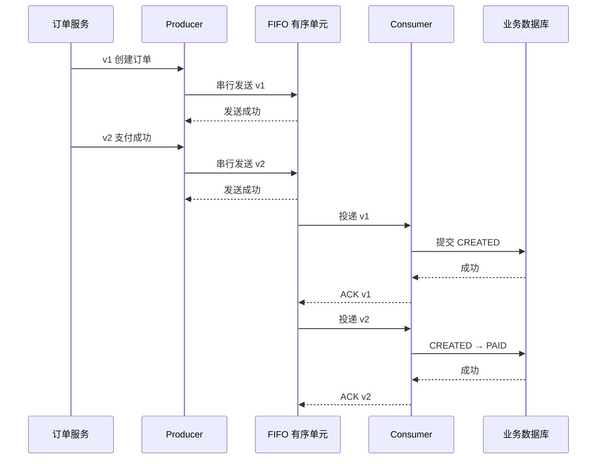
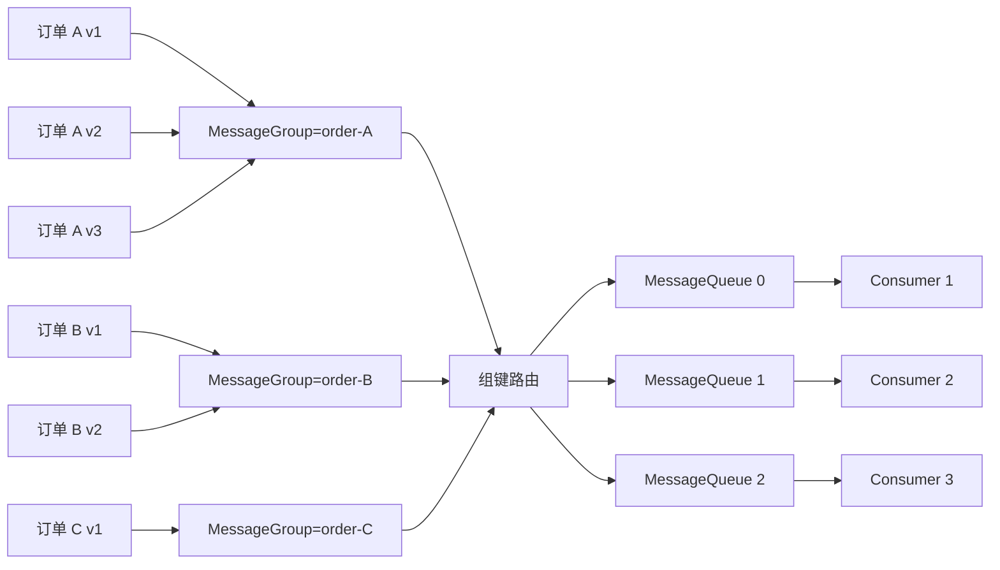
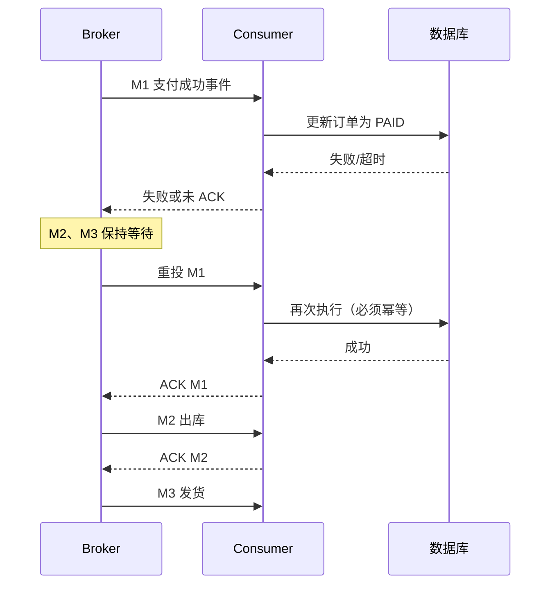
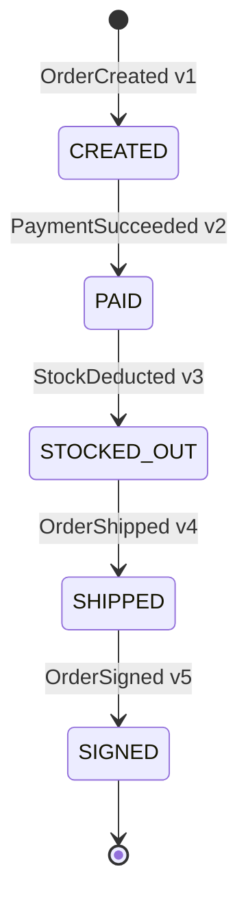

# 第 9 章：FIFO 顺序消息：发送有序、存储有序、消费有序与并发权衡

> **版本基线**：本章以 Apache RocketMQ 5.5.0 与官方 Go gRPC SDK `github.com/apache/rocketmq-clients/golang/v5` v5.1.4 为主线；经典模型按 `github.com/apache/rocketmq-client-go/v2` v2.1.2 的 Remoting API 说明。不同客户端、消费者类型和服务端版本的负载均衡语义并不完全相同，不能把 4.x 的“队列独占”直接套到 5.x。

顺序消息看起来只是“先发先到”，实际却是一条端到端约束链：业务事件必须先有确定的因果顺序，Producer 必须按该顺序发送，同一业务聚合的消息必须进入同一个有序单元，Broker 必须按写入顺序保存，Consumer 还必须在前一条业务处理完成后才确认成功。任何一环引入并发、超时重试、路由变化或错误确认，都可能破坏业务观察到的顺序。

本章先给出最重要的结论：

> **RocketMQ 不是默认保证整个 Topic 全局有序，而是以 MessageGroup 或 MessageQueue 为边界提供有条件的局部 FIFO。顺序保证依赖“同键路由、串行发送、有序存储、串行处理、成功后确认”同时成立；重复消息、晚到消息和故障切换仍需业务幂等与版本状态机兜底。**

---

## 本章去重边界与跳转

本章是 FIFO 顺序消息的主讲章节，保留全局有序、分区有序、MessageGroup、ShardingKey、失败阻塞、热 Key 和状态机兜底。消费、幂等和资源治理只在顺序语义下引用。

| 重复主题 | 本章处理方式 |
| --- | --- |
| Consumer 类型、ACK 和不可见时间 | 本章只讲它们如何影响顺序；完整消费链路看 [第 5 章：Consumer 类型、长轮询、POP、ACK 与完整消费链路](/blog/tech/RocketMQ/05.Consumer类型、长轮询、POP、ACK与完整消费链路)。 |
| Rebalance、队列级负载均衡和积压 | 本章只讲顺序场景下的放大效应；负载均衡和积压治理看 [第 6 章](/blog/tech/RocketMQ/06.Rebalance、消费位点、负载均衡与消息积压)。 |
| 重复消息、重试和幂等 | 本章只讲顺序失败后的阻塞与补偿；可靠性闭环看 [第 8 章：端到端消息可靠性](/blog/tech/RocketMQ/08.端到端消息可靠性、重试、死信队列与消费幂等)。 |
| Topic、Tag、Key、MessageGroup 的资源边界 | 本章聚焦顺序键；治理规范看 [第 12 章：资源治理](/blog/tech/RocketMQ/12.Topic、Tag、Key、SQL92、MessageQueue与资源治理)。 |
| 5.x MessageGroup 与消息级负载均衡 | 本章讲 FIFO 语义；版本演进看 [第 17 章：4.x 到 5.x 架构演进](/blog/tech/RocketMQ/17.从RocketMQ4.x到5.x：Proxy、gRPC、POP、Controller与架构演进)。 |

## 9.1 全局有序、分区有序与无序消费

### 9.1.1 全局有序

全局有序要求一个 Topic 中任意两条消息都存在唯一先后关系。例如消息 A 在消息 B 之前产生，那么所有消费者都必须先完成 A，再处理 B。最直接的实现是让整个 Topic 只有一个有序单元，并且只允许单线程发送、单线程消费。

代价也非常直接：

1. **写入无法横向扩展**：所有消息竞争同一条串行写入链路。
2. **消费无法横向扩展**：增加消费者也不能同时处理下一条消息。
3. **故障影响面最大**：一条毒消息可以阻塞整个 Topic。
4. **可用性与严格顺序冲突**：主节点故障后，立即切换可能引入路由或进度边界；等待原节点恢复又会牺牲可用性。
5. **绝大多数业务并不需要全局顺序**：订单 A 的“支付”通常不必等待订单 B 的“发货”。

所以，全局有序吞吐低并不是 RocketMQ 的某个缺陷，而是全序关系本身压缩了并行空间。系统一旦允许两个事件并行完成，就必须承认它们之间没有严格的全局先后关系。

### 9.1.2 分区有序

分区有序也叫局部有序、键内有序。它只要求同一个业务聚合键内的消息保持顺序，不同键之间允许并行。例如：

- 同一 `order_id`：创建 → 支付 → 出库 → 发货 → 签收；
- 同一 `device_id`：上线 → 上报配置 → 下线；
- 同一账户：入账与扣款按账户流水号顺序处理。

RocketMQ 5.x 用 `MessageGroup` 表达这个逻辑有序单元；经典模型则通常用 `ShardingKey` 或自定义 `MessageQueueSelector`，把同键消息固定路由到同一个 `MessageQueue`。

### 9.1.3 三种模型对比

| 维度 | 全局有序 | 分区有序 | 无序/并发消费 |
|---|---|---|---|
| 顺序范围 | 整个 Topic | 同一 MessageGroup、ShardingKey 或业务聚合键 | 不承诺处理完成顺序 |
| 典型路由 | 单队列或单有序单元 | 相同键稳定映射到同一有序单元 | 轮询、随机或任意队列 |
| 并发上限 | 接近 1 条串行链 | 约等于活跃消息组数量，经典模型还受队列数限制 | 由队列、线程与消费者实例共同决定 |
| 单条失败影响 | 阻塞整个 Topic | 主要阻塞当前组；经典队列模型可能连带阻塞同队列其他键 | 通常不阻塞后续消息 |
| 扩容收益 | 很低 | 键足够分散时明显 | 通常最高 |
| 热 Key 风险 | Topic 本身就是单热点 | 某个大组成为局部热点 | 较低，但业务冲突仍可能存在 |
| 重平衡影响 | 风险集中 | 需要维护组/队列的消费连续性 | 主要表现为短时重复或负载波动 |
| 适用场景 | 极少数审计流水、严格单序列指令 | 订单、账户、设备、工作流 | 通知、日志、画像、可交换任务 |

架构设计时应先问：“哪些事件之间真的存在不可交换的因果关系？”答案通常不是“整个 Topic”，而是某个订单、账户或设备。

---

## 9.2 顺序保证的三层条件：发送、存储、消费

### 9.2.1 发送有序

发送有序指 Producer 按业务事件的真实因果顺序发出消息，并且前一条发送完成后再发送后一条。以下写法都可能破坏发送顺序：

- 同一订单的事件由多个 Producer 实例并行发送；
- 同一 Producer 中用多个 goroutine 同时发送同一消息组；
- 业务数据库先后提交为 v1、v2，但异步任务先取到 v2；
- v1 发送超时后在后台重试，v2 已经先发送成功；
- 两个系统分别发布“支付成功”和“发货完成”，却没有统一序列号或串行出口。

因此，“设置了 MessageGroup”不等于发送天然有序。MessageGroup 只定义哪些消息应当进入同一个有序域，不能替业务系统创造一个原本不存在的全序。

### 9.2.2 存储有序

存储有序指同一有序单元内，Broker 按发送顺序写入并建立可消费顺序。在经典模型中，有序单元通常就是 `MessageQueue`；在 5.x FIFO 语义中，业务首先感知的是 `MessageGroup`，客户端和服务端再把同组消息稳定映射到队列并维护组内顺序。

需要注意：

- 同一队列内不同消息组之间不自动建立业务因果关系；
- 不同队列之间不存在天然全局顺序；
- 队列编号、路由列表和哈希算法属于实现细节，不应成为业务协议；
- Topic 扩容、路由变化或故障切换时，不能仅凭“以前哈希到 Queue 2”推断以后仍在 Queue 2。

### 9.2.3 消费有序

消费有序不是“拉取顺序正确”就结束了，而是**业务处理完成顺序**也必须正确。假设 Consumer 按顺序收到 M1、M2，却把二者提交给两个 goroutine：M2 的数据库事务先提交，业务侧观察到的顺序仍然是乱的。

正确的基本链路是：



顺序消息的端到端条件可以概括为：

```text
业务因果顺序
  × 同键串行发送
  × 同键路由到同一有序单元
  × Broker 组内/队列内有序保存
  × Consumer 串行完成并在事务提交后 ACK
  = 业务可观察到的局部 FIFO
```

其中任意一项为零，最终结果都不能称为严格的业务顺序。

---

## 9.3 RocketMQ 5.x：MessageGroup 模型

### 9.3.1 MessageGroup 是逻辑顺序边界

在 5.x FIFO 消息中，Producer 必须为消息设置 `MessageGroup`。同一组内的消息要求顺序发送、顺序存储和顺序消费；不同组之间可以并发。典型设置是：

```text
MessageGroup = order_id
```

而不是：

```text
MessageGroup = tenant_id
MessageGroup = shop_id
MessageGroup = 固定字符串 "all-orders"
```

后几种选择会把本来互不相关的订单压进一条串行链，形成大组或热 Key。

5.x 应使用 FIFO 类型 Topic，并为需要顺序投递的消费组配置相应的顺序属性。资源类型与消息语义应保持一致，不能在普通 Topic 上依赖“碰巧有序”。

### 9.3.2 同组如何进入同一有序单元

官方 Go SDK 会根据 MessageGroup 选择一个消息队列。以 v5.1.4 当前实现为例，发布负载均衡器对 MessageGroup 做 SipHash 后对可写队列数取模。这个细节有两个架构含义：

1. 同一路由视图下，相同 MessageGroup 会稳定选到同一队列；
2. 队列集合或顺序变化时，映射可能变化，所以业务不能依赖具体 QueueId，更不能把 QueueId 当作订单状态的一部分。

逻辑关系如下：



图中多个组可能共享同一物理队列，但业务顺序只在组内定义。5.x 的消息级负载均衡能够以比经典“整队列分配”更细的粒度分发消息；服务端仍需保证同一消息组的前一条未完成时，后一条不能越过它。

### 9.3.3 Producer 侧约束

要获得组内 FIFO，Producer 侧至少满足以下条件：

- 同一消息组的消息由可确定顺序的发送链路产生；
- 同组消息串行调用发送接口，等待前一条结果后再发下一条；
- 不能把同组事件无约束地扔进 goroutine 池；
- 发送超时按“结果未知”处理，而不是直接认定失败；
- 重试可能生成重复消息，Consumer 必须幂等；
- 多 Producer 写同一组时，要在业务侧先统一排序，例如 Outbox 表按聚合键和版本号串行派发。

如果多个 Producer 同时向 `order-1001` 发送消息，RocketMQ只能按实际到达顺序保存，无法知道哪条在业务上应该先发生。

### 9.3.4 Consumer 侧约束

5.x 的 PushConsumer 与 SimpleConsumer 都可以消费 FIFO 消息，但职责不同：

- **PushConsumer**：客户端框架负责按有序语义投递，业务回调中应直接、串行地完成处理，不要再次异步分发同组消息。
- **SimpleConsumer**：应用主动 Receive 和 ACK。若一次收到多条消息，也必须保持同组处理顺序；只有前一条业务事务成功后才能 ACK。官方语义明确：同组前一条尚未消费完成时，下一条不能继续取得或处理。

“不可见时间”可以理解为一段消费租约：消息被某消费者取走后，在租约期内对其他消费者不可见；成功则 ACK，失败或超时则可能重新投递。对于 FIFO 消息，服务端还要把同组后续消息挡在前驱之后。若业务处理时间超过不可见时间而未续期，前一条可能被再次投递，所以它解决的是并发交付协调，不是 exactly-once。

---

## 9.4 经典 4.x：ShardingKey 与 MessageQueueSelector

经典 Remoting 模型通常按以下步骤实现局部顺序：

1. 从业务事件中提取 `order_id` 等 ShardingKey；
2. Producer 用相同哈希规则从 Topic 的 `MessageQueue` 列表中选一个队列；
3. 同一 ShardingKey 的消息进入同一队列；
4. Consumer 开启 orderly 模式，对分配到的队列串行消费；
5. 消费失败时暂停当前队列，先重试失败消息，避免越过它处理后续消息。

官方经典 Go SDK 中，`NewHashQueueSelector()` 读取消息的 `ShardingKey`，使用 FNV-1a 哈希并对队列数取模；Producer 通过 `WithQueueSelector` 安装该选择器，消息通过 `WithShardingKey` 设置分片键。

```mermaid
flowchart TB
    E[订单事件 order_id=1001] --> K[WithShardingKey("1001")]
    K --> S[HashQueueSelector]
    S -->|hash % queueCount| Q1[MessageQueue 1]
    E2[同订单下一事件] --> K2[相同 ShardingKey]
    K2 --> S
    S --> Q1
    Q1 --> L[Orderly Consumer 队列锁]
    L --> P[单队列串行处理]
```

经典模型有一个重要的并发副作用：**顺序消费通常以队列为粒度串行化**。即使订单 A 与订单 B 没有因果关系，只要哈希到了同一队列，A 的失败也可能暂停这条队列，从而连带阻塞 B。并发能力主要受队列数限制，而不只是活跃 ShardingKey 数量。

### 9.4.1 5.x 与经典模型的关键差异

| 维度 | 5.x FIFO MessageGroup | 经典 ShardingKey/MessageQueueSelector |
|---|---|---|
| 业务表达 | MessageGroup 是一等消息属性 | ShardingKey 供客户端选队列 |
| 顺序语义中心 | 消息组内 FIFO | 选中队列内 FIFO |
| Producer 路由 | SDK 按 MessageGroup 选择队列 | 自定义或内置 QueueSelector 选队列 |
| 消费负载均衡 | 5.x Push/Simple 常用消息级负载均衡 | 4.x/3.x 主要是队列级分配 |
| 串行粒度 | 重点约束同一消息组 | orderly 模式通常串行整个队列 |
| 失败阻塞范围 | 主要是当前消息组 | 可能暂停当前队列，影响同队列其他键 |
| 扩容上限 | 组足够多时并行粒度更细 | 消费者数超过队列数后通常出现空闲实例 |
| 典型 Go SDK | `rocketmq-clients/golang/v5` | `rocketmq-client-go/v2` |
| 配置重点 | FIFO Topic、MessageGroup、顺序消费组 | 稳定选队列、orderly consumer、队列锁 |

迁移时最常见的错误，是看到 5.x 内部仍有 MessageQueue，便认为它只是经典模型换了 API 名称。实际上，5.x 对上层暴露的是消息组语义，并配合消息级负载均衡和服务端组内阻塞；经典模型的操作中心则是队列选择和队列所有权。

---

## 9.5 并发为什么会破坏顺序

设 M1、M2、M3 已按正确顺序存储。Consumer 拉取后启动三个 goroutine：

```text
M1：调用库存服务，耗时 800 ms
M2：只更新缓存，耗时 10 ms
M3：写审计日志，耗时 20 ms
```

最终完成顺序会变成 M2 → M3 → M1。即使回调最初按 M1、M2、M3 被调用，业务提交顺序也已经改变。

常见破坏方式包括：

- 在有序回调中 `go handle(msg)` 后立即返回成功；
- 一批消息并发执行，最后统一 ACK；
- 先 ACK，再异步写数据库；
- 为追求吞吐，把同一订单的事件投入无键调度的工作池；
- M1 失败后直接跳过，继续提交 M2；
- 对外部服务调用成功、数据库未落库时 ACK，重试后状态不一致。

可以并发，但并发边界必须放在**消息组之间**，而不是同一组内部。例如按 `order_id` 做 keyed executor：同键进入同一串行执行槽，不同键分配到不同槽并行执行。RocketMQ 已经提供组内调度时，不应在回调里再打散该约束。

---

## 9.6 锁、租约、不可见时间与队列锁

顺序消费中的“锁”并非单一机制，至少要区分三层：

### 9.6.1 经典队列锁

在经典集群消费中，重平衡把队列分配给某个消费者。orderly 模式还需要协调队列锁，确保同一消费组在稳定状态下由一个消费者推进该队列。消费者定期续锁；锁丢失、进程失联或重平衡时，应停止继续处理并转移所有权。

但这不是永恒的单主承诺。客户端与 Broker 的分配信息存在传播窗口，扩缩容时可能短暂不一致，少量消息可能重复处理。因此，“队列锁”降低并发越界，不消除幂等需求。

### 9.6.2 5.x 消息不可见时间

5.x 消息级消费中，消息被 Receive 后会在一段时间内不可见，相当于可超时的处理租约。业务完成后 ACK；未 ACK、处理超时或消费者故障时，消息重新可见并被重投。FIFO 场景还需要保证同组后继等待前驱完成。

不可见时间应覆盖正常处理耗时并留出抖动余量，但也不能无限大：太短会造成执行中的消息被重复投递；太长会让故障恢复变慢。长任务应支持续期、拆分，或把耗时工作转换成有状态工作流。

### 9.6.3 业务数据库锁与状态机

RocketMQ 的消费锁不保护你的数据库事务，也不保护跨服务副作用。即使同一时刻只有一个消费者拿到消息，也可能在“数据库已提交、ACK 响应丢失”后再次收到同一条消息。因此还需要：

- `event_id` 唯一约束防重复；
- `order_id + version` 乐观锁防越级覆盖；
- 合法状态迁移表防止 `CREATED → SHIPPED`；
- 外部调用使用幂等请求号；
- ACK 必须发生在本地事务成功之后。

---

## 9.7 失败重试与队头阻塞

FIFO 的核心代价是：前驱未完成，后继不能越过。假设同一订单有 M1=支付、M2=出库、M3=发货，M1 因数据库死锁失败：



这种现象叫队头阻塞。它不是实现偶然，而是维持 FIFO 的必要条件：若失败时仍允许 M2 通过，就已经放弃了顺序。

需要制定明确的毒消息策略：

1. 可恢复错误采用有限次数重试与退避；
2. 永久业务错误不要无限重试，例如订单不存在、字段格式永久非法；
3. 达到最大重试次数后进入死信或异常处置流程，并报警；
4. 人工修复或回放时仍携带原 `event_id`、`order_id`、`version`；
5. 不要为了“解堵”直接丢弃前驱而不记录，因为后续状态可能建立在它之上。

经典 orderly 消费通常暂停当前队列并本地重试，因此影响可能扩散到该队列上其他 ShardingKey。5.x FIFO 文档强调的是当前消息组后继等待，阻塞粒度更贴近业务组。

---

## 9.8 扩缩容、重平衡与故障恢复

### 9.8.1 增加消费者为什么不一定提速

- **经典队列级负载均衡**：一个消费组内，稳定状态下每个队列分给一个消费者。若 Topic 只有 8 个队列，启动第 9 个消费者通常不会增加并行度。
- **5.x 消息级负载均衡**：同一队列中的不同消息可以由不同消费者处理，但同一 MessageGroup 仍不能并发越过。若所有流量都来自一个组，增加再多消费者也无效；若有大量均匀的小组，扩容才有明显收益。

因此，顺序系统的真实并发度可近似理解为：

```text
有效并发度 ≈ min(消费者处理能力, 可并行的活跃消息组数, 平台调度上限)
```

经典队列模型还要再受可消费队列数约束。

### 9.8.2 重平衡的影响

消费者加入、退出，Broker 扩缩容或路由变化都会触发重平衡。迁移期间要完成“旧消费者停止推进—未完成消息恢复可见—新消费者接管”的交接。由于心跳、锁续期、不可见时间和分配信息传播都不是瞬时的，可能出现：

- 短时停止消费；
- 消费延迟抖动；
- 已执行但 ACK 丢失的消息再次投递；
- 经典队列分配短暂不一致；
- 长任务在租约过期后由新消费者重做。

正确目标不是幻想“重平衡绝不重复”，而是确保重复执行不会破坏状态。

### 9.8.3 一个队列是否只能由一个消费者消费

这是必须按版本和消费者类型回答的面试题：

> **不能脱离上下文回答“是”。**在 4.x/3.x 的队列级负载均衡中，同一消费组的稳定分配目标是一个队列只由一个消费者实例负责；消费者多于队列时会有实例空闲。但重平衡窗口仍可能产生短时重复。到了 5.x 的消息级负载均衡，来自同一队列的不同消息可以分发给同组的多个消费者，服务端通过消息不可见与消息组约束避免同一消息被同时处理，并保证同一 MessageGroup 的后继不越过前驱。另外，不同 ConsumerGroup 本来就可以各自独立消费同一个队列的数据。**

所以，“一个队列永远只能有一个消费者”是把经典稳态分配误说成了所有版本、所有时刻和所有消费组的绝对规律。

---

## 9.9 Broker 故障切换时的顺序边界

Broker 高可用解决的是数据持久性和服务恢复，不等于无条件的端到端严格顺序。故障时至少有四个边界：

1. **发送结果不确定**：Broker 已写入但响应丢失，Producer 认为超时并重试，产生重复；
2. **路由集合变化**：同一键的队列映射可能因队列可用集合变化而改变；
3. **主从切换进度边界**：副本确认策略不同，能够恢复的数据位置也不同；
4. **消费租约转移**：旧消费者可能已完成副作用但未 ACK，新消费者接管后重做。

经典 4.x 文档明确揭示了“严格顺序与可用性”的取舍：Broker 掉线后，继续把同键消息路由到其他队列会破坏原队列顺序；坚持原队列则发送失败、牺牲可用性。顺序 Topic 的相关配置用于偏向严格顺序，但架构仍应明确故障期间是停止写入、降低可用性，还是允许恢复后由业务版本号校正。

工程上应把保证边界写进 SLA：

- 正常路由下保证同组 FIFO；
- 故障切换和超时重试可能重复；
- 不承诺跨消息组、跨 Topic、跨 Producer 的全局顺序；
- 关键状态以 `version` 和状态机为最终判定依据；
- 灾难恢复或历史回放不得绕过版本校验。

---

## 9.10 MessageGroup 如何选：订单号、用户 ID 还是设备 ID

选择原则是：**用最小的业务聚合根作为顺序边界。**

| 候选键 | 适合场景 | 优点 | 风险 |
|---|---|---|---|
| `order_id` | 单订单状态流转 | 粒度细、天然对应状态机、并行度高 | 跨订单账户余额不保证顺序 |
| `user_id` | 用户账户流水、会员等级变更 | 同用户操作可线性化 | 大客户或机器人用户可能成为热 Key |
| `device_id` | IoT 指令、设备状态 | 对单设备语义清晰 | 单设备高频遥测会拉低并发 |
| `account_id` | 资金账户入账/扣款 | 符合账本聚合边界 | 核心大账户流量集中，需专门分片模型 |
| `tenant_id` | 仅当租户内确需全序 | 实现简单 | 通常过粗，极易形成超大组 |
| 固定常量 | 整个 Topic 全序 | 顺序最强 | 吞吐最低、单条失败阻塞全部消息 |

订单系统中，创建、支付、出库、发货、签收都属于单订单状态机，首选 `order_id`。只有当两个订单共享不可并行的业务资源时，才考虑更高层聚合键；即便如此，也应先判断是否能通过数据库约束、账户分片或独立账本解决，而不是直接把整个用户流量串行化。

---

## 9.11 热 Key 故障案例

### 9.11.1 事故现象

某电商团队把 `shop_id` 设为 MessageGroup，希望“同一店铺订单都有序”。大促开始后，头部店铺产生海量订单，所有订单事件进入同一个组。一个订单的库存接口持续超时，导致该组后续消息等待；Consumer 实例扩到几十台，消费积压仍几乎不下降。

监控表现为：

- Topic 总流量正常，但单个 MessageGroup 延迟持续升高；
- Consumer CPU 很低，说明不是机器算力不足；
- 增加实例没有改善，因为同一组仍必须串行；
- 失败消息反复重试，后续支付、出库事件全部等待；
- 业务侧出现“已支付但长时间未出库”的集中投诉。

### 9.11.2 根因

团队真正需要的是“同一订单状态有序”，却错误选择了 `shop_id`，把几十万个独立订单压成一条因果链。这不是普通负载倾斜，而是顺序边界设计错误。扩容无法创造组内并行度。

### 9.11.3 修复

1. 新消息改用 `order_id` 作为 MessageGroup；
2. 对旧大组停止盲目扩容，先定位并处置毒消息；
3. 将已成功副作用但未确认的事件通过 `event_id` 幂等消重；
4. 对积压消息按订单版本回放，禁止简单按到达时间覆盖状态；
5. 增加按消息组统计的吞吐、失败率、最大滞留时间与组大小监控；
6. 在发布评审中校验“一个组每天/每秒可能包含多少消息”“单条失败会阻塞哪些业务对象”。

若某个单一业务聚合本身就是热点，例如超级账户，则不能随意把同一账户拆成多个组后仍声称严格有序。需要在业务层重构：分子账户、分片账本、预分配额度，或接受只按子序列有序。

---

## 9.12 晚到消息、历史回放与版本状态机

RocketMQ 的 FIFO 只能约束进入同一有序链后的处理顺序，不能阻止业务源头产生晚到事件。例如支付系统网络隔离，`PAID(v2)` 晚于 `SHIPPED(v4)` 才被补发；或者历史数据回放时旧事件与实时事件混在一起。

每条状态事件至少应携带：

```text
event_id       全局唯一，消费幂等键
order_id       MessageGroup / ShardingKey
version        聚合内单调递增版本
 event_type     CREATED、PAID、STOCKED_OUT、SHIPPED、SIGNED
occurred_at    业务发生时间
produced_at    消息产生时间
trace_id       链路追踪标识
```

处理规则建议如下：

- `event_id` 已处理：直接返回成功；
- `event.version == current.version + 1`：检查状态迁移合法后提交；
- `event.version <= current.version`：视为重复或陈旧事件，记录后幂等成功；
- `event.version > current.version + 1`：出现版本缺口，不应直接越级覆盖；
- 非法迁移：进入异常表或人工处置，而不是无限重试。

对于版本缺口，有两种策略：

1. **短暂缺口**：返回失败，让 FIFO 重试等待缺失前驱，但必须设置最大等待与报警；
2. **长期缺口或历史回放**：把当前事件原子地写入 pending 表后 ACK，再触发补数；待前驱补齐后按版本重放。这样既不丢事件，也避免永久阻塞在线消息组。

历史回放最好使用独立 Topic 或独立 ConsumerGroup，先写影子表或校验环境。若必须回灌线上状态，仍要复用同一状态机和幂等表，不能用“回放任务权限高”作为跳过版本校验的理由。

---

## 9.13 订单状态流转设计

本章示例状态链为：



### 9.13.1 事件与状态表

| 事件 | 期望前置状态 | 目标状态 | 关键副作用 |
|---|---|---|---|
| `OrderCreated` | 不存在 | `CREATED` | 建立订单快照 |
| `PaymentSucceeded` | `CREATED` | `PAID` | 记录支付单与支付时间 |
| `StockDeducted` | `PAID` | `STOCKED_OUT` | 记录库存扣减结果 |
| `OrderShipped` | `STOCKED_OUT` | `SHIPPED` | 写入运单号与承运商 |
| `OrderSigned` | `SHIPPED` | `SIGNED` | 完成履约与签收时间 |

Producer 使用 `order_id` 作为 MessageGroup，事件版本依次为 1～5。Consumer 不能仅根据消息到达顺序更新状态，还必须验证前置状态和版本，因为重复投递、旧消息回放与人工补发都可能发生。

### 9.13.2 重复、有序重试与幂等状态机的组合

三者分别解决不同问题：

- **FIFO**：让正常情况下同订单事件按顺序到达并处理；
- **有序重试**：前一事件失败时不让后一事件越过；
- **幂等状态机**：处理“已提交但 ACK 丢失”的重复，以及业务源头晚到、补发、回放。

只做 FIFO 不做幂等，重试就可能重复扣库存；只做幂等不做顺序，v4 可能在 v2 前到达并形成大量 pending；只做状态机不做唯一事件键，同版本重复副作用仍可能发生。生产系统通常需要三者同时存在。

---

## 9.14 Go 示例一：5.x FIFO Producer

依赖模块：

```text
github.com/apache/rocketmq-clients/golang/v5 v5.1.4
```

下面代码刻意对同一订单逐条同步发送，并等待上一条成功后再发送下一条。示例省略 ACL；开启 ACL 时按部署环境加入官方 `credentials.SessionCredentials`。

```go
package main

import (
	"context"
	"encoding/json"
	"errors"
	"fmt"
	"log"
	"os"
	"time"

	rmq "github.com/apache/rocketmq-clients/golang/v5"
)

type OrderEvent struct {
	EventID    string    `json:"event_id"`
	OrderID    string    `json:"order_id"`
	Version    int64     `json:"version"`
	EventType  string    `json:"event_type"`
	OccurredAt time.Time `json:"occurred_at"`
}

func main() {
	endpoint := os.Getenv("ROCKETMQ_ENDPOINT")
	topic := os.Getenv("ROCKETMQ_FIFO_TOPIC")
	if endpoint == "" || topic == "" {
		log.Fatal("ROCKETMQ_ENDPOINT and ROCKETMQ_FIFO_TOPIC are required")
	}

	p, err := rmq.NewProducer(
		&rmq.Config{Endpoint: endpoint},
		rmq.WithTopics(topic),
	)
	if err != nil {
		log.Fatalf("create producer: %v", err)
	}
	if err := p.Start(); err != nil {
		log.Fatalf("start producer: %v", err)
	}
	defer p.GracefulStop()

	orderID := "order-1001"
	events := []OrderEvent{
		{EventID: "evt-1001-1", OrderID: orderID, Version: 1, EventType: "OrderCreated", OccurredAt: time.Now()},
		{EventID: "evt-1001-2", OrderID: orderID, Version: 2, EventType: "PaymentSucceeded", OccurredAt: time.Now()},
		{EventID: "evt-1001-3", OrderID: orderID, Version: 3, EventType: "StockDeducted", OccurredAt: time.Now()},
		{EventID: "evt-1001-4", OrderID: orderID, Version: 4, EventType: "OrderShipped", OccurredAt: time.Now()},
		{EventID: "evt-1001-5", OrderID: orderID, Version: 5, EventType: "OrderSigned", OccurredAt: time.Now()},
	}

	for _, event := range events {
		if err := sendFIFO(p, topic, event); err != nil {
			// 不继续发送同组后续事件，避免把业务缺口扩大。
			log.Fatalf("send order=%s version=%d: %v", event.OrderID, event.Version, err)
		}
	}
}

func sendFIFO(p rmq.Producer, topic string, event OrderEvent) error {
	body, err := json.Marshal(event)
	if err != nil {
		return fmt.Errorf("marshal event: %w", err)
	}

	msg := &rmq.Message{Topic: topic, Body: body}
	msg.SetKeys(event.EventID)
	msg.SetTag(event.EventType)
	msg.SetMessageGroup(event.OrderID)
	msg.AddProperty("aggregate_version", fmt.Sprintf("%d", event.Version))

	ctx, cancel := context.WithTimeout(context.Background(), 5*time.Second)
	defer cancel()

	receipts, err := p.Send(ctx, msg)
	if err != nil {
		// 超时意味着结果未知，不能简单推断 Broker 未写入。
		if errors.Is(err, context.DeadlineExceeded) {
			return fmt.Errorf("send result unknown after timeout: %w", err)
		}
		return err
	}
	if len(receipts) == 0 {
		return errors.New("empty send receipt")
	}

	log.Printf(
		"sent event=%s order=%s version=%d messageID=%s",
		event.EventID,
		event.OrderID,
		event.Version,
		receipts[0].MessageID,
	)
	return nil
}
```

代码中的关键点不是 API 本身，而是 `for` 循环对同组串行发送。若业务需要同时发送多个订单，可以按订单分组并行，但每个订单内部仍需串行，或者由带聚合键的 Outbox Dispatcher 保证顺序。

---

## 9.15 Go 示例二：经典 ShardingKey 选队列

依赖模块：

```text
github.com/apache/rocketmq-client-go/v2 v2.1.2
```

```go
package main

import (
	"context"
	"encoding/json"
	"fmt"
	"log"
	"os"
	"time"

	rocketmq "github.com/apache/rocketmq-client-go/v2"
	"github.com/apache/rocketmq-client-go/v2/primitive"
	"github.com/apache/rocketmq-client-go/v2/producer"
)

type ClassicOrderEvent struct {
	EventID   string `json:"event_id"`
	OrderID   string `json:"order_id"`
	Version   int64  `json:"version"`
	EventType string `json:"event_type"`
}

func main() {
	nameserver := os.Getenv("ROCKETMQ_NAMESERVER")
	topic := os.Getenv("ROCKETMQ_ORDER_TOPIC")
	if nameserver == "" || topic == "" {
		log.Fatal("ROCKETMQ_NAMESERVER and ROCKETMQ_ORDER_TOPIC are required")
	}

	p, err := rocketmq.NewProducer(
		producer.WithGroupName("order-event-producer"),
		producer.WithNsResolver(
			primitive.NewPassthroughResolver([]string{nameserver}),
		),
		producer.WithQueueSelector(producer.NewHashQueueSelector()),
		producer.WithRetry(2),
	)
	if err != nil {
		log.Fatalf("create producer: %v", err)
	}
	if err := p.Start(); err != nil {
		log.Fatalf("start producer: %v", err)
	}
	defer func() {
		if err := p.Shutdown(); err != nil {
			log.Printf("shutdown producer: %v", err)
		}
	}()

	events := []ClassicOrderEvent{
		{EventID: "evt-2001-1", OrderID: "order-2001", Version: 1, EventType: "OrderCreated"},
		{EventID: "evt-2001-2", OrderID: "order-2001", Version: 2, EventType: "PaymentSucceeded"},
		{EventID: "evt-2001-3", OrderID: "order-2001", Version: 3, EventType: "StockDeducted"},
	}

	for _, event := range events {
		body, err := json.Marshal(event)
		if err != nil {
			log.Fatalf("marshal event: %v", err)
		}

		msg := primitive.NewMessage(topic, body)
		msg.WithKeys([]string{event.EventID})
		msg.WithTag(event.EventType)
		msg.WithShardingKey(event.OrderID)

		ctx, cancel := context.WithTimeout(context.Background(), 5*time.Second)
		result, err := p.SendSync(ctx, msg)
		cancel()
		if err != nil {
			log.Fatalf(
				"send order=%s version=%d: %v",
				event.OrderID,
				event.Version,
				err,
			)
		}

		log.Printf(
			"sent order=%s version=%d messageID=%s queueOffset=%d",
			event.OrderID,
			event.Version,
			result.MsgID,
			result.QueueOffset,
		)
	}

	fmt.Println("all classic ordered messages sent")
}
```

`NewHashQueueSelector()` 只有在消息设置了 ShardingKey 时才按键哈希；未设置时会退化为随机选队列。消费端还必须开启经典 SDK 的 orderly 模式，例如创建 PushConsumer 时使用 `consumer.WithConsumerOrder(true)`。仅保证发送到同一队列，却用并发监听器消费，仍然不能得到业务顺序。

---

## 9.16 Go 状态机骨架：幂等、版本与原子提交

下面是消费端核心逻辑的抽象骨架。真实实现应让“检查事件是否处理、锁定订单、更新状态、写入消费记录”位于同一个数据库事务中。

```go
package orderstate

import (
	"context"
	"errors"
	"fmt"
)

var (
	ErrVersionGap        = errors.New("order event version gap")
	ErrInvalidTransition = errors.New("invalid order state transition")
)

type Event struct {
	EventID   string
	OrderID   string
	Version   int64
	EventType string
}

type Order struct {
	OrderID string
	Version int64
	Status  string
}

type Tx interface {
	Processed(ctx context.Context, eventID string) (bool, error)
	LoadOrderForUpdate(ctx context.Context, orderID string) (*Order, error)
	SaveOrder(ctx context.Context, order *Order) error
	MarkProcessed(ctx context.Context, eventID string) error
}

type Store interface {
	WithTx(ctx context.Context, fn func(Tx) error) error
}

func Apply(ctx context.Context, store Store, event Event) error {
	return store.WithTx(ctx, func(tx Tx) error {
		done, err := tx.Processed(ctx, event.EventID)
		if err != nil {
			return err
		}
		if done {
			return nil // 重复投递，幂等成功
		}

		order, err := tx.LoadOrderForUpdate(ctx, event.OrderID)
		if err != nil {
			return err
		}

		if event.Version <= order.Version {
			// 陈旧事件或同版本重复：记录 event_id 后安全跳过。
			return tx.MarkProcessed(ctx, event.EventID)
		}
		if event.Version != order.Version+1 {
			return fmt.Errorf(
				"%w: current=%d incoming=%d",
				ErrVersionGap,
				order.Version,
				event.Version,
			)
		}

		next, ok := nextStatus(order.Status, event.EventType)
		if !ok {
			return fmt.Errorf(
				"%w: status=%s event=%s",
				ErrInvalidTransition,
				order.Status,
				event.EventType,
			)
		}

		order.Status = next
		order.Version = event.Version
		if err := tx.SaveOrder(ctx, order); err != nil {
			return err
		}
		return tx.MarkProcessed(ctx, event.EventID)
	})
}

func nextStatus(current, eventType string) (string, bool) {
	transitions := map[string]map[string]string{
		"": {
			"OrderCreated": "CREATED",
		},
		"CREATED": {
			"PaymentSucceeded": "PAID",
		},
		"PAID": {
			"StockDeducted": "STOCKED_OUT",
		},
		"STOCKED_OUT": {
			"OrderShipped": "SHIPPED",
		},
		"SHIPPED": {
			"OrderSigned": "SIGNED",
		},
	}

	byEvent, ok := transitions[current]
	if !ok {
		return "", false
	}
	next, ok := byEvent[eventType]
	return next, ok
}
```

消费回调的正确顺序是：调用 `Apply` → 数据库事务提交成功 → 返回消费成功或 ACK。若 `Apply` 返回可恢复错误，则不 ACK；若是永久非法事件，应原子记录异常原因并按治理策略结束重试，避免整个消息组永久挂死。

---

## 9.17 两个必答问题

> **题目去重**：这两个问题是 FIFO 主讲题的压缩答案，保留在本章；第 20 章只负责收进总题库和追问链。

### 9.17.1 RocketMQ 如何保证顺序消息？

标准回答应包含完整条件链，而不是只说“同一个队列”：

> RocketMQ 通过局部有序单元保证顺序。5.x Producer 为消息设置相同 MessageGroup，并按业务顺序串行发送；SDK/Broker 将同组消息路由并保存到同一有序单元，消费端保证同组前一条完成并确认后，后一条才能继续。经典模型则用相同 ShardingKey 或 MessageQueueSelector 把消息选到同一 MessageQueue，再由 orderly consumer 串行推进该队列。失败时必须先重试前驱，因此会产生队头阻塞。超时重试、重平衡和 ACK 丢失仍可能导致重复，所以业务还要用 event_id、version 和状态机保证幂等与合法迁移。RocketMQ 不默认保证整个 Topic、不同队列或不同消息组之间的全局顺序。

### 9.17.2 一个队列是否只能由一个消费者消费？

> 在经典队列级负载均衡的同一消费组内，稳态目标是一个队列分配给一个消费者，消费者多于队列时会有实例空闲；但重平衡窗口仍可能短暂重复。5.x 消息级负载均衡可以把同一队列中的不同消息交给多个消费者，只需保证同一消息不会同时可见、同一 FIFO MessageGroup 的后继不越过前驱。不同 ConsumerGroup 则本来就能各自独立消费同一队列。因此答案不是无条件的“只能”。

---

## 9.18 面试题与参考答案

> **题目去重**：本节作为本章 FIFO 自测，只保留顺序语义、MessageGroup、阻塞和晚到消息题。跨章重复题、完整追问链和模拟面试统一跳转到 [第 20 章：资深面试题库、追问链与模拟面试](/blog/tech/RocketMQ/20.RocketMQ资深面试题库、追问链与模拟面试)。

### 1. 全局有序和局部有序有什么区别？

**标准回答**：全局有序要求整个 Topic 只有一条确定序列，通常接近单队列、单线程；局部有序只要求同一业务键内有序，不同键可并行。订单系统一般按 `order_id` 做局部有序。
**追问**：为什么全局有序扩容收益低？
**易错点**：把“每个队列内部有序”误说成“Topic 全局有序”。

### 2. 为什么全局有序吞吐通常很低？

**标准回答**：全序要求所有消息共享同一串行提交点，写入、消费和失败恢复都难以并行；一条失败消息还会阻塞全局后继。
**追问**：能否增加消费者提升吞吐？
**易错点**：只归因于 Broker 性能，而忽略顺序关系本身限制并行。

### 3. 发送有序、存储有序、消费有序分别是什么？

**标准回答**：发送有序是 Producer 按业务因果顺序串行发送；存储有序是同一有序单元按该顺序写入；消费有序是前一条业务处理完成并确认后才处理后一条。三者缺一不可。
**追问**：按顺序拉到消息后并发处理算不算有序？
**易错点**：只检查拉取顺序，不检查事务提交顺序。

### 4. 5.x MessageGroup 与经典 ShardingKey 的本质差异是什么？

**标准回答**：MessageGroup 是 5.x FIFO 的一等业务顺序属性，服务端按组维护消费约束；经典 ShardingKey 主要用于客户端稳定选择 MessageQueue，orderly 消费往往以队列为串行粒度。
**追问**：二者内部是否都可能映射到队列？
**易错点**：因为内部都有队列，就认为两种消费和负载均衡语义完全相同。

### 5. 同一订单如何保证路由到同一有序单元？

**标准回答**：5.x 把 `order_id` 设置为 MessageGroup；经典客户端把 `order_id` 设置为 ShardingKey，并安装哈希 QueueSelector。还要保持路由视图和发送链路正确。
**追问**：能否直接使用 `hash(order_id) % queueCount` 写死 QueueId？
**易错点**：把队列编号持久化到业务表，忽略队列扩缩容和路由变化。

### 6. 同一 MessageGroup 可以由多个 Producer 并发发送吗？

**标准回答**：技术上可以发出，但不能据此获得业务上的确定顺序。不同 Producer 或不同 goroutine 的到达先后不可控，应先在业务侧统一排序并串行发送。
**追问**：Outbox 多实例如何处理？
**易错点**：认为 Broker 能根据事件内容自动推断谁先谁后。

### 7. 并发消费为什么会破坏顺序？

**标准回答**：并发任务的完成时间不同，即使输入顺序正确，数据库提交和外部副作用也可能反序。组内应串行，组间可以并行。
**追问**：可以使用 keyed worker pool 吗？
**易错点**：在回调中启动 goroutine 后立即返回成功。

### 8. 顺序消息失败后为什么阻塞后续消息？

**标准回答**：若允许后继越过失败前驱，FIFO 就失效。服务端或客户端必须先重试前驱，所以会发生队头阻塞。
**追问**：如何治理毒消息？
**易错点**：无限重试永久错误，或者直接丢弃却没有异常记录和状态修复。

### 9. 5.x 的不可见时间是什么？

**标准回答**：它是消息被某消费者处理期间的临时不可见租约；成功后 ACK，超时或失败后可能重新投递。它协调并发交付，但不提供 exactly-once。
**追问**：处理时间超过不可见时间怎么办？
**易错点**：把不可见时间理解为永久分布式锁。

### 10. 一个队列是否只能由一个消费者消费？

**标准回答**：经典队列级负载均衡在同组稳态下通常一队列一消费者；5.x 消息级负载均衡可让同一队列的不同消息由多个消费者处理，同时维持消息和消息组约束。重平衡还可能产生短时重复。
**追问**：不同 ConsumerGroup 呢？
**易错点**：不区分版本、消费者类型、消费组和稳态/迁移期。

### 11. 为什么增加消费者后 FIFO 积压不下降？

**标准回答**：可能只有一个热 MessageGroup，组内必须串行；经典模型还可能受队列数限制。应观察组分布、单组耗时和队列数，而不是只看实例数。
**追问**：如何判断是机器瓶颈还是热 Key？
**易错点**：反复扩容却不分析顺序键基数和倾斜度。

### 12. Broker 故障切换时还能绝对保证顺序吗？

**标准回答**：不能无条件承诺。发送超时可能结果未知并导致重复，路由变化可能改变队列映射，消费租约也会转移。严格顺序与可用性之间要明确取舍，并用版本状态机兜底。
**追问**：经典 order Topic 的意义是什么？
**易错点**：把副本高可用等同于端到端 exactly-once 且永不乱序。

### 13. MessageGroup 应选订单号还是用户 ID？

**标准回答**：选择最小且真正需要串行的聚合根。订单状态流转选订单号；用户账户流水才考虑用户或账户 ID。键越粗，并发越低、热 Key 风险越高。
**追问**：超级账户怎么办？
**易错点**：为“保险”选择租户 ID 或固定常量。

### 14. 如何处理晚到消息？

**标准回答**：事件携带聚合版本。版本小于等于当前值时幂等跳过；等于当前加一时合法推进；大于当前加一时识别缺口，短期重试或持久化 pending 后补数。
**追问**：为什么不能只比较 `occurred_at`？
**易错点**：依赖分布式机器时钟直接决定状态覆盖顺序。

### 15. FIFO 是否等于 exactly-once？

**标准回答**：不等于。FIFO 约束同组顺序，发送重试、ACK 丢失、租约超时、重平衡都可能造成重复。必须做 event_id 去重、版本校验和副作用幂等。
**追问**：数据库已提交但 ACK 失败怎么办？
**易错点**：认为“单消费者”就不会重复。

### 16. 经典模型中为什么一个键失败可能影响其他键？

**标准回答**：多个 ShardingKey 可能哈希到同一 MessageQueue，而 orderly 消费通常暂停并串行整个队列，所以队头阻塞会扩散到同队列其他键。
**追问**：5.x MessageGroup 模型如何改善粒度？
**易错点**：把 ShardingKey 当成 Broker 内部完全隔离的独立分区。

### 17. SimpleConsumer 消费 FIFO 时要注意什么？

**标准回答**：Receive 后必须按同组顺序处理，业务成功后再 ACK；批量拉取不代表可以并行处理同组消息。处理时间较长时还要管理不可见时间。
**追问**：可以先 ACK 再写数据库吗？
**易错点**：把 ACK 当成“收到消息”的确认，而不是“业务已成功处理”的确认。

### 18. Topic 增加队列会影响同键映射吗？

**标准回答**：基于哈希对队列数取模的路由通常会因队列集合变化而重映射。不能把物理队列当稳定业务契约；扩容应演练路由切换，并依赖版本状态机处理边界。
**追问**：如何降低重映射影响？
**易错点**：在线直接改队列数，却假设所有历史和新消息仍在同一队列。

---

## 9.19 本章小结

RocketMQ 顺序消息的本质，是用业务聚合键划出可串行、可并行的边界。5.x 用 MessageGroup 表达组内 FIFO，经典客户端用 ShardingKey/MessageQueueSelector 把同键消息固定到同一队列。无论哪种模型，都必须同时保证发送、存储和消费三层顺序。

顺序越强，并发越低；失败阻塞范围越大，可用性代价越明显。生产设计不应追求模糊的“所有消息有序”，而应做到：用最小聚合键定义顺序，用有限重试处理瞬时错误，用死信和异常流治理毒消息，用 event_id、version 与合法状态迁移抵御重复、晚到和回放，并通过热 Key、组级延迟、重平衡重复率等指标持续验证保证边界。

---

## 9.20 官方资料与源码

1. Apache RocketMQ 5.x FIFO/Ordered Message：<https://rocketmq.apache.org/docs/featureBehavior/03fifomessage/>
2. Apache RocketMQ 5.x Consumer Load Balancing：<https://rocketmq.apache.org/docs/featureBehavior/08consumerloadbalance/>
3. Apache RocketMQ Topic 与消息类型：<https://rocketmq.apache.org/docs/domainModel/02topic/>
4. Apache RocketMQ 参数限制：<https://rocketmq.apache.org/docs/introduction/03limits/>
5. Apache RocketMQ 4.x Ordered Message Sending：<https://rocketmq.apache.org/docs/4.x/producer/03message2/>
6. Apache RocketMQ 4.x PushConsumer、顺序消费与重试：<https://rocketmq.apache.org/docs/4.x/consumer/02push/>
7. Apache RocketMQ 5.5.0 Release：<https://github.com/apache/rocketmq/releases/tag/rocketmq-all-5.5.0>
8. 官方多语言客户端仓库：<https://github.com/apache/rocketmq-clients>
9. 官方 Go 5.x FIFO Producer 示例：<https://github.com/apache/rocketmq-clients/blob/master/golang/example/producer/fifo/main.go>
10. Go 5.x MessageGroup 路由实现：<https://github.com/apache/rocketmq-clients/blob/master/golang/loadBalancer.go>
11. Go 5.x SDK API：<https://pkg.go.dev/github.com/apache/rocketmq-clients/golang/v5>
12. 经典 Go Remoting 客户端仓库：<https://github.com/apache/rocketmq-client-go>
13. 经典 Go QueueSelector 实现：<https://github.com/apache/rocketmq-client-go/blob/master/producer/selector.go>
14. 经典 Go orderly consumer 示例：<https://github.com/apache/rocketmq-client-go/blob/master/examples/consumer/orderly/main.go>
