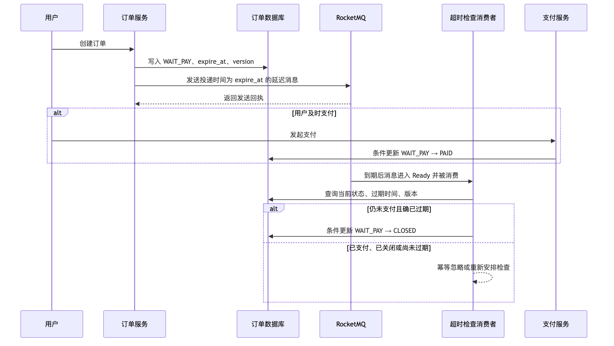
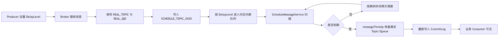
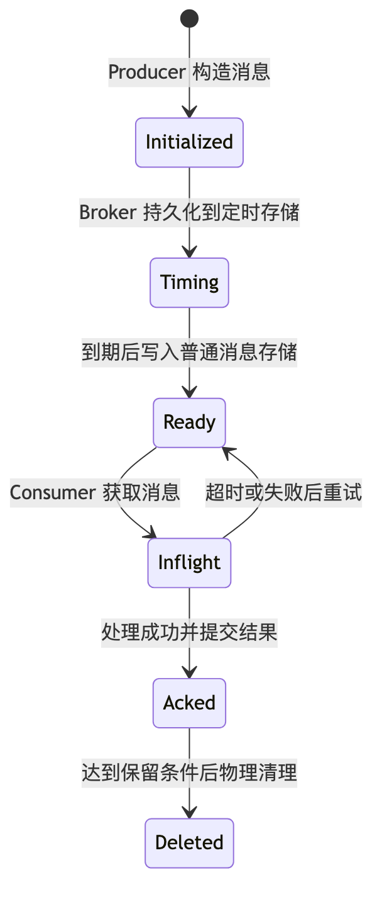
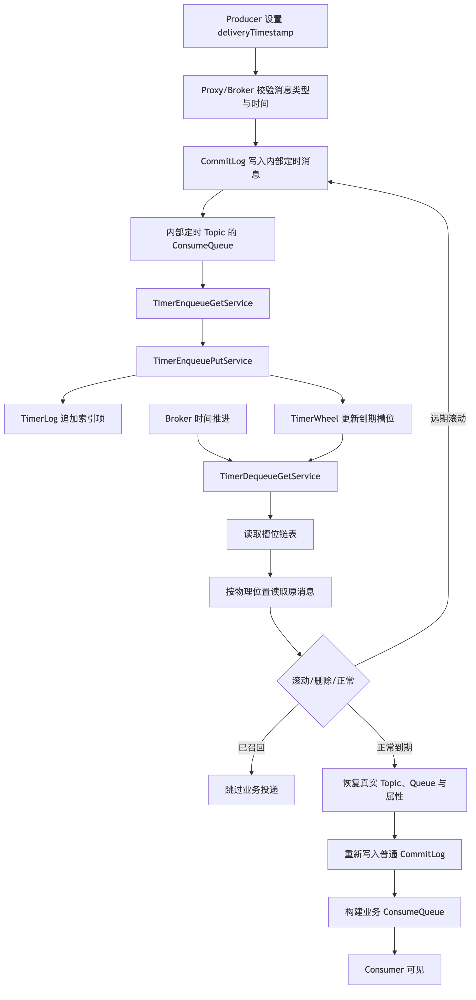

# 第 10 章：延迟消息、定时消息与分布式任务调度

> **版本基线**：本章以 Apache RocketMQ Server **5.5.0** 为当前实现基线，以 RocketMQ **4.9.8** 说明经典固定延迟级别，并以官方 5.x gRPC Go SDK 的 `SetDelayTimestamp` API 演示。官方仓库在 2026 年 6 月列出的 Go SDK 为 `golang/v5.1.4`，该版本在 GitHub Release 页面标记为 Pre-release，生产使用时应结合组织的版本准入策略。
>
> **最重要的结论**：延迟消息解决的是“到某个时间后触发一次消息投递”，不是硬实时定时器，更不是“到点保证业务完成”。

## 本章去重边界与跳转

本章是延迟消息、定时消息、时间轮和任务调度选型的主讲章节。重复出现的幂等、事务、补偿和源码只在“定时触发”上下文中引用。

| 重复主题 | 本章处理方式 |
| --- | --- |
| 至少一次、重复投递和消费幂等 | 本章只讲延迟消息如何产生重复；通用可靠性闭环看 [第 8 章：端到端消息可靠性](/blog/tech/RocketMQ/08.端到端消息可靠性、重试、死信队列与消费幂等)。 |
| 订单关闭、Outbox、状态机和业务补偿 | 本章讲定时触发模式；业务架构设计看 [第 19 章：复杂场景落地](/blog/tech/RocketMQ/19.RocketMQ业务架构设计、技术选型与复杂场景落地)，事务消息看 [第 11 章](/blog/tech/RocketMQ/11.事务消息、HalfMessage、事务回查与最终一致性)。 |
| 4.x 与 5.x 延迟模型差异 | 本章讲机制细节；整体版本演进看 [第 17 章：4.x 到 5.x 架构演进](/blog/tech/RocketMQ/17.从RocketMQ4.x到5.x：Proxy、gRPC、POP、Controller与架构演进)。 |
| TimerMessageStore、TimerLog、TimerWheel 源码 | 本章讲运行机制；源码调用链看 [第 18 章：源码阅读](/blog/tech/RocketMQ/18.RocketMQ源码阅读：发送、存储、消费、事务与高可用调用链)。 |
| 定时消息积压、同槽洪峰和监控 | 本章讲设计风险；容量压测看 [第 14 章](/blog/tech/RocketMQ/14.RocketMQ性能优化、流控、压测与容量规划)，运维排障看 [第 15 章](/blog/tech/RocketMQ/15.RocketMQ可观测性、故障诊断、应急处理与生产Runbook)。 |

## 10.1 学习目标

学完本章，你应当能够：

1. 区分延迟消息、定时消息、相对延迟和绝对投递时间。
2. 解释 RocketMQ 4.x 固定 `DelayLevel` 的存储与重新投递流程。
3. 解释 RocketMQ 5.x 基于时间戳、`TimerMessageStore`、`TimerLog` 和时间轮的实现。
4. 判断延迟消息的精度边界、故障恢复行为以及可能产生的重复投递。
5. 设计订单超时关闭、支付结果检查、延迟通知和失败重试方案。
6. 正确回答“延迟消息是否保证准时”“延迟消息能否取消或修改”。
7. 在 RocketMQ、数据库扫描、Redis ZSet 和自建调度器之间做技术选型。

---

## 10.2 场景导入：订单 30 分钟未支付自动关闭

用户创建订单后，订单系统写入一条状态为 `WAIT_PAY`、过期时间为 30 分钟后的记录。最直接的实现是每隔几秒扫描订单表，但订单量一大，数据库会持续承担范围扫描、排序和锁竞争。另一种思路是发送一条 30 分钟后到期的消息，由消费者在到期后检查订单。

注意这里的动词是**检查**，不是无条件关闭。



为什么不能收到消息就执行 `UPDATE orders SET status='CLOSED' WHERE id=?`？因为消息可能晚到、重复到，也可能与支付回调并发。订单状态必须由数据库中的当前事实和条件更新决定，而不能由一条历史消息单方面决定。

---

## 10.3 延迟消息与定时消息

### 10.3.1 基本定义

**延迟消息**是发送后不立即对消费者可见，而是在经过一段时间或到达指定时间后才进入可消费状态的消息。

**定时消息**强调在指定的绝对时间触发，例如“2026-06-20 18:00:00 投递”；**延迟消息**强调相对时间，例如“15 分钟后投递”。在 RocketMQ 5.x 的服务端模型中，两者最终都被转换为毫秒级 Unix 时间戳，因此本质上是同一种能力。[1]

### 10.3.2 相对延迟与绝对投递时间

| 表达方式 | 示例 | 优点 | 主要风险 |
|---|---|---|---|
| 相对延迟 | 当前时间后 30 分钟 | 业务表达自然 | 依赖生产者时钟；重试发送时必须避免重新延长 30 分钟 |
| 绝对时间 | `expire_at=1781949600000` | 可与数据库截止时间保持一致 | 需要正确处理时区、时间同步和过期时间 |

在 5.x Go SDK 中，业务通常调用 `time.Now().Add(30*time.Minute)`，但 SDK 发送给服务端的语义仍然是绝对投递时间。更稳妥的做法是先把订单的 `expire_at` 持久化，再将同一个值设置为消息投递时间，避免数据库和消息各算一次导致偏差。

### 10.3.3 两个必须直接回答的问题

> **延迟消息是否保证准时？**
>
> **不保证。** RocketMQ 提供的是持久化、可扩展的到期触发能力，不是硬实时调度。到达设定时间只表示消息具备进入普通存储并被投递的条件。时间轮粒度、Broker 扫描和重新写入、磁盘与线程池负载、网络、消费者积压及业务处理时间都会形成额外延迟。故障恢复后通常会补投，但可能晚于目标时间。

> **RocketMQ 4.x 与 5.x 延迟消息有什么区别？**
>
> 4.x 主要通过固定 `DelayLevel` 表达相对延迟，默认只有 18 个离散档位，服务端使用调度主题和按延迟级别划分的队列重新投递；5.x 面向用户提供毫秒 Unix 投递时间戳，使用 `TimerMessageStore`、`TimerLog` 和时间轮管理到期任务，可表达任意允许范围内的时间点。两者的 API、存储索引和调度模型均不同，不能混为一谈。

---

## 10.4 RocketMQ 4.x：固定 DelayLevel 模型

### 10.4.1 默认 18 个延迟级别

RocketMQ 4.x 官方默认提供以下 18 个级别：[2]

| Level | 延迟 | Level | 延迟 | Level | 延迟 |
|---:|---:|---:|---:|---:|---:|
| 1 | 1 秒 | 7 | 3 分钟 | 13 | 9 分钟 |
| 2 | 5 秒 | 8 | 4 分钟 | 14 | 10 分钟 |
| 3 | 10 秒 | 9 | 5 分钟 | 15 | 20 分钟 |
| 4 | 30 秒 | 10 | 6 分钟 | 16 | 30 分钟 |
| 5 | 1 分钟 | 11 | 7 分钟 | 17 | 1 小时 |
| 6 | 2 分钟 | 12 | 8 分钟 | 18 | 2 小时 |

客户端设置的是级别编号，而不是任意时间戳。例如 Level 3 表示 10 秒。Broker 配置项 `messageDelayLevel` 的默认值也对应这 18 个档位。开源 Broker 虽可调整该配置，但这仍然是“离散级别模型”，而不是 5.x 的任意时间戳模型；修改后还会增加跨环境、运维工具和客户端认知不一致的风险。

### 10.4.2 经典实现流程

4.x Broker 接收延迟消息后，不会让消息直接进入业务 Topic 的可消费队列，而是把真实 Topic、真实 QueueId 写入属性，将消息转入内部调度主题。一个延迟级别对应内部主题中的一个队列。`ScheduleMessageService` 为各级别推进消费位置，计算剩余时间；到期后恢复真实 Topic 和 QueueId，再次写入普通消息存储。



从源码阅读角度，应关注 `ScheduleMessageService` 的三个位置：

1. `parseDelayLevel`：解析 `1s 5s 10s ... 2h`，建立级别到毫秒数的映射。
2. 定时投递任务：从内部调度队列读取消息物理位置，计算 `deliverTimestamp-now`。
3. `messageTimeUp`：重建消息，恢复业务 Topic 和 QueueId，再调用消息存储写入。

### 10.4.3 4.x 模型的限制

第一，无法原生表达“37 秒后”或“今天 18:03:27 投递”，只能选择最接近的档位。第二，默认最大档位是 2 小时，长周期任务不合适。第三，同一级别的消息集中在同一类调度队列中，热点级别或同一时刻的大批量任务会造成追赶延迟。第四，消息到期后还需要重新写入普通存储，因此“级别时间到达”与“消费者收到”之间仍有链路延迟。第五，已发送消息没有通用的原地修改和取消 API，业务通常只能通过状态表、任务版本或取消标记让消费者忽略旧任务。

因此，4.x 固定级别适合“几秒、几分钟、几小时后触发”的有限场景，但不适合通用分布式调度平台。

---

## 10.5 RocketMQ 5.x：投递时间戳模型

### 10.5.1 用户侧模型

5.x 延迟消息以毫秒级 Unix 时间戳表示投递时间。官方文档规定：时间戳必须晚于当前时间，并处于允许范围内；过早或超出范围的时间可能不生效并被立即投递。官方文档给出的默认最大范围是 **24 小时**，默认时间粒度是 **1000 毫秒**，延迟消息必须发送到消息类型为 `Delay` 的 Topic。[1]

这意味着下面三个概念不能混淆：

- **API 时间戳精度**：字段能表达毫秒时间戳。
- **默认调度粒度**：官方文档为 1000 毫秒。
- **业务端到端精度**：还要叠加服务端和消费者链路延迟，远大于字段精度。

生产环境应把官方文档的 24 小时作为可移植、可支持的外部约束。5.5.0 源码中虽然存在 `timerMaxDelaySec` 等可配置实现参数，但 Proxy、SDK、运维策略和后续版本可能具有不同校验，不能仅凭修改 Broker 参数就把内部实现当成稳定公共契约。超过官方范围的任务，宜由数据库任务表或专业调度系统长期保存，在进入近期限窗口后再投递到 RocketMQ。

### 10.5.2 生命周期



`Timing` 阶段与普通消息不同：消息尚未进入面向业务消费者的普通可见状态。到期后进入 `Ready`，才开始服从普通消息的拉取、消费、重试和积压语义。因而“定时阶段的延迟”和“消费者阶段的延迟”必须分别观察。

---

## 10.6 时间轮与 TimerMessageStore 源码模型

### 10.6.1 为什么需要时间轮

假设 Broker 保存一亿个定时任务。如果每秒对全部任务排序或扫描，成本不可接受。时间轮把时间轴切成固定大小的槽位，例如每 1 秒一个槽。任务根据到期时间映射到槽位，指针每次只推进一个槽，处理当前到期桶中的任务，时间复杂度更接近“当前到期任务数”，而不是“全部任务数”。

时间轮不是消息正文仓库，更像按时间组织的索引。RocketMQ 5.5.0 的 `TimerWheel` 使用映射文件保存槽位信息，槽位记录时间、首尾索引位置和数量；`TimerLog` 记录定时索引项，包括原消息物理位置、大小、前驱位置、到期时间和标记等；消息正文仍可通过物理位置读取。`TimerCheckpoint` 保存推进进度，供重启恢复。[4][5]

### 10.6.2 5.5.0 的主要组件

| 组件 | 职责 |
|---|---|
| `TimerMessageStore` | 定时消息总控，组织入轮、出轮、恢复和重新投递 |
| `TimerWheel` | 将时间映射为槽位，保存槽位首尾索引与任务数量 |
| `TimerLog` | 顺序记录定时索引项及链式关系 |
| `TimerCheckpoint` | 持久化读时间、队列位置和刷盘进度 |
| `TimerEnqueueGetService` | 从内部定时主题对应的消费队列读取待入轮消息 |
| `TimerEnqueuePutService` | 将索引项追加到 TimerLog 并更新槽位 |
| `TimerDequeueGetService` | 随时间推进并取出到期槽位 |
| `TimerDequeueGetMessageService` | 根据物理位置读取原消息 |
| `TimerDequeuePutMessageService` | 恢复业务属性并重新写入普通消息存储 |
| `TimerFlushService` | 刷新时间轮、日志和检查点相关状态 |

### 10.6.3 写入、暂存、扫描与重新投递



核心过程可以概括为：

1. Broker 将带投递时间的消息转换为内部定时消息，并保留真实 Topic、Queue 等属性。
2. 入轮线程从内部定时 Topic 的消费队列顺序读取消息。
3. `doEnqueue` 根据到期时间选择槽位，在 `TimerLog` 追加索引项，并修订槽位首尾位置。
4. 出轮线程按 `timerPrecisionMs` 推进读时间，读取当前槽位及其链式索引。
5. 根据索引取得原消息，判断其是正常任务、远期滚动记录还是召回删除记录。
6. 正常到期任务恢复真实业务属性，再写入普通消息存储，随后消费者才可见。

5.5.0 源码中的几个默认值值得用于理解实现，但不应直接当作外部 SLA：[4][6]

| 源码项 | 5.5.0 默认值/常量 | 含义 |
|---|---:|---|
| `timerPrecisionMs` | 1000 ms | 时间轮推进精度 |
| `timerRollWindowSlot` | 172800 个槽 | 默认约 2 天滚动窗口 |
| `timerMaxDelaySec` | 259200 秒 | Broker 内部默认最大延迟约 3 天 |
| `TIMER_WHEEL_TTL_DAY` | 7 天 | 时间轮固定槽位跨度相关常量 |

为什么存在“官方文档 24 小时”和“源码默认 3 天”的差异？前者是用户侧支持边界，后者是某一服务端版本的内部配置。完整链路还包含客户端、Proxy 和运维约束。架构设计时以官方文档和实测兼容矩阵为准，源码参数用于理解实现与排障，而不是擅自扩大业务承诺。

对于超过滚动窗口的远期任务，源码会将其先放到窗口边缘，后续再滚动重新入轮。这样可以避免时间轮无限增大，并刷新消息所在的存储位置。但自定义超长延迟会同时放大磁盘保留、恢复耗时、版本升级和极端停机风险，因此不建议把 RocketMQ 当作数月、数年的日历数据库。

---

## 10.7 到期不等于准时，更不等于业务完成

设业务期望时间为 `T`，实际业务完成时间可以近似分解为：

`完成时间 = T + 时间槽误差 + 到期扫描积压 + 重新写入延迟 + 消息分发延迟 + 消费积压 + 网络延迟 + 业务执行时间`


因此，应至少区分三类指标：

1. **到期转 Ready 延迟**：普通消息重新写入时间减目标投递时间，反映 Broker 定时链路。
2. **Ready 到消费开始延迟**：反映 Topic、ConsumerGroup 和客户端积压。
3. **消费开始到业务提交延迟**：反映下游数据库、RPC 和业务线程池。

### 10.7.1 精度

默认 1000 毫秒粒度不意味着每条消息都能在误差 1 秒内被消费者处理。粒度只是时间桶尺度。大量任务落入同一桶、Broker 磁盘繁忙、出轮线程赶不上或业务 Topic 积压时，尾延迟可能明显放大。

### 10.7.2 时钟漂移

5.x 使用绝对时间戳，生产者和 Broker 的时钟偏差会直接改变实际延迟。生产者时钟过快会把时间设得更远；过慢可能让时间戳接近甚至早于 Broker 当前时间，从而立即投递。Broker 时钟大幅前跳可能让一批消息同时到期；回拨则可能使到期判断停滞或恢复后集中追赶。所有节点应使用 NTP/chrony，并监控时钟偏差和时间同步状态。

### 10.7.3 Broker 重启

`TimerLog`、`TimerWheel` 和 `TimerCheckpoint` 都有持久化与恢复流程。5.5.0 启动时会加载定时日志、修订时间轮、校正内部队列位置和读时间。因此正常重启不应把所有定时状态当作内存任务丢失，但停机期间已经到期的消息只能在服务恢复后补投，恢复扫描又会增加迟延和瞬时负载。[4]

### 10.7.4 消费积压

即使 Broker 在 `T` 时刻及时把消息转为 `Ready`，消费者仍可能因实例不足、处理缓慢或下游故障而几分钟后才执行。面试中把“定时投递准时”和“业务执行准时”画等号，是典型错误。

---

## 10.8 延迟消息能否取消或修改

### 10.8.1 4.x

经典固定级别模型没有面向业务的通用原地取消、修改接口。常用方案是：任务表记录 `ACTIVE/CANCELED/DONE`，消息只携带任务 ID；消费者收到后查询状态，已取消则直接成功返回。需要修改执行时间时，更新任务版本并发送新消息，旧消息因版本过期而被忽略。

### 10.8.2 5.5.0 的真实开源能力

RocketMQ 5.5.0 服务端包含 `RecallMessageProcessor`，官方 Go SDK `golang/v5.1.4` 的发布说明和示例也包含 `Producer.Recall`。发送回执中可返回 `RecallHandle`，客户端在消息到期前使用该句柄发起召回。服务端并不是直接删除原物理记录，而是写入带删除唯一键和原投递时间的召回记录，由 `TimerMessageStore` 在时间线中识别删除标记。[7][8][10]

但必须同时看到限制：

1. 5.5.0 Broker 的 `recallMessageEnable` **默认是 `false`**，需要明确开启并核对 Proxy、客户端与 Broker 的兼容性。
2. 消息已经到期或已进入普通可见状态后，召回可能失败或已经来不及阻止消费。
3. 召回依赖 `RecallHandle`，句柄丢失、Topic 不匹配或 Broker 不匹配都会失败。
4. “修改投递时间”不是原地更新。通常是召回旧消息，再发送新消息。
5. 召回与重发不是一个原子事务：可能旧消息召回成功而新消息发送失败，也可能新消息发送成功但旧消息召回超时。
6. 即使召回接口返回失败，也不能据此推断原消息一定会被消费；网络超时可能导致结果未知。

所以，召回是降低无效投递的优化能力，不应成为业务正确性的唯一保障。消费者仍要检查任务状态、版本号和业务事实。

---

## 10.9 典型业务场景

### 10.9.1 订单超时关闭

消息到期后查询订单，只有满足“当前状态仍为待支付、数据库认定已过期、任务版本仍有效”三个条件，才能执行条件关闭。支付回调也必须使用条件更新，让 `WAIT_PAY → PAID` 与 `WAIT_PAY → CLOSED` 在数据库中竞争，最终只有一个状态迁移成功。

### 10.9.2 支付结果检查

支付请求返回“处理中”时，可发送 10 秒、30 秒或 2 分钟后的查询任务。消费者调用支付渠道查询接口，确认成功后推进订单；仍处理中则按有上限的退避策略重新发送。不能无限重试，也不能把“渠道查询失败”当作“支付失败”。

### 10.9.3 延迟通知

例如注册后 10 分钟仍未完成实名认证，则发送提醒。通知类业务通常允许较宽时间窗口，可对到期时间增加小幅随机抖动，避免整点海量消息同时触发。发送前仍应检查用户是否已完成操作，避免过时通知。

### 10.9.4 失败重试

业务失败重试可以使用延迟消息，但应与 RocketMQ 自身的消费重试区分。中间件重试解决“本次消费未成功确认”；业务重试解决“明确记录了一次外部任务，计划稍后再次执行”。后者应携带 `attempt`、`next_at`、业务幂等键和最大次数，并采用指数退避加随机抖动，超过上限后进入人工处理或补偿流程。

---

## 10.10 Go 实战：订单超时检查

下面使用 5.x gRPC Go SDK。示例重点是时间戳、幂等标识和条件关闭，不展开工程目录。

### 10.10.1 发送延迟消息

```go
package ordertimeout

import (
    "context"
    "encoding/json"
    "errors"
    "fmt"
    "time"

    rmq "github.com/apache/rocketmq-clients/golang/v5"
)

type TimeoutEvent struct {
    EventID        string    `json:"event_id"`
    OrderID        string    `json:"order_id"`
    ExpectedVersion int64    `json:"expected_version"`
    ExpireAt       time.Time `json:"expire_at"`
    Attempt        int       `json:"attempt"`
}

func SendTimeoutEvent(
    ctx context.Context,
    producer rmq.Producer,
    topic string,
    event TimeoutEvent,
) error {
    if producer == nil {
        return errors.New("producer is nil")
    }
    if topic == "" || event.EventID == "" || event.OrderID == "" {
        return errors.New("topic, event_id and order_id are required")
    }

    now := time.Now()
    if !event.ExpireAt.After(now) {
        return fmt.Errorf("expire_at must be in the future: %s", event.ExpireAt)
    }

    // 以官方文档的 24 小时范围作为可移植约束。
    if event.ExpireAt.Sub(now) > 24*time.Hour {
        return fmt.Errorf("delay exceeds documented 24-hour range")
    }

    body, err := json.Marshal(event)
    if err != nil {
        return fmt.Errorf("marshal timeout event: %w", err)
    }

    msg := &rmq.Message{
        Topic: topic,
        Body:  body,
    }
    msg.SetTag("ORDER_TIMEOUT_CHECK")
    msg.SetKeys(event.OrderID, event.EventID)
    msg.SetDelayTimestamp(event.ExpireAt)

    sendCtx, cancel := context.WithTimeout(ctx, 3*time.Second)
    defer cancel()

    receipts, err := producer.Send(sendCtx, msg)
    if err != nil {
        // 超时不代表 Broker 一定未接收。调用方应按 EventID 做发送去重或补偿核对。
        return fmt.Errorf("send timeout event: %w", err)
    }
    if len(receipts) == 0 {
        return errors.New("empty send receipt")
    }
    return nil
}
```

生产者初始化方式与普通 5.x Producer 相同：配置 Proxy Endpoint，使用 `rmq.NewProducer` 创建单例 Producer，调用 `Start`，退出时执行 `GracefulStop`。延迟 Topic 应提前创建为 `Delay` 类型，而不是依赖线上自动创建。[1][9]

### 10.10.2 消费端必须做条件状态迁移

```go
package ordertimeout

import (
    "context"
    "encoding/json"
    "errors"
    "fmt"
    "time"
)

type CloseResult int

const (
    CloseNoop CloseResult = iota
    CloseSucceeded
    CloseTooEarly
)

type OrderStore interface {
    // 实现必须在数据库中原子判断：
    // status = WAIT_PAY、expire_at <= 数据库当前时间、version = expectedVersion。
    // 只有同时满足条件时才更新为 CLOSED，并递增 version。
    CloseIfUnpaidAndExpired(
        ctx context.Context,
        orderID string,
        expectedVersion int64,
    ) (CloseResult, error)
}

type TimeoutHandler struct {
    Store OrderStore
    Now   func() time.Time
}

func (h TimeoutHandler) Handle(ctx context.Context, body []byte) error {
    if h.Store == nil {
        return errors.New("order store is nil")
    }

    var event TimeoutEvent
    if err := json.Unmarshal(body, &event); err != nil {
        // 格式错误通常不可重试，应记录后转入人工或隔离流程。
        return fmt.Errorf("decode timeout event: %w", err)
    }
    if event.OrderID == "" || event.EventID == "" {
        return errors.New("invalid timeout event")
    }

    result, err := h.Store.CloseIfUnpaidAndExpired(
        ctx,
        event.OrderID,
        event.ExpectedVersion,
    )
    if err != nil {
        // 临时数据库错误返回失败，由消费重试机制再次投递。
        return fmt.Errorf("close order conditionally: %w", err)
    }

    switch result {
    case CloseSucceeded:
        // 后续库存释放、优惠券返还等操作也要幂等，宜通过事件或 Outbox 驱动。
        return nil
    case CloseNoop:
        // 已支付、已关闭或版本已变化，旧任务已经失效，按成功处理。
        return nil
    case CloseTooEarly:
        // 可能由时钟偏差或数据变更引起。应依据数据库 expire_at 重新发送检查任务，
        // 而不是在消费者线程中 Sleep。
        return nil
    default:
        return fmt.Errorf("unknown close result: %d", result)
    }
}
```

真正的数据库实现应使用一条带状态、过期条件和版本条件的原子更新，判断受影响行数，而不是先查询后无条件更新。使用数据库当前时间可以减少应用节点时钟漂移影响。即使同一事件被重复投递，第一次成功关闭后，后续更新因状态或版本不匹配而返回 `CloseNoop`。

### 10.10.3 发送与订单事务之间仍有空窗

如果订单已经提交但延迟消息发送失败，订单可能永远没有检查任务；如果发送超时后盲目重发，又可能产生多条消息。可采用以下组合：

- 订单事务同时写入 Outbox/任务表，由可靠发布器发送延迟消息。
- 使用 `EventID` 作为幂等键，发布器允许至少一次发送。
- 保留低频补偿扫描，查找已过期但仍为 `WAIT_PAY` 的订单。
- 监控“即将到期任务数”和“已过期未关闭订单数”，而不只监控 MQ 发送成功率。

延迟消息降低了全表高频扫描压力，但不应删除最终兜底扫描。

---

## 10.11 RocketMQ、数据库扫描、Redis ZSet 与自建时间轮对比

| 维度 | RocketMQ 延迟消息 | 数据库扫描 | Redis ZSet | 自建时间轮调度器 |
|---|---|---|---|---|
| 调度模型 | 到期后转为消息投递 | 周期查询到期行 | 按 score 查询到期成员 | 槽位推进并执行任务 |
| 持久化 | Broker 持久化并支持恢复 | 数据库天然持久化 | 取决于 AOF/RDB 与主从策略 | 必须自行实现日志、快照和恢复 |
| 水平扩展 | Broker、Topic、消费者可扩展 | 分片扫描与抢锁较复杂 | 需分片、主从和领取协议 | 分片、再平衡均需自研 |
| 精度 | 默认秒级调度粒度，端到端非实时 | 取决于扫描周期 | 可做较细粒度轮询 | 由 tick 决定 |
| 对主库压力 | 低，消费时按主键检查 | 可能持续范围扫描和锁竞争 | 低于数据库，但增加 Redis 压力 | 取决于任务存储 |
| 取消/修改 | 4.x 弱；5.5.0 可选召回但有条件 | 更新任务行最直接 | `ZREM`/改 score 较方便 | 需自行维护句柄与并发一致性 |
| 重复与领取 | 至少一次语义，业务幂等 | 需设计状态和抢锁 | 需解决原子领取、宕机归还 | 全部自行处理 |
| 消费生态 | 天然接入 MQ 重试、积压、监控 | 还需任务执行队列 | 还需工作队列或执行器 | 还需完整执行平台 |
| 适合场景 | 高并发近期限触发、异步业务 | 任务量小、可审计、易修改 | 需要频繁取消/改期的中等任务 | 单进程或特定低延迟系统 |
| 主要风险 | 到期洪峰、积压、版本边界 | 数据库压力、扫描空耗 | 数据丢失策略、热 Key、领取竞态 | 研发和运维成本极高 |

选型不能只问“哪个更快”。任务是否需要频繁修改、保存多久、是否允许重复、是否要求审计、执行端是否天然使用 MQ，往往比单点吞吐更重要。

一个常见的混合方案是：数据库保存权威任务状态和远期任务；Redis 或数据库负责可取消、可改期的计划；任务进入未来 24 小时窗口后再发送 RocketMQ 延迟消息；RocketMQ 负责高并发到期触发和消费者扩展。

---

## 10.12 大量相同到期时间：定时消息的“惊群”

电商活动在 20:00 结束，如果一千万条消息都设置为 20:00:00，它们会落入相同或相邻时间槽。到期时 Broker 需要同时出轮、读取消息并重新写入普通存储，业务消费者和下游数据库也会瞬间承压。官方文档明确不建议给大量消息设置完全相同的投递时间。[1]

治理方法包括：

1. **允许窗口的业务增加抖动**：通知、缓存刷新、非关键重试可在数十秒窗口内随机分散。
2. **按业务键分片 Topic 或队列**：避免所有任务集中到单一 Broker，但不要为了分片制造无穷 Topic。
3. **消费端限流与批处理**：限制数据库并发，用批量查询或批量状态更新减少连接风暴。
4. **提前容量评估**：估算峰值到期 QPS，而不是只看全天平均发送 TPS。
5. **分级降级**：先处理支付、订单等核心任务，营销通知允许延后。
6. **避免同步扇出**：消费者不要收到一条消息后立即同步调用十个下游，可继续拆分事件并设置隔离线程池。

对于“必须整点生效”的规则，通常不需要为每个对象发送一条整点消息。更好的做法可能是先切换一条全局活动状态，再由请求路径读取状态；逐对象任务只承担确实需要逐项处理的工作。

---

## 10.13 重复投递与幂等

延迟消息仍遵循消息系统的至少一次现实：发送超时后重发、Broker 到期重新写入时的异常、消费者处理成功但 ACK 丢失、消费超时和重试，都可能导致重复。

幂等设计至少包含三层：

- **消息层**：`EventID` 唯一，记录已处理事件或依赖业务状态天然去重。
- **状态机层**：只允许合法状态迁移，例如 `WAIT_PAY → CLOSED`，不能从 `PAID → CLOSED`。
- **副作用层**：库存释放、退款、优惠券返还、通知发送各自使用业务幂等键，不能因为订单更新幂等就假定所有下游也幂等。

不要只用 Redis `SETNX event_id` 就宣称完成幂等。若 Redis 标记成功后数据库事务失败，重试可能被错误拦截；若数据库成功而标记失败，又可能重复执行。优先使用业务数据库的唯一约束、状态条件和同事务记录，Redis 可作为加速层而非唯一事实源。

---

## 10.14 故障场景推演

### 10.14.1 Broker 在到期前重启

消息状态可从持久化文件恢复。若重启在目标时间前完成，通常继续等待；若恢复时目标时间已过，则会在恢复和追赶后补投。应关注恢复耗时、定时读时间落后量和重新写入速率。

### 10.14.2 Broker 停机跨过大量到期点

恢复后可能形成集中补投。业务必须接受“晚到但仍执行检查”的语义，并对下游限流。对已经过期很久、业务价值已消失的通知，可以在消费者中根据 `expire_at` 丢弃；订单检查则仍应查询状态并完成必要补偿。

### 10.14.3 生产者时钟慢 5 分钟

它计算出的绝对投递时间可能比预期早 5 分钟，甚至被 Broker 视为过去时间而立即投递。因此订单消费者必须再次判断数据库过期条件。时间同步故障不能仅靠 MQ 配置修复。

### 10.14.4 Broker 时钟突然前跳

一批未来消息可能快速被判定为到期，引发洪峰。恢复时钟后，也不能假定已经投递的消息会自动“撤回”。必须监控系统时间跃迁，并在消费者侧保留业务条件。

### 10.14.5 消费者积压 20 分钟

Broker 可能准时完成到期转 Ready，但订单直到 20 分钟后才被检查。这时关闭操作仍应执行，因为订单确实过期；同时要用消费延迟指标定位消费者容量，而不是误判为时间轮故障。

### 10.14.6 召回请求超时

召回可能已在服务端成功，也可能未执行。不要立刻假定结果。把任务状态改为 `CANCELED` 或提升任务版本，使旧消息即使到达也无效；召回仅用于减少无效消息和资源消耗。

---

## 10.15 生产设计与观测清单

上线前至少回答以下问题：

1. 目标是“尽量在某时刻触发”还是有明确的最晚完成时间？后者需要容量冗余和补偿通道。
2. 任务是否超过官方 24 小时范围？远期任务放在哪里？
3. 是否存在整点、活动结束或批量导入造成的同一到期时间洪峰？
4. 生产者发送超时如何核对，是否有 Outbox 或补偿发布器？
5. 消费者的幂等键、状态机、版本号和副作用幂等分别是什么？
6. Broker 重启和消费者停机后，补投洪峰如何限流？
7. 时钟同步由谁负责，偏差达到多少报警？
8. 是否需要取消或改期？若使用 Recall，是否开启 Broker 配置并验证完整版本链路？
9. 是否保留低频数据库兜底扫描？
10. 是否分别监控到期转 Ready 延迟、消费积压和业务完成延迟？

建议核心告警包括：定时读时间落后、TimerLog/CommitLog 磁盘空间、到期重新写入失败、同槽任务数异常、业务 Topic 消费堆积、消费者处理 RT、数据库条件关闭失败率、已过期仍为待支付的订单数、节点时钟偏差以及 Recall 失败率。

---

## 10.16 常见误区

1. **“设置 10 秒，就会在第 10 秒准时执行。”** 错。10 秒后只是进入可投递阶段，链路还有多段排队。
2. **“5.x 支持毫秒时间戳，所以业务精度是毫秒级。”** 错。字段分辨率不等于调度 SLA，默认粒度为 1000 毫秒。
3. **“消息到了就说明订单一定过期。”** 错。生产者时钟、数据变更和消息重复都可能使消息失真，数据库事实才权威。
4. **“延迟消息不会重复。”** 错。它仍然处于至少一次投递链路中。
5. **“有延迟消息后可以完全删除补偿扫描。”** 错。发送空窗、配置错误和长期故障都需要低频兜底。
6. **“源码参数能设 30 天，所以官方一定支持 30 天。”** 错。源码实现参数、客户端校验和官方支持边界不是同一层契约。
7. **“Recall 成功就不需要消费幂等。”** 错。召回存在时间窗口和竞态，且默认未开启。
8. **“修改时间就是更新原消息时间戳。”** 错。当前做法是召回旧消息并发送新消息，两步不原子。
9. **“订单关闭成功，库存释放自然也只执行一次。”** 错。每个跨服务副作用都要独立幂等。

---

## 10.17 面试题

> **题目去重**：本节作为本章延迟/定时消息自测，只保留时间模型、时间轮、取消修改和调度选型题。跨章重复题、完整追问链和模拟面试统一跳转到 [第 20 章：资深面试题库、追问链与模拟面试](/blog/tech/RocketMQ/20.RocketMQ资深面试题库、追问链与模拟面试)。

### 1. 什么是延迟消息和定时消息？

**标准回答**：延迟消息在经过相对时间后可投递，定时消息在绝对时间点后可投递；RocketMQ 5.x 最终都用毫秒 Unix 投递时间戳表达。到期表示进入 Ready 的条件成立，不表示消费者已经完成业务。

**追问**：相对延迟重试发送时有什么风险？

**易错点**：每次重试都按“当前时间加 30 分钟”，导致截止时间不断后移。

### 2. 延迟消息是否保证准时？

**标准回答**：不保证硬实时准时。时间轮粒度、扫描积压、重新写入、消息分发、消费积压和业务处理都会产生延迟；Broker 故障恢复后通常补投，但可能晚到。

**追问**：应监控哪些阶段？

**易错点**：只看消费者收到时间，无法区分 Broker 定时延迟和消费积压。

### 3. 4.x 与 5.x 延迟消息的核心区别是什么？

**标准回答**：4.x 是固定 DelayLevel 和内部调度主题；5.x 是绝对投递时间戳和 `TimerMessageStore` 时间轮。4.x 默认只有 18 档，5.x 可表达允许范围内的任意时间点。

**追问**：5.x 服务端是否完全删除了经典调度代码？

**易错点**：把面向用户的 5.x 模型和所有兼容代码是否存在混为一谈。

### 4. 4.x 延迟消息为什么要重新写入 CommitLog？

**标准回答**：延迟阶段的消息存放在内部调度主题，业务消费者不可见；到期后恢复真实 Topic 和 QueueId，作为普通消息重新写入，才能构建业务 ConsumeQueue 并被消费。

**追问**：重新写入失败会怎样？

**易错点**：认为修改一个可见性标志即可，不需要第二次存储链路。

### 5. 时间轮为什么比全量扫描高效？

**标准回答**：时间被切成槽，任务按到期时间映射到槽位，指针只处理当前槽中的任务，成本主要与本次到期任务数相关，而不是与全部定时任务数相关。

**追问**：时间轮是否保存消息正文？

**易错点**：把时间索引与消息数据存储混为一体。

### 6. `TimerWheel`、`TimerLog` 和 `TimerCheckpoint` 分别做什么？

**标准回答**：`TimerWheel` 保存时间槽及首尾索引，`TimerLog` 顺序记录定时索引项，`TimerCheckpoint` 持久化读时间和处理位置；三者配合完成入轮、出轮和重启恢复。

**追问**：为什么只保存内存时间轮不行？

**易错点**：忽略 Broker 重启后数百万任务的恢复与一致性。

### 7. 为什么到期消息还可能晚很久？

**标准回答**：到期后要扫描槽位、读取原消息、重新写入普通存储、构建消费索引，再等待消费者获取和执行。任何阶段积压都会放大尾延迟。

**追问**：如何判断问题在 Broker 还是消费者？

**易错点**：把 Consumer Lag 当作定时引擎故障。

### 8. 5.x 官方延迟时间范围是多少？

**标准回答**：当前官方 5.0 文档给出的默认最大范围为 24 小时，并要求时间晚于当前时间；架构设计应以该公开约束为准。

**追问**：源码中为什么看到 3 天？

**易错点**：直接用内部配置覆盖官方 API、Proxy 和 SDK 的支持边界。

### 9. 延迟消息能取消吗？

**标准回答**：4.x 没有通用召回；5.5.0 已有 Recall 链路，Go v5.1.4 也提供 API，但 Broker 默认关闭，且只能在有效窗口内尝试召回。业务仍需状态或版本兜底。

**追问**：召回超时后如何处理？

**易错点**：把超时等同于召回失败，再无条件执行一次相反操作。

### 10. 延迟消息能修改投递时间吗？

**标准回答**：当前不是原地修改。通常召回旧消息后发送新消息，两步不原子，应使用任务版本令旧消息失效，并用补偿流程处理部分成功。

**追问**：先召回还是先发送？

**易错点**：认为存在一个适合所有业务且无风险的固定顺序。

### 11. 为什么不能仅凭超时消息关闭订单？

**标准回答**：消息可能早到、晚到、重复，也可能与支付并发。必须在数据库中原子判断状态仍为 `WAIT_PAY`、确已过期且版本匹配，才允许关闭。

**追问**：支付和关闭同时发生怎么办？

**易错点**：先查后改，导致两个线程都基于旧状态执行成功。

### 12. 如何保证订单超时处理幂等？

**标准回答**：用事件 ID、订单状态机、版本号和数据库条件更新；关闭后的库存、优惠券、通知等副作用各自使用业务幂等键。

**追问**：只用 Redis SETNX 足够吗？

**易错点**：忽略 Redis 标记和数据库事务之间的原子性空窗。

### 13. Broker 重启后定时消息会丢吗？

**标准回答**：正常情况下定时日志、时间轮和检查点可恢复，已到期任务会在恢复后补投；但会产生延迟和追赶洪峰。极端停机、磁盘损坏或超出实现边界仍需容灾与补偿。

**追问**：业务层还要做什么？

**易错点**：把持久化等同于任何故障下绝对不丢。

### 14. 时钟回拨有什么影响？

**标准回答**：绝对时间模型依赖时钟。生产者偏差会设置错误时间，Broker 大幅回拨或前跳会影响到期判断和批量触发。需要 NTP/chrony、偏差告警和业务条件校验。

**追问**：为什么数据库时间更适合判断订单过期？

**易错点**：认为所有容器和 Broker 的 `time.Now()` 天然一致。

### 15. 大量消息同一时刻到期如何治理？

**标准回答**：对允许窗口的任务加抖动，按容量合理分片，消费者限流和批处理，核心与非核心任务隔离，并按峰值到期 QPS 容量规划。

**追问**：整点规则是否一定需要一对象一消息？

**易错点**：把全局状态切换错误地建模成千万条逐对象任务。

### 16. 延迟消息与数据库扫描如何选？

**标准回答**：高并发近期限触发更适合 MQ；任务量小、频繁改期、强审计或超长保存更适合数据库任务表。生产系统常用数据库保存权威状态、MQ 负责近期限触发的混合方案。

**追问**：为什么仍保留低频补偿扫描？

**易错点**：把二者视为必须二选一。

### 17. Redis ZSet 做延迟队列的难点是什么？

**标准回答**：除按 score 取到期任务外，还要解决原子领取、多实例竞争、执行中宕机归还、持久化、分片、热点和重复处理，不能只写一个 `ZRANGEBYSCORE`。

**追问**：删除 ZSet 成员后消费者宕机怎么办？

**易错点**：先删后执行造成任务丢失，或先执行后删造成重复却没有幂等。

### 18. 延迟消息适合做 Cron 吗？

**标准回答**：它适合承载一次性到期触发。周期任务需要计算下一次时间、处理漏跑和重复、暂停与变更、时区和日历规则；复杂 Cron 更适合专业调度系统，再由调度系统向 RocketMQ 分发执行事件。

**追问**：每天 5 点任务如何防止重复创建下一周期？

**易错点**：让消费者无条件发送下一条消息，失败重试时产生多条未来任务。

---

## 10.18 练习题

1. 为“优惠券 7 天后过期提醒”设计数据库任务表、近期限投递和取消流程，说明为什么不直接发送 7 天延迟消息。
2. 假设 1000 万订单在 20:00 同时到期，计算 Broker 到期重写峰值和消费者数据库并发，提出削峰方案。
3. 画出订单支付回调与超时关闭并发时的状态机，并给出条件更新规则。
4. 设计 Recall 失败、重发成功和消费者已收到旧消息三个竞态下的任务版本方案。
5. 分别定义“到期转 Ready 延迟”“消费延迟”“业务完成延迟”的监控指标和报警阈值。

---

## 10.19 本章总结

RocketMQ 4.x 延迟消息的本质是**固定延迟级别 + 内部调度队列 + 到期重新写入**；RocketMQ 5.x 的本质是**绝对投递时间戳 + 持久化时间索引 + 时间轮推进 + 到期重新写入**。两代模型都不提供硬实时保证。

延迟消息到期只表示消息可以进入普通投递链路。真正的业务完成还取决于 Broker 负载、消费积压、下游系统和业务事务。订单超时场景中，消息只能触发检查，数据库状态机和原子条件更新才决定是否关闭订单。

5.5.0 已出现开源 Recall 能力，但默认关闭、受时间窗口和版本链路约束，也不能原子修改投递时间。最稳健的架构始终是：消息至少一次、消费者幂等、任务带版本、业务状态权威、故障可补偿、全链路可观测。

---

## 10.20 版本与 Apache 官方来源

- **Apache RocketMQ Server**：5.5.0，GitHub Release 标记为 Latest。[3]
- **经典 4.x 源码参考**：4.9.8 `ScheduleMessageService`。[11]
- **Go 5.x SDK**：官方仓库 `github.com/apache/rocketmq-clients/golang/v5`；2026 年 6 月列出 `golang/v5.1.4`，Release 页面标记为 Pre-release，并包含延迟消息 Recall 支持。[8]

1. Apache RocketMQ 5.0 Delay Message：<https://rocketmq.apache.org/docs/featureBehavior/02delaymessage/>
2. Apache RocketMQ 4.x Delayed Message Sending：<https://rocketmq.apache.org/docs/4.x/producer/04message3/>
3. Apache RocketMQ 5.5.0 Release：<https://github.com/apache/rocketmq/releases/tag/rocketmq-all-5.5.0>
4. RocketMQ 5.5.0 `TimerMessageStore`：<https://github.com/apache/rocketmq/blob/rocketmq-all-5.5.0/store/src/main/java/org/apache/rocketmq/store/timer/TimerMessageStore.java>
5. RocketMQ 5.5.0 `TimerWheel`：<https://github.com/apache/rocketmq/blob/rocketmq-all-5.5.0/store/src/main/java/org/apache/rocketmq/store/timer/TimerWheel.java>
6. RocketMQ 5.5.0 `MessageStoreConfig`：<https://github.com/apache/rocketmq/blob/rocketmq-all-5.5.0/store/src/main/java/org/apache/rocketmq/store/config/MessageStoreConfig.java>
7. RocketMQ 5.5.0 `RecallMessageProcessor`：<https://github.com/apache/rocketmq/blob/rocketmq-all-5.5.0/broker/src/main/java/org/apache/rocketmq/broker/processor/RecallMessageProcessor.java>
8. Apache RocketMQ Clients Releases：<https://github.com/apache/rocketmq-clients/releases>
9. Go SDK Delay Producer Example：<https://github.com/apache/rocketmq-clients/blob/master/golang/example/producer/delay/main.go>
10. Go SDK Delay Recall Example：<https://github.com/apache/rocketmq-clients/blob/master/golang/example/producer/delay_recall/main.go>
11. RocketMQ 4.9.8 `ScheduleMessageService`：<https://github.com/apache/rocketmq/blob/rocketmq-all-4.9.8/store/src/main/java/org/apache/rocketmq/store/schedule/ScheduleMessageService.java>
