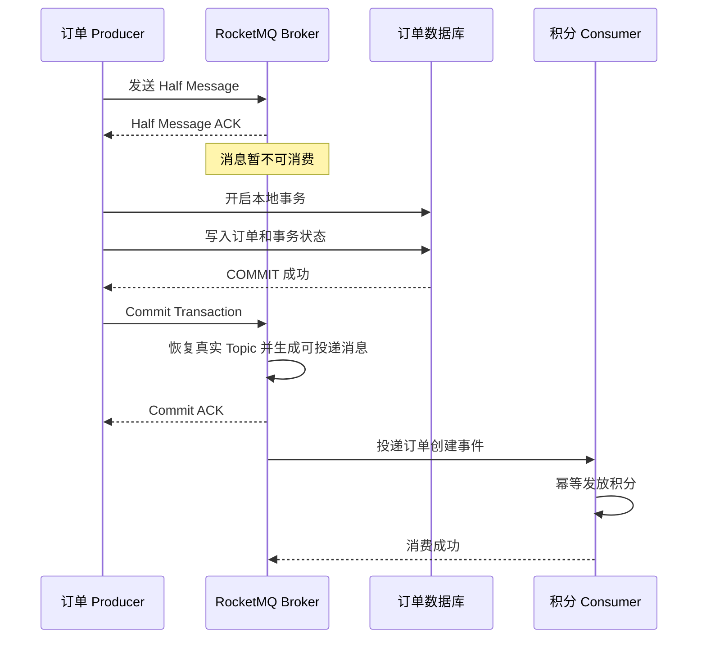
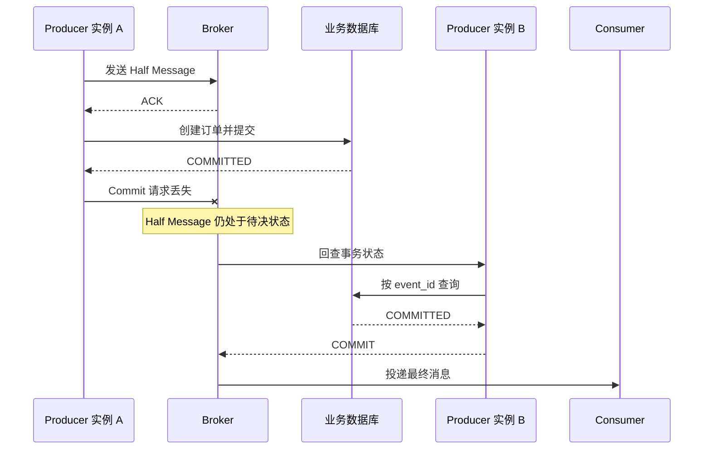
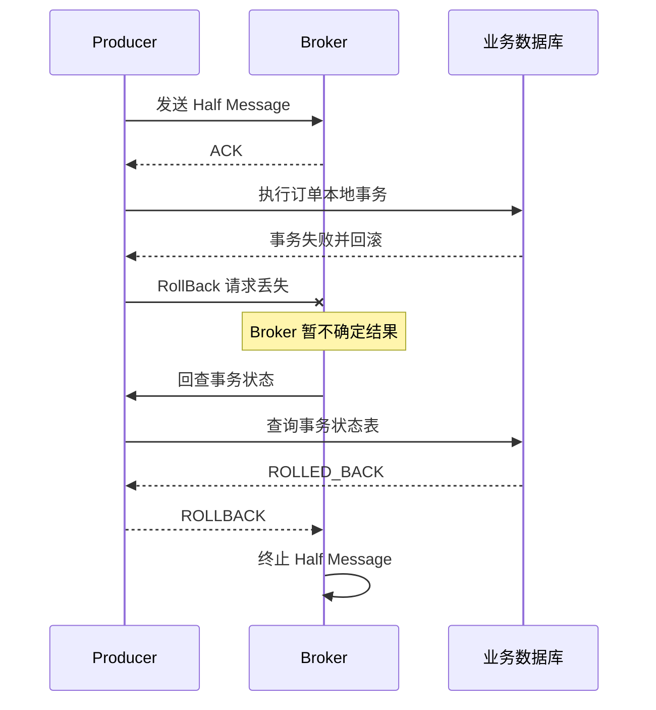
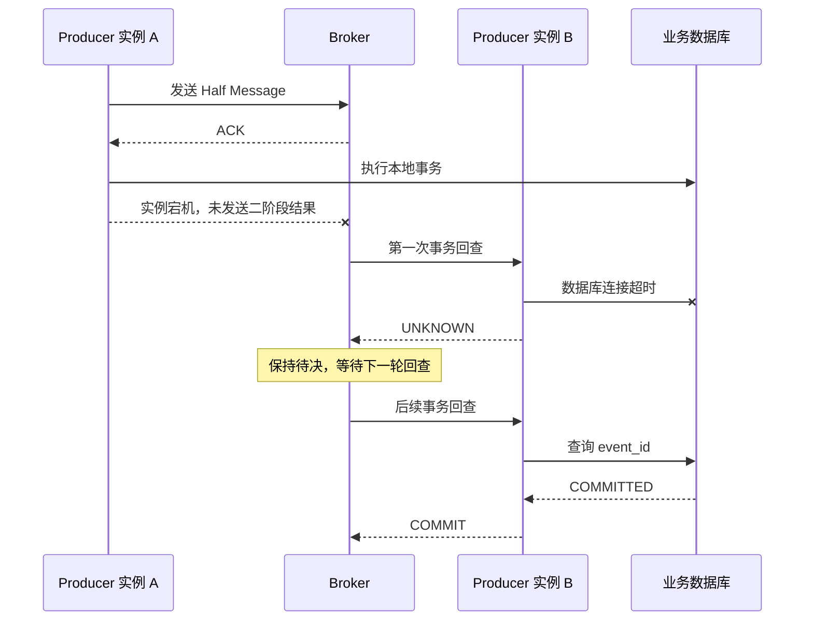
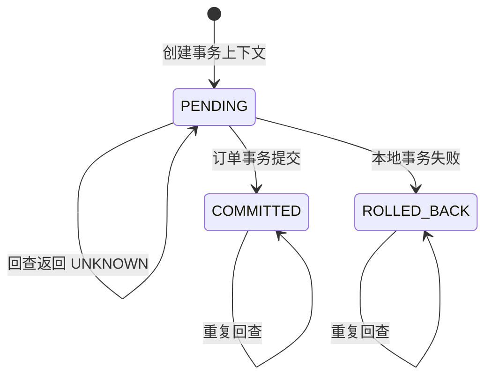

# 第 11 章：RocketMQ 事务消息、Half Message、事务回查与最终一致性

> **版本基线**：截至 2026 年 6 月 20 日，本章以 Apache RocketMQ **5.5.0** 服务端源码为主；官方多语言客户端仓库当前列出的 Go SDK 为 **golang/v5.1.4**，其 GitHub Release 标记为 Pre-release。示例使用该标签中的真实 API，生产环境应固定依赖版本并完成兼容性测试。([GitHub][1])

---

## 本章去重边界与跳转

本章是 RocketMQ 事务消息的主讲章节，保留 Half Message、Commit/Rollback/Unknown、事务回查、状态表、Go 实战和最终一致性边界。幂等、Outbox 和业务架构只在对比中出现。

| 重复主题 | 本章处理方式 |
| --- | --- |
| 至少一次、重复消息、消费幂等 | 本章只说明事务消息仍可能重复；通用可靠性闭环看 [第 8 章：端到端消息可靠性](/blog/tech/RocketMQ/08.端到端消息可靠性、重试、死信队列与消费幂等)。 |
| Producer 发送模型与结果未知 | 本章只关注事务 Producer；普通发送链路看 [第 4 章：Producer 发送模型](/blog/tech/RocketMQ/04.Producer发送模型、路由选择、重试机制与底层发送链路)。 |
| Topic MessageType 与资源规划 | 本章只讲事务 Topic 的约束；资源治理看 [第 12 章](/blog/tech/RocketMQ/12.Topic、Tag、Key、SQL92、MessageQueue与资源治理)，5.x 变化看 [第 17 章](/blog/tech/RocketMQ/17.从RocketMQ4.x到5.x：Proxy、gRPC、POP、Controller与架构演进)。 |
| Outbox、订单支付和复杂业务场景 | 本章只做方案对比；系统设计落地看 [第 19 章：业务架构设计](/blog/tech/RocketMQ/19.RocketMQ业务架构设计、技术选型与复杂场景落地)。 |
| Half Message 服务端源码 | 本章讲机制；源码调用链看 [第 18 章：源码阅读](/blog/tech/RocketMQ/18.RocketMQ源码阅读：发送、存储、消费、事务与高可用调用链)。 |

## 11.1 为什么需要事务消息

假设订单服务创建订单后，需要通知积分服务发放积分。订单表和 RocketMQ Broker 是两个独立资源，普通本地数据库事务无法同时覆盖二者。

无论先做哪一步，都存在“双写不一致”。

| 执行顺序        | 异常场景                | 后果                |
| ----------- | ------------------- | ----------------- |
| 先创建订单，再发送消息 | 数据库提交成功，进程随后宕机或发送失败 | 订单存在，但积分服务永远收不到事件 |
| 先发送消息，再创建订单 | 消息发送成功，数据库事务随后回滚    | 积分服务收到一个实际上不存在的订单 |
| 数据库和消息并发执行  | 一方成功、一方超时           | 无法仅凭调用结果确定最终状态    |
| 失败后直接重试     | 第一次其实已经成功，只是 ACK 丢失 | 可能产生重复订单或重复消息     |

RocketMQ 事务消息解决的核心问题不是“让订单数据库和积分数据库进入一个全局事务”，而是：

> **使生产者本地事务的最终结果，与消息是否对消费者可见，最终保持一致。**

具体来说：

* 本地事务提交，消息最终应可见；
* 本地事务回滚，消息最终不应投递；
* 第二阶段结果丢失时，Broker 通过事务回查重新确认；
* 下游积分是否真正发放成功，仍由消费重试、幂等和补偿机制负责。

官方文档同样将事务消息定义为保障“消息生产与本地事务之间最终一致性”的消息类型，并明确指出它不保证上游事务结果与下游消费结果同步一致。([RocketMQ][2])

---

## 11.2 事务消息的完整执行流程

RocketMQ 事务消息把发送过程拆成两个主要阶段：

1. Producer 向 Broker 发送 Half Message。
2. Broker 持久化 Half Message，但暂不允许普通消费者消费。
3. Broker 返回 Half Message 发送成功的 ACK。
4. Producer 执行本地数据库事务。
5. Producer 根据本地事务结果向 Broker 提交 `Commit` 或 `Rollback`。
6. Broker 收到 `Commit` 后使消息可投递；收到 `Rollback` 后终止该消息。
7. 如果第二阶段结果缺失或为 `Unknown`，Broker 稍后回查 Producer。

### 11.2.1 成功链路



只有在 Half Message 发送成功以后，Producer 才执行本地事务。这样可以避免“本地事务已经提交，但 Broker 从未保存过任何消息线索”的情况。

官方流程规定：Broker 先保存并将消息标记为不可投递，Producer 再执行本地事务，随后提交 `Commit` 或 `Rollback`；当网络中断、Producer 重启或状态为 `Unknown` 时，Broker 会向生产者集群发起事务状态查询。([RocketMQ][2])

---

## 11.3 Half Message、Commit、Rollback 与 Unknown

### 11.3.1 Half Message 是什么

Half Message，也称 Prepare Message、半事务消息，表示：

> Broker 已经接受了消息，但尚未得到本地事务最终结果，因此该消息暂时不能投递给普通消费者。

“Half”并不表示消息只保存了一半，也不表示消息体不完整。消息体、Key、属性等信息都已经发送给 Broker，只是消息处于事务待决状态。

普通 Consumer 不能消费 Half Message。只有 Broker 得到 `Commit` 结果并生成真实 Topic 下的可投递消息后，消费者才能看到它。官方文档将此阶段称为 `Transaction pending`，并明确说明消息对下游不可见。([RocketMQ][2])

### 11.3.2 三种事务状态

当前官方 Go SDK 定义了三个事务状态：

```go
const (
	UNKNOWN TransactionResolution = iota
	COMMIT
	ROLLBACK
)
```

事务接口为：

```go
type Transaction interface {
	Commit() error
	RollBack() error
}
```

注意 Go SDK 的方法名是 `RollBack()`，其中 `B` 大写，不是 `Rollback()`。事务回查器则通过 `TransactionChecker.Check` 返回上述三种状态。([GitHub][3])

三种状态的语义如下：

| 状态         | 含义         | Broker 行为   |
| ---------- | ---------- | ----------- |
| `COMMIT`   | 本地事务已经确定提交 | 使消息进入可投递状态  |
| `ROLLBACK` | 本地事务已经确定回滚 | 终止该事务消息，不投递 |
| `UNKNOWN`  | 当前无法可靠判断   | 保持待决，等待后续回查 |

`UNKNOWN` 不是一种模糊的成功，也不是让 Broker 随机选择。只要业务状态尚未确定、数据库暂时不可用或事务仍在执行，就应返回 `UNKNOWN`。

官方特别提示：回查时如果事务仍在进行，不能贸然返回 `Commit` 或 `Rollback`，而应继续返回 `Unknown`。([RocketMQ][2])

---

## 11.4 Half Message 存在哪里

这是事务消息最常见的源码面试题。

在 RocketMQ 5.5.0 的经典队列事务实现中，Broker 接收事务消息后，会：

1. 将原始 Topic 保存到 `PROPERTY_REAL_TOPIC`；
2. 将原始 Queue ID 保存到 `PROPERTY_REAL_QUEUE_ID`；
3. 将消息 Topic 改写为内部事务 Topic；
4. 将 Queue ID 设置为 0；
5. 通过 Broker 的 `MessageStore` 存储消息。

对应的内部系统 Topic 主要包括：

* `RMQ_SYS_TRANS_HALF_TOPIC`：保存待决的 Half Message；
* `RMQ_SYS_TRANS_OP_HALF_TOPIC`：记录 Half Message 已提交或已回滚等操作结果；
* `TRANS_CHECK_MAX_TIME_TOPIC`：与超过回查上限的事务消息处理有关。

RocketMQ 5.5.0 源码还定义了 RocksDB 事务存储对应的内部 Topic 变体。([GitHub][4])

因此，标准回答是：

> Half Message 逻辑上保存在 Broker 的内部事务存储中；在经典队列实现里对应 `RMQ_SYS_TRANS_HALF_TOPIC`。物理写入仍经过 Broker 的消息存储链路，而不是只存在 Producer 内存中。

### 11.4.1 Commit 不是简单修改一个布尔值

提交事务时，Broker 并不是在原 CommitLog 记录上“原地翻转可见位”。`EndTransactionProcessor` 会根据 Half Message 保存的真实 Topic 和 Queue 信息恢复消息，再调用 `MessageStore.putMessage` 写入最终可投递消息，成功后记录对 Prepare Message 的处理结果。([GitHub][5])

可以把它理解为：

```text
Half Message 内部记录
        │
        │ Commit
        ▼
恢复真实 Topic、Queue 和属性
        │
        ▼
向真实 Topic 写入最终消息
        │
        ▼
记录 Half Message 已处理
```

这也解释了为什么：

* Half Message 本身不能被普通 Consumer 拉取；
* 提交后消费者看到的是实际 Topic 下的最终消息；
* 所谓删除 Half Message，通常首先是逻辑处理标记，不等于立即从物理日志中擦除。

---

## 11.5 Broker 为什么必须回查

Broker 只知道两件事：

1. Half Message 是否保存成功；
2. Producer 是否成功返回了第二阶段结果。

Broker无法直接知道订单数据库中的本地事务是否提交。下列异常都可能使 Broker 长时间停留在待决状态：

* 本地事务成功，但 `Commit` 请求在网络中丢失；
* Broker 已处理 `Commit`，但响应 Producer 的 ACK 丢失；
* Producer 在数据库提交后、发送 `Commit` 前宕机；
* Producer 执行本地事务超时，没有明确提交第二阶段结果；
* Producer 主动或被动留下 `UNKNOWN` 状态。

事务回查实际上是在回答：

> “这个 Half Message 所关联的本地事务，最终到底成功还是失败？”

### 11.5.1 本地事务成功，但 Commit 请求丢失



此时不能因为 `transaction.Commit()` 返回错误，就回滚已经提交的数据库事务。数据库提交已经不可逆，正确做法是：

* 将本地数据库状态视为事实来源；
* 记录 Commit 请求失败指标；
* 等待 Broker 回查；
* 通过补偿巡检确认消息最终可见；
* 防止调用方把“消息确认失败”误认为“订单创建失败”并重复创建订单。

Go SDK v5.1.4 修复了事务 `Commit/RollBack` 总是返回 `nil` 的问题，因此当前版本必须真实处理其错误返回值。([GitHub][6])

### 11.5.2 Half Message 成功，但本地事务失败



即使 `RollBack()` 请求丢失，后续回查仍可以依据持久化事务状态返回 `ROLLBACK`。

---

## 11.6 Producer 宕机后如何处理

事务状态不能只保存在发起请求的 Goroutine、进程内 Map 或本机缓存中。

原 Producer 宕机后，Broker 会向生产者集群中的存活实例发起回查，不保证回查仍由最初发送消息的进程处理。官方 Go SDK 创建事务 Producer 时，也要求配置 `TransactionChecker` 并通过 `WithTopics` 绑定相关 Topic。([RocketMQ][2])

因此，每个 Producer 实例都必须：

* 实现相同的事务回查逻辑；
* 能访问共享、持久化的业务数据库；
* 能通过消息中的稳定业务标识找到事务状态；
* 不依赖原始 HTTP 请求上下文；
* 不依赖发送 Half Message 的那台机器；
* 不重新执行原本地事务。

### 11.6.1 Producer 宕机且数据库暂时不可用



数据库不可用时必须返回 `UNKNOWN`，不能根据以下信号猜测：

* 查询超时；
* 查从库暂时没有记录；
* 缓存中不存在；
* 原 Producer 已经下线；
* Half Message 已存在较长时间。

这些现象都不能证明本地事务已经回滚。

如果数据库长时间不可用，Half Message 可能最终达到平台超时或回查上限。因此生产系统还应有独立的事务对账任务：扫描本地已提交业务，检查对应消息是否完成发布；必要时使用相同 `event_id` 补发事件，由消费者幂等去重。

---

## 11.7 回查间隔、次数、超时与异常处理

这一部分必须区分“官方产品文档参数”和“开源 Broker 内部源码参数”。

| 范围                             | 参数或规则                                |  默认值 |
| ------------------------------ | ------------------------------------ | ---: |
| RocketMQ 5.0 官方参数文档            | Transaction exception check interval | 60 秒 |
| RocketMQ 5.0 官方参数文档            | Half Message 最大超时时间                  | 4 小时 |
| 开源 Broker 5.5.0 `BrokerConfig` | `transactionTimeOut`                 |  6 秒 |
| 开源 Broker 5.5.0 `BrokerConfig` | `transactionCheckInterval`           | 30 秒 |
| 开源 Broker 5.5.0 `BrokerConfig` | `transactionCheckMax`                | 15 次 |

官方参数文档说明：事务异常回查间隔默认为 60 秒，Half Message 最大超时默认为 4 小时，超时后将强制回滚。([RocketMQ][7])

但开源 Broker 5.5.0 源码中的内部默认配置为：

```text
transactionTimeOut        = 6 * 1000
transactionCheckMax       = 15
transactionCheckInterval  = 30 * 1000
```

其中，`transactionTimeOut` 参与首次检查免疫时间等内部判定，不能直接等同于整个 Half Message 的最大生命周期；`transactionCheckInterval` 是 Broker 检查服务的内部扫描间隔。([GitHub][8])

因此，不能简单得出：

```text
事务消息一定会在 30 秒后回查
事务消息一定会在 15 × 30 秒后回滚
```

实际回查时刻还会受以下因素影响：

* Half Message 的出生和存储时间；
* 首次回查免疫时间；
* Broker 扫描周期；
* Half Topic 和 Op Topic 的消费进度；
* Producer 实例是否在线；
* 回查线程池是否拥塞；
* 部署是否经过 Proxy；
* 使用的具体服务端实现和配置。

在 5.5.0 的队列事务实现中，超过 `transactionCheckMax` 后会进入 `resolveDiscardMsg` 处理分支，不会无限回查。([GitHub][9])

### 11.7.1 回查函数自身的超时控制

当前 Go SDK 的回查签名是：

```go
Check func(msg *MessageView) TransactionResolution
```

它没有直接提供 `context.Context` 或 `error` 返回值，因此应用应在回查函数内部自行设置数据库超时，并把无法判断的异常统一映射为 `UNKNOWN`。([GitHub][3])

---

## 11.8 为什么事务回查必须幂等

同一个 Half Message 可能被多次回查；多个 Producer 实例也可能先后处理回查。因此 Checker 必须满足：

```text
check(eventID) 执行一次的结果
=
check(eventID) 执行多次的结果
```

回查接口最好是纯查询：

* 不重新创建订单；
* 不重新扣款；
* 不重新发积分；
* 不在每次查询时修改核心状态；
* 不因为查询次数增加而改变 `Commit/Rollback` 结论。

推荐状态映射：

| 本地事务状态                    | 回查结果           |
| ------------------------- | -------------- |
| `COMMITTED`               | `COMMIT`       |
| `ROLLED_BACK`、`CANCELLED` | `ROLLBACK`     |
| `PENDING`、`EXECUTING`     | `UNKNOWN`      |
| 数据库超时、连接失败                | `UNKNOWN`      |
| 状态数据不完整                   | `UNKNOWN` 并告警  |
| 消息缺少合法业务标识                | `ROLLBACK` 并告警 |

“查不到记录就立即返回 `ROLLBACK`”只有在业务能够证明“记录不存在必然表示事务未提交”时才成立。若存在主从复制延迟、分库路由错误、归档或事务仍在执行，立即回滚可能造成“本地事务已提交但消息被终止”。

---

## 11.9 事务状态表设计

订单表本身可以作为事务事实来源，但独立事务状态表更容易处理 `PENDING`、超时、人工补偿和审计。

| 字段             | 含义                                  |
| -------------- | ----------------------------------- |
| `event_id`     | 全局唯一事件 ID，主键                        |
| `biz_type`     | 业务类型，如 `ORDER_CREATED`              |
| `biz_id`       | 订单 ID                               |
| `state`        | `PENDING`、`COMMITTED`、`ROLLED_BACK` |
| `payload_hash` | 事件载荷摘要，防止同一 ID 对应不同请求               |
| `started_at`   | 事务开始时间                              |
| `finished_at`  | 明确提交或回滚时间                           |
| `version`      | 乐观锁版本                               |
| `updated_at`   | 最后更新时间                              |

一个稳健的状态流转是：



关键约束：

1. `event_id` 必须唯一。
2. 订单写入和 `PENDING -> COMMITTED` 必须在同一个本地数据库事务中。
3. 已经是 `COMMITTED` 的状态不能被改回 `ROLLED_BACK`。
4. 已经是 `ROLLED_BACK` 的状态不能重新提交。
5. 同一个 `event_id` 再次请求时必须校验 `payload_hash`。
6. 超时的 `PENDING` 由独立对账任务确认后再转为 `ROLLED_BACK`，Checker 本身尽量只读。

---

## 11.10 使用 Go 实现事务回查

下面使用官方 Go SDK v5.1.4 中真实存在的 `TransactionChecker`、`MessageView.GetProperties()`、`UNKNOWN`、`COMMIT` 和 `ROLLBACK` API。消息的 `AddProperty`、`GetBody`、`GetProperties` 等方法同样存在于该版本。([GitHub][10])

```go
package order

import (
	"context"
	"encoding/json"
	"errors"
	"log"
	"time"

	rmq "github.com/apache/rocketmq-clients/golang/v5"
)

type TxState string

const (
	TxPending    TxState = "PENDING"
	TxCommitted  TxState = "COMMITTED"
	TxRolledBack TxState = "ROLLED_BACK"
)

var ErrTxNotFound = errors.New("transaction state not found")

type TxStateStore interface {
	GetState(ctx context.Context, eventID string) (TxState, error)
}

type OrderCreatedEvent struct {
	EventID   string `json:"event_id"`
	OrderID   string `json:"order_id"`
	UserID    string `json:"user_id"`
	CreatedAt int64  `json:"created_at"`
}

func NewTransactionChecker(store TxStateStore) *rmq.TransactionChecker {
	return &rmq.TransactionChecker{
		Check: func(msg *rmq.MessageView) rmq.TransactionResolution {
			return checkTransaction(store, msg)
		},
	}
}

func checkTransaction(
	store TxStateStore,
	msg *rmq.MessageView,
) (resolution rmq.TransactionResolution) {
	// panic 不能导致 Producer 回查线程失效。
	resolution = rmq.UNKNOWN
	defer func() {
		if value := recover(); value != nil {
			log.Printf("transaction checker panic: %v", value)
			resolution = rmq.UNKNOWN
		}
	}()

	eventID := msg.GetProperties()["event_id"]
	if eventID == "" {
		var event OrderCreatedEvent
		if err := json.Unmarshal(msg.GetBody(), &event); err != nil {
			log.Printf("invalid transaction message: message_id=%s err=%v",
				msg.GetMessageId(), err)
			return rmq.ROLLBACK
		}
		eventID = event.EventID
	}

	if eventID == "" {
		return rmq.ROLLBACK
	}

	// Go SDK 的 Check 没有传入 Context，业务自行限制数据库查询时间。
	ctx, cancel := context.WithTimeout(context.Background(), 800*time.Millisecond)
	defer cancel()

	state, err := store.GetState(ctx, eventID)
	if err != nil {
		// 数据库不可用、查询超时或暂时查不到，都不能猜测事务结果。
		log.Printf("query transaction state failed: event_id=%s err=%v",
			eventID, err)
		return rmq.UNKNOWN
	}

	switch state {
	case TxCommitted:
		return rmq.COMMIT
	case TxRolledBack:
		return rmq.ROLLBACK
	case TxPending:
		return rmq.UNKNOWN
	default:
		log.Printf("unknown local transaction state: event_id=%s state=%s",
			eventID, state)
		return rmq.UNKNOWN
	}
}
```

Checker 的业务复杂度应尽可能低。正常情况下只需按主键查询一行状态，不应在回查线程中发起长链路 RPC。

---

## 11.11 使用当前 Go SDK 创建事务 Producer

官方 Go SDK v5.1.4 的 `Producer` 接口包含：

```go
SendWithTransaction(context.Context, *Message, Transaction)
BeginTransaction() Transaction
```

官方事务示例使用 `WithTransactionChecker`、`WithTopics`、`BeginTransaction`、`SendWithTransaction` 和 `transaction.Commit()`。([GitHub][11])

```go
package order

import (
	rmq "github.com/apache/rocketmq-clients/golang/v5"
	"github.com/apache/rocketmq-clients/golang/v5/credentials"
)

func NewProducer(
	endpoint string,
	accessKey string,
	accessSecret string,
	topic string,
	store TxStateStore,
) (rmq.Producer, error) {
	return rmq.NewProducer(
		&rmq.Config{
			Endpoint: endpoint,
			Credentials: &credentials.SessionCredentials{
				AccessKey:    accessKey,
				AccessSecret: accessSecret,
			},
		},
		rmq.WithTopics(topic),
		rmq.WithTransactionChecker(NewTransactionChecker(store)),
	)
}
```

启动与关闭：

```go
producer, err := NewProducer(
	endpoint,
	accessKey,
	accessSecret,
	"order-created-transaction",
	stateStore,
)
if err != nil {
	return err
}

if err := producer.Start(); err != nil {
	return err
}
defer producer.GracefulStop()
```

事务消息只能发送到 `MessageType=Transaction` 的 Topic，普通 Topic 不能直接接收事务消息。([RocketMQ][2])

---

## 11.12 Go 订单创建流程

下面的代码突出事务顺序和异常语义，数据库方言以 PostgreSQL 风格为例。

```go
package order

import (
	"context"
	"database/sql"
	"encoding/json"
	"errors"
	"fmt"
	"log"
	"time"

	rmq "github.com/apache/rocketmq-clients/golang/v5"
)

var ErrMessageResolutionPending = errors.New(
	"order committed but message transaction resolution is pending",
)

type CreateOrderCommand struct {
	// EventID、OrderID 必须由调用入口稳定生成。
	// 调用方重试时不能重新生成。
	EventID string
	OrderID string
	UserID  string
	Amount  int64
}

type OrderService struct {
	db       *sql.DB
	producer rmq.Producer
	topic    string
}

func (s *OrderService) CreateOrder(
	ctx context.Context,
	cmd CreateOrderCommand,
) error {
	event := OrderCreatedEvent{
		EventID:   cmd.EventID,
		OrderID:   cmd.OrderID,
		UserID:    cmd.UserID,
		CreatedAt: time.Now().UnixMilli(),
	}

	body, err := json.Marshal(event)
	if err != nil {
		return fmt.Errorf("marshal event: %w", err)
	}

	// 先建立持久化 PENDING 记录。
	// 重复 event_id 时必须核对 payload_hash，此处省略摘要计算。
	if err := s.createPendingState(ctx, cmd); err != nil {
		return err
	}

	msg := &rmq.Message{
		Topic: s.topic,
		Body:  body,
	}
	msg.SetKeys(cmd.EventID, cmd.OrderID)
	msg.AddProperty("event_id", cmd.EventID)
	msg.AddProperty("order_id", cmd.OrderID)

	transaction := s.producer.BeginTransaction()

	// 第一阶段：发送 Half Message。
	if _, err := s.producer.SendWithTransaction(ctx, msg, transaction); err != nil {
		_ = s.markRolledBack(ctx, cmd.EventID)
		return fmt.Errorf("send half message: %w", err)
	}

	// 第二步：订单写入与事务状态 COMMITTED 在同一本地事务中完成。
	if err := s.commitLocalTransaction(ctx, cmd); err != nil {
		// 本地事务已经失败，单独记录明确的 ROLLED_BACK。
		// 即使这一更新失败，Checker 也应把 PENDING 返回为 UNKNOWN。
		if markErr := s.markRolledBack(ctx, cmd.EventID); markErr != nil {
			log.Printf("mark rollback failed: event_id=%s err=%v",
				cmd.EventID, markErr)
		}

		if rollbackErr := transaction.RollBack(); rollbackErr != nil {
			log.Printf("send transaction rollback failed: event_id=%s err=%v",
				cmd.EventID, rollbackErr)
		}
		return err
	}

	// 此时本地数据库已经提交，绝不能因 Commit RPC 失败而回滚订单。
	if err := transaction.Commit(); err != nil {
		log.Printf("transaction commit confirmation failed: event_id=%s err=%v",
			cmd.EventID, err)

		// 上层不能把它解释为“订单创建失败”并盲目生成新订单。
		// 后续由 Broker 回查和对账任务完成消息状态收敛。
		return ErrMessageResolutionPending
	}

	return nil
}

func (s *OrderService) createPendingState(
	ctx context.Context,
	cmd CreateOrderCommand,
) error {
	_, err := s.db.ExecContext(ctx, `
		INSERT INTO mq_tx_state(
			event_id, biz_type, biz_id, state,
			started_at, updated_at, version
		)
		VALUES($1, 'ORDER_CREATED', $2, 'PENDING', NOW(), NOW(), 1)
		ON CONFLICT(event_id) DO NOTHING
	`, cmd.EventID, cmd.OrderID)
	if err != nil {
		return fmt.Errorf("create pending transaction state: %w", err)
	}
	return nil
}

func (s *OrderService) commitLocalTransaction(
	ctx context.Context,
	cmd CreateOrderCommand,
) error {
	tx, err := s.db.BeginTx(ctx, nil)
	if err != nil {
		return err
	}
	defer tx.Rollback()

	if _, err := tx.ExecContext(ctx, `
		INSERT INTO orders(order_id, user_id, amount, status, created_at)
		VALUES($1, $2, $3, 'CREATED', NOW())
		ON CONFLICT(order_id) DO NOTHING
	`, cmd.OrderID, cmd.UserID, cmd.Amount); err != nil {
		return fmt.Errorf("insert order: %w", err)
	}

	result, err := tx.ExecContext(ctx, `
		UPDATE mq_tx_state
		   SET state = 'COMMITTED',
		       finished_at = NOW(),
		       updated_at = NOW(),
		       version = version + 1
		 WHERE event_id = $1
		   AND state = 'PENDING'
	`, cmd.EventID)
	if err != nil {
		return fmt.Errorf("mark transaction committed: %w", err)
	}

	affected, err := result.RowsAffected()
	if err != nil {
		return err
	}
	if affected != 1 {
		return fmt.Errorf("invalid transaction state transition: event_id=%s",
			cmd.EventID)
	}

	return tx.Commit()
}

func (s *OrderService) markRolledBack(
	ctx context.Context,
	eventID string,
) error {
	_, err := s.db.ExecContext(ctx, `
		UPDATE mq_tx_state
		   SET state = 'ROLLED_BACK',
		       finished_at = NOW(),
		       updated_at = NOW(),
		       version = version + 1
		 WHERE event_id = $1
		   AND state = 'PENDING'
	`, eventID)
	return err
}
```

### 11.12.1 Commit 返回错误时，HTTP 应该返回什么

不能简单返回“订单创建失败”。一种可行策略是：

* 查询订单表确认订单已经存在；
* 返回“订单已受理，事件发布确认中”；
* 使用稳定 `order_id` 保证客户端重试不会重复创建；
* 后台持续对账 `COMMITTED` 事务与消息发布结果；
* 监控 Commit 请求错误和长时间待决事务。

---

## 11.13 积分消费者必须幂等

RocketMQ 事务消息只解决生产侧本地事务与消息可见性的最终一致性。消息投递后，Consumer 可能因为业务处理超时、进程宕机、ACK 丢失或重平衡而再次收到同一消息。官方文档也明确说明，消费失败或未及时响应会触发重试。([RocketMQ][2])

积分服务可以使用 `event_id` 建立 Inbox 去重表，并让“写 Inbox”和“写积分流水”处于同一个本地事务中。

```go
func (h *PointsHandler) Handle(
	ctx context.Context,
	msg *rmq.MessageView,
) error {
	var event OrderCreatedEvent
	if err := json.Unmarshal(msg.GetBody(), &event); err != nil {
		return err
	}

	tx, err := h.db.BeginTx(ctx, nil)
	if err != nil {
		return err
	}
	defer tx.Rollback()

	result, err := tx.ExecContext(ctx, `
		INSERT INTO consumer_inbox(event_id, consumer_name, received_at)
		VALUES($1, 'points-service', NOW())
		ON CONFLICT(event_id, consumer_name) DO NOTHING
	`, event.EventID)
	if err != nil {
		return err
	}

	affected, err := result.RowsAffected()
	if err != nil {
		return err
	}

	// 已经处理过，直接按成功返回。
	if affected == 0 {
		return tx.Commit()
	}

	if _, err := tx.ExecContext(ctx, `
		INSERT INTO points_ledger(
			event_id, user_id, points, reason, created_at
		)
		VALUES($1, $2, 100, 'ORDER_CREATED', NOW())
	`, event.EventID, event.UserID); err != nil {
		return err
	}

	return tx.Commit()
}
```

只有上述数据库事务提交后，Consumer 才应向 Broker 返回消费成功。

---

## 11.14 RocketMQ 事务消息是两阶段提交吗

需要分两个层面回答。

### 11.14.1 从消息协议流程看：是

官方文档明确称 RocketMQ 事务消息在普通消息方案上支持 Two-phase Commit：

1. 第一阶段发送 Half Message；
2. 第二阶段提交 `Commit` 或 `Rollback`。

因此说它具有“两阶段事务消息协议”是正确的。([RocketMQ][2])

### 11.14.2 从 XA 分布式事务语义看：不是

它不是经典 XA/2PC，原因包括：

* RocketMQ Broker 不是订单数据库的事务管理器；
* 数据库没有向 Broker 执行 XA Prepare；
* Broker 无法锁定或提交数据库资源；
* 本地事务由应用自行提交；
* 第二阶段通知失败时靠回查收敛，而不是由全局协调器原子提交所有资源；
* 下游积分数据库不属于这个“两阶段”范围。

更准确的表述是：

> RocketMQ 事务消息采用类似两阶段的“Half Message + 二阶段确认”协议，保障本地事务结果与消息可见性的最终一致性，但它不是提供跨服务 ACID 的 XA 两阶段提交。

---

## 11.15 与其他分布式事务方案对比

| 方案                   | 一致性边界        | 核心机制                            | 优点                 | 主要代价                         |
| -------------------- | ------------ | ------------------------------- | ------------------ | ---------------------------- |
| RocketMQ 事务消息        | 本地事务与消息可见性   | Half Message、二阶段确认、回查           | 业务实时发送，Broker 原生协调 | 依赖 MQ；仍需消费幂等和对账              |
| 本地消息表                | 本地业务表与消息表    | 同一本地事务写业务和消息表，后台轮询发送            | 原理直观，不依赖 MQ 事务协议   | 轮询延迟、表膨胀、清理和补偿复杂             |
| Transactional Outbox | 本地事务与 Outbox | 业务表和 Outbox 原子写入，Relay 或 CDC 发布 | 与数据库事务天然结合，审计性好    | 需要 Relay、CDC 和 Outbox 生命周期治理 |
| TCC                  | 多个可控业务资源     | Try、Confirm、Cancel              | 可实现较强业务一致性         | 业务侵入大，需要资源预留和悬挂处理            |
| Saga                 | 长事务、多步骤流程    | 正向步骤加反向补偿                       | 适合长流程和跨多个服务        | 补偿不一定等价于回滚，中间状态可见            |
| XA/2PC               | 多个支持 XA 的资源  | 全局事务管理器、Prepare、Commit          | 接近全局原子提交           | 锁资源时间长、吞吐下降、可用性受协调器影响        |

### 11.15.1 RocketMQ 事务消息与 Outbox 如何选择

优先考虑 RocketMQ 事务消息：

* 已经深度使用 RocketMQ；
* 希望事件尽快进入 Broker；
* 本地事务状态容易查询；
* 可以接受回查和异步最终一致；
* 团队能够治理事务 Topic 和待决消息。

优先考虑 Transactional Outbox：

* 希望消息事件首先成为数据库中的可靠事实；
* 需要完整审计和重放；
* 使用 CDC 发布数据库变更；
* 不希望业务事务依赖 Broker 的实时可用性；
* 需要同时向多个消息系统或数据平台发布。

两者并非绝对互斥。极高可靠场景可以保留业务事件日志作为最终补偿依据，但要避免叠加多个机制后状态机失控。

---

## 11.16 哪些业务不适合事务消息

以下情况通常不应只依赖 RocketMQ 事务消息：

1. **要求跨服务同步强一致。**
   例如余额扣减和资产过户必须在接口返回前同时成功。

2. **无法接受中间状态。**
   事务消息明确是最终一致性方案，下游在消息提交和消费前存在延迟。

3. **本地事务结果无法被持久化查询。**
   如果状态只在内存中，Producer 重启后无法可靠回查。

4. **本地事务依赖多个外部服务。**
   Checker 无法根据一个本地数据库状态确定全链路最终结果。

5. **业务不能实现幂等。**
   事务回查不等于端到端 Exactly-once，消费者仍可能重复收到消息。

6. **本地事务执行时间极长。**
   大量 `UNKNOWN` 会形成回查风暴，增加 Broker 和 Producer 压力。

7. **无法承受超时后的人工介入。**
   长时间数据库不可用可能使事务达到平台超时或回查上限，必须有告警和补偿。

8. **需要将多个数据库资源原子提交。**
   此时应评估 TCC、Saga、XA 或重新划分业务边界。

---

## 11.17 事务消息会不会重复

**会。**

事务消息并没有消除端到端重复，重复可能来自：

* Half Message 发送成功但 Producer 未收到 ACK，业务重新发送；
* 调用方因不确定结果重新发起同一业务；
* 消息提交后 Consumer 处理成功但消费 ACK 丢失；
* Consumer 处理超时触发重新投递；
* Consumer 重平衡期间出现少量重复；
* 运维补偿或消息重放；
* 业务错误地为同一订单生成多个不同 `event_id`。

需要区分两个概念：

1. **同一个 Half Message 被重复回查**：Checker 幂等即可。
2. **同一个业务事件对应多个最终消息**：Consumer 必须按稳定 `event_id` 去重。

因此生产级设计通常是：

```text
至少一次发送
+ Broker 事务回查
+ Consumer 至少一次投递
+ event_id 幂等
+ 定期对账补偿
```

而不是宣称端到端绝对 Exactly-once。

---

## 11.18 服务端关键源码调用链

无需背诵全部 Java 源码，但应理解以下主链路。

### 11.18.1 Half Message 写入

```text
SendMessageProcessor
  → TransactionalMessageService.prepareMessage /
    asyncPrepareMessage
  → TransactionalMessageBridge.putHalfMessage
  → 改写真实 Topic、Queue 属性
  → MessageStore.putMessage
```

### 11.18.2 Commit 或 Rollback

```text
EndTransactionProcessor
  → 根据 CommitLog Offset 查找 Prepare Message
  → 校验 Producer Group、事务状态等信息
  → Commit:
       恢复真实 Topic 和 Queue
       sendFinalMessage
       MessageStore.putMessage
  → Rollback:
       不生成真实 Topic 消息
  → 记录 Prepare Message 已处理
```

### 11.18.3 Broker 定期回查

```text
TransactionalMessageCheckService
  → TransactionalMessageServiceImpl.check
  → 扫描 Half Topic 和 Op Topic
  → 判断免疫时间、回查次数、处理状态
  → AbstractTransactionalMessageCheckListener.resolveHalfMsg
  → Broker2Client.checkProducerTransactionState
  → Producer TransactionChecker
```

5.5.0 源码显示，回查服务会读取内部 Half Topic、维护检查次数，并在需要回查时向 Producer 发送检查请求。([GitHub][9])

---

## 11.19 生产落地检查清单

### 11.19.1 发送侧

* Transaction Topic 已按正确 MessageType 创建；
* 每个业务事件拥有稳定且唯一的 `event_id`；
* Half Message 发送成功后才执行本地事务；
* 业务表和 `COMMITTED` 状态在同一本地事务内写入；
* `Commit()` 出错不反向回滚已经提交的数据库事务；
* `RollBack()` 出错有日志和监控；
* 调用方重试复用原 `order_id` 和 `event_id`；
* 所有 Producer 实例部署相同 Checker。

### 11.19.2 回查侧

* 只查询共享持久化状态；
* 查询有严格超时；
* 数据库异常返回 `UNKNOWN`；
* `PENDING` 返回 `UNKNOWN`；
* Checker 不重新执行订单事务；
* Checker 可重复、并发执行；
* 避免查询有明显复制延迟的从库；
* 监控回查量、`UNKNOWN` 比例、查询耗时和异常数。

### 11.19.3 消费侧

* 按 `event_id` 建立唯一约束；
* Inbox 与业务变更处于同一本地事务；
* 数据库提交后才返回消费成功；
* 支持重试、死信和人工补偿；
* 不把消息 ID 当作唯一的业务幂等依据；
* 补发事件仍使用原业务 `event_id`。

### 11.19.4 对账与告警

重点监控：

```text
Half Message 长时间未决数量
事务回查 QPS
Checker 返回 UNKNOWN 的比例
Commit/RollBack API 错误数
超过回查上限的消息数
本地 COMMITTED 但消息未完成收敛的事务数
积分 Inbox 与订单事件的差异数
```

---

## 11.20 高频面试题

> **题目去重**：本节作为本章事务消息自测，只保留 Half Message、Commit/Rollback、回查、状态表和最终一致性题。跨章重复题、完整追问链和模拟面试统一跳转到 [第 20 章：资深面试题库、追问链与模拟面试](/blog/tech/RocketMQ/20.RocketMQ资深面试题库、追问链与模拟面试)。

|  # | 问题                               | 标准回答与常见误区                                                                                                               |
| -: | -------------------------------- | ----------------------------------------------------------------------------------------------------------------------- |
|  1 | RocketMQ 事务消息解决什么问题？             | 解决生产者本地事务结果与消息可见性之间的最终一致性，不直接保证下游消费成功。                                                                                  |
|  2 | RocketMQ 事务消息是两阶段提交吗？            | 流程上是 Half Message 加 Commit/Rollback 两阶段；但不是 XA/2PC，不提供跨服务 ACID。                                                         |
|  3 | Half Message 存在哪里？               | 逻辑上存于 Broker 内部事务存储；经典实现使用 `RMQ_SYS_TRANS_HALF_TOPIC`，物理写入经过 MessageStore。                                              |
|  4 | Half Message 对普通 Consumer 可见吗？   | 不可见。只有 Commit 后写入真实 Topic 的最终消息才可消费。                                                                                    |
|  5 | 为什么不能先提交数据库再发送事务消息？              | 数据库提交后若进程宕机，Broker 可能完全没有消息线索；正确顺序是先 Half Message，再本地事务。                                                                |
|  6 | `UNKNOWN` 表示什么？                  | 当前无法可靠确定本地事务结果，Broker 应继续保持待决并后续回查。                                                                                     |
|  7 | Broker 为什么要回查？                   | 二阶段请求可能因网络、进程宕机或超时丢失，Broker 又不能直接读取业务数据库。                                                                               |
|  8 | Producer 宕机后怎么办？                 | Broker 向生产者集群中的存活实例回查；实例通过共享数据库和业务 ID 判断结果。                                                                             |
|  9 | Checker 为什么必须幂等？                 | 同一事务可能被重复或由不同实例回查；重复查询不能产生额外业务副作用。                                                                                      |
| 10 | 本地事务成功但 Commit 请求丢失怎么办？          | Half Message 保持待决，Broker 后续回查；Checker 查询到 `COMMITTED` 后返回 `COMMIT`。                                                     |
| 11 | Half Message 成功但本地事务失败怎么办？       | Producer 调用 `RollBack()`；调用失败时后续 Checker 根据持久化状态返回 `ROLLBACK`。                                                          |
| 12 | 回查时数据库不可用怎么办？                    | 返回 `UNKNOWN`，不能猜测 Commit 或 Rollback；同时触发告警和对账。                                                                          |
| 13 | 查不到订单能否直接返回 Rollback？            | 只有“不存在必然表示未提交”时可以。存在从库延迟、路由错误或事务进行中时应返回 `UNKNOWN`。                                                                      |
| 14 | 事务消息会重复吗？                        | 会。消费重试、ACK 丢失、业务重发和补偿都可能产生重复，因此必须做消费幂等。                                                                                 |
| 15 | 当前 Go SDK 是否支持事务消息？              | 支持。v5.1.4 提供 `WithTransactionChecker`、`BeginTransaction`、`SendWithTransaction`、`Commit()` 和 `RollBack()`。([GitHub][11]) |
| 16 | 当前默认回查参数是多少？                     | 官方 5.0 参数页为 60 秒检查间隔、4 小时最大超时；5.5.0 Broker 内部源码默认扫描间隔 30 秒、检查上限 15、`transactionTimeOut` 6 秒，必须区分语义。                     |
| 17 | Commit 后只是修改 Half Message 状态吗？   | 经典源码实现会恢复真实 Topic 和 Queue，再向 MessageStore 写入最终消息，不是简单原地修改一个布尔值。                                                         |
| 18 | 事务消息能保证积分一定成功吗？                  | 不能。它只保证订单本地事务和事件发布最终一致；积分侧仍需重试、幂等、死信和补偿。                                                                                |
| 19 | 与 Transactional Outbox 的主要区别是什么？ | Outbox 先在数据库事务内保存事件，再由 Relay/CDC 发布；RocketMQ 事务消息先保存 Half Message，再由本地事务结果控制可见性。                                        |
| 20 | 什么场景不适合事务消息？                     | 同步强一致、不可接受中间状态、无法查询本地状态、不能消费幂等、长事务或多数据库原子提交场景。                                                                          |

---

## 11.21 本章结论

RocketMQ 事务消息的本质可以概括为：

```text
先让 Broker 持有一个不可见的消息凭证
        +
执行生产者本地事务
        +
通过 Commit、Rollback 或回查确定消息最终命运
```

需要牢牢记住四个边界：

1. **Half Message 已经由 Broker 保存，但普通消费者不可见。**
2. **本地事务的持久化结果必须是事务回查的唯一事实来源。**
3. **事务消息只协调本地事务和消息可见性，不提供跨服务 ACID。**
4. **事务消息仍可能重复，消费者幂等和定期对账不可缺少。**

---

## 11.22 官方来源与源码版本

* Apache RocketMQ 事务消息机制、可见性、回查和使用限制。([RocketMQ][2])
* Apache RocketMQ 5.0 参数限制：60 秒事务检查间隔、4 小时最大超时。([RocketMQ][7])
* Apache RocketMQ 服务端版本及源码基线：`rocketmq-all-5.5.0`。([GitHub][1])
* Apache RocketMQ Go SDK：`golang/v5.1.4`，事务 API 与官方示例。([GitHub][6])
* Broker 5.5.0 事务内部 Topic、Half Message 改写和最终消息写入源码。([GitHub][12])

[1]: https://github.com/apache/rocketmq "GitHub - apache/rocketmq: Apache RocketMQ is a cloud native messaging and streaming platform, making it simple to build event-driven applications. · GitHub"
[2]: https://rocketmq.apache.org/docs/featureBehavior/04transactionmessage/ "Transaction Message | RocketMQ"
[3]: https://github.com/apache/rocketmq-clients/blob/golang/v5.1.4/golang/transaction.go "rocketmq-clients/golang/transaction.go at golang/v5.1.4 · apache/rocketmq-clients · GitHub"
[4]: https://github.com/apache/rocketmq/blob/master/broker/src/main/java/org/apache/rocketmq/broker/transaction/queue/TransactionalMessageBridge.java "rocketmq/broker/src/main/java/org/apache/rocketmq/broker/transaction/queue/TransactionalMessageBridge.java at master · apache/rocketmq · GitHub"
[5]: https://github.com/apache/rocketmq/blob/rocketmq-all-5.5.0/broker/src/main/java/org/apache/rocketmq/broker/processor/EndTransactionProcessor.java "rocketmq/broker/src/main/java/org/apache/rocketmq/broker/processor/EndTransactionProcessor.java at rocketmq-all-5.5.0 · apache/rocketmq · GitHub"
[6]: https://github.com/apache/rocketmq-clients/releases?spm=a2c4g.11186623.0.0.54da2807N3IIyT "Releases · apache/rocketmq-clients · GitHub"
[7]: https://rocketmq.apache.org/docs/introduction/03limits/ "Parameter Constraints and Suggestions | RocketMQ"
[8]: https://github.com/apache/rocketmq/blob/rocketmq-all-5.5.0/common/src/main/java/org/apache/rocketmq/common/BrokerConfig.java "rocketmq/common/src/main/java/org/apache/rocketmq/common/BrokerConfig.java at rocketmq-all-5.5.0 · apache/rocketmq · GitHub"
[9]: https://github.com/apache/rocketmq/blob/rocketmq-all-5.5.0/broker/src/main/java/org/apache/rocketmq/broker/transaction/queue/TransactionalMessageServiceImpl.java "rocketmq/broker/src/main/java/org/apache/rocketmq/broker/transaction/queue/TransactionalMessageServiceImpl.java at rocketmq-all-5.5.0 · apache/rocketmq · GitHub"
[10]: https://github.com/apache/rocketmq-clients/blob/golang/v5.1.4/golang/message.go "rocketmq-clients/golang/message.go at golang/v5.1.4 · apache/rocketmq-clients · GitHub"
[11]: https://github.com/apache/rocketmq-clients/blob/golang/v5.1.4/golang/producer.go "rocketmq-clients/golang/producer.go at golang/v5.1.4 · apache/rocketmq-clients · GitHub"
[12]: https://github.com/apache/rocketmq/blob/rocketmq-all-5.5.0/common/src/main/java/org/apache/rocketmq/common/topic/TopicValidator.java "rocketmq/common/src/main/java/org/apache/rocketmq/common/topic/TopicValidator.java at rocketmq-all-5.5.0 · apache/rocketmq · GitHub"
