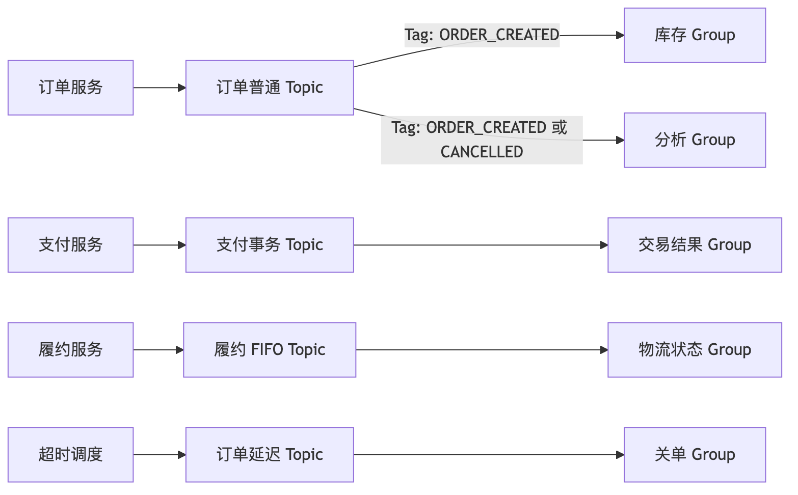
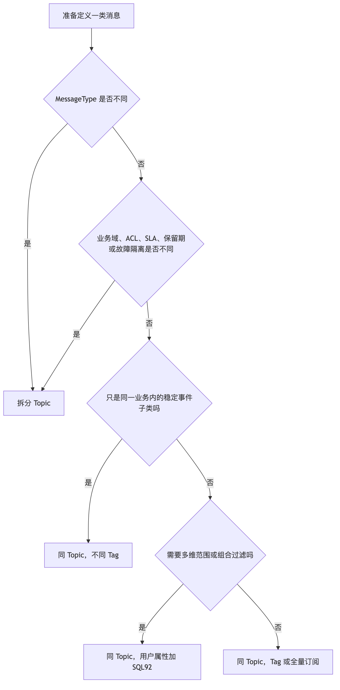
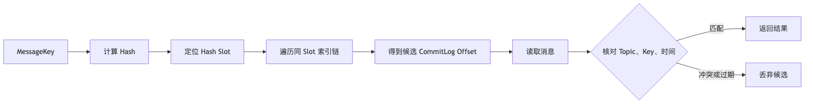

# 第 12 章：Topic、Tag、Key、SQL92、MessageQueue 与资源治理

> **技术基线**：本章以 2026 年 6 月 20 日的 Apache RocketMQ 5.5.0 为主，同时标注 4.x 经典 Remoting 模型仍需掌握的差异。LiteTopic 是 5.5.0 引入的新能力，不能套用普通 Topic 的全部结论。

## 本章去重边界与跳转

本章是资源模型和治理规范的主讲章节，保留 Topic、Tag、Key、用户属性、SQL92、MessageQueue、ConsumerGroup、Schema、Retry Topic、DLQ 和配额治理。其他章节只引用资源选择结论。

| 重复主题 | 本章处理方式 |
| --- | --- |
| Topic、MessageQueue、ConsumerGroup 的基础定义 | 本章负责治理细化；领域模型入门看 [第 2 章：整体架构、核心组件与领域模型](/blog/tech/RocketMQ/02.RocketMQ整体架构、核心组件与领域模型)。 |
| MessageKey、IndexFile 和查询机制 | 本章讲 Key 的业务语义；索引文件结构看 [第 7 章：存储引擎](/blog/tech/RocketMQ/07.RocketMQ存储引擎)。 |
| Retry Topic、DLQ 和 Poison Message | 本章讲资源治理；重试语义和消费幂等看 [第 8 章：端到端消息可靠性](/blog/tech/RocketMQ/08.端到端消息可靠性、重试、死信队列与消费幂等)。 |
| FIFO 的 MessageGroup、ShardingKey 与热 Key | 本章讲命名和资源边界；顺序语义看 [第 9 章：FIFO 顺序消息](/blog/tech/RocketMQ/09.FIFO顺序消息)。 |
| 多租户、安全、配额和隔离 | 本章讲资源侧规范；安全与灾备看 [第 16 章：安全、ACL、TLS、多租户隔离与跨集群灾备](/blog/tech/RocketMQ/16.RocketMQ安全、ACL、TLS、多租户隔离与跨集群灾备)。 |

## 12.1 学习目标

学完本章，你应当能够：

- 把 Topic、Tag、MessageKey、用户属性、MessageQueue、ConsumerGroup 放在同一套资源模型中理解；
- 根据业务边界、消息类型、SLA、权限和流量规划 Topic，而不是“一个系统一个 Topic”或“一种事件一个 Topic”；
- 解释 Tag 与 SQL92 的服务端过滤机制，以及复杂过滤对 Broker 的成本；
- 说明 Key 的索引用途、Hash 冲突与查询语义，避免把 Key 当成唯一约束、分区键或幂等机制；
- 根据吞吐、消费模型、顺序语义和扩容目标确定队列数；
- 建立企业级资源申请、命名、容量、Schema、重试、死信和回收规范。

---

## 12.2 场景导入：一个“大一统 Topic”为什么会失控

某电商早期只有订单服务和通知服务，于是创建 `prod-all-events`，订单创建、支付成功、物流更新、营销触达全部写入其中，再使用 Tag 区分事件。业务增长后出现了四类问题：

1. 支付使用事务消息，物流需要 FIFO，营销需要延迟消息，但 5.x Topic 只能声明一种 MessageType；
2. 营销流量突增挤占订单链路，Topic 级权限、限流、告警和故障隔离无法独立配置；
3. 消费者使用不同 SQL92 表达式，Broker 过滤成本上升，发布时还出现同组订阅不一致；
4. 为追求并发把队列数从 16 扩到 512，大量队列没有流量，却增加了路由、监控、轮询和重平衡成本。

正确做法不是把每个事件都拆成 Topic，而是先识别**治理边界**，再使用 Tag 和属性表达同一边界内的细分语义。

这张图体现了本章的核心原则：**Topic 负责隔离，Tag/属性负责筛选，Queue 负责分区，Group 负责消费身份。**

---

## 12.3 六类资源各自回答什么问题

| 资源 | 它回答的问题 | 主要用途 | 不应承担的职责 |
|---|---|---|---|
| Topic | 这批消息属于哪个治理边界 | 存储、权限、MessageType、监控、SLA、故障隔离 | 表达每一个细小业务状态 |
| Tag | 同一 Topic 内属于哪一种稳定子类 | 单标签精确匹配、简单路由 | 多维范围查询、权限隔离 |
| MessageKey | 运维或业务按什么线索查消息 | 建立索引、按订单号等定位候选消息 | 唯一约束、幂等、顺序或分区 |
| 用户属性 | 消息还具有哪些可过滤维度 | SQL92 过滤、携带轻量元数据 | 放置大对象或敏感明文 |
| MessageQueue | 消息落入哪个有序分区 | 存储分片、吞吐扩展、局部有序 | 作为业务实体或租户标识 |
| ConsumerGroup | 谁以独立进度消费这些消息 | 订阅、负载均衡、Offset、重试、死信 | 复用给消费逻辑不同的应用 |

面试时可以用一句话概括：

> **Topic 是治理边界，Tag 是稳定子类，Key 是查询索引，属性是过滤维度，Queue 是有序分区，Group 是独立消费身份。**

---

## 12.4 Topic：先定治理边界，再定事件粒度

### 12.4.1 Topic 的职责

RocketMQ 中，Topic 是队列的逻辑集合和顶层消息容器；真正的存储与水平扩展落在 Topic 内的 MessageQueue 上。Topic 还天然承载权限、监控、消息类型和运维操作，因此它不是一个随意拼接的字符串，而是生产资源。

设计 Topic 时应依次检查五个边界：

1. **业务域边界**：交易、支付、履约、营销等不直接相关的业务通常分开；
2. **MessageType 边界**：Normal、FIFO、Delay、Transaction 通常必须分开；
3. **SLA 与故障域边界**：核心支付与低优先级营销不能相互拖累；
4. **安全与数据边界**：ACL、敏感等级、租户归属不同，应独立治理；
5. **容量与生命周期边界**：流量、保留期、回放方式差异明显时，应考虑拆分。

同一业务域中，语义相关、MessageType 相同、SLA 相近且常被共同消费的事件，可以放入同一 Topic，再用 Tag 区分。例如订单创建、订单修改、订单取消可以共享订单普通 Topic；支付事务消息与订单延迟关单消息则不应混入。

### 12.4.2 RocketMQ 5.x 的 MessageType 校验

5.x Topic 可声明 `Normal`、`FIFO`、`Delay` 或 `Transaction`。开启强制校验后，发送消息的类型与 Topic 类型不一致会被拒绝。为兼容 4.x，该校验在服务端默认关闭，生产环境应评估后启用 `enableTopicMessageTypeCheck`，并在资源申请时把 MessageType 设为必填项。

这解释了“为什么不同消息类型通常需要不同 Topic”：它不仅是代码风格问题，还涉及存储、投递状态机、重试语义、顺序保证和平台治理。把事务消息与 FIFO 消息混在一个 Topic 中，会让资源语义无法被可靠声明和检查。

### 12.4.3 Topic 与 Tag 如何选择

**结论**：需要独立存储、权限、MessageType、SLA、容量或故障处理时选 Topic；仅是同一治理边界内的稳定子类型时选 Tag。不要用 Tag 模拟强隔离，也不要为每个订单、用户或状态创建普通 Topic。

---

## 12.5 Tag、MessageKey 与用户属性

### 12.5.1 Tag：低成本、低复杂度的二级分类

每条消息只能设置一个 Tag。消费者可以精确匹配单个 Tag、使用 `TagA||TagB` 匹配多个 Tag，或用 `*` 订阅全部消息。Tag 适合数量有限、含义稳定、经常作为订阅条件的枚举型事件，例如：

- `ORDER_CREATED`
- `ORDER_CANCELLED`
- `ORDER_ADDRESS_CHANGED`

不建议把 `region=cn-east`, `vip=true`, `amount>1000` 等多个维度编码进 Tag。这样会导致组合爆炸，也无法表达范围关系。Tag 一旦被消费者使用，就属于消息契约；重命名 Tag 相当于修改订阅协议，必须采用兼容发布和灰度切换。

### 12.5.2 MessageKey：用于查找，不用于保证

MessageKey 是消息索引键，可以设置一个或多个，用于按订单号、支付单号、事件号等快速定位消息。它**不要求全局唯一**。例如同一订单的创建、支付、取消事件都使用同一个订单号作为 Key，查询时返回多条消息是合理结果。

推荐同时保留两类标识：

- `eventId`：业务生成的事件唯一标识，供消费幂等和审计；
- `aggregateId`：订单号、支付单号等聚合根标识，供链路检索。

不要把 MessageKey 与以下概念混淆：

- **Message ID**：客户端生成的消息标识；
- **MessageGroup/分片键**：FIFO 或队列选择时决定顺序与路由；
- **幂等键**：由消费端持久化并建立唯一约束；
- **数据库主键**：提供事务一致性和强唯一性。

### 12.5.3 IndexFile 与 Hash 冲突

经典存储实现会对 Key 计算 Hash，定位 IndexFile 中的 Hash Slot，再沿索引链找到 CommitLog 物理偏移。索引项保存的是 Key Hash、物理偏移、时间差和前一索引位置，而不是一个无冲突的唯一映射。

不同 Key 可能产生相同 Hash，因此查询结果必须以读取到的真实消息属性为准。重复 Key 与 Hash 冲突都会让查询产生多个候选项。Key 查询适合排障和追踪，不应成为业务在线查询的唯一数据源；索引和消息也会随保留周期清理。

### 12.5.4 用户属性与 SQL92

用户属性是字符串键值对，可表达地区、租户、优先级、Schema 版本等轻量元数据。消费者使用 SQL92 表达式对属性组合过滤，例如：

`region = 'cn-east' AND amountLevel IN ('L3','L4')`

官方支持 `IS NULL`、`IS NOT NULL`、比较、`BETWEEN`、`IN`、`AND`、`OR` 等语法，Tag 在 SQL 中可通过系统属性 `TAGS` 使用。表达式异常、类型不一致或计算结果为 `NULL` 时，消息可能被过滤掉，所以属性命名、类型和值域必须契约化。

| 选择项 | 适合场景 | 优点 | 主要代价 |
|---|---|---|---|
| Tag | 单一、稳定、枚举型分类 | 简单、表达明确、过滤成本低 | 每条消息只有一个 Tag，不能做范围过滤 |
| SQL92 | 多属性组合、范围或集合判断 | 灵活，减少无关消息下发 | Broker 解析与计算成本更高，属性治理更复杂 |
| 客户端过滤 | 必须读取 Body 才能判断的业务规则 | 表达能力最强 | 无关消息仍占网络、客户端 CPU 和消费吞吐 |
| 拆 Topic | 需要权限、SLA、MessageType 或故障隔离 | 隔离最强、可观测性清晰 | 增加元数据和运维资源 |

SQL92 是 **Broker 端过滤**：生产者写入 Tag/属性，消费者注册表达式，Broker 在投递前判断，只发送匹配消息。客户端过滤则先接收全部消息，再由业务代码丢弃，不仅浪费网络和消费配额，也会模糊消费成功语义。即便使用服务端过滤，客户端仍要校验消息 Schema、权限上下文和业务条件；过滤不是授权机制。

在经典 4.x Remoting 部署中，Broker 使用 SQL92 属性过滤需要显式设置 `enablePropertyFilter=true`，其默认值为 `false`。5.x 文档已将 SQL92 纳入标准过滤模型，但生产升级仍要验证 Broker、Proxy 与 SDK 的兼容组合，并以压测结果确定复杂表达式的使用上限。

---

## 12.6 ConsumerGroup：消费身份、隔离与订阅一致性

一个 ConsumerGroup 表示一套独立的消费目的、进度、重试策略和死信归属。同组实例应运行相同消费逻辑，通过负载均衡共同处理消息；不同业务目的必须使用不同 Group，即使它们订阅同一个 Topic。

推荐命名格式：

`G-{env}-{domain}-{application}-{purpose}-v{major}`

例如：

- `G-prod-trade-inventory-reserve-v1`
- `G-prod-trade-risk-audit-v1`
- `G-stg-trade-inventory-reserve-v1`

名称应短、稳定、可追责，并避开 `%RETRY%`、`%DLQ%` 等系统保留前缀。不要把 Pod 名、IP、发布批次或随机数放入 Group，否则每次发布都可能产生新的 Offset、重试和死信资源。

### 12.6.1 一个 Group 可以订阅多个 Topic 吗
**可以。**订阅关系由“ConsumerGroup + Topic”共同确定，一个 Group 可订阅多个 Topic。但同一 Group 的所有实例必须保持相同的 Topic 集合、过滤表达式、投递顺序和重试行为。实例 A 订阅 `TopicA/TagA`，实例 B 却订阅 `TopicA/TagB`，会造成订阅冲突和消息误消费。

工程上还应限制一个 Group 聚合的业务范围。把订单、日志、营销等互不相关的 Topic 都交给一个“万能 Group”，会让扩缩容、积压、故障、发布和重试相互耦合。订阅关系变更也不宜频繁执行，应通过版本化 Group 或兼容窗口完成迁移。

---

## 12.7 MessageQueue：队列数如何影响并发和扩容

MessageQueue 是 RocketMQ 最小的有序存储单元。一个 Topic 包含一个或多个 Queue，生产写入、消费读取、Offset、监控和部分负载均衡都围绕 Queue 展开。

### 12.7.1 “消费者数不能超过队列数”是否永远正确

不是，必须先说明消费模型：

| 消费模型 | 队列数与并发关系 |
|---|---|
| 经典 4.x Push/Pull 的队列级分配 | 同一 Group 内，一个 Queue 通常只分配给一个消费者实例，实例数超过 Queue 数后会出现空闲实例 |
| 5.x PushConsumer/SimpleConsumer 的 POP 消息级负载均衡 | 多个消费者可从同一 Queue 获取不同消息，Queue 数不再是消费者实例数的严格上限 |
| FIFO 消费 | 还受 MessageGroup、队列顺序和同组串行约束，不能只靠增加线程获得线性扩展 |

因此，5.x 中队列数仍影响存储分片、Broker 分布、局部顺序、热点和元数据，但不能机械套用“Queue 数必须大于消费者数”。面试回答应先确认客户端协议、消费类型和负载均衡粒度。

### 12.7.2 队列数的确定方法

可以使用以下工程化步骤，而不是直接填写 4、8、16：

1. 压测得到单 Queue 在目标消息大小、刷盘、复制和过滤条件下的安全吞吐 `TPS_queue_safe`；
2. 估算峰值生产或消费吞吐 `TPS_peak`；
3. 明确希望跨多少 Broker 分布，以及经典队列级消费所需的并行分区数 `P_consume`；
4. 计算基础值：

`Q_base = max(ceil(TPS_peak / TPS_queue_safe), P_consume, P_broker_distribution)`

5. 加入增长与故障余量，再通过压测验证。余量系数是企业经验值，不是 RocketMQ 官方固定参数；常见做法是为可预见增长保留空间，而不是一次性创建数百个空队列。

对于 FIFO，应先根据业务顺序键的基数、热点分布和可接受的并行度建模。对普通消息，则更应关注总吞吐、Broker 分布和消费模型。

### 12.7.3 队列是不是越多越好

不是。官方明确建议配置较少且必要的队列。队列过多会增加：

- Topic 路由和队列元数据；
- 每 Queue 的指标、Offset 和监控时序；
- 客户端路由缓存、负载均衡和空轮询；
- 扩缩容时的重平衡计算与抖动；
- 运维排障面和资源回收复杂度。

| 资源膨胀 | 典型原因 | 主要成本 | 治理手段 |
|---|---|---|---|
| Topic 过多 | 每用户、每订单、每临时任务建普通 Topic | 路由、权限、指标、配置和运维负担 | 以业务治理边界建 Topic；动态细粒度场景评估 LiteTopic |
| Queue 过多 | 把理论并发等同于 Queue 数 | 元数据、空轮询、负载均衡、监控成本 | 压测定容，设置默认值与上限，按证据扩容 |
| Group 过多 | 随实例或发布批次动态命名 | Offset、订阅、重试、DLQ、指标持续累积 | 稳定命名、Owner、有效期与自动回收 |

不要迷信某个全行业通用的 Topic 或 Queue 数量阈值。平台应根据 Broker 规模、客户端数量、监控系统基数和压测结果制定租户配额。

---

## 12.8 热 Topic、热 Queue 与热 Key

三者含义不同，诊断时必须分层：

- **热 Topic**：该 Topic 总 TPS、字节率或积压远高于其他资源；
- **热 Queue**：同一 Topic 内流量分布不均，少数 Queue 承担大部分写入或读取；
- **热 Key**：某个订单、租户、商品或顺序键产生异常高频流量。

识别指标包括 Topic/Queue 的写入 TPS、读取 TPS、字节率、消费落后量、P99 延迟、Broker 磁盘与网络利用率，以及业务 Key 的频率分布。平均值会掩盖倾斜，应查看 Top-N Queue 和 Top-N 业务键。

治理方法如下：

1. **热 Topic**：按 MessageType、SLA、租户等级或业务子域拆分；必要时迁入独立集群，避免低优先级流量影响核心链路；
2. **热 Queue**：检查自定义队列选择器、Hash 算法和顺序键分布；采用一致的均匀散列或虚拟桶，再通过双写和灰度迁移调整；
3. **热 Key**：先限流、合并或隔离高频租户，再判断是否允许把一个业务键拆为多个虚拟分片。若要求同一订单严格有序，就不能随意加随机盐，否则会破坏顺序；
4. **消费热点**：将慢业务从 Group 中拆出，增加消费者、优化批处理或下游依赖，不要用“返回失败触发重试”当作限流策略。

特别注意：MessageKey 只是查询索引，不决定 Queue。真正造成热 Queue 的往往是 MessageGroup、ShardingKey 或自定义队列选择逻辑。

---

## 12.9 大消息、批量消息与压缩消息治理

RocketMQ 5.x 官方文档给出的默认单消息上限是 4 MB，但“能发送”不等于“适合发送”。大消息会放大网络、内存、磁盘、复制、重试和消费超时成本。

| 类型 | 收益 | 风险 | 推荐治理 |
|---|---|---|---|
| 大消息 | 一次携带完整数据 | 重试昂贵、占用网络与内存、挤压小消息 | 大对象存对象存储，消息仅放 URI、校验和、大小、版本和权限信息 |
| 批量消息 | 摊薄 RPC 与协议开销、提升吞吐 | 单批延迟增加，失败与重试范围扩大 | 按 Topic、类型和大小组批，设置条数、字节数、等待时间三重上限 |
| 压缩消息 | 节省网络和存储带宽 | 消耗 CPU，已压缩数据收益低，兼容性复杂 | 仅对超过阈值且可压缩的 Body 启用，记录算法和原始大小并压测 |

经典 4.x 批量发送文档要求批内消息属于同一 Topic，并建议控制总批次大小；5.x 多语言 SDK 的具体限制应以所用版本接口为准。不要把不同 MessageType、不同权限域或不同失败语义的消息强行拼成一批。

对象存储指针方案必须处理对象先写还是消息先写的一致性、下载权限、过期时间和校验失败。拆分超大消息时还要设计分片编号、总片数、幂等合并、超时清理和缺片补偿，因此通常优先选择对象存储而不是自建分片协议。

---

## 12.10 消息体、Schema 演进与兼容性

### 12.10.1 是否直接存完整业务对象

通常不应把数据库 ORM 实体、内部聚合对象或完整用户档案原样序列化进消息。这样会泄漏内部字段，使消费者依赖生产者表结构，并导致消息体膨胀和敏感数据扩散。

更合理的原则是：

> 携带消费者完成确定性处理所需的最小稳定事实，同时保留必要快照，避免消费时必须回查一个随时间变化的源数据库。

“只传 ID”与“传完整对象”都不是绝对答案。库存预占可能只需订单号和商品明细快照；审计事件可能需要当时价格、币种和规则版本；头像原图则应存对象存储，只传引用。

建议每条事件包含统一信封：

| 字段 | 作用 |
|---|---|
| `eventId` | 消费幂等、审计和链路追踪 |
| `eventType` | 与 Tag 对应的业务事件类型 |
| `schemaVersion` | Schema 兼容判断 |
| `aggregateId` | 订单号等业务聚合标识，可同时作为 Key |
| `occurredAt` | 业务事实发生时间，不等同于发送时间 |
| `producer` | 生产应用及版本 |
| `traceId` | 跨服务追踪 |
| `data` | 版本化业务载荷 |

### 12.10.2 Schema 演进规则

1. 新增字段优先设为可选，并给旧消费者可接受的默认行为；
2. 消费者必须忽略未知字段，枚举必须处理未知值；
3. 不在原字段上修改类型、单位或语义，不复用已废弃字段名；
4. 破坏性变更使用新的 Schema 主版本，必要时新建 Topic 或 Tag；
5. 迁移期采用双写、双读或适配层，并明确停止旧版本的日期；
6. 在 CI 中做生产者—消费者兼容检查，维护 Owner、样例、字段字典和数据分级；
7. 消费幂等依据 `eventId` 或业务唯一约束，不依赖 RocketMQ Key 的唯一性。

Schema 版本不要只写在 Body 内部；也可同步放入用户属性，便于过滤、灰度和排障，但属性总量应保持轻量。

---

## 12.11 Namespace、多租户与环境隔离

Namespace 或资源名前缀可以降低命名冲突，但不能自动提供网络、权限、容量和故障域的强隔离。尤其在开源 5.x 中，不同 SDK 对 Namespace 的呈现方式存在差异，不能把客户端名称包装当成安全边界。

| 隔离级别 | 方案 | 适用场景 | 结论 |
|---|---|---|---|
| 强隔离 | 独立集群、网络、凭证和监控 | 生产与测试、监管数据、核心与非核心业务 | 优先选择，成本最高 |
| 中等隔离 | 同集群，不同 Topic/Group、ACL、配额和 Owner | 同公司内可信租户 | 需平台严格治理 |
| 弱隔离 | 名称前缀或 Namespace | 防止重名、便于归类 | 不是安全或容量边界 |
| 非隔离 | Tag、Key、用户属性 | 同一业务内分类与过滤 | 绝不能用于租户授权 |

生产与测试至少应使用不同集群或不同访问端点和凭证；若受条件限制共用集群，也必须通过 `env` 前缀、ACL、Topic 白名单、配额和发布流水线阻断跨环境访问。推荐资源名：

- Topic：`prod-trade-order-normal-v1`
- Group：`G-prod-trade-inventory-reserve-v1`

名称只使用平台允许的短字符，控制在官方建议长度内，并预留版本后缀。

---

## 12.12 重试 Topic 与死信 Topic 治理

消费失败后，RocketMQ 按 ConsumerGroup 的重试策略重新投递；超过最大次数后进入该 Group 对应的死信队列。经典 Remoting 模型常见内部资源名为 `%RETRY%{Group}` 和 `%DLQ%{Group}`。这些前缀属于系统保留资源，不应被业务手工创建或作为普通 Topic 发送。

企业治理至少包含：

- 每个 Group 明确 Owner、最大重试次数、可重试异常和不可重试异常；
- 按 DLQ 消息数、最老消息年龄、增长速率建立告警，而非只看是否非零；
- 将参数错误、Schema 不兼容、权限失败等永久错误快速转入补偿流程，避免无意义重试；
- 回放前先修复根因，验证幂等，设置速率上限、审批、审计和停止开关；
- 对回放消息保留原 `eventId`、原消息 ID、失败原因和回放批次；
- 禁止用消费失败与重试机制进行日常限流，持续过载应通过背压、扩容或入口限流解决。

同一条原始消息可能被 Group A 正常消费，却在 Group B 进入死信，这是正确的：重试和死信归属于消费身份，而不是只归属于 Topic。

---

## 12.13 普通 Topic 与 LiteTopic

RocketMQ 5.5.0 引入 Lite Mode。LiteTopic 是 Lite 类型父 Topic 下的轻量、短生命周期二级通道，可按会话、任务或用户创建；首次使用可自动创建，空闲超过 TTL 后自动删除。每个 LiteTopic 默认只有一个 Queue，因此天然有序，但单通道吞吐受单 Queue 限制。官方最低版本要求是服务端 5.5.0、gRPC SDK 5.1.0。

| 维度 | 普通 Topic | LiteTopic |
|---|---|---|
| 资源定位 | 稳定的顶层业务治理边界 | Lite 父 Topic 下的细粒度临时通道 |
| 生命周期 | 手工申请、变更与删除 | 首次使用自动创建，TTL 自动回收 |
| 队列 | 可有多个 Queue，横向扩展 | 每个 LiteTopic 默认一个 Queue |
| 吞吐 | 通过 Queue 和 Broker 扩展 | 单通道 TPS 受限，总量靠大量通道扩展 |
| 顺序 | 普通并发或按分区有序 | 每个 LiteTopic 有序 |
| 同组订阅一致性 | 同 Group 实例必须一致 | 同 Group 可订阅不同 LiteTopic 集合 |
| 典型场景 | 订单、支付、物流等长期业务事件 | AI 会话、长任务、用户临时会话、细粒度数据围栏 |

LiteTopic 不是“更便宜的普通 Topic”，也不是 Tag 的同义词。Tag 只有过滤语义，不拥有独立存储通道、生命周期和订阅范围；LiteTopic 则形成二级消息容器。订单、支付等稳定高吞吐主链路仍应使用普通 Topic，只有“海量、动态、细粒度、短生命周期、单通道有序”的场景才考虑 LiteTopic。

---

## 12.14 电商业务资源规划示例

下表中的 Queue 数仅为容量评审示例，不能直接照搬；正式值必须由消息大小、峰值 TPS、Broker 拓扑和消费模型压测确定。

| Topic | MessageType / 初始 Queue | Tag 或子类 | Key / 顺序键 | 主要 ConsumerGroup |
|---|---|---|---|---|
| `prod-trade-order-normal-v1` | Normal / 16 | `ORDER_CREATED`、`ORDER_UPDATED`、`ORDER_CANCELLED` | Key=`orderId`,`eventId` | 库存预占、风控审计、数据分析各用独立 Group |
| `prod-payment-result-normal-v1` | Normal / 8 | `PAYMENT_SUCCEEDED`、`PAYMENT_FAILED`、`REFUND_SUCCEEDED` | Key=`paymentId`,`orderId` | 订单状态、对账、通知 Group |
| `prod-payment-tx-v1` | Transaction / 8 | `PAYMENT_COMMIT_REQUESTED` | Key=`paymentId` | 交易落账 Group |
| `prod-fulfillment-fifo-v1` | FIFO / 16 | `PACKED`、`SHIPPED`、`SIGNED` | Key=`trackingNo`; MessageGroup=`orderId` | 物流状态 Group |
| `prod-trade-order-delay-v1` | Delay / 8 | `PAY_TIMEOUT_CHECK`、`AUTO_CONFIRM_CHECK` | Key=`orderId`,`eventId` | 关单、自动确认 Group |
| `prod-marketing-normal-v1` | Normal / 8 | `COUPON_GRANTED`、`CAMPAIGN_TRIGGERED` | Key=`campaignId`,`userId` | 营销触达、效果分析 Group |

属性可统一使用 `tenant`、`region`、`schemaVersion`、`priority`，但高频订阅优先使用 Tag；复杂 SQL92 只在确有价值的 Group 上启用。订单普通事件与营销事件即使都属于 Normal，也因 SLA、权限和流量特征不同而拆 Topic。支付事务、履约 FIFO、超时 Delay 则因 MessageType 不同必须独立。

---

## 12.15 企业级消息资源申请规范

### 12.15.1 申请字段与审核清单

| 类别 | 必填内容 | 审核问题 |
|---|---|---|
| 责任信息 | 应用、业务域、Owner、值班群、成本中心 | 出现积压或死信时谁在规定时间内处理 |
| 资源命名 | 环境、Topic、Group、版本 | 是否符合字符、长度、保留前缀和稳定命名规范 |
| 消息语义 | 事件定义、MessageType、Tag、Key、顺序键 | 是否混入不同类型或无关业务，Key 是否被误作唯一约束 |
| 容量 | 平均/峰值 TPS、平均/P99 大小、增长率、保留期 | Queue 数是否有压测和计算依据，是否存在热点 |
| 消费 | Topic 集合、过滤表达式、并发、超时、下游依赖 | 同组订阅是否一致，是否需要拆 Group |
| 可靠性 | 发送确认、幂等键、重试次数、DLQ、回放方案 | 是否能处理重复、乱序、毒消息和回放冲击 |
| Schema | 编码、Schema 版本、兼容策略、样例、数据分级 | 是否泄漏敏感字段，破坏性升级如何迁移 |
| 安全 | ACL、生产者/消费者白名单、跨环境限制 | 是否把 Tag/Namespace 误当权限边界 |
| 可观测性 | TPS、失败率、积压、最老消息、P99、DLQ 告警 | 是否有阈值、仪表盘和应急 Runbook |
| 生命周期 | 上线日、复审日、到期日、删除条件 | 临时资源是否可自动回收，删除前如何确认无生产消费 |

### 12.15.2 审批和上线流程

平台最好把这些规则固化到自助门户和 CI：禁止生产自动建 Topic；对 SQL92、Queue 数、消息大小和 Group 数设置配额；创建后自动生成仪表盘、告警和资源台账；连续无流量的临时资源进入回收流程。

---

## 12.16 常见误区

1. **“一个微服务一个 Topic”**：服务边界不一定等于消息治理边界，应看业务域、MessageType、SLA 和权限。
2. **“一个事件一个 Topic”**：会造成资源爆炸；同一边界内的稳定子类优先使用 Tag。
3. **“Key 唯一，所以可用于幂等”**：Key 没有唯一约束，幂等必须落到业务存储。
4. **“Queue 越多，吞吐一定越高”**：超过瓶颈后只会增加元数据、轮询和重平衡成本。
5. **“同组实例可订阅不同 Tag”**：普通 Topic 下会产生订阅冲突；LiteTopic 是另一个模型，不能混用结论。
6. **“SQL92 比 Tag 高级，所以全部使用 SQL92”**：复杂表达式消耗 Broker 资源，也增加契约风险。
7. **“Namespace 就是多租户安全边界”**：名称隔离不等于 ACL、网络、配额和故障域隔离。
8. **“进入 DLQ 后直接重放”**：未修根因和幂等就回放，往往会制造第二次事故。

---

## 12.17 面试题

> **题目去重**：本节作为本章资源治理自测，只保留 Topic、Tag、Key、SQL92、MessageQueue 和 Group 治理题。跨章重复题、完整追问链和模拟面试统一跳转到 [第 20 章：资深面试题库、追问链与模拟面试](/blog/tech/RocketMQ/20.RocketMQ资深面试题库、追问链与模拟面试)。

### 1. Topic 和 Tag 如何选择？

**标准回答**：Topic 用于业务、MessageType、权限、SLA、容量和故障域隔离；Tag 用于同一 Topic 内稳定的二级分类。不同 MessageType 通常拆 Topic，只是订单事件子类型不同可用 Tag。
**追问**：订单创建与订单取消是否必须拆 Topic？
**易错点**：用“事件不同就拆 Topic”或“系统相同就共用 Topic”代替治理分析。

### 2. MessageKey 是否必须唯一？

**标准回答**：不必须。Key 是索引键，同一订单的多条事件可共用订单号；查询可能返回多条候选。业务幂等应使用 `eventId` 和数据库唯一约束。
**追问**：Hash 冲突怎么办？
**易错点**：把 Key 当主键、分区键或 Exactly-once 保证。

### 3. Key 查询为什么会出现无关候选？

**标准回答**：IndexFile 按 Key Hash 定位槽位并遍历索引链，不同 Key 可能 Hash 冲突；读取 CommitLog 后仍需核对真实 Key、Topic 和时间。
**追问**：能否用 Key 查询替代订单数据库？
**易错点**：忽略消息保留期、索引清理和查询非唯一性。

### 4. Queue 数量怎么确定？

**标准回答**：依据峰值 TPS、单 Queue 安全吞吐、Broker 分布、消费模型、FIFO 顺序并发和增长余量计算，再通过压测验证。不能只按消费者实例数拍脑袋。
**追问**：5.x POP 下队列数仍限制消费者数吗？
**易错点**：把经典队列级分配结论套到所有 5.x 消费模式。

### 5. 队列数是不是越多越好？

**标准回答**：不是。过多 Queue 增加路由、指标、Offset、空轮询、负载均衡和运维成本，且可能没有吞吐收益。
**追问**：什么时候应增加 Queue？
**易错点**：只谈并发，不谈 Broker、网络、磁盘和元数据瓶颈。

### 6. 一个 Group 可以订阅多个 Topic 吗？

**标准回答**：可以，一个 Group 可与多个 Topic 分别形成订阅关系，但同组所有实例必须保持相同 Topic 集合、过滤规则和消费行为。
**追问**：为何不建议一个 Group 订阅大量无关 Topic？
**易错点**：误认为 Group 与 Topic 必须一一对应，或忽略同组一致性。

### 7. 同一 Group 的两个实例能否订阅不同 Tag？

**标准回答**：普通 Topic 下不能。同组订阅表达式必须一致，否则会产生冲突和误消费。
**追问**：LiteTopic 为什么例外？
**易错点**：把不同 Tag 当作同组实例的流量分工方式。

### 8. Tag 与 SQL92 的区别是什么？

**标准回答**：Tag 是单字符串精确匹配，适合稳定枚举；SQL92 对多个系统或自定义属性做组合、范围和集合判断，更灵活但 Broker 成本和治理复杂度更高。
**追问**：SQL92 能否替代 Topic 隔离？
**易错点**：把过滤能力当成权限或故障隔离。

### 9. 服务端过滤和客户端过滤有何区别？

**标准回答**：服务端过滤由 Broker 在下发前执行，节约网络和客户端资源，但消耗 Broker CPU；客户端过滤必须先收全部消息，适合依赖 Body 的最终业务判断。
**追问**：使用服务端过滤后还需客户端校验吗？
**易错点**：认为过滤等同于鉴权或 Schema 校验。

### 10. 4.x 使用 SQL92 要注意什么？

**标准回答**：经典 4.x Broker 默认关闭属性过滤，需要启用 `enablePropertyFilter=true`；升级时还应验证 Broker、客户端和表达式兼容性。
**追问**：为何不应默认在所有 Group 使用复杂 SQL？
**易错点**：只背语法，不考虑 Broker 计算成本与空值语义。

### 11. 为什么不同消息类型通常使用不同 Topic？

**标准回答**：Normal、FIFO、Delay、Transaction 的投递和状态机不同；5.x Topic 可声明并校验单一 MessageType，拆分有利于语义、容量和故障治理。
**追问**：校验默认一定开启吗？
**易错点**：忽略为兼容 4.x，强制校验默认关闭这一点。

### 12. 如何识别热 Queue？

**标准回答**：比较同 Topic 各 Queue 的写入/读取 TPS、字节率、积压和延迟，检查自定义选择器及顺序键分布；不能只看 Topic 总平均值。
**追问**：给顺序键加随机盐可行吗？
**易错点**：为均衡流量破坏同一业务键的有序性。

### 13. 消息体应只传 ID 还是完整对象？

**标准回答**：应传消费者完成确定性处理所需的最小稳定事实和必要快照；大对象放外部存储，避免直接序列化 ORM 实体。
**追问**：只传 ID 有何风险？
**易错点**：忽略回查时源数据已变化、不可用或被删除造成的时序耦合。

### 14. Schema 如何做破坏性升级？

**标准回答**：启用新的主版本，必要时新 Topic/Tag，迁移期双写或双读，消费者先兼容新旧格式，完成审计后再下线旧版本。
**追问**：新增枚举值算兼容吗？
**易错点**：消费者没有 unknown 分支，把新增枚举当作天然兼容。

### 15. 大消息为何不推荐？

**标准回答**：它放大网络、内存、复制、磁盘、重试和消费超时成本；大对象更适合对象存储，消息携带引用和校验信息。
**追问**：分片发送有哪些新增问题？
**易错点**：只看到 4 MB 上限，忽视重组、缺片、幂等与清理协议。

### 16. Retry Topic 与 DLQ 应如何治理？

**标准回答**：按 Group 设置 Owner、异常分类、最大重试、DLQ 告警和审计回放；回放前修复根因并验证幂等，不能用重试做限流。
**追问**：同一消息为何可能只在某个 Group 进入 DLQ？
**易错点**：认为死信只属于原 Topic，而忽略其消费身份属性。

### 17. Namespace 能否实现强多租户？

**标准回答**：不能单独实现。Namespace 或前缀主要解决命名归类，强隔离还需要独立集群或 ACL、网络、配额和资源边界。
**追问**：生产与测试至少如何隔离？
**易错点**：把 Tag、属性或名称前缀当作授权机制。

### 18. LiteTopic 与普通 Topic 如何选择？

**标准回答**：稳定、高吞吐、多队列业务使用普通 Topic；海量动态、短生命周期、按会话或任务细分且单通道有序的场景考虑 LiteTopic。LiteTopic 需要 5.5.0 服务端和兼容 gRPC SDK。
**追问**：LiteTopic 能否替代 Tag？
**易错点**：忽略 LiteTopic 有独立二级容器、TTL 和订阅范围，而 Tag 只有过滤语义。

---

## 12.18 总结

资源治理的目标不是把 RocketMQ 配置得“足够复杂”，而是让每个资源只承担它擅长的职责：

- 用 Topic 表达稳定的治理和隔离边界；
- 用 Tag 表达同一边界内的稳定子类；
- 用用户属性和 SQL92 处理确有价值的多维过滤；
- 用 Key 辅助检索，用业务唯一键实现幂等；
- 用 Queue 承担分区和扩展，但以压测而非数量崇拜定容；
- 用 Group 区分独立消费目的，并保持订阅一致；
- 用 Schema、ACL、配额、重试、DLQ、监控和生命周期流程把资源纳入平台治理；
- 对 LiteTopic 明确版本和场景，不把新模型与普通 Topic、Tag 混为一谈。

资深工程师面对 Topic 设计题时，不应只回答“按业务拆分”，而要继续追问：消息类型是否相同、SLA 是否相同、是否需要独立权限、流量是否互相影响、消费者是否共同订阅、Schema 如何演进、队列怎样定容、死信由谁处理。能把这些问题串成一套可执行的资源规范，才真正具备 RocketMQ 生产治理能力。

---

## 12.19 官方来源

1. [Apache RocketMQ 5.5.0 Release](https://github.com/apache/rocketmq/releases/tag/rocketmq-all-5.5.0)
2. [Topic](https://rocketmq.apache.org/docs/domainModel/02topic/)
3. [LiteTopic](https://rocketmq.apache.org/docs/domainModel/03litetopic/)
4. [Message Queue](https://rocketmq.apache.org/docs/domainModel/04messagequeue/)
5. [Message](https://rocketmq.apache.org/docs/domainModel/05message/)
6. [Consumer Group](https://rocketmq.apache.org/docs/domainModel/08consumergroup/)
7. [Subscription](https://rocketmq.apache.org/docs/domainModel/10subscription/)
8. [Message Filtering](https://rocketmq.apache.org/docs/featureBehavior/07messagefilter/)
9. [Consumption Retry](https://rocketmq.apache.org/docs/featureBehavior/10consumerretrypolicy/)
10. [Parameter Constraints and Suggestions](https://rocketmq.apache.org/docs/introduction/03limits/)
11. [RocketMQ 4.x Server Configuration：enablePropertyFilter](https://rocketmq.apache.org/docs/4.x/parameterConfiguration/02server/)
12. [Consumer Load Balancing](https://rocketmq.apache.org/docs/featureBehavior/08consumerloadbalance/)
13. [RocketMQ 4.x Batch Example](https://rocketmq.apache.org/docs/4.x/producer/05message4/)
14. [IndexFile.java（rocketmq-all-5.5.0）](https://github.com/apache/rocketmq/blob/rocketmq-all-5.5.0/store/src/main/java/org/apache/rocketmq/store/index/IndexFile.java)
