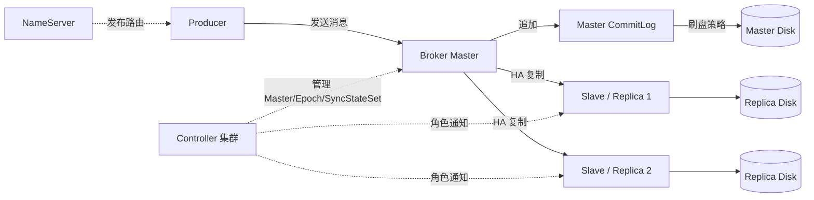
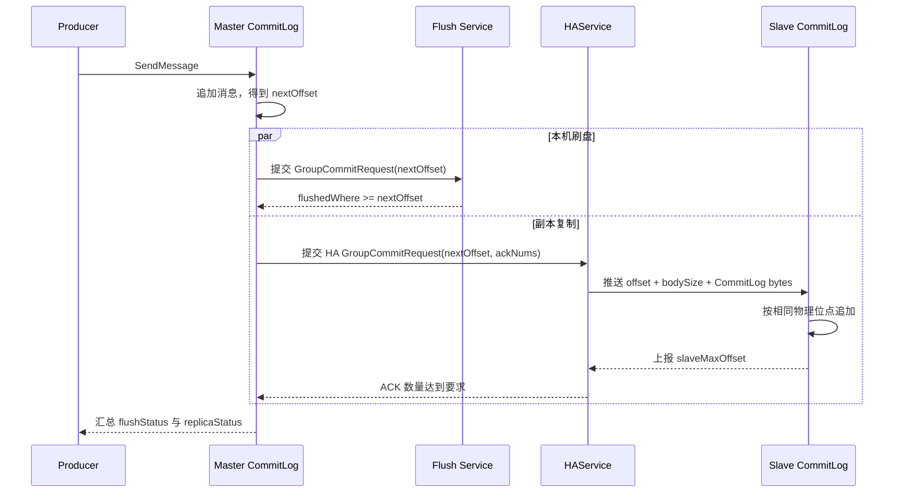
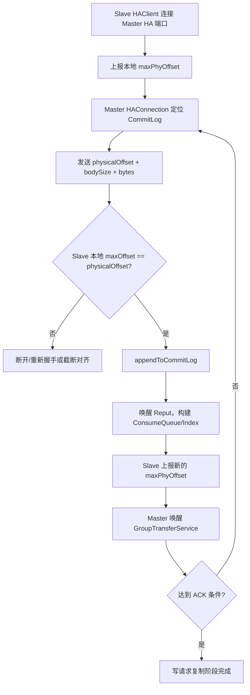
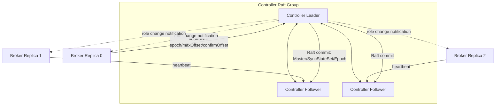
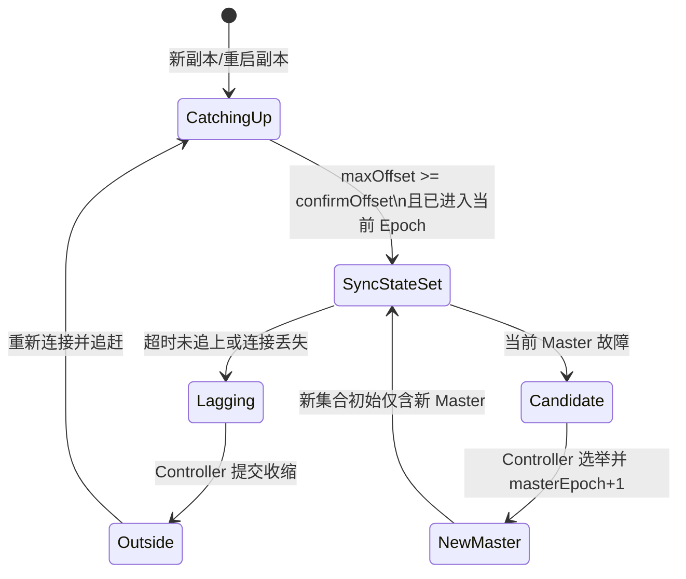
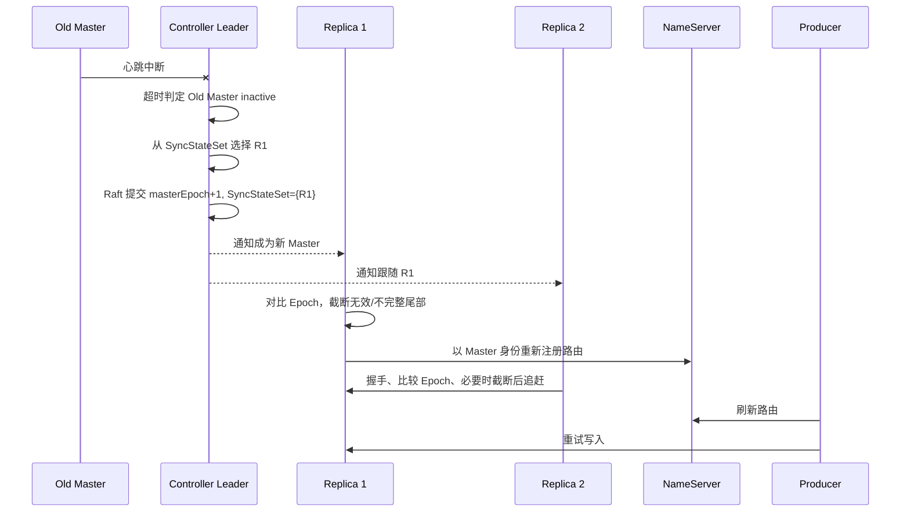
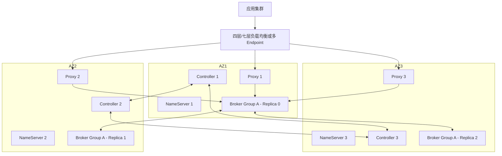

# 第 13 章：RocketMQ 高可用：主从复制、刷盘策略、Controller 与自动故障切换

> **版本边界**：本章以 Apache RocketMQ **5.5.0**（源码 tag：`rocketmq-all-5.5.0`）为实现基线。需要特别区分三件事：**DLedger Broker 模式**、**使用 DLedger 内核的 Controller**、**使用 jRaft 内核的 Controller**。三者名称相近，但数据路径和职责完全不同。

## 本章去重边界与跳转

本章是高可用主讲章节，保留刷盘、复制、HAService、Controller、SyncStateSet、选主、脑裂、RPO/RTO 和故障演练。存储、可靠性和灾备只按高可用语境引用。

| 重复主题 | 本章处理方式 |
| --- | --- |
| CommitLog、MappedFile、刷盘线程和文件恢复 | 本章只讲 HA 需要的存储边界；存储机制看 [第 7 章：存储引擎](/blog/tech/RocketMQ/07.RocketMQ存储引擎)。 |
| 端到端不丢、重复和幂等 | 本章只讲服务端 RPO/RTO；生产到消费闭环看 [第 8 章：端到端消息可靠性](/blog/tech/RocketMQ/08.端到端消息可靠性、重试、死信队列与消费幂等)。 |
| Controller 在 5.x 架构中的定位 | 本章讲主从切换；整体演进看 [第 17 章：4.x 到 5.x 架构演进](/blog/tech/RocketMQ/17.从RocketMQ4.x到5.x：Proxy、gRPC、POP、Controller与架构演进)。 |
| 监控、告警和应急 Runbook | 本章给演练清单；生产排障看 [第 15 章：可观测性、故障诊断、应急处理与生产 Runbook](/blog/tech/RocketMQ/15.RocketMQ可观测性、故障诊断、应急处理与生产Runbook)。 |
| 跨集群灾备与历史回放 | 本章聚焦单集群或同城 HA；跨集群灾备看 [第 16 章：安全、ACL、TLS、多租户隔离与跨集群灾备](/blog/tech/RocketMQ/16.RocketMQ安全、ACL、TLS、多租户隔离与跨集群灾备)。 |

## 13.1 高可用先问三个问题：数据写到哪、谁有资格接班、多久恢复

高可用不是“多部署几台 Broker”这么简单。一次发送成功至少涉及三层承诺：

1. 消息是否已经追加到当前 Master 的 CommitLog；
2. 消息是否已经落到本机持久化介质；
3. 消息是否已经复制到足够多、且未来有资格成为 Master 的副本。

因此，讨论 RocketMQ 高可用时必须同时给出：

- **RPO（Recovery Point Objective）**：故障后最多允许丢多少已确认消息；
- **RTO（Recovery Time Objective）**：从故障发生到业务重新可用允许多长时间；
- **确认语义**：Broker 返回 `SEND_OK` 时，究竟完成了本机追加、主盘刷盘、一个从副本确认，还是 SyncStateSet 全成员确认。

图中实线是消息数据路径，虚线是控制面。**Controller 不转发消息，也不存储业务 CommitLog**；它负责保存副本组元数据、判断存活、选举 Master 和推进 Epoch。

---

## 13.2 Master、Slave 与 Replica 的职责

### 13.2.1 Master

Master 是一个 Broker 副本组当前对外提供写入的主节点，主要职责包括：

- 接收 Producer 写入，校验并追加 CommitLog；
- 按刷盘策略等待本机持久化；
- 通过 HA 通道向 Slave 传输 CommitLog 字节；
- 收集 Slave 上报的最大物理位点；
- 在同步复制下等待足够副本确认；
- 在 Controller 模式下维护并上报 SyncStateSet 变化；
- 向 NameServer 注册当前角色和路由。

### 13.2.2 Slave

Slave 持续连接 Master，接收 CommitLog 字节并按相同物理位点追加，随后构建 ConsumeQueue、Index 等派生结构。Slave 是否承担读流量取决于版本、Broker 配置和客户端路由策略，不能把“有 Slave”直接等同于“Master 故障时客户端自动读 Slave”。

### 13.2.3 Replica

Replica 是更通用的称呼，表示同一 Broker 副本组中的一个数据副本。Controller 模式下，每个副本有持久化的稳定身份；“谁是 Master”是可变化的运行时角色。一个 Replica 可能处于：

- 当前 Master；
- 可被选举的同步副本；
- 已落后、暂时不在 SyncStateSet 的副本；
- `asyncLearner=true` 的异步 Learner，只做冗余复制，不进入 SyncStateSet，也不参与 Master 选举。

---

## 13.3 刷盘和复制是两条独立维度

### 13.3.1 异步刷盘与同步刷盘

- **ASYNC_FLUSH**：消息追加到映射内存后即可进入后续流程，刷盘线程异步把脏页持久化。吞吐和尾延迟更好，但主机掉电、内核崩溃或磁盘缓存丢失时，尚未刷盘的数据存在风险。
- **SYNC_FLUSH**：写线程提交刷盘请求，等待 CommitLog 刷到目标物理位点后才确认。它提高单机持久性，但不能替代副本复制；主盘物理损坏时，仅有一份已刷盘数据仍可能不可恢复。

### 13.3.2 异步复制与同步复制

- **异步复制**：Master 不等待 Slave 到达本条消息的结束位点即可返回。Master 故障时，RPO 约等于尚未复制的尾部。
- **同步复制**：Master 追加后，等待规定数量的副本 ACK 到本条消息结束位点，再返回结果。吞吐和尾延迟受最慢参与副本影响，但显著降低单节点故障造成的已确认消息丢失风险。

### 13.3.3 四种组合

| 复制 × 刷盘 | 返回成功前完成的核心动作 | 性能 | 单机掉电 | Master 磁盘损坏/整机丢失 | 典型定位 |
|---|---|---:|---|---|---|
| 异步复制 + 异步刷盘 | Master 内存映射追加 | 最高 | 有风险 | 风险最大，RPO≈复制滞后 | 可重建、可补偿数据 |
| 异步复制 + 同步刷盘 | Master 本地刷盘 | 较高 | 本机数据较安全 | 主盘不可用时仍可能丢未复制尾部 | 强单机持久、容忍少量 RPO |
| 同步复制 + 异步刷盘 | 足够副本已追加并 ACK | 中等 | 单机掉电通常可由另一副本恢复 | 抗单节点故障较强；不代表多盘均 fsync | 常见高可用折中 |
| 同步复制 + 同步刷盘 | Master 本地刷盘与副本 ACK 均成功 | 最低 | 最强 | 内建组合中最强，但仍需正确选举与幂等 | 资金、订单等高价值链路 |

这里有一个常见误区：**“同步复制”不等于“主从两块盘都完成 fsync”**。当前原生 HA 路径中，Slave 收到字节、按物理位点追加到本地 CommitLog 后就会上报最大位点；该 ACK 本身并不证明 Slave 已完成同步刷盘。因此，严谨表述应是“主盘同步刷盘 + 从副本已追加确认”，而不是“主从双盘强同步”。

另外，磁盘刷盘 Future 与 HA 复制 Future 在发送链路中是并行等待后汇总结果，不是先刷盘、再开始复制的串行流水线。

---

## 13.4 一条消息的准确 ACK 时机

以同步复制为例，核心过程如下：

精确到实现语义：

1. Master 先把消息编码并追加到 CommitLog，得到消息结束位点 `nextOffset`；
2. 若是同步刷盘，等待本机 `flushedWhere >= nextOffset`；
3. 若需要同步复制，创建 HA 等待请求；
4. Slave 发起 HA 连接并报告自己当前最大物理位点；
5. Master 从该位点开始发送连续 CommitLog 字节；
6. Slave 校验“Master 推送起始位点必须等于本地最大位点”，追加后回报新的最大位点；
7. Master 统计达到 `nextOffset` 的副本数，或检查 SyncStateSet 全成员是否到达；
8. 两个 Future 汇总后才形成最终写入结果。

如果返回 `FLUSH_DISK_TIMEOUT` 或 `FLUSH_SLAVE_TIMEOUT`，不能简单理解为“消息一定没写入”。消息可能已经追加，甚至稍后完成刷盘或复制，只是响应窗口内没有得到确认。Producer 应把这类结果视为**结果未知**，结合业务幂等键、消息 Key、事务状态或对账机制重试，而不是盲目生成一笔新业务。

---

## 13.5 CommitLog 主从同步与 HAService

原生主从复制是基于物理 CommitLog 的连续复制，不是按 Topic 或 Queue 逐条重放。

5.5.0 中需要重点阅读的源码入口如下，不必背代码，但要能讲清调用关系：

| 模块 | 关键类/方法 | 作用 |
|---|---|---|
| `store` | `CommitLog.asyncPutMessage`、`handleDiskFlushAndHA`、`handleHA` | 追加、刷盘与复制确认汇合点 |
| `store/ha` | `DefaultHAService` | 管理 HA 监听、连接、等待请求和位点 |
| `store/ha` | `DefaultHAConnection` | Master 端发送 CommitLog、读取 Slave ACK |
| `store/ha` | `DefaultHAClient` | Slave 端连接、接收、追加与上报位点 |
| `store/ha` | `GroupTransferService` | 按目标位点和 ACK 数量唤醒发送线程 |
| `store/ha/autoswitch` | `AutoSwitchHAService`、`AutoSwitchHAClient` | Controller 模式角色切换、Epoch、截断和 SyncStateSet |
| `broker/controller` | `ReplicasManager` | Broker 注册 Controller、心跳、同步元数据、切换角色 |
| `controller` | `ControllerManager`、`ReplicasInfoManager` | 存活检测、选主、元数据状态机和角色通知 |

### 13.5.1 Slave 长时间落后时会怎样
传统主从模式中，异步复制继续服务写入；同步复制则可能等待超时。Controller 模式增加了 SyncStateSet 管理：

- Slave 断连，或超过 `haMaxTimeSlaveNotCatchup` 未追上时，Master 尝试把它从 SyncStateSet 移除；
- 变更必须上报 Controller，由 Controller 校验当前 Master、`masterEpoch` 和 `syncStateSetEpoch` 后提交；
- `allAckInSyncStateSet=true` 时，在收缩完成前，消息仍可能等待落后副本而超时；
- 收缩后，只等待新的 SyncStateSet；
- 若集合大小低于 `minInSyncReplicas`，Master 直接拒绝写入并返回副本不足；
- 落后副本追到 `confirmOffset`，且进入当前 Leader Epoch 的有效区间后，才可重新加入 SyncStateSet。

官方文档给出的收缩 RTO 粗略估算是：

`checkSyncStateSetPeriod / 2 + haMaxTimeSlaveNotCatchup`

这只是正常调度下的估算，还要叠加网络、Controller 提交和线程调度耗时。

---

## 13.6 三条高可用演进路线，不能混为一谈

| 模式 | 数据复制协议 | 谁选 Master | CommitLog 格式/路径 | 自动切换 | 主要特点 |
|---|---|---|---|---|---|
| 经典 Master-Slave | RocketMQ 原生 HA | 配置/运维决定 | 原生 CommitLog | 原生模式不具备一致性的自动选主 | 简单、成熟，RTO 依赖人工或外部编排 |
| DLedger Broker 模式 | DLedger Raft 复制消息日志 | Broker 组内部 Raft | DLedger CommitLog | 支持 | 数据面本身进入 Raft；与原生格式不同 |
| Controller 模式 | 原生 CommitLog + AutoSwitchHA | Controller 依据 SyncStateSet 选主 | 原生 CommitLog，增加 Epoch 元数据 | 支持 | 控制面共识与数据复制解耦，利于从旧主从演进 |

还要再区分 Controller 自身的共识内核：

- **DLedger Controller**：用 DLedger 复制 Controller 元数据；在 5.5.0 中仍是默认 `controllerType`；
- **jRaft Controller**：从 5.2.0 起支持，增加更完整的 Raft 状态机与快照能力；
- 这两者只决定 Controller 元数据如何复制，不改变 Broker 业务消息仍走原生 CommitLog HA；
- 官方明确不支持把 DLedger Controller 的存量状态“原地切换”为 jRaft 内核；应按迁移方案重建控制面状态；
- DLedger Broker 模式迁移到 Controller 模式也不能把存量消息数据直接原地复用，因为两种 CommitLog 数据格式不同。

传统主从为何不能可靠自动切换？根因不是“没有探活脚本”，而是缺少一个具备多数派一致性的权威控制面：NameServer 维护路由，却不对“哪个副本拥有最新安全数据、谁是唯一合法 Master”做共识决策；静态 `brokerId` 和角色配置也没有单调递增 Epoch 来约束旧主。外部脚本可以改配置，却很难同时解决选主正确性、并发切换和分叉日志收敛。

---

## 13.7 Controller：只管控制面，不进入消息数据面

Controller 维护的核心元数据包括：

- Broker 副本组成员及地址；
- 当前 Master 的稳定副本 ID；
- `masterEpoch`；
- SyncStateSet 及 `syncStateSetEpoch`；
- Broker 心跳和存活状态；
- 选举优先级、最大位点、确认位点等选主参考信息。

### 13.7.1 独立部署与嵌入 NameServer
| 方式 | 进程形态 | 优点 | 风险与注意点 |
|---|---|---|---|
| 独立 Controller | 单独运行 `mqcontroller` | 资源和故障域清晰，便于独立扩缩容、监控和升级 | 多一类进程和端口需要运维 |
| 嵌入 NameServer | `enableControllerInNamesrv=true` | 减少组件数量，部署简单 | NameServer 路由能力仍是无状态的，但同进程中的 Controller 是有状态组件，Controller 存储目录不能随意删除 |

无论哪种方式，生产上要获得 Controller 自身容错，都应部署至少三个实例并保持多数派。单 Controller 也能完成 Broker Failover，但它自己一旦故障，已有 Master 通常仍能收发，新的自动切换能力会丢失。

### 13.7.2 Leader、Quorum 与多数派丢失
Controller 对 Master、Epoch、SyncStateSet 等写元数据必须由 Leader 提议并经多数派提交。三节点集群可容忍一台故障，五节点可容忍两台故障。如果失去多数派：

- 已存在且健康的 Broker Master 不会因为控制面不可用就立即停止数据收发；
- Controller 不能安全提交新的选举和集合变更；
- 如果此时 Master 再故障，该副本组不能完成受信任的自动晋升；
- 运维人员不应强制在两边各自选主，而应优先恢复 Controller 多数派或执行经过审批的数据取舍流程。

这体现了 CAP 中的取舍：发生控制面网络分区时，Controller 选择一致性而不是让少数派继续修改权威元数据。

---

## 13.8 SyncStateSet：谁有资格成为下一任 Master

SyncStateSet 不是“所有在线 Slave”，也不是简单的 ISR 数量。它表示当前被 Controller 认可、数据进度满足同步要求的副本集合，集合中必须包含当前 Master。

其作用有四个：

1. **限制选主范围**：默认 `enableElectUncleanMaster=false`，Controller 只能从 SyncStateSet 中选 Master；
2. **定义强确认范围**：`allAckInSyncStateSet=true` 时，消息必须到达集合所有成员；
3. **计算确认位点**：`confirmOffset` 近似取集合成员已确认进度的最小值；
4. **约束重新加入**：落后副本必须追到安全位点，避免带着旧分支直接参加选举。

当选出新 Master 后，Controller 增加 `masterEpoch`，同时把新的 SyncStateSet 初始化为仅包含新 Master，其他副本追上后再逐步扩容。这可避免在角色切换瞬间把尚未与新主完成一致性检查的副本直接视为同步成员。

---

## 13.9 Master 选举、日志截断与脑裂防护

Master 故障后的关键流程如下：

### 13.9.1 防止脑裂靠的是组合机制
1. **启动隔离**：Controller 模式 Broker 启动时先处于 fenced/isolated 状态，完成注册、同步 Controller 元数据和角色确认后才解除；
2. **Epoch 单调递增**：Broker 只接受更高的 `masterEpoch` 角色变更；Controller 也会拒绝旧 Master 或旧 Epoch 修改 SyncStateSet；
3. **受限选主**：默认不允许从 SyncStateSet 外选择落后副本；
4. **日志对齐**：新旧副本握手时交换 Epoch 区间，寻找一致点并截断分叉或不完整尾部；
5. **路由收敛**：新 Master 重新向 NameServer 注册，客户端刷新并重试；
6. **写入 Quorum**：使用 `allAckInSyncStateSet=true`，或至少要求两个副本 ACK，能使被隔离的旧 Master 难以继续返回成功。

必须坦诚一个边界：Controller 不是硬件 STONITH。若旧 Master 与 Controller 隔离、却仍能被客户端访问，而配置又允许单副本确认，例如 `inSyncReplicas=1` 且未开启全 SyncStateSet ACK，它可能在短窗口内对旧路由返回成功。新主形成后，这些不在安全确认边界内的尾部可能被截断。因此，**不能只部署 Controller，却继续用单副本成功语义，然后宣称 RPO=0**。

---

## 13.10 “Broker Master 宕机后发生什么”逐秒推演

下面是一个**示例推演，不是官方固定 SLA**。假设：三个 Controller 跨三个可用区且多数派健康；一个 Broker 组三副本；故障前 SyncStateSet 为 `{B0,B1,B2}`；禁止非同步副本选主；Controller 心跳超时按 10 秒配置，失活扫描周期 5 秒；为单独展示切换链路，示例取 `minInSyncReplicas=1`；客户端具备重试和路由刷新能力。若生产配置为 `minInSyncReplicas=2`，新主还必须等至少一个副本追平并重新进入 SyncStateSet，才能恢复写入。

| 时间 | 控制面与数据面发生的事 | 业务表现 |
|---:|---|---|
| T+0s | B0 Master 进程或主机突然失联 | 新连接失败；正在发送的请求结果未知 |
| T+0～1s | Producer、B1、B2 的 TCP 连接感知断开；Slave 停止收到新 CommitLog | 部分请求快速报网络错误，部分等超时 |
| T+1～5s | Controller 继续收到 B1/B2 心跳，但尚未满足 B0 失活阈值 | 旧路由仍可能指向 B0，重试可能继续失败 |
| T+5～10s | 失活扫描运行；若距最后心跳未超过阈值，则继续等待 | 该 Broker 组暂时不可写；其他 Broker 组不受影响 |
| T+10～15s | Controller Leader 判定 B0 inactive，从原 SyncStateSet 中选 B1；多数派提交 `masterEpoch=n+1`，新 SyncStateSet 为 `{B1}` | 控制面完成权威切换 |
| T+11～18s | B1 收到通知，停止旧从同步，校验 Epoch，截断不完整尾部，恢复队列派生进度并切成 `SYNC_MASTER`；B2 改连 B1 | `minInSyncReplicas=1` 时逐步具备写能力；若下限为 2，需等 B2 重新入集合 |
| T+12～20s | B1 以 Master 身份向 NameServer 注册；Controller 主动通知与 Broker 周期拉取共同推进角色收敛 | 新路由开始可见 |
| T+15～30s | Producer 刷新路由，重试原请求；消费端重新连接 | 业务恢复；超时请求需按业务 Key 幂等判定 |
| B0 恢复后 | B0 启动先被隔离，发现更高 Epoch 后成为 Slave；与 B1 交换 Epoch，截断旧分支，追到 `confirmOffset` 后才可能重新进入 SyncStateSet | 不应人工把 B0 直接强设为 Master |

可把示例 RTO 拆成：

`RTO ≈ 心跳超时 + 扫描相位 + Controller 共识提交 + Broker 角色切换/截断 + NameServer 路由传播 + 客户端重试`

若新 Master 有大量未派生 CommitLog、磁盘慢、Controller 多数派网络抖动或客户端路由缓存时间长，RTO 会明显增加。面试中只说“几秒自动切换”而不说明这些组成项，属于不完整答案。

---

## 13.11 CAP、RPO、RTO 在 RocketMQ 中如何落地

- **CAP**：Broker 数据面与 Controller 控制面要分别讨论。Controller 在分区下要求多数派，偏向 CP；已有 Master 的消息收发可以继续，因此整个系统不是用一个字母就能概括。
- **RPO=0 的条件**：只能针对“满足安全确认条件并返回成功”的消息讨论。典型前提是禁止不干净选主，并让成功写入覆盖未来候选集合，例如 `allAckInSyncStateSet=true`。超时、单副本 ACK、非同步副本强制晋升都可能扩大 RPO。
- **RTO**：既受故障检测与选举影响，也受 Broker 日志对齐、路由传播和客户端重试影响。Controller 可把人工分钟级切换压缩到秒级或十几秒级，但不能承诺与配置无关的固定值。
- **一致性边界**：RocketMQ 的副本一致性不等于业务“Exactly Once”。Producer 超时重试、消费失败重投和事务回查仍要求业务幂等。

---

## 13.12 故障矩阵

> 表中的“可读”指该 Broker 组能否继续对业务提供正常消费能力；直接从 Slave 读取是否可用仍取决于具体配置，不能作为统一保证。

| 故障 | 可写 | 可读/消费 | 已确认消息是否可能丢失 | 典型 RPO | 主要恢复动作 |
|---|---|---|---|---|---|
| 单个 Slave 宕机，Master 健康 | 异步复制通常可写；全 ACK 模式可能短暂超时，收缩后恢复 | 通常可读 | 安全 ACK 配置下通常不丢；异步复制时若随后 Master 再故障有风险 | 0 或复制尾差 | 修复 Slave；观察 SyncStateSet 收缩；重建后追赶并再加入 |
| Master 宕机，Controller 多数派健康 | 切换窗口不可写，选主后恢复 | 切换窗口受影响 | 取决于故障前确认策略和候选副本进度 | 0 到复制滞后 | 自动选主；校验 Epoch/路由；对超时请求做幂等重试 |
| Master 与 Controller 分区 | 旧 Master 可能仍处理旧路由；新 Master 可能被选出 | 可能出现短窗口分裂 | 单副本确认存在风险；全 SyncStateSet ACK 可显著收紧 RPO | 0 或旧主未同步尾部 | 恢复网络；禁止强制双主；核对 Epoch、截断和路由 |
| Controller Leader 宕机，仍有多数派 | 已有 Master 正常写 | 正常 | 不因 Controller Leader 单点故障而丢 | 0 | 等待 Raft 重新选 Leader；排查故障节点 |
| Controller 集群失去多数派 | 已有 Master 通常仍可写 | 通常正常 | Master 不故障时不新增风险；若 Master 再故障则无法安全自动切换 | 取决于数据面策略 | 优先恢复 Controller 多数派，禁止少数派强选主 |
| 一个可用区整体故障 | 取决于 Master、Controller 多数派和 Proxy/NameServer 是否仍在 | 同左 | 跨 AZ 同步且候选存活时可做到 0；否则取决于滞后 | 0 或跨 AZ 复制滞后 | 跨 AZ 选主、流量切换、扩回副本；验证故障域分布 |
| Master 磁盘损坏 | 该组先不可写，提升健康副本后恢复 | 切换后恢复 | 同步安全确认可降低风险；仅本地同步刷盘仍可能失去主盘数据 | 0 或未复制尾部 | 隔离坏盘节点，提升健康副本，换盘后全量/增量重建 |
| Slave 磁盘损坏 | Master 可继续；强 ACK 可能受影响 | 通常正常 | 单次故障通常不丢，冗余下降 | 0 | 从 SyncStateSet 移除，清盘重建，不要带损坏日志参选 |
| 主从长时间落后 | 异步模式可写；全 ACK 模式可能超时；收缩后按最小副本数决定 | 通常可读 | 异步模式 RPO 增大；强 ACK 模式倾向牺牲可用性 | 0 或 lag 对应消息量 | 排查磁盘/网络/限速；收缩集合；恢复后追到 confirmOffset |
| NameServer 单节点宕机 | 客户端有其他 NameServer 时可写 | 可读 | 不直接导致消息丢失 | 0 | 修复节点，确保客户端配置多个地址 |
| Proxy 单节点宕机 | 有其他 Proxy 且负载均衡健康时可写 | 可读 | 不直接导致存储丢失；在途请求可能未知 | 0 | 摘除故障实例，客户端幂等重试 |

---

## 13.13 七类故障的机制级推演

故障矩阵适合做值班手册，但架构评审还要追问“系统为何得到这个结果”。以下推演都应把**故障检测、写入确认、选主资格、日志收敛、路由刷新**分开观察。

### 13.13.1 单个 Slave 宕机

假设 Master 与两个 Slave 都在 SyncStateSet。一个 Slave 进程退出后，Master 侧 HA 连接会消失；AutoSwitchHAService 会发起集合收缩，周期检查也会根据最后追平时间识别落后成员。此时存在三个阶段：

1. **故障已发生但集合变更尚未生效**：`allAckInSyncStateSet=true` 的在途消息可能仍按旧集合等待故障副本，因此出现复制超时；连接断开触发的本地变更与周期收缩路径时序略有不同，不能假定所有请求都等到同一个固定时间点；
2. **Controller 提交新 SyncStateSet**：只要剩余集合不低于 `minInSyncReplicas`，后续写入可以按新集合恢复；
3. **Slave 修复并追赶**：它先处于集合外，不能被选主；达到 `confirmOffset` 且进入当前 Epoch 后，Master 才上报扩容。

因此，把 `haMaxTimeSlaveNotCatchup` 调得很小会缩短降级等待，却会把短暂网络抖动放大成频繁的集合收缩与扩容；调得过大则会增加强 ACK 模式下的不可写时间。正确做法是用生产 RTT、磁盘 P99、GC 停顿和故障检测目标共同定值。

### 13.13.2 Master 宕机

Master 宕机瞬间，在途请求至少分三类：

- 尚未追加 CommitLog：新 Master 上通常查不到，Producer 重试即可；
- 已追加但未达到安全 ACK：可能存在于部分副本，也可能在选主对齐时被截断，业务必须按“结果未知”处理；
- 已满足安全 ACK 并返回成功：只要 Controller 不从 SyncStateSet 外不干净选主，新的候选应包含这段数据。

Controller 选举时并不是简单挑“机器还活着”的副本，而是在默认策略下从 SyncStateSet 的活跃成员中决定新 Master，并推进 Epoch。新 Master 切换前还要清理不完整消息、恢复 TopicQueueTable、等待必要的 ConsumeQueue 派生进度。故障恢复后，旧 Master 只能以更高 Epoch 下的 Slave 身份加入，不能凭本地数据量较大就夺回主角色。

### 13.13.3 Master 与 Controller 网络分区

这一场景要再拆成两种：

- **只断控制面，Master 与客户端及 Slave 仍互通**：旧 Master 可能继续收发；Controller 因收不到它的心跳，可能从仍向 Controller 报活的同步副本中选新主。角色通知到达候选副本后，它会断开旧复制关系，旧 Master 随即失去必要 ACK。若配置全 SyncStateSet ACK，旧主后续写入通常超时；若允许单副本确认，风险明显增大。
- **Master 所在故障域整体隔离**：客户端、Slave、Controller 都无法访问旧主，行为更接近 Master 宕机；多数派一侧完成选举即可。

网络恢复时不能按“谁的 CommitLog 更长谁正确”判断。正确性由 Controller 已提交的 Epoch 和安全确认边界决定；旧 Epoch 中未被新主继承的尾部必须允许截断。业务若把超时请求当成成功，就会在此处暴露账实不一致。

### 13.13.4 Controller Leader 宕机

Controller Leader 宕机只会暂时影响控制面请求。Follower 在多数派内重新选出 Leader 后，Broker 会通过周期同步发现新地址；已有 Master 不需要切换。需要重点观察：

- 新 Leader 产生期间 Broker 心跳是否仍被正确处理；
- 未提交的 SyncStateSet 变更是否由新 Leader重新处理；
- Broker 是否因拿不到 Controller 元数据而错误自降级；
- 对外 Controller RPC 地址与内部 Raft 地址是否配置混淆。

若一次 Controller Leader 故障就导致全体 Producer 不可写，说明部署把 Controller 错误放进了消息数据路径，或业务侧存在不必要的强依赖。

### 13.13.5 一个可用区整体故障

跨可用区高可用的成败由“副本分布”而不是“总实例数”决定。三个 Controller 若有两个在同一可用区，失去该区就失去多数派；三个 Broker 副本若有 Master 和唯一同步 Slave 同区，第三个异步落后副本也未必能实现 RPO=0。

理想情况下，Controller 三副本分别位于三个 AZ，Broker 副本组也跨 AZ，Proxy 与 NameServer 在剩余区域仍有实例。故障后应先确认 Controller 多数派，再确认候选是否在 SyncStateSet，最后才评估路由和接入层。恢复原 AZ 时，所有返回节点都应作为落后副本追赶，不能批量以旧配置抢占 Master。

### 13.13.6 磁盘损坏

磁盘故障分为可见的 I/O 错误、文件系统只读、静默数据损坏和容量耗尽。处理原则是：

- Master 盘出现持续 I/O 错误时，尽快隔离节点并让健康同步副本接班，不要在故障盘上反复重启碰运气；
- Slave 盘损坏时，将其移出安全集合，清理或更换介质后重新拉取；
- 只有 Master 本地同步刷盘、没有副本复制，无法抵御主盘物理损坏；
- 即使多副本都存在，也要监控同批次磁盘、同机柜电源和错误运维造成的相关性故障；
- 修复后应校验 CommitLog、ConsumeQueue 和 Index 的一致性，派生结构可以重建，CommitLog 原始数据不能凭空恢复。

### 13.13.7 主从复制长期落后

长期 lag 常见根因包括 Slave 磁盘吞吐不足、跨 AZ 带宽拥塞、主端 HA 限速、超大消息突发、Slave Full GC、页缓存抖动和文件系统异常。排查顺序应是：

1. 比较 Master `maxPhyOffset` 与各 Slave ACK 位点及增长速度；
2. 检查 HA 连接是否持续重连、是否触发流控；
3. 对齐磁盘写延迟、网络吞吐、CPU 与 GC 时间线；
4. 确认 lagging 副本是否已退出 SyncStateSet，避免误以为它仍是安全候选；
5. 评估是等待追赶、限流 Master、临时缩容，还是直接重建副本。

不能只看“Slave 进程存活”。一个落后数小时但心跳正常的副本，在灾难恢复上可能几乎等同于没有副本。

### 13.13.8 必须建立的观测面

生产监控至少应覆盖四组指标：

- **数据进度**：Master 最大位点、每个 Slave ACK 位点、`confirmOffset`、复制字节差与时间差；
- **控制面**：Controller Leader、Raft 多数派、提交延迟、Broker 心跳、`masterEpoch`、`syncStateSetEpoch`；
- **写入语义**：`IN_SYNC_REPLICAS_NOT_ENOUGH`、`FLUSH_SLAVE_TIMEOUT`、`FLUSH_DISK_TIMEOUT`、发送重试率；
- **恢复链路**：角色切换耗时、NameServer 路由更新时间、客户端首次成功重试时间、日志截断量。

告警应能回答“现在是性能抖动、冗余下降，还是已经失去安全选主能力”。只有 CPU、内存和进程存活告警，不足以运营一个自动切换集群。

---

## 13.14 生产部署：官方约束与示例建议要分开

### 13.14.1 官方机制所要求或明确建议的边界

- Controller 要容忍故障，应部署三个及以上副本并遵循 Raft 多数派；
- 需要避免从落后副本选主时，保持 `enableElectUncleanMaster=false`；
- 需要以 SyncStateSet 全员确认成功时，设置 `allAckInSyncStateSet=true`；
- Controller 模式 Broker 必须开启 `enableControllerMode` 并正确配置全部 Controller 地址；
- Controller 存储目录和 Broker Epoch 文件属于关键有状态数据，不可随意删除；
- 从经典主从带数据升级时，必须保证主备 CommitLog 对齐，并谨慎控制原主、原从启动顺序；
- DLedger Broker 模式到 Controller 模式不支持携带原消息数据直接原地升级；DLedger Controller 到 jRaft Controller 也不支持内核原地切换。

### 13.14.2 一套可落地的示例拓扑

以下是示例，不是所有业务都必须照搬：

- **NameServer**：三个独立实例，跨故障域部署。它们不是一个 Raft 组，奇数不是协议要求；三实例只是常见容灾选择。
- **Proxy**：至少两个实例，跨机器或可用区，前置负载均衡或给客户端多个 Endpoint；关注连接、长轮询和在途请求。
- **Controller**：三个或五个实例，跨可用区，低抖动网络，独立持久盘和监控；避免三个副本落在同一宿主机。
- **Broker**：高价值主题建议每个副本组三副本跨三个故障域；成本敏感场景可两副本，但要接受更低的并发故障容忍度。
- **跨地域**：远距离副本可配置为 `asyncLearner`，避免把高 RTT 纳入每条消息的全 ACK 路径；它提供灾备副本，但不能自动获得同步候选资格。

### 13.14.3 参数组合示例

高价值订单链路可把以下组合作为评审起点，而非不加测试地直接上线：

- `flushDiskType=SYNC_FLUSH`；
- `enableControllerMode=true`；
- 启动身份可参考 5.5.0 官方 quick-start 使用 `brokerId=-1`、`brokerRole=SLAVE`，由 Controller 注册流程分配稳定副本 ID，并在运行期决定谁是 `SYNC_MASTER`；不要在 Controller 模式下把某台机器静态写死为永久 Master；
- `allAckInSyncStateSet=true`；
- `minInSyncReplicas=2`；
- `enableElectUncleanMaster=false`；
- 根据磁盘、带宽和 RTT 压测后设置 `haMaxTimeSlaveNotCatchup`、`checkSyncStateSetPeriod` 和发送超时。

可重放日志、指标或缓存失效事件则可选择异步刷盘/异步复制，把吞吐优先级置于 RPO 之前。配置选择必须由数据价值和补偿能力驱动，而不是全公司复制一份“最佳参数”。

### 13.14.4 配置评审的正确顺序

高可用参数不应从“选同步还是异步”开始拍脑袋，而应按以下顺序评审：

1. **先给数据分级**：明确消息能否从数据库、对象存储或上游日志重建，单条丢失的业务损失是多少；
2. **再定义故障模型**：只防进程退出，还是要防整机、磁盘、机架、可用区以及控制面分区；
3. **确定成功边界**：返回成功需要本地刷盘、两个副本 ACK，还是 SyncStateSet 全员 ACK；
4. **确定可用性下限**：副本减少到几个时继续写，几个时必须拒写；这决定 `minInSyncReplicas`，也是安全与可用性的显式合同；
5. **确定候选资格**：是否绝对禁止不干净选主，远端 Learner 是否只做灾备；
6. **预算延迟与带宽**：把跨 AZ RTT、磁盘 P99、消息峰值和复制带宽带入压测，不能只看平均值；
7. **设计未知结果处理**：规定发送超时后的幂等键、查询、重试和对账流程；
8. **最后设定 RTO**：根据心跳、扫描、选举、日志对齐、路由刷新和客户端重试分配时间预算。

评审结果应形成一张可审计的“可靠性合同”：哪些返回码算成功、哪些算未知、允许损失多少、何时拒写、谁有权限执行不干净恢复。没有这张合同，配置即使看起来很强，也可能在事故时被临时操作破坏。

---

## 13.15 滚动升级与故障演练

### 13.15.1 Controller 模式内的滚动升级示例

1. 备份 Controller 状态目录、Broker 配置、Epoch 文件和关键监控基线；
2. 先升级 Controller Follower，一次一台，始终保持多数派；最后处理 Leader，必要时先转移 Leader；
3. 观察 Raft Leader、提交位点、Broker 心跳和选举接口均正常；
4. 按 Broker 副本组逐组处理，先升级非 Master 副本并追平，再主动切主或维护 Master；
5. 每次切换后验证 SyncStateSet、`masterEpoch`、NameServer 路由和生产/消费探针；
6. 再滚动升级 Proxy、NameServer 或客户端接入层，避免在同一时间改变多个故障域；
7. 对发送超时消息按业务 Key 对账，确认没有重复副作用。

### 13.15.2 从经典主从升级到 Controller

- 可先升级 NameServer，或独立部署 Controller；
- 对每个 Broker 组先禁写或迁流，等待主备 CommitLog 对齐；
- 停止该组副本，升级并开启 Controller 模式；
- 原 Master 先上线并当选，再上线原 Slave；
- 未对齐时不能随意先启动旧 Slave，否则可能因新 Epoch 的日志截断损失旧 Master 独有数据。

### 13.15.3 故障演练清单

| 演练 | 注入方式 | 必看指标/日志 | 通过标准 |
|---|---|---|---|
| Slave 进程退出 | 停止一个同步副本 | SyncStateSet、发送 P99、超时数 | 集合按预期收缩，业务按策略继续或明确拒写 |
| Master 宕机 | kill 进程/断电测试机 | 心跳超时、选举、Epoch、路由 | 仅一个新 Master，RTO 达标，确认消息可查 |
| Controller Leader 宕机 | 停 Leader | Raft 新 Leader、提交延迟 | 多数派内恢复，无 Broker 数据面中断 |
| Controller 丢多数派 | 隔离两个节点 | 元数据写失败、已有 Master 可用性 | 不发生双 Leader，不执行不干净强切 |
| 主从网络分区 | 隔离 HA 端口 | ACK 超时、集合收缩、旧主返回码 | 安全配置下旧主不能持续成功确认 |
| 磁盘慢/满 | 限速或填充测试盘 | flush latency、lag、磁盘水位 | 触发告警与限流，不扩散为全局故障 |
| AZ 故障 | 隔离整组测试资源 | Controller quorum、路由、Proxy | 剩余故障域完成切换，RPO/RTO符合目标 |

每次演练都应保存：故障时间线、客户端错误码、消息 Key 对账结果、重复率、丢失率、RTO、人工操作和改进项。只观察“新 Master 出现了”并不能证明演练成功。

---

## 13.16 常见错误结论

1. **“SYNC_MASTER 就是主从双盘落盘。”** 错。它首先是复制确认语义，从副本 ACK 不天然等于 fsync。
2. **“有 Controller 就绝不会丢消息。”** 错。还取决于 ACK 数、SyncStateSet、是否允许不干净选主以及超时请求处理。
3. **“NameServer 会自动选主。”** 错。NameServer 负责路由发现，不承担 Broker 选主共识。
4. **“DLedger Controller 就是 DLedger Broker 模式。”** 错。前者复制控制面元数据，后者复制业务消息日志。
5. **“Controller 少数派也可以先强选一个 Master。”** 错。这正是制造双主和元数据分叉的方式。
6. **“发送超时可以认定发送失败。”** 错。超时常代表结果未知，必须幂等重试和对账。
7. **“三副本一定比两副本延迟高。”** 不一定。固定等待两个 ACK 时，第三副本可提高候选和容错；若开启全成员 ACK，则最慢副本会直接决定尾延迟。

---

## 13.17 资深面试题（22 题）

> **题目去重**：本节作为本章高可用自测，只保留刷盘、复制、Controller、选主、RPO/RTO 和故障演练题。跨章重复题、完整追问链和模拟面试统一跳转到 [第 20 章：资深面试题库、追问链与模拟面试](/blog/tech/RocketMQ/20.RocketMQ资深面试题库、追问链与模拟面试)。

1. **异步刷盘和异步复制的风险是否相同？** 不同：前者是本机脏页未持久化，后者是跨副本尾部未复制。
2. **同步复制 ACK 的精确时机是什么？** Slave 追加到目标物理位点并上报，Master 的等待服务确认达到 ACK 条件；不等价于 Slave fsync。
3. **为什么刷盘和复制要并行等待？** 减少串行 RTT，总延迟接近两者较慢值而非两者之和。
4. **`FLUSH_SLAVE_TIMEOUT` 是否表示消息不存在？** 不能；消息可能已在 Master 或稍后复制完成，属于结果未知。
5. **传统主从为什么不能仅靠 NameServer 自动切换？** NameServer 没有对最新安全副本、唯一 Master 和 Epoch 做多数派共识。
6. **SyncStateSet 与“在线副本列表”有何区别？** 它是数据进度满足要求、可参与安全确认和选主的受控集合。
7. **为什么新 Master 当选后 SyncStateSet 先只包含自己？** 其他副本需先与新 Epoch 对齐，避免把未验证副本直接视为同步成员。
8. **`allAckInSyncStateSet` 与 `inSyncReplicas` 谁优先？** 开启全 ACK 后，写入等待集合全成员，固定 ACK 数参数不再决定确认数。
9. **`minInSyncReplicas` 的作用是什么？** 当安全同步集合低于下限时拒写，避免为了可用性把副本保证降到不可接受水平。
10. **允许 unclean master election 的代价是什么？** 可从落后副本恢复可用性，但可能丢失已在旧主或同步集合中的尾部数据。
11. **Controller 失去多数派时，Broker 为什么仍可能正常收发？** Controller 不在数据路径；已有 Master 可继续，但不能安全提交新选举。
12. **Controller Leader 宕机与 Broker Master 宕机有什么本质区别？** 前者是控制面 Leader 重选，已有数据面不变；后者要求选出新的业务写主并传播路由。
13. **如何识别“DLedger”一词的歧义？** 先问它指 Broker 消息日志模式，还是 Controller 的元数据共识内核。
14. **jRaft Controller 相比 DLedger Controller 的定位是什么？** 是 Controller 内部共识实现替代，提供更标准的状态机/快照能力，不改变 Broker 数据协议。
15. **旧 Master 与 Controller 分区后还能不能写？** 技术上可能在短窗口接收旧路由；能否返回成功取决于副本 ACK 配置，因此要用 Epoch、路由和写 Quorum 共同防护。
16. **为什么 Epoch 能帮助日志收敛？** 它给每届 Master 的日志区间提供单调版本，副本可找共同点并截断旧分支。
17. **三副本、全 SyncStateSet ACK 的最大性能风险是什么？** 最慢同步副本决定每条消息尾延迟，网络抖动会放大 P99/P999。
18. **远端灾备副本如何避免拖慢主链路？** 设为异步 Learner，不进入 SyncStateSet；但它也不能直接作为安全候选主。
19. **Master 磁盘损坏后为什么不能修好就直接设回 Master？** 它可能缺失或分叉，应作为 Slave 重新对齐并通过 SyncStateSet 准入。
20. **如何估算 Controller 模式的 RTO？** 心跳超时、扫描相位、共识提交、角色切换、日志截断、路由传播和客户端重试之和。
21. **什么配置组合才有资格讨论 RPO=0？** 至少禁止不干净选主，并让成功 ACK 覆盖未来可选 Master；还要限定为成功确认消息，而非超时请求。
22. **RocketMQ 高可用能否消除业务重复？** 不能。网络超时、Producer 重试和消费重投仍要求业务幂等与对账。

---

## 13.18 本章小结

RocketMQ 高可用可以压缩为三条主线：

- **数据承诺**：刷盘决定本机持久性，复制决定跨节点冗余；同步复制 ACK 不是从盘 fsync；
- **接班资格**：SyncStateSet、`confirmOffset` 和 Epoch 决定哪些副本可以安全成为新 Master；
- **控制面共识**：Controller 用 DLedger 或 jRaft 维护唯一权威元数据，在多数派内完成选主，Broker 再通过角色切换、日志截断和路由注册恢复服务。

真正可靠的生产方案不是“打开一个自动切换开关”，而是把副本数、ACK 范围、刷盘、Controller 多数派、故障域、客户端幂等、升级顺序和演练结果共同纳入设计。面试时也应始终回答四件事：**成功 ACK 到了哪里、故障时谁能接班、是否会截断数据、恢复要经过哪些时间项。**

---

## 13.19 官方文档、RIP 与源码基线

1. Apache RocketMQ 5.0 文档：Master-Slave Automatic Failover Mode
   <https://rocketmq.apache.org/docs/deploymentOperations/03autofailover/>
2. Apache RocketMQ 5.5.0 中文部署与升级指南：Controller 部署、参数、兼容性与升级
   <https://github.com/apache/rocketmq/blob/rocketmq-all-5.5.0/docs/cn/controller/deploy.md>
3. RIP-44：Support DLedger Controller（Controller 自动主从切换设计）
   <https://github.com/apache/rocketmq/wiki/RIP-44-Support-DLedger-Controller>
4. RIP-67：jRaft Controller Implementation
   <https://github.com/apache/rocketmq/wiki/RIP%E2%80%9067-jRaft%E2%80%90Controller-Implemention>
5. Apache RocketMQ 5.5.0 Release
   <https://github.com/apache/rocketmq/releases/tag/rocketmq-all-5.5.0>
6. 本章源码 tag
   <https://github.com/apache/rocketmq/tree/rocketmq-all-5.5.0>
7. Controller 模式官方 quick-start Broker 配置示例
   <https://github.com/apache/rocketmq/blob/rocketmq-all-5.5.0/distribution/conf/controller/quick-start/broker-n0.conf>
8. 重点源码目录：`store/src/main/java/org/apache/rocketmq/store/ha`、`store/.../ha/autoswitch`、`broker/.../controller`、`controller/src/main/java/org/apache/rocketmq/controller`。

> RIP 用于理解设计动机，最终行为应以目标版本官方文档、配置默认值和对应源码 tag 为准。
