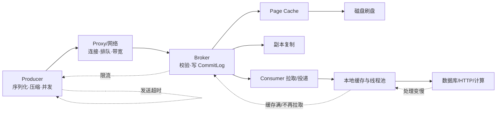
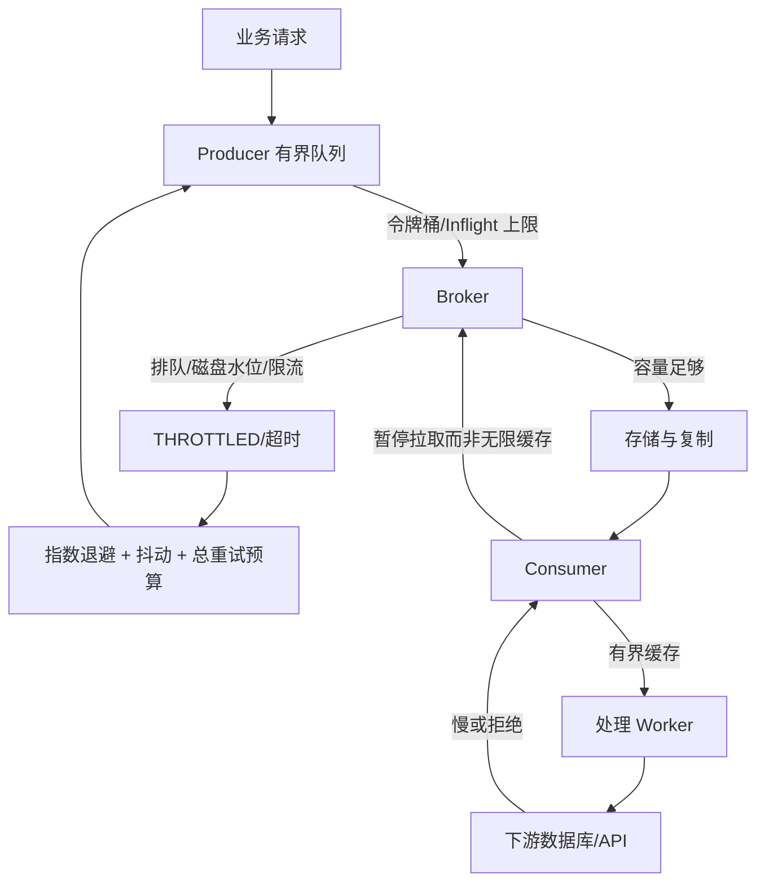
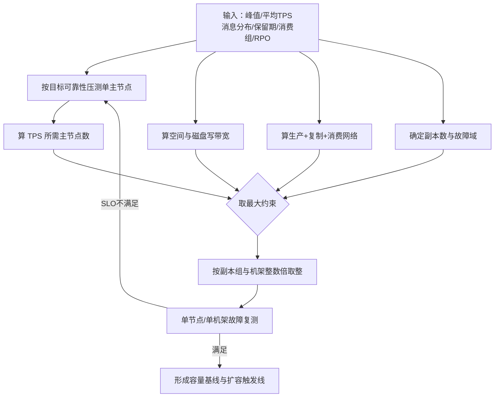
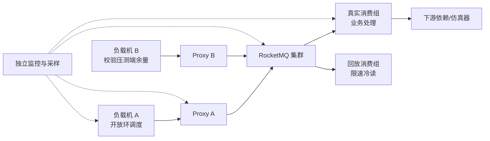

# 第 14 章：RocketMQ 性能优化、流控、压测与容量规划

> **技术基线**：本文以 Apache RocketMQ **5.5.0** 服务端和 Go gRPC SDK **golang/v5.1.4** 为当前基线，同时保留 4.x 经典 Remoting、队列级 Rebalance、主从复制等面试知识。文中的 **官方限制**、**源码默认值**、**公式示例**和**工程经验值**会明确区分；任何单机 TPS 都必须在自己的消息大小、刷盘、复制、过滤、消费和故障模型下重新压测。

---

## 本章去重边界与跳转

本章是性能、流控、压测和容量规划主讲章节。Producer、Consumer、存储、高可用和积压概念只保留与指标、瓶颈和容量公式相关的部分。

| 重复主题 | 本章处理方式 |
| --- | --- |
| Producer 批量、压缩、异步和重试 | 本章讲性能影响；发送语义看 [第 4 章：Producer 发送模型](/blog/tech/RocketMQ/04.Producer发送模型、路由选择、重试机制与底层发送链路)。 |
| Consumer 并发、不可见时间和 ACK | 本章讲吞吐模型；消费链路看 [第 5 章](/blog/tech/RocketMQ/05.Consumer类型、长轮询、POP、ACK与完整消费链路)，位点和积压看 [第 6 章](/blog/tech/RocketMQ/06.Rebalance、消费位点、负载均衡与消息积压)。 |
| CommitLog、ConsumeQueue、Page Cache 和冷读 | 本章讲瓶颈和压测；存储机制看 [第 7 章：存储引擎](/blog/tech/RocketMQ/07.RocketMQ存储引擎)。 |
| 同步刷盘、同步复制和可用性取舍 | 本章讲性能代价；高可用语义看 [第 13 章：高可用](/blog/tech/RocketMQ/13.RocketMQ高可用)。 |
| 告警、Runbook 和事故处理 | 本章只定义指标输入；生产排障看 [第 15 章：可观测性与 Runbook](/blog/tech/RocketMQ/15.RocketMQ可观测性、故障诊断、应急处理与生产Runbook)。 |

## 14.1 学习目标与场景导入

完成本章后，你应能回答四类问题：

1. **看懂性能数据**：区分 TPS、吞吐量、带宽、平均延迟、P95、P99，识别“高吞吐但尾延迟失控”的假繁荣。
2. **定位瓶颈**：判断瓶颈在 Producer、Proxy、Broker CPU、Page Cache、磁盘、复制链路、Consumer，还是下游数据库。
3. **建立背压**：让系统在突发流量、积压和故障时有界退化，而不是通过无限并发、无限缓存和无限重试把故障放大。
4. **完成容量评审**：从峰值 TPS、消息大小、保留期、副本数、消费组数和故障冗余推导 Queue、Broker、磁盘、网络及消费者数量。

贯穿案例是一套订单事件平台：正常峰值为 10 万 TPS，平均消息体 1 KiB，消息保留 72 小时，要求双副本或三副本；支付、库存、风控三个消费组分别订阅同一 Topic。团队提出四个“直觉方案”：把 Queue 从 32 调到 1024、Producer 开 10 万 goroutine、Broker JVM 堆设为物理内存的 80%、积压时无限扩消费者。本章将说明这些方案为什么可能适得其反。



性能工程的核心不是把某一个数字调到最大，而是在给定可靠性目标下，使整条链路的**吞吐、延迟、资源利用率和故障余量同时可接受**。

---

## 14.2 性能指标：先统一测量语言

### 14.2.1 TPS、QPS、吞吐量与带宽

- **TPS（Transactions Per Second）**：每秒完成的业务事务或消息操作数。在 RocketMQ 中必须说明口径，例如“Producer 成功 ACK TPS”“Broker 写入 TPS”“某消费组成功消费 TPS”。
- **QPS（Queries Per Second）**：每秒请求数。一次请求可能包含多条消息，因此批量发送时 QPS 与消息 TPS 不相等。
- **吞吐量（Throughput）**：单位时间内处理的数据量，常用 MiB/s、GiB/s。相同 TPS 下，1 KiB 与 1 MiB 消息对系统的压力完全不同。
- **带宽（Bandwidth）**：链路可传输速率，常以 Gbit/s 表示；吞吐量是实际流量，带宽是资源上限。

设每次请求平均包含 `b` 条消息、请求 QPS 为 `q`，则消息 TPS 为：

\[
TPS_{msg}=q\times b \tag{1}
\]

设平均线上字节数为 `S_wire`，则单向网络速率为：

\[
BW_{bit/s}=TPS_{msg}\times S_{wire}\times 8 \tag{2}
\]

`S_wire` 不只是消息 Body，还应包含 Topic、Key、Tag、属性、协议头、TLS 与压缩后的实际大小。容量初算可使用协议系数 `k_wire`，例如 `S_wire=S_body×1.10`；**1.10 是公式示例，不是官方固定值**，必须通过抓包或客户端指标校准。

### 14.2.2 平均延迟、P95 与 P99

平均值会掩盖长尾。若 99% 请求耗时 2 ms、1% 请求耗时 1 s，平均值约 12 ms，看似不高，但每秒 10 万请求意味着每秒约 1000 个请求遭遇 1 s 延迟。

- **P95**：95% 的请求不超过该耗时。
- **P99**：99% 的请求不超过该耗时。
- **P99.9**：大流量系统常需关注，因为低比例长尾仍对应大量用户请求。

延迟必须同时报告：样本数、负载强度、成功率、超时率、重试率、消息大小、刷盘/复制模式和压测持续时间。不能把不同负载下的 P99 直接比较，也不能把各机器 P99 求平均；正确做法是合并直方图或原始分布后重算分位数。

### 14.2.3 并发、吞吐与延迟的关系

稳定系统可用 Little 定律近似：

\[
Concurrency \approx TPS\times Latency_{seconds} \tag{3}
\]

例如目标 10 万 TPS、平均端到端发送延迟 10 ms，理论在途请求约为 1000。若延迟因磁盘抖动升到 100 ms，而流量仍保持 10 万 TPS，在途请求会增至约 1 万；若客户端没有并发上限，内存、连接、goroutine 和超时重试会继续膨胀。

### 14.2.4 推荐指标面板

| 层次 | 必看指标 | 需要同时观察的条件 |
|---|---|---|
| Producer | offered TPS、成功 TPS、P95/P99、超时率、重试率、客户端排队时间 | 消息大小、同步/异步、并发上限 |
| Proxy/Broker | 请求排队、写入 TPS、写字节、CPU、网络、磁盘延迟、Page Cache、复制落后 | 刷盘与复制策略、Topic/Queue 分布 |
| Consumer | 拉取 TPS、成功消费 TPS、处理 P99、Lag、Inflight、本地缓存、重试/DLQ | 批量、线程数、下游容量 |
| 业务端 | 数据库连接池、慢 SQL、HTTP P99、限流、错误率 | 幂等成本、事务范围 |

---

## 14.3 消息大小如何改变瓶颈

消息变大并非只增加网络流量，而会同时改变四类成本：

1. **CPU**：序列化、校验和、压缩/解压、复制和对象分配成本上升。压缩可节省网络与磁盘，却可能把瓶颈转移到 CPU。
2. **网络**：消息越大，单机 TPS 上限越可能由 NIC 带宽决定；多个消费组会重复产生消费出口流量。
3. **磁盘**：CommitLog 写入字节增加，刷盘时间和复制字节同步增加；大消息还会降低一次批量中可容纳的消息数。
4. **Page Cache**：相同内存可缓存的消息时间窗口变短，回溯、重放和积压消费更容易转为冷读。

RocketMQ 官方参数约束中，单条消息大小默认上限为 4 MiB，并建议消息体保持较小；Go 5.x SDK 源码也以 4 MiB 作为默认最大 Body 校验值。**“允许 4 MiB”不等于“适合发送 4 MiB”**。图片、视频、大 JSON 或二进制快照通常应存对象存储，消息只携带 URI、摘要、版本和业务 Key。

可以用“单位消息固定成本 + 单位字节成本”理解 CPU：

\[
CPU_{total}\approx TPS\times C_{fixed}+Bytes/s\times C_{byte} \tag{4}
\]

小消息高 TPS 时，固定协议、路由、锁和系统调用成本占主导；大消息时，复制、带宽、校验和与内存拷贝占主导。因此压测至少应覆盖 128 B、1 KiB、4 KiB、32 KiB 等真实分布，而不是只用一个固定大小。

---

## 14.4 Producer 优化：降低排队，而不是盲目加并发

### 14.4.1 批量发送

批量的收益来自摊薄请求头、系统调用、网络往返和 Broker 请求调度成本。代价是：

- 为等待凑批引入额外延迟；
- 单批失败时重试范围扩大；
- 大批次占用更多客户端与 Broker 内存；
- FIFO、事务、不同 Topic 或不同路由约束可能阻止合批。

必须注意 SDK 差异：经典 Remoting Go SDK 提供显式批量发送接口；当前 5.x gRPC Go SDK 的公开 `Producer.Send`/`SendAsync` API 每次接收一条 `Message`。不要凭其他语言或旧 SDK 的经验虚构 Go 5.x 批量 API。若业务强依赖显式批量，应先核对所用 SDK 版本和语义，再决定使用经典客户端、业务聚合消息或等待相应能力。

### 14.4.2 压缩

压缩适合可压缩且相对较大的文本消息。判断标准不是“压缩率高不高”，而是压缩后节省的网络、磁盘和复制时间是否大于 CPU 与延迟成本。建议按消息大小阈值启用，并在 Producer 与 Consumer 两端同时测 CPU、P99 和 GC。已经压缩的图片、压缩包通常收益很低。

### 14.4.3 异步发送与并发上限

异步发送可隐藏网络往返，提高吞吐，但必须有**有界 Inflight**。当前 Go 5.x SDK 的 `SendAsync` 内部会启动 goroutine；若调用方无上限地提交，压力只会从调用线程转移到 goroutine、内存和连接队列。生产代码应使用信号量、固定 worker 或令牌桶控制最大在途请求，并对本地排队超时单独计数。

发送端到端延迟可拆成：

\[
L_{send}=L_{clientQueue}+L_{serialize}+L_{network}+L_{brokerQueue}+L_{store}+L_{replica}+L_{response} \tag{5}
\]

**如何优化发送延迟？**正确顺序是：

1. 先区分客户端排队、网络、Broker 排队、刷盘和复制耗时；
2. 复用少量长生命周期 Producer，不要每条消息创建客户端；
3. 让并发覆盖正常 RTT，但设置 Inflight 上限，避免过载后继续增压；
4. 缩小消息和属性，避免无价值的大 Key、Trace 或 JSON；
5. 在可接受可靠性边界内选择异步发送、刷盘和复制策略；
6. 分散热 Key/FIFO 消息组，检查 Topic 是否集中到少数 Broker；
7. 超时与重试要匹配 SLO，重试必须有总时限、退避和抖动；
8. 若 P99 与磁盘、GC 或复制抖动同步，继续加 Producer 并发只会恶化延迟。

官方说明同步和异步发送都可能触发客户端重试。压测时应分别报告“首次尝试延迟”和“包含重试的业务完成延迟”，否则重试可能制造表面上的成功 TPS，并放大 Broker 压力。

---

## 14.5 Consumer 优化：并发、批量、处理时长与本地缓存

### 14.5.1 消费能力模型

若有 `N` 个有效处理 worker，每个 worker 平均每批处理 `B` 条，拉取、处理、确认一个周期耗时为 `T_cycle`，理论消费能力近似：

\[
R_{consume}\approx \frac{N\times B}{T_{cycle}} \tag{6}
\]

但当下游数据库、远程 API 或锁成为瓶颈后，增加 worker 只会提高争用和超时。应同时观察下游成功吞吐，而不是只看客户端“拿到消息”的速度。

### 14.5.2 批量大小

批量拉取可以摊薄网络和协议开销，但批量过大会：

- 增加单次处理和 ACK 延迟；
- 放大进程崩溃后的重复消费范围；
- 占用更多本地内存；
- 让慢消息阻塞同批其他消息；
- 在 FIFO 场景扩大串行等待。

应从小批量开始，用真实业务处理测吞吐与 P99。官方参数文档也提醒，单次获取过多消息会在失败时增加重复范围。

### 14.5.3 处理时长与不可见时间

SimpleConsumer 通过 `Receive(maxMessageNum, invisibleDuration)` 获取消息。`invisibleDuration` 应覆盖业务处理 P99、网络抖动和 ACK 时间；任务可能超时时，应在到期前调用 `ChangeInvisibleDuration`，而不是设置一个无限大的值。过短会导致仍在处理的消息重新可见并产生并发重复；过长则会延迟真正失败消息的重试。

### 14.5.4 本地缓存必须有界

本地缓存是削峰工具，不是永久仓库。建议设置“条数上限 + 字节上限 + 最长驻留时间”，任一达到阈值就暂停拉取。仅按条数限制会被大消息击穿，未计入在途业务对象也会低估内存。消费失败不能被当作限速手段；官方文档明确指出，重试用于可靠性恢复，不应替代流控。

### 14.5.5 Topic Queue 数与消费并发：必须区分版本模型

- **经典 4.x 队列级负载均衡**：同一消费组内，一条 Queue 同时分配给一个消费者实例；实例数超过 Queue 数时，部分实例可能空闲。因此 Queue 数会限制实例级并行度。
- **5.x PushConsumer/SimpleConsumer 消息级负载均衡**：Broker 可把同一 Queue 中的不同普通消息分配给多个消费者，Queue 数不再直接等于可用消费者实例数。官方文档说明这是 5.x 默认模型；PullConsumer 等仍可能采用队列级模型。
- **FIFO 消息**：并行单位主要是消息组。相同消息组必须串行确认，热消息组仍会形成单点，即使有很多 Queue 和消费者。

**Queue 是否越多越好？不是。**Queue 增多可能提高路由和并行度，却同时增加路由元数据、ConsumeQueue 文件、Rebalance/分配开销、管理复杂度和热点诊断成本。Queue 太少会限制经典模型并行度，太多则不能突破磁盘、网络、Broker 或下游瓶颈。规划时应由以下因素反推：目标并行度、Broker/主节点数量、经典或消息级负载均衡模型、FIFO 消息组分布、未来扩容倍数以及实测单 Queue/单 Broker 能力。

---

## 14.6 Broker、磁盘与 Topic 分布

### 14.6.1 Broker 数量不是用一个“官方单机 TPS”相除

Broker 数量应取多个约束的最大值：

\[
N_{broker}=\max(N_{TPS},N_{diskBW},N_{capacity},N_{network},N_{HA}) \tag{7}
\]

其中每个分项都应基于所选硬件和可靠性策略压测。还要按 Broker 组、主副本数和故障域向上取整。某台 32 核 NVMe 机器的结果不能外推到 SATA、云盘或不同消息大小环境。

### 14.6.2 Topic 与 Queue 分布

容量足够但分布不均，仍会出现热 Broker。应检查：

- Topic 的读写 Queue 是否均匀分布到主节点；
- 大 Topic 是否与大量延迟、事务、重试或 Trace 流量共盘；
- 某 Broker 是否承载更多主角色；
- Topic 创建、扩 Queue 后路由是否真正均衡；
- 消费回溯是否集中读取某些历史文件。

单机多盘只有在存储路径和 Broker/存储实例能真实利用多盘时才有价值；把多个目录放在同一块物理盘不会增加 IOPS。生产中更常见的可靠做法是每个 Broker 使用独立本地盘或独立存储卷，通过多个 Broker 横向扩展。

### 14.6.3 普通消息与顺序消息

普通消息可跨 Queue、跨消费者并行。FIFO 保证的是**同一消息组内有序**，不是整个 Topic 全局串行；但一个热消息组只能按顺序推进，吞吐上限约等于该组单链路处理能力。不要把所有订单都使用常量 MessageGroup，否则会把整个 Topic 退化为单通道。应使用稳定且足够分散的业务键，如 `orderID`，同时防止某个大客户或大商户形成超级热组。

### 14.6.4 刷盘与复制矩阵

| 策略 | 性能特征 | 可靠性与风险 |
|---|---|---|
| 异步刷盘 | ACK 路径通常更短，吞吐较高 | OS/Page Cache 中尚未落盘的数据在极端宕机时存在窗口 |
| 同步刷盘 | ACK 等待刷盘，延迟受磁盘尾延迟影响 | 单机掉电场景的数据持久性更强 |
| 异步复制 | 主节点不等待副本确认，延迟较低 | 主节点在复制完成前不可恢复故障可能扩大 RPO |
| 同步复制 | ACK 路径包含副本确认，网络和副本磁盘抖动进入 P99 | 提高已确认消息的副本确定性，但降低可用吞吐 |

RocketMQ 5.x Controller/自动切换场景还涉及同步副本集合和确认语义，不能只背“SYNC_MASTER/ASYNC_MASTER”四个词。评审必须写明：生产 ACK 需要本地 Page Cache、落盘还是副本确认；允许的 RPO/RTO；副本落后时继续写、限流还是拒绝写。

源码中的 `MessageStoreConfig` 默认值只描述默认行为，不等于生产最佳实践。例如 5.5.0 源码中默认 `ASYNC_FLUSH`、默认 Broker 角色为 `ASYNC_MASTER`，CommitLog 映射文件默认 1 GiB，默认消息保留时间为 72 小时，磁盘最大使用比例默认值为 75；这些值必须结合部署模式审查。

---

## 14.7 Page Cache、冷读与硬件/系统因素

### 14.7.1 Page Cache 命中

RocketMQ 顺序写 CommitLog，正常实时消费往往能从 Linux Page Cache 读取刚写入的数据。此时“磁盘读 IOPS 很低”不代表没有读，而是读命中内存。JVM 堆不能占满物理内存，应给 Page Cache、直接内存、线程栈和内核留出空间。

### 14.7.2 冷读

消费回溯、长时间积压、Offset 重置或 Broker 重启后，目标数据可能不在 Page Cache，需要从磁盘读取。冷读会：

- 提高读延迟和磁盘队列深度；
- 挤占热数据缓存；
- 与实时顺序写、刷盘和副本复制竞争；
- 使消费 TPS 突然下降并拉高 Broker P99。

因此压测不能只在预热后的热数据上运行。应单独构造超出 Page Cache 的历史数据集，测“冷启动回放”和“实时写 + 冷读回放”混合场景。

### 14.7.3 磁盘、文件系统、网络与 NUMA

以下属于**工程建议，不是 Apache 官方强制值**：

- 优先关注磁盘的稳定尾延迟、持续写带宽和故障抖动，而不只看标称顺序带宽；本地 NVMe 通常比共享云盘更可预测，但仍需压测。
- ext4、XFS 等成熟文件系统均需以实际内核、挂载参数和故障恢复验证；避免在不了解语义时照抄参数。
- 网卡要同时计算 Producer 入口、副本复制、多个消费组出口、管理和故障迁移流量；带宽够而软中断、丢包或跨机架拥塞仍可能拉高 P99。
- NUMA 机器上，跨节点内存访问和网卡/磁盘中断亲和性可能产生抖动。先通过监控确认，再做 CPU、IRQ、内存绑定实验；不要把绑定当作万能调优。

### 14.7.4 JVM、OS 与文件描述符

只调与 RocketMQ 直接相关的项目：

- **JVM 堆与 GC**：堆过小会频繁 GC，过大则挤压 Page Cache并延长某些停顿。以对象分配、停顿和 Page Cache 命中共同确定，而非固定比例。
- **直接内存与映射区**：CommitLog/ConsumeQueue 使用内存映射，需关注进程虚拟地址映射数量及直接内存；`vm.max_map_count` 必须覆盖文件映射规模。
- **文件描述符**：连接、CommitLog、ConsumeQueue、IndexFile 和日志都消耗 FD；`nofile` 要根据 Topic、Queue、连接和文件数量估算并监控余量。
- **Swap**：Broker 工作集被换出会造成灾难性尾延迟。生产通常避免内存超卖，并通过低交换倾向或禁用 Swap 控制风险；具体策略需结合宿主机规范。
- **脏页与写回**：内核脏页积累过多后集中回写会造成抖动。任何 `vm.dirty_*` 调整都必须通过断电、写满和稳态压测验证，不能照抄互联网“神奇参数”。

---

## 14.8 流控与背压：让过载有界



### 14.8.1 Producer 侧

- 令牌桶限制 offered TPS；信号量限制 Inflight；本地队列限制待发送条数和字节数。
- 队列满时应明确选择：拒绝、降级、落本地可靠日志或阻塞到截止时间，不能静默丢弃。
- 重试采用指数退避、随机抖动和总时限；限流时立即无间隔重试会形成重试风暴。
- 业务侧必须接受发送结果不确定性：超时不代表 Broker 一定未写入，仍需 Key、幂等和对账。

### 14.8.2 Broker 侧

Broker 会受到请求队列、异步写请求、Page Cache 繁忙、磁盘水位、复制落后和冷数据读取等保护机制约束。客户端收到限流或超时后，应降低发送速率，而不是增加并发。磁盘进入高水位时，首要动作是止住增长、核对保留期和异常 Topic，再扩容或迁移；不要仅提高磁盘阈值掩盖风险。

### 14.8.3 Consumer 侧

Consumer 背压的目标是让“拉取速率 ≤ 可持续处理速率”。可通过减少并发 Receive、缩小批量、暂停拉取、收紧本地缓存和保护下游实现。失败重试不是限流器；若数据库明确容量为 2 万 TPS，消费者就不应以 5 万 TPS 拉取后让 3 万条进入重试。

---

## 14.9 积压模型与百万级积压处理

设生产速率为 `P`，成功消费速率为 `C`，初始积压为 `L0`，持续时间为 `t`：

\[
L(t)=\max(0,L_0+(P-C)\times t) \tag{8}
\]

若 `C≤P`，积压永远清不完；若 `C>P`，清理时间为：

\[
T_{drain}=\frac{L_0}{C-P} \tag{9}
\]

要求在目标时间 `T_target` 内清完积压、单个消费者实例可持续处理 `r` 条/s，则实例数至少为：

\[
N_{consumer}=\left\lceil\frac{P+L_0/T_{target}}{r\times u}\right\rceil \tag{10}
\]

`u` 是目标利用率，例如 0.7；这是**容量经验参数**，用于保留故障和波动余量。

**如何处理百万级积压？**

1. 先阻断根因：下游故障、热 Key、消费异常、订阅错误、限流或 Broker 冷读；不先修根因，扩容只会继续失败。
2. 确认消息仍有业务价值和保留时间，估算最早消息年龄、增长率与清理窗口。
3. 计算所需净消费能力 `C-P`，而不是看到“一百万”就凭感觉加机器。
4. 验证 Queue/消息级负载均衡、FIFO 消息组和下游容量是否允许扩并发。
5. 建立临时回放消费组或隔离资源时，保证幂等、顺序、限速和数据核对；不要直接跳过 Offset。
6. 冷积压回放要限制磁盘读带宽，避免拖垮实时写入；必要时分时段、分 Topic 或分 Broker 清理。
7. 持续观察 Lag 斜率。Lag 下降才说明有效；只看消费者实例数没有意义。

---

## 14.10 磁盘、网络、消费者与 Broker 容量公式

### 14.10.1 磁盘容量

严格计算应对流量曲线积分：

\[
D_{primary}=\int_{now-R}^{now} TPS(t)\times S_{store}(t)\,dt \tag{11}
\]

初算可用平均 TPS：

\[
D_{cluster}=\frac{TPS_{avg}\times S_{store}\times R_{sec}\times ReplicaCount\times (1+k_{meta})}{u_{disk}} \tag{12}
\]

- `S_store`：CommitLog 中实际单条存储字节，不只是 Body。
- `k_meta`：ConsumeQueue、Index、属性、对齐、事务/延迟/重试/Trace 等开销系数。经典 ConsumeQueue 单条索引固定为 20 B，但集群总开销不能只加 20 B；示例可先取 10%～25%，再用真实磁盘增长校准。
- `u_disk`：允许使用的磁盘比例。例如按 70% 规划，公式中取 0.70；这是安全水位示例，不是官方通用值。
- `ReplicaCount`：物理副本总数，双副本取 2，三副本取 3。

吞吐容量按峰值定，空间容量原则上按保留窗口内的**实际平均流量积分**定。只有在“峰值可能持续整个保留期”时，才用峰值直接乘 72 小时。

### 14.10.2 网络带宽

有 `G` 个完整消费组、`R` 个副本，忽略协议细节时集群总业务流量近似：

\[
BW_{cluster}\approx BW_{ingress}\times [1+(R-1)+G] \tag{13}
\]

第一项是生产入口，第二项是副本复制，第三项是每个消费组的出口。还需加入协议/TLS/重试/跨区系数，并分别检查每台主节点、从节点、Proxy 和交换机端口的入向与出向峰值。网络目标利用率常取 50%～70% 以保留故障迁移余量，属于工程经验，不是官方限制。

### 14.10.3 Broker 数量

若压测得到单个主 Broker 在指定配置下的稳定能力为 `T_broker`，目标利用率为 `u`：

\[
N_{primary,TPS}=\left\lceil\frac{TPS_{peak}}{T_{broker}\times u}\right\rceil \tag{14}
\]

再分别按磁盘容量、写带宽、网卡和 HA 算出数量，取最大值，并按副本组整数倍向上取整。**如何确定 Broker 数量？答案永远是“多约束取最大值 + 故障场景复测”，而不是引用一个网上单机 TPS。**



---

## 14.11 热 Topic、热 Queue 与热消息组

- **热 Topic**：某 Topic 占集群大部分写入、存储或消费流量。处理方法是独立集群/独立 Broker 资源、细化 Topic、均衡 Queue、限制异常生产者，并核对多个消费组出口。
- **热 Queue**：路由或选择策略导致流量集中到少数 Queue/Broker。检查发送队列选择、扩 Queue 后路由、Broker 主角色分布和 Key 哈希。
- **热消息组**：FIFO 下某 MessageGroup 远高于其他组。增加 Queue 或消费者通常无效，因为同组仍串行。应重新设计分组粒度、拆分业务实体，或接受该实体的单链路上限。

识别热点不要只看 Topic 总 TPS，要下钻到 `Broker → Topic → Queue/MessageGroup → Producer/Consumer`。总量均衡并不代表局部没有热点。

---

## 14.12 压测设计与测量陷阱

### 14.12.1 五类必测场景

| 场景 | 目的 | 关键观察 |
|---|---|---|
| 空载基线 | 测最低延迟和客户端固定成本 | 单消息延迟、连接建立、CPU 基线 |
| 稳态 | 验证长时间可持续能力 | 30～120 分钟后 P99、GC、磁盘写回、复制延迟 |
| 突发 | 验证排队和背压 | 1～10 倍突增、恢复时间、拒绝率、队列峰值 |
| 故障 | 验证降级与冗余 | Broker/Proxy/网卡/磁盘故障、选主、重试风暴 |
| 冷读 | 验证回放和积压清理 | Page Cache 未命中、读写混合、实时流量受影响程度 |

还应覆盖不同消息大小、Tag/SQL 过滤、普通/FIFO、同步/异步刷盘、双/三副本、一个与多个消费组。每次只改变一个主要变量，否则无法归因。

### 14.12.2 Coordinated Omission

闭环压测常采用“上一次请求完成后再发下一次”。当系统卡顿 1 秒时，压测端也暂停 1 秒，没有记录本应在这 1 秒到达却未发出的请求，于是 P99 被严重低估，这就是 **coordinated omission（协调遗漏）**。

修正方法：

- 使用开放环模型，按预定时间表产生请求，与上一次响应是否完成无关；
- 记录“计划发送时刻 → 完成时刻”的延迟，把客户端排队也算进去；
- 本地队列满时记录拒绝或丢弃，不能悄悄降低 offered load；
- 同时报告 offered TPS、accepted TPS、success TPS 和 completed TPS；
- 压测机 CPU、网卡或连接耗尽时，应判定为压测端瓶颈，而不是 Broker 上限。

### 14.12.3 其他常见错误

- 只跑 60 秒，未经历 JVM 稳态、文件切换、内核写回和 GC；
- 只报平均值，不报 P99、错误、重试和样本数；
- 用压缩率极高的重复字符串代替真实消息；
- Producer、Broker、Consumer 全在同一台机器，资源互相争用；
- 在热 Page Cache 上测回放，却宣称磁盘读性能；
- 通过扩大超时把“超时率下降”误认为性能提升；
- 压测期间自动重试，但把每次尝试都算作新 TPS；
- 忽略消费业务和幂等写，仅测空处理 ACK。



---

## 14.13 Go Producer/Consumer 压测框架

下面代码基于当前 5.x gRPC Go SDK 的公开 API。它是**框架片段**，重点展示开放环调度、有界并发、计划时间延迟、批量拉取和本地背压；生产压测还应接入 HDR Histogram/Prometheus、配置校验、分布式负载机和结果持久化。

### 14.13.1 Producer：开放环 + 固定 Worker

```go
package main

import (
    "context"
    "flag"
    "fmt"
    "log"
    "sort"
    "sync"
    "sync/atomic"
    "time"

    rmq "github.com/apache/rocketmq-clients/golang/v5"
    "github.com/apache/rocketmq-clients/golang/v5/credentials"
)

type job struct {
    seq     uint64
    planned time.Time
}

type stats struct {
    offered  atomic.Uint64
    rejected atomic.Uint64
    success  atomic.Uint64
    failed   atomic.Uint64
    mu       sync.Mutex
    latency  []time.Duration
}

func (s *stats) observe(d time.Duration) {
    s.mu.Lock()
    s.latency = append(s.latency, d)
    s.mu.Unlock()
}

func percentile(v []time.Duration, p float64) time.Duration {
    if len(v) == 0 { return 0 }
    sort.Slice(v, func(i, j int) bool { return v[i] < v[j] })
    i := int(float64(len(v)-1) * p)
    return v[i]
}

func main() {
    endpoint := flag.String("endpoint", "127.0.0.1:8081", "gRPC endpoint")
    topic := flag.String("topic", "PerfTopic", "topic")
    rate := flag.Int("rate", 10000, "offered messages per second")
    workers := flag.Int("workers", 256, "bounded concurrent sends")
    bodyBytes := flag.Int("body-bytes", 1024, "message body bytes")
    duration := flag.Duration("duration", time.Minute, "test duration")
    timeout := flag.Duration("timeout", 3*time.Second, "per-send timeout")
    flag.Parse()

    producer, err := rmq.NewProducer(&rmq.Config{
        Endpoint: *endpoint,
        Credentials: &credentials.SessionCredentials{},
    }, rmq.WithTopics(*topic), rmq.WithMaxAttempts(1)) // 压测首次尝试；业务值另测
    if err != nil { log.Fatal(err) }
    if err = producer.Start(); err != nil { log.Fatal(err) }
    defer producer.GracefulStop()

    ctx, cancel := context.WithTimeout(context.Background(), *duration)
    defer cancel()

    jobs := make(chan job, *workers*4) // 有界队列，满时记 rejected
    result := &stats{latency: make([]time.Duration, 0, *rate*int(duration.Seconds()))}
    body := make([]byte, *bodyBytes)

    var wg sync.WaitGroup
    for i := 0; i < *workers; i++ {
        wg.Add(1)
        go func() {
            defer wg.Done()
            for j := range jobs {
                msg := &rmq.Message{Topic: *topic, Body: body}
                msg.SetTag("perf")
                msg.SetKeys(fmt.Sprintf("perf-%d", j.seq))

                sendCtx, sendCancel := context.WithTimeout(context.Background(), *timeout)
                _, sendErr := producer.Send(sendCtx, msg)
                sendCancel()

                // 从计划到达时刻计时，包含客户端排队，避免 coordinated omission。
                result.observe(time.Since(j.planned))
                if sendErr != nil { result.failed.Add(1) } else { result.success.Add(1) }
            }
        }()
    }

    start := time.Now()
    tick := time.NewTicker(10 * time.Millisecond)
    defer tick.Stop()
    var issued uint64

schedule:
    for {
        select {
        case now := <-tick.C:
            target := uint64(now.Sub(start).Seconds() * float64(*rate))
            for issued < target {
                issued++
                result.offered.Add(1)
                planned := start.Add(time.Duration(float64(issued)/float64(*rate)*float64(time.Second)))
                select {
                case jobs <- job{seq: issued, planned: planned}:
                default:
                    result.rejected.Add(1)
                }
            }
        case <-ctx.Done():
            break schedule
        }
    }

    close(jobs)
    wg.Wait()
    result.mu.Lock()
    samples := append([]time.Duration(nil), result.latency...)
    result.mu.Unlock()

    fmt.Printf("offered=%d rejected=%d success=%d failed=%d p50=%s p95=%s p99=%s\n",
        result.offered.Load(), result.rejected.Load(), result.success.Load(), result.failed.Load(),
        percentile(samples, 0.50), percentile(samples, 0.95), percentile(samples, 0.99))
}
```

说明：`WithMaxAttempts(1)` 只是为了测首次尝试的 Broker 能力，属于压测口径，不是生产推荐。生产环境应另跑一组包含真实重试策略的业务完成测试。高 TPS 下不应把所有延迟永久保存在切片中，可改为固定桶直方图或抽样。

### 14.13.2 SimpleConsumer：有界本地队列 + Worker

```go
func runConsumer(ctx context.Context, endpoint, topic, group string, workers int, batch int32) error {
    consumer, err := rmq.NewSimpleConsumer(&rmq.Config{
        Endpoint: endpoint,
        ConsumerGroup: group,
        Credentials: &credentials.SessionCredentials{},
    },
        rmq.WithSimpleAwaitDuration(5*time.Second),
        rmq.WithSimpleSubscriptionExpressions(map[string]*rmq.FilterExpression{
            topic: rmq.SUB_ALL,
        }),
    )
    if err != nil { return err }
    if err = consumer.Start(); err != nil { return err }
    defer consumer.GracefulStop()

    // 同时限制条数和近似字节数；真实实现应按消息 Body 统计字节水位。
    local := make(chan *rmq.MessageView, workers*int(batch)*2)
    var wg sync.WaitGroup
    for i := 0; i < workers; i++ {
        wg.Add(1)
        go func() {
            defer wg.Done()
            for msg := range local {
                if err := handleBusiness(ctx, msg.GetBody()); err != nil {
                    // 不 ACK，等待重新可见；不要把失败当作日常限速手段。
                    continue
                }
                ackCtx, cancel := context.WithTimeout(ctx, 3*time.Second)
                _ = consumer.Ack(ackCtx, msg)
                cancel()
            }
        }()
    }

    invisible := 60 * time.Second // 示例值，应覆盖业务处理 P99
    for ctx.Err() == nil {
        messages, receiveErr := consumer.Receive(ctx, batch, invisible)
        if receiveErr != nil {
            time.Sleep(100 * time.Millisecond) // 实际使用带抖动退避并分类错误
            continue
        }
        for _, msg := range messages {
            select {
            case local <- msg: // channel 满时自然暂停 Receive，形成背压
            case <-ctx.Done():
                close(local)
                wg.Wait()
                return ctx.Err()
            }
        }
    }
    close(local)
    wg.Wait()
    return ctx.Err()
}
```

压测报告应记录 Receive 批量分布、业务成功率、ACK 延迟、重复率、消息年龄、Lag 下降斜率、本地队列字节数和下游 P99。若业务处理可能超过不可见时间，应提前续期。

---

## 14.14 完整容量规划案例：10 万 TPS、1 KiB、72 小时

### 14.14.1 假设与口径

- 峰值：100,000 消息/s。
- 消息体：1 KiB，即 1024 B。
- 保留：72 小时。
- 元数据与索引综合系数：15%，即 `k_meta=0.15`，**公式示例**。
- 磁盘规划水位：70%，即 `u_disk=0.70`，**工程示例**。
- 网络协议系数：10%，即 `k_wire=0.10`，**公式示例**。
- 为给出上界，先假设峰值连续 72 小时；真实规划应使用业务流量曲线积分。
- 压测得到：在目标刷盘、复制、消息大小与 P99 SLO 下，单个主 Broker 稳态可承载 40,000 TPS；规划利用率 70%。这两个数字均为**案例压测输入，不是官方能力**。

### 14.14.2 主数据量

\[
100000\times1024\times72\times3600
=26.54208\times10^{12}B
\approx24.14TiB
\]

加入 15% 元数据/索引/属性开销：

\[
D_{oneCopy}=24.14\times1.15\approx27.76TiB
\]

双副本并按 70% 水位规划：

\[
D_{2copy}=27.76\times2/0.70\approx79.32TiB
\]

三副本：

\[
D_{3copy}=27.76\times3/0.70\approx118.98TiB
\]

若实际 72 小时平均 TPS 仅为峰值的 35%，则空间约为上述结果的 35%；这说明**吞吐按峰值、空间按流量积分**的重要性。

### 14.14.3 网络

消息体入口带宽：

\[
100000\times1024\times8=819.2Mbit/s
\]

加入 10% 协议系数约为 `0.90 Gbit/s`。若只有一个完整消费组：

- 双副本：生产入口 + 1 份复制 + 1 份消费出口，集群业务流量约 `2.70 Gbit/s`；
- 三副本：生产入口 + 2 份复制 + 1 份消费出口，约 `3.60 Gbit/s`。

本案例实际有三个完整消费组，双副本近似为 `0.90×(1+1+3)=4.51 Gbit/s`，三副本约为 `0.90×(1+2+3)=5.41 Gbit/s`。这只是集群汇总，必须再按主从角色和 Topic 分布计算单节点双向峰值，并考虑故障迁移和重试。

### 14.14.4 主 Broker 与总节点数

单主节点规划能力：

\[
40000\times0.70=28000TPS
\]

所需主节点：

\[
N_{primary}=\lceil100000/28000\rceil=4
\]

因此：

- 双副本可规划为 4 个 Broker 组 × 2 节点，共 8 节点；
- 三副本可规划为 4 个 Broker 组 × 3 节点，共 12 节点。

此时每个节点按均匀分布承担的规划后空间约为：

\[
79.32/8\approx9.91TiB
\]

或：

\[
118.98/12\approx9.91TiB
\]

若每节点可用于 RocketMQ 的原始容量为 16 TiB，则空间约束暂不高于吞吐约束。但最终还必须执行“失去一个主节点”“失去一个机架”“副本落后”“冷读回放 + 实时写”压测。若故障后剩余 3 个主节点需要承载 10 万 TPS，则每主约 33,333 TPS，已超过案例规划值 28,000 TPS；因此应提高单主实测余量、增加到 5 个主组，或在故障期间启用业务限流。容量评审不能只保证正常态。

### 14.14.5 推荐结论

本案例的初步基线是：正常态至少 4 个主 Broker 组；双副本 8 节点、三副本 12 节点；每节点规划约 10 TiB 原始空间需求；网络至少按多消费组汇总并保留故障余量。最终节点数取决于故障态 SLO，而不是上述算术结果本身。

---

## 14.15 计算题

### 题 1：积压增长

生产 25,000 TPS，消费 18,000 TPS，持续 20 分钟，初始无积压。积压多少？

\[
(25000-18000)\times20\times60=8,400,000
\]

**答案：840 万条。**若平均存储字节为 1.2 KiB，新增积压数据约 9.61 GiB；还未计副本和索引。

### 题 2：清理百万积压需要多少消费者

当前生产 8,000 TPS，积压 1,000,000 条，要求 10 分钟清完；单实例可持续成功消费 500 TPS，暂不计余量。

所需总消费速率：

\[
8000+1000000/600\approx9666.7TPS
\]

实例数：

\[
\lceil9666.7/500\rceil=20
\]

**答案：至少 20 个有效实例。**若按 70% 利用率规划，则应为 `ceil(9666.7/(500×0.7))=28` 个；还需确认经典 Queue 数、5.x 消息级负载均衡、FIFO 热组和下游容量。

### 题 3：网络容量

峰值 50,000 TPS，平均线上大小 2 KiB，双副本，两个完整消费组，协议开销已包含。集群业务流量约多少？

入口：

\[
50000\times2048\times8\approx0.8192Gbit/s
\]

总流量系数为 `1 + (2-1) + 2 = 4`，因此约 `3.28 Gbit/s`。这不是单台网卡流量，需按角色分解。

### 题 4：Broker 数量

峰值 180,000 TPS；单主节点在目标 SLO 下实测稳定 50,000 TPS；目标利用率 65%；三副本。主节点至少多少，总节点至少多少？

\[
N_{primary}=\lceil180000/(50000\times0.65)\rceil=6
\]

**答案：至少 6 个主组、18 个 Broker 节点。**之后还要与磁盘、网络和故障态约束取最大值。

---

## 14.16 容量评审模板

| 类别 | 必填内容 |
|---|---|
| 业务口径 | Topic、消息类型、生产方、消费组、峰值/平均/突发曲线、增长率 |
| 消息模型 | Body P50/P95/P99、Key/Tag/属性、压缩率、FIFO 消息组分布 |
| SLO | 发送成功率、P95/P99、消费时延、允许积压、RPO、RTO |
| 可靠性 | 刷盘模式、复制/ACK 语义、副本数、机架/可用区、故障时限流策略 |
| 存储 | 保留期、实际存储字节、CQ/Index/Trace/重试开销、安全水位、清理窗口 |
| 网络 | 入口、复制、每个消费组出口、跨区、故障迁移、目标利用率 |
| Producer | 实例数、连接、同步/异步、Inflight、批量/压缩、超时、重试预算 |
| Consumer | 类型、实例/worker、批量、不可见时间、本地缓存、单实例可持续 TPS |
| Broker | 主组数、副本拓扑、单节点实测 TPS/字节、磁盘、网卡、CPU、内存 |
| 压测证据 | 版本、硬件、数据集、持续时间、场景矩阵、P99、错误、重试、资源曲线 |
| 故障验证 | 主节点故障、Proxy 故障、磁盘慢、复制落后、机架故障、冷读回放 |
| 扩容触发 | TPS、磁盘水位、P99、复制 Lag、消费 Lag 的告警与提前量 |
| 回滚与风险 | 配置变更回滚、Topic/Queue 变更影响、数据核对、负责人 |

评审结论应给出“当前基线、12 个月预测、扩容触发点、扩容周期、最坏故障态”五项，而不是只写一个 Broker 数量。

---

## 14.17 资深面试题

> **题目去重**：本节作为本章性能容量自测，只保留指标、瓶颈、流控、积压、压测和容量规划题。跨章重复题、完整追问链和模拟面试统一跳转到 [第 20 章：资深面试题库、追问链与模拟面试](/blog/tech/RocketMQ/20.RocketMQ资深面试题库、追问链与模拟面试)。

### 1. TPS 与吞吐量有什么区别？
**标准回答**：TPS 是消息或请求数量速率，吞吐量是字节速率；必须同时看消息大小。**追问**：批量 10 条时 QPS 与 TPS 如何换算？**易错点**：只报 TPS，不说明消息大小与成功口径。

### 2. 为什么平均延迟低，用户仍可能觉得系统很慢？
**标准回答**：平均值掩盖长尾，应看 P95/P99、超时和错误；大流量下 1% 也是大量请求。**追问**：能否把各机器 P99 求平均？**易错点**：把平均值当 SLA。

### 3. Queue 是否越多越好？
**标准回答**：不是。Queue 增加并行和路由粒度，也增加元数据、文件、Rebalance 和运维成本，且不能突破磁盘、网络和下游瓶颈。**追问**：5.x SimpleConsumer 还受 Queue 数硬限制吗？**易错点**：忽略消息级负载均衡与经典队列级模型差异。

### 4. 如何确定 Broker 数量？
**标准回答**：分别按峰值 TPS、磁盘写带宽、保留容量、网络和 HA 计算，取最大值，再按副本组与故障域取整，并做故障态复测。**追问**：为什么不能引用官方或网上单机 TPS？**易错点**：未说明消息大小、刷盘、复制和硬件。

### 5. 如何优化 Producer 发送延迟？
**标准回答**：先拆分客户端排队、网络、Broker 排队、刷盘和复制；复用 Producer、限制 Inflight、缩小消息、均衡热点，并按可靠性目标选择异步/同步策略。**追问**：提高超时是否算优化？**易错点**：超时减少但真实延迟没下降。

### 6. 异步发送为什么可能导致 OOM？
**标准回答**：调用方提交速度超过完成速度且没有 Inflight/本地队列上限，回调、消息体和 goroutine 持续积累。**追问**：如何设计背压？**易错点**：认为异步天然更高效且没有成本。

### 7. 批量越大吞吐一定越高吗？
**标准回答**：到一定程度会受单请求大小、内存、失败重试范围和凑批延迟影响，P99 可能恶化。**追问**：当前 Go 5.x 公共 Producer API 是否有显式多消息 Send？**易错点**：混淆经典 Remoting SDK 与 gRPC SDK。

### 8. 压缩应该如何决策？
**标准回答**：比较 CPU 成本与网络/磁盘节省，按真实消息分布和阈值压测。**追问**：为什么重复字符压测会误导？**易错点**：使用异常高压缩率的数据。

### 9. 同步刷盘与同步复制分别影响什么？
**标准回答**：同步刷盘等待本地持久化，同步复制等待副本确认；两者都把相应资源的尾延迟放入 ACK 路径。**追问**：二者能否相互替代？**易错点**：把“有副本”当作“本地已落盘”。

### 10. Page Cache 为什么对 RocketMQ 很重要？
**标准回答**：顺序写和近实时读可命中 Page Cache，减少物理读；JVM 堆过大会挤压缓存。**追问**：如何验证冷读？**易错点**：只看进程 RSS 或磁盘 IOPS 就下结论。

### 11. 如何处理百万级积压？
**标准回答**：先修根因，计算增长率和所需净消费能力，确认并行模型与下游容量，再限速扩容和冷读回放，持续看 Lag 斜率。**追问**：为什么不能直接 Reset Offset？**易错点**：把跳过消息当作清理积压。

### 12. 消费者越多，积压清得越快吗？
**标准回答**：只在 Broker、负载均衡、FIFO 分组和下游仍有余量时成立；否则会增加争用、重试和重复。**追问**：经典模型实例数超过 Queue 数会怎样？**易错点**：只看实例数量。

### 13. `invisibleDuration` 太短或太长有什么问题？
**标准回答**：太短会在处理中重新投递造成重复，太长会延迟失败重试；应覆盖处理 P99并按需续期。**追问**：能否设置成一天？**易错点**：用超长不可见时间掩盖慢处理。

### 14. 如何计算积压清理时间？
**标准回答**：当 `C>P` 时为 `L/(C-P)`；若 `C≤P` 永远清不完。**追问**：为什么不能用 `L/C`？**易错点**：忘记清理期间仍有新消息进入。

### 15. 什么是 coordinated omission？
**标准回答**：闭环压测在系统停顿时也停止发请求，漏记本应到达的等待，从而低估长尾。**追问**：如何修正？**易错点**：只提高并发却仍按响应驱动发流量。

### 16. 为什么冷读压测必须与实时写混合？
**标准回答**：真实回放会与 CommitLog 写、刷盘和复制竞争磁盘及 Page Cache，单独冷读无法反映对在线流量的影响。**追问**：如何限制回放？**易错点**：只追求最快清积压。

### 17. 热 Queue 与热消息组有什么区别？
**标准回答**：热 Queue 是路由/分布层热点；热消息组是 FIFO 串行键热点，后者即使增加 Queue 也可能无效。**追问**：如何拆分热组？**易错点**：把常量当 MessageGroup。

### 18. 磁盘容量为什么不能只算 Body×TPS×时间？
**标准回答**：还包含 CommitLog 固定字段、属性、ConsumeQueue、Index、事务/延迟/重试/Trace、副本和安全水位。**追问**：经典 ConsumeQueue 每条索引多大？**易错点**：知道 20 B 后就认为总开销恒定为 20 B。

### 19. Broker 磁盘水位高时可以直接调高阈值吗？
**标准回答**：不应先调阈值；应止住流量、确认保留期和异常 Topic、评估清理与扩容。提高阈值会压缩恢复空间。**追问**：为何磁盘满会影响可用性？**易错点**：把阈值当容量扩展。

### 20. 一份合格的 RocketMQ 压测报告必须包含什么？
**标准回答**：版本、硬件、拓扑、消息分布、刷盘/复制、offered/成功 TPS、P95/P99、错误/重试、资源曲线、持续时间、故障与冷读场景。**追问**：为什么只给峰值 TPS 没意义？**易错点**：没有可复现条件和失败拐点。

---

## 14.18 本章总结

RocketMQ 性能优化可以归纳为五句话：

1. **先统一口径**：TPS 必须带消息大小、成功定义和可靠性配置，延迟必须看长尾。
2. **先找瓶颈再加资源**：Producer 并发、Queue、消费者和 Broker 都不是越多越好。
3. **把背压做成闭环**：Producer 有界 Inflight，Broker 保护存储，Consumer 有界缓存，下游有明确容量。
4. **吞吐按峰值，容量按积分**：磁盘、网络、副本、消费组和安全水位必须进入公式。
5. **以故障态决定生产容量**：正常态跑满不是能力，失去 Broker、机架或 Page Cache 后仍满足 SLO 才是能力。

---

## 14.19 官方资料与源码

1. [Apache RocketMQ 5.5.0 Release](https://github.com/apache/rocketmq/releases/tag/rocketmq-all-5.5.0)
2. [Parameter Constraints and Suggestions](https://rocketmq.apache.org/docs/introduction/03limits/)
3. [Sending Retry and Throttling Policy](https://rocketmq.apache.org/docs/featureBehavior/05sendretrypolicy/)
4. [Consumer Types](https://rocketmq.apache.org/docs/featureBehavior/06consumertype/)
5. [Consumer Load Balancing](https://rocketmq.apache.org/docs/featureBehavior/08consumerloadbalance/)
6. [Ordered Message](https://rocketmq.apache.org/docs/featureBehavior/03fifomessage/)
7. [Consumption Retry](https://rocketmq.apache.org/docs/featureBehavior/10consumerretrypolicy/)
8. [Message Storage and Cleanup](https://rocketmq.apache.org/docs/featureBehavior/11messagestorepolicy/)
9. [Go Client SDK](https://rocketmq.apache.org/docs/sdk/05go/)
10. [RocketMQ 5.5.0 MessageStoreConfig 源码](https://github.com/apache/rocketmq/blob/rocketmq-all-5.5.0/store/src/main/java/org/apache/rocketmq/store/config/MessageStoreConfig.java)
11. [RocketMQ ConsumeQueue 源码](https://github.com/apache/rocketmq/blob/rocketmq-all-5.5.0/store/src/main/java/org/apache/rocketmq/store/queue/ConsumeQueue.java)
12. [RocketMQ Go 5.x Client Repository](https://github.com/apache/rocketmq-clients/tree/golang/v5.1.4/golang)
13. [Go Producer API 源码](https://github.com/apache/rocketmq-clients/blob/golang/v5.1.4/golang/producer.go)
14. [Go SimpleConsumer API 源码](https://github.com/apache/rocketmq-clients/blob/golang/v5.1.4/golang/simple_consumer.go)
15. [经典 Remoting Go SDK](https://github.com/apache/rocketmq-client-go)
