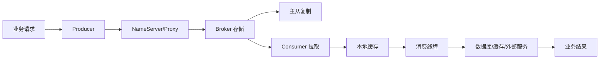
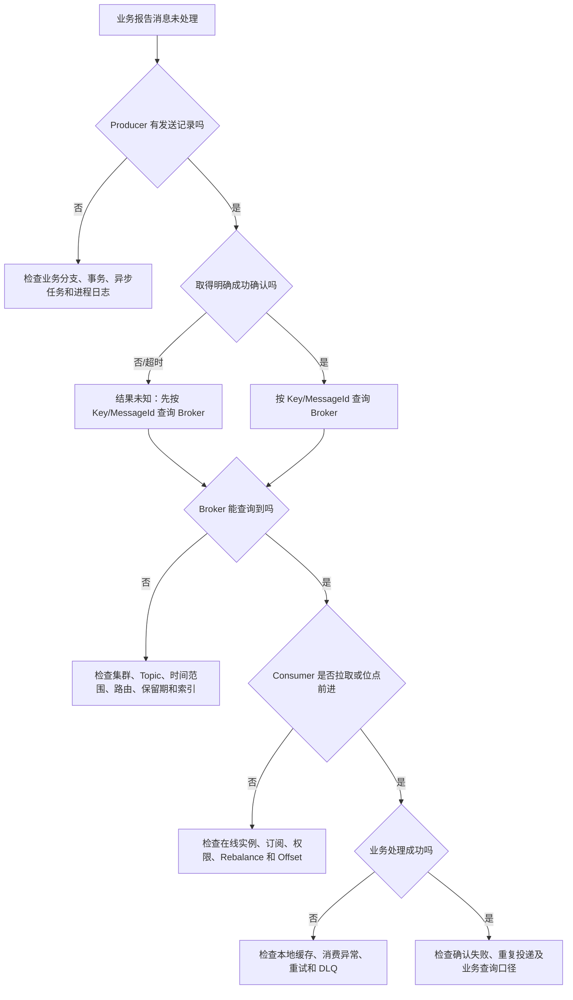
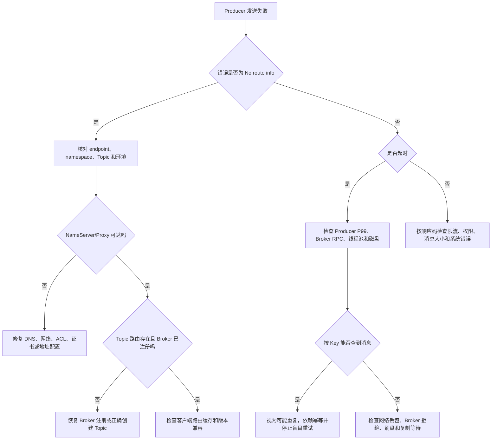
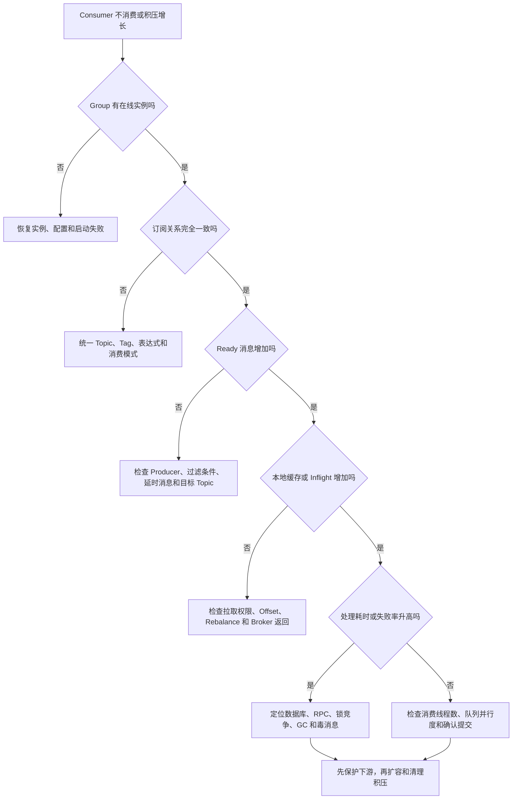
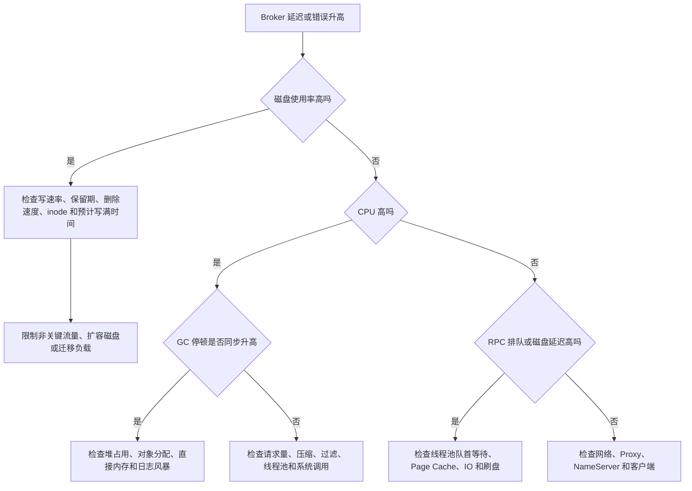
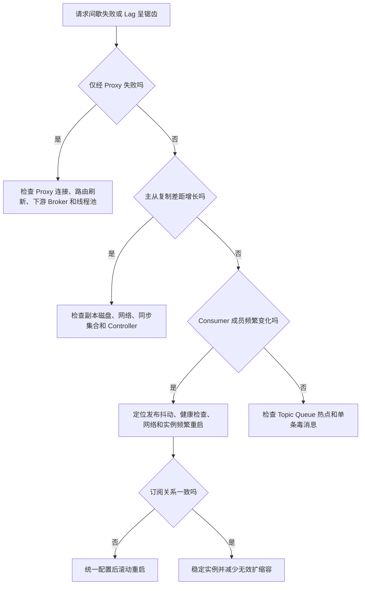

# 第 15 章：RocketMQ 可观测性、故障诊断、应急处理与生产 Runbook

> **技术基线**：本章以 Apache RocketMQ 5.x 为主要背景，同时指出 4.x 常见运维差异。截至 2026 年 6 月，Apache RocketMQ 最新正式版本为 5.5.0，发布于 2026 年 4 月 10 日。生产操作必须使用与服务端版本匹配的管理工具，并以本地执行 `mqadmin help <command>` 输出为最终依据。([RocketMQ][1])

## 本章去重边界与跳转

本章是可观测性、故障诊断和生产 Runbook 主讲章节。它不重新解释所有 RocketMQ 机制，而是把前面章节的机制落到指标、日志、Trace、排查顺序和应急动作上。

| 重复主题 | 本章处理方式 |
| --- | --- |
| Producer、Consumer、Broker、Proxy 的职责 | 本章只用它们定位故障边界；组件模型看 [第 2 章：整体架构、核心组件与领域模型](/blog/tech/RocketMQ/02.RocketMQ整体架构、核心组件与领域模型)。 |
| 消费积压、Lag、Reset Offset 和 Rebalance Storm | 本章讲排查和应急；位点机制看 [第 6 章：Rebalance、消费位点、负载均衡与消息积压](/blog/tech/RocketMQ/06.Rebalance、消费位点、负载均衡与消息积压)。 |
| 端到端可靠性、DLQ、Poison Message 和幂等 | 本章讲告警和处理闭环；语义看 [第 8 章：端到端消息可靠性](/blog/tech/RocketMQ/08.端到端消息可靠性、重试、死信队列与消费幂等)。 |
| 容量、压测和性能瓶颈 | 本章讲线上定位；容量规划看 [第 14 章：性能优化、流控、压测与容量规划](/blog/tech/RocketMQ/14.RocketMQ性能优化、流控、压测与容量规划)。 |
| 高可用、安全和灾备演练 | 本章给 Runbook 入口；HA 看 [第 13 章](/blog/tech/RocketMQ/13.RocketMQ高可用)，安全灾备看 [第 16 章](/blog/tech/RocketMQ/16.RocketMQ安全、ACL、TLS、多租户隔离与跨集群灾备)。 |

## 15.1 可观测性不是“装一个 Dashboard”

RocketMQ 故障往往跨越多个边界：



“消息没有被处理”可能意味着：

1. 业务根本没有调用发送接口；
2. Producer 调用了接口，但没有取得路由；
3. Broker 已存储消息，但 Producer 因响应超时认为失败；
4. Broker 已存储，但 Consumer 没有拉取；
5. Consumer 已拉取，消息仍在本地缓存中等待处理；
6. Listener 已执行，但业务数据库写入失败；
7. 业务成功，消费确认却失败，导致重复投递；
8. 消费多次失败后进入重试主题或死信队列。

因此，可观测性要回答的不是“机器活着吗”，而是四个问题：

* **现在发生了什么？**
* **影响了哪些 Topic、Group 和业务？**
* **消息生命周期停在哪一段？**
* **采取操作后，数据是否真正恢复正确？**

### 15.1.1 Metrics、Logs、Traces 的分工

| 维度      | 主要作用         | 典型问题                   | 局限                     |
| ------- | ------------ | ---------------------- | ---------------------- |
| Metrics | 发现趋势、异常和容量风险 | 成功率是否下降、积压是否增长、磁盘何时写满  | 聚合后缺少单条消息细节            |
| Logs    | 定位错误上下文      | 哪个请求码失败、哪个 Group 订阅不一致 | 数据量大，字段不规范时难检索         |
| Traces  | 串联单条消息生命周期   | 消息何时发送、存储、投递和消费        | 有额外网络、存储和查询成本          |
| 业务审计数据  | 判断最终业务结果     | 订单是否落库、账户是否记账          | 需要业务自行建设，RocketMQ 无法代替 |

一个成熟系统必须把四类证据关联起来：

* Metrics 用于**发现事故**；
* Logs 用于**缩小范围**；
* 消息轨迹和消息查询用于**追踪消息**；
* 业务幂等表、状态表和对账任务用于**确认最终结果**。

---

## 15.2 指标体系设计

RocketMQ 指标应分成三层：

1. **业务结果层**：订单事件成功率、结算延迟、通知到达率；
2. **消息生命周期层**：发送、存储、投递、处理、重试、死信；
3. **组件资源层**：CPU、内存、磁盘、网络、线程池和复制状态。

只监控第三层会产生一种常见假象：所有机器 CPU 都不高，但业务消息已经延迟半小时。

### 15.2.1 Producer 指标

| 指标      | 推荐定义                                  | 诊断价值                      |
| ------- | ------------------------------------- | ------------------------- |
| 逻辑发送成功率 | 明确获得成功确认的逻辑消息数 ÷ 逻辑发送数                | 反映 Producer 对业务提供的可用性     |
| 未知结果率   | 超时、连接中断等无法判断 Broker 是否接受的消息数 ÷ 逻辑发送数  | 发现可能产生重复消息的模糊失败           |
| 发送延迟    | 从调用发送接口到取得最终结果的耗时，观察 P50/P95/P99/P999 | 发现路由、网络、Broker 排队和刷盘异常    |
| 超时率     | 发送超时次数 ÷ 逻辑发送数                        | 区分慢请求与明确拒绝                |
| 重试率     | 发生过至少一次重试的逻辑消息数 ÷ 逻辑发送数               | 识别网络抖动、Broker 局部异常        |
| 平均尝试次数  | 总发送尝试次数 ÷ 逻辑发送数                       | 发现重试放大                    |
| 限流率     | 被客户端、Proxy、Broker 或业务网关限流的次数 ÷ 请求数    | 判断是否达到保护阈值                |
| 消息体大小   | 平均值与分位数                               | 大消息会放大网络、内存和磁盘压力          |
| 路由刷新失败率 | 获取或更新 Topic 路由失败次数 ÷ 尝试次数             | 定位 NameServer、Proxy 或配置问题 |

必须区分“逻辑消息”和“发送尝试”。一条业务消息重试三次，只能在业务发送量中计为一条，否则重试风暴会把 TPS 指标人为抬高。

RocketMQ 官方原生指标包含 `rocketmq_send_cost_time`，可以按 Topic、客户端及调用结果观察生产 API 延迟；但业务仍应自行补充超时、重试、限流、业务标识和未知结果等客户端指标。([RocketMQ][2])

#### 15.2.1.1 Producer 日志建议字段

```text
cluster、endpoint、topic、producer_group、client_id、
business_id、keys、message_id、queue_id、queue_offset、
attempt、result、response_code、latency_ms、trace_id
```

不要默认记录完整消息体、AccessKey、SecretKey、身份证号、手机号等敏感字段。

### 15.2.2 Consumer 指标

| 指标           | 说明                           |
| ------------ | ---------------------------- |
| 拉取 TPS       | SDK 从 Broker 拉取消息的速率         |
| 业务成功 TPS     | Listener 完成业务处理并准备确认成功的速率    |
| 处理耗时         | Listener 业务逻辑耗时的 P50/P95/P99 |
| 本地等待耗时       | 消息进入客户端缓存到开始执行业务逻辑的时间        |
| Ready 消息数    | Broker 中已经可消费、尚未被客户端拉取的消息数   |
| Inflight 消息数 | 已拉取但尚未提交消费进度的消息数             |
| Lag 时间       | 最早未完成消息距离当前时间的时长             |
| 本地缓存条数和字节数   | PushConsumer 客户端缓存中的消息规模     |
| 重试率          | 进入失败重试的消息占比                  |
| DLQ 增量       | 新进入死信队列的消息数                  |
| 依赖失败率        | 数据库、缓存、HTTP/RPC 等下游错误率       |
| 消费实例数        | Group 当前在线客户端数量              |
| Rebalance 次数 | 队列分配变化次数及持续时间                |

官方定义中：

* Inflight 数量约等于“最新拉取位点减去最新提交位点”；
* Ready 数量约等于“最大位点减去最新拉取位点”；
* `rocketmq_consumer_queueing_latency` 表示 Ready 消息的排队时间；
* `rocketmq_consumer_lag_latency` 表示最早未完成消息的延迟；
* 客户端侧还包括 `rocketmq_process_time`、`rocketmq_consumer_cached_messages`、`rocketmq_consumer_cached_bytes` 和 `rocketmq_await_time`。([RocketMQ][2])

#### 15.2.2.1 数量 Lag 与时间 Lag

仅监控积压条数是不够的。

假设两个 Group 都积压十万条：

* Group A 每秒消费五万条，最老消息延迟 2 秒；
* Group B 每秒消费一百条，最老消息延迟 40 分钟。

两者业务影响完全不同。因此生产告警应优先使用：

1. 最老消息延迟；
2. 积压增长速度；
3. 预计清空时间；
4. 业务时效性 SLO。

预计清空时间可近似计算为：

[
T_{\text{drain}}=
\frac{\text{当前积压量}}
{\text{消费速率}-\text{生产速率}}
]

当消费速率不大于生产速率时，理论上无法清空积压。

### 15.2.3 Broker 指标

RocketMQ 5.1.0 起提供的原生指标包括消息流入流出数量、字节吞吐、Ready/Inflight、DLQ、RPC 延迟、未分发字节、未刷盘字节和线程池排队水位等。官方页面目前明确标注这组原生能力“仅支持 Broker”，不能仅因指标标签中出现 Proxy 或 NameServer 就假设所有组件都提供同样的指标集。([RocketMQ][2])

| 类别         | 必须监控的指标                                   |
| ---------- | ----------------------------------------- |
| 流量         | 写入/读取消息数、写入/读取字节数、消息大小分布                  |
| 请求         | 发送、拉取、查询、心跳等 RPC 的吞吐、错误率和延迟               |
| 排队         | Send/Pull/Query 等线程池队列长度、队首等待时间、拒绝次数      |
| 存储         | 磁盘使用率、inode、写延迟、未刷盘字节、未分发字节               |
| Page Cache | major page fault、回收压力、swap、磁盘读延迟、映射文件访问抖动 |
| JVM        | Heap、Metaspace、直接内存、GC 次数、停顿时间、线程数        |
| 主机         | CPU、load、内存、网络、文件描述符、上下文切换                |
| 复制         | 主从位点差、复制字节差、复制时间延迟、同步副本集合健康度              |
| 数据保留       | 实际消息保留时间、删除速度、剩余磁盘可用时间                    |
| 元数据        | Topic 数量、ConsumerGroup 数量及创建失败率           |

Page Cache 不应简化为一个“命中率”。RocketMQ 大量使用 mmap 和操作系统页缓存，排查时要联看：

* Broker JVM 是否发生 Full GC；
* 系统是否开始 swap；
* major page fault 是否激增；
* 磁盘读延迟是否突然上升；
* 热数据是否因其他进程挤占而变冷；
* CommitLog、ConsumeQueue 和索引文件访问是否同时变慢。

### 15.2.4 NameServer、Proxy 和 Controller 指标

#### 15.2.4.1 NameServer

* Topic 路由查询成功率及延迟；
* Broker 注册数量和最后心跳时间；
* 路由表规模及异常变化；
* TCP 连接、文件描述符、CPU、内存和 GC；
* 从 Producer 所在网络执行的路由查询探针。

#### 15.2.4.2 Proxy

* gRPC/Remoting 请求量、错误率和延迟；
* 活跃连接、活跃流、请求并发；
* 路由刷新失败；
* 访问 Broker 的错误率和耗时；
* 线程池排队、拒绝数；
* Heap、直接内存、GC、CPU 和网络；
* 不同协议、请求码和响应码的错误分布。

#### 15.2.4.3 Controller

* Controller Leader 是否存在；
* 多数派是否可用；
* Leader 选举次数和耗时；
* 元数据提交延迟；
* Broker 主节点选举次数、失败率；
* Controller RPC 延迟和错误率；
* Controller 与 Broker 的网络连通性。

这些组件应以“进程指标＋主机指标＋功能探针”补齐监控，不能只做端口存活检查。

---

## 15.3 Dashboard、Exporter 与原生 Metrics

### 15.3.1 能力对比

| 工具                | 适合用途                    | 优点                            | 注意事项              |
| ----------------- | ----------------------- | ----------------------------- | ----------------- |
| 原生 Metrics        | Broker 高频监控、告警          | 路径短、语义较新、支持 Prometheus 和 OTLP | 官方当前标注主要支持 Broker |
| RocketMQ Exporter | 兼容旧集群、补充 Broker/客户端管理指标 | 通过 MQAdminExt 获取较丰富的信息        | 有采集延迟、标签缓存和管理请求开销 |
| Dashboard         | 人工查询、临时诊断和管理            | 查看集群、Topic、Consumer、消息和消费位点   | 不应作为唯一监控和告警系统     |
| mqadmin           | 精确查询和变更操作               | 功能直接、适合 Runbook               | 属于高权限工具，误操作风险高    |
| 消息轨迹              | 查询单条消息生命周期              | 能关联发送和消费事件                    | 存储、网络、IO 和敏感数据成本  |

原生 Broker Metrics 可通过 `metricsExporterType=OTLP_GRPC` 上报至 OpenTelemetry Collector，也可设置为 `PROM` 后由 Prometheus 拉取；官方默认 Prometheus 端口为 5557。([RocketMQ][2])

RocketMQ Exporter 通过 MQAdminExt 请求集群数据，再规范化后从 `/metrics` 暴露；这意味着其结果存在采集周期，并会给 NameServer、Broker 和客户端查询带来额外负载。([RocketMQ][3])

Dashboard 支持集群、Broker 运行信息、Topic 路由、Consumer 状态、消息详情、消息轨迹和重置消费位点等功能，但它更适合人工诊断，而不是替代 Prometheus 告警。([RocketMQ][4])

截至 2026 年 6 月，官方 Dashboard 最新发布版为 2.1.0；RocketMQ Exporter 仓库显示的最新发布版为 v0.0.2。升级前应结合服务端版本进行兼容性验证。([GitHub][5])

### 15.3.2 消息轨迹的价值、成本与安全

经典消息轨迹默认写入 `RMQ_SYS_TRACE_TOPIC`，Broker 需启用 `traceTopicEnable`；也可以配置自定义轨迹 Topic。对于轨迹量很大的场景，官方文档提出可以使用独立 Broker 隔离普通消息和轨迹数据的物理 IO。([RocketMQ][6])

消息轨迹适合回答：

* Producer 是否执行发送；
* Broker 是否记录发送事件；
* 哪个 Consumer 实例取得消息；
* 消费结果是成功还是失败；
* 消息是否经过重试。

它不能替代：

* 业务数据库审计；
* 跨服务的完整分布式调用链；
* 对每条消息永久、零缺失的法律审计。

主要成本包括：

1. 额外轨迹消息写入；
2. 额外网络和磁盘 IO；
3. 轨迹 Topic 的保留空间；
4. 索引和查询压力；
5. 高基数 Key、客户端地址和业务标识泄露风险。

生产上应采取采样、缩短保留期、独立权限、字段脱敏和访问审计。不要把完整消息体写入轨迹或普通日志。

---

## 15.4 mqadmin 常用排查命令

以下命令中的地址、Topic、Group、BrokerName 和消息标识均为占位符：

```bash
# 查看集群和 Broker
sh mqadmin clusterList -n nameserver:9876
sh mqadmin brokerStatus -n nameserver:9876 -b broker-host:10911

# 查看 Topic 路由和队列位点
sh mqadmin topicRoute -n nameserver:9876 -t order_event
sh mqadmin topicStatus -n nameserver:9876 -t order_event

# 查看 Consumer 连接、进度和内部状态
sh mqadmin consumerConnection -n nameserver:9876 -g order_consumer
sh mqadmin consumerProgress -n nameserver:9876 -g order_consumer -s
sh mqadmin consumerStatus -n nameserver:9876 -g order_consumer

# 按消息标识查询
sh mqadmin queryMsgByKey -n nameserver:9876 -t order_event -k order_10086
sh mqadmin queryMsgById -n nameserver:9876 -i OFFSET_MSG_ID
sh mqadmin queryMsgByUniqueKey -n nameserver:9876 -t order_event -i UNIQUE_MSG_ID

# 按队列和位点查询
sh mqadmin queryMsgByOffset -n nameserver:9876 \
  -t order_event -b broker-a -i 3 -o 928731
```

官方管理文档区分了 `offsetMsgId` 与 unique message ID：前者使用 `queryMsgById`，后者使用 `queryMsgByUniqueKey`；`queryMsgByOffset` 的 `-b` 参数要求填写 Broker 名称，而不是地址。`consumerStatus` 可以检查订阅关系和客户端 ProcessQueue 状态。([RocketMQ][7])

### 15.4.1 查询优先级

1. **业务 Key**：适合订单号、支付流水号等稳定业务标识；
2. **Unique Message ID**：适合客户端记录了消息唯一标识的情况；
3. **OffsetMsgId**：适合已有发送结果中的物理定位信息；
4. **Topic＋时间区间**：只适合缩小范围，容易返回大量候选消息；
5. **BrokerName＋QueueId＋Offset**：最精确，但依赖完整位点信息。

业务 Key 应尽量唯一、可检索且不包含敏感明文。

---

## 15.5 判断消息停在哪个阶段

### 15.5.1 故障诊断流程图一：消息“消失”



### 15.5.2 四段式证据链

| 阶段   | 判定证据                                        |
| ---- | ------------------------------------------- |
| 没发送  | 无 Producer 调用日志、无业务事件记录、无消息 Key             |
| 没存储  | Producer 没有明确成功，Broker 查询不到，路由或网络异常         |
| 没投递  | Broker 能查到，但 Group 位点不前进、没有拉取或轨迹事件          |
| 业务失败 | Consumer 已取得消息，但 Listener 异常、重试、DLQ 或业务表未更新 |

特别注意：**发送超时不等于 Broker 没存储**。响应可能在回程网络中丢失，而 Broker 已经接受消息。此时立即无限重试会制造重复消息。

---

## 15.6 核心故障诊断流程

### 15.6.1 故障诊断流程图二：Producer 超时与 No route info



### 15.6.2 故障诊断流程图三：Consumer 不消费或积压



同一 ConsumerGroup 内的所有实例必须具有完全一致的 Topic 和 Tag 订阅关系；不一致可能造成消费混乱，甚至消息遗漏。([RocketMQ][8])

### 15.6.3 故障诊断流程图四：Broker 磁盘、CPU 与 Full GC



### 15.6.4 故障诊断流程图五：复制、Proxy 与 Rebalance



---

## 15.7 故障矩阵

| 现象              | 可能原因                           | 验证方法                           | 处理动作                                |
| --------------- | ------------------------------ | ------------------------------ | ----------------------------------- |
| Producer 超时     | 网络抖动、Broker 排队、磁盘慢、同步复制等待      | 查发送 P99、RPC 延迟、Key、线程池、磁盘延迟    | 先确认消息是否已存储，再限速、切流或恢复 Broker         |
| No route info   | 地址错误、Topic 不存在、Broker 未注册、环境混用 | `topicRoute`、连通性探针、Broker 注册日志 | 修正 endpoint/namespace，恢复注册或创建 Topic |
| Consumer 无在线实例  | 启动失败、配置错误、权限失败、进程退出            | `consumerConnection`、应用启动日志    | 修复配置并恢复实例                           |
| Consumer 在线但不消费 | 订阅不一致、过滤错误、Offset 异常、Rebalance | `consumerStatus`、订阅表达式、位点变化    | 统一订阅，稳定实例，核对 Offset                 |
| 积压持续增长          | 处理慢、并行度不足、下游限流、热点 Queue        | Lag 时间、处理耗时、本地缓存、依赖延迟          | 先恢复下游，再增加有效并行度                      |
| 重试激增            | 业务异常、超时设置过短、毒消息                | 消费错误分类、相同 Key 重复失败             | 隔离毒消息，修复业务，限制重试放大                   |
| DLQ 激增          | 持续不可恢复错误、最大重试耗尽                | DLQ Topic、错误码、消息样本             | 停止盲目回放，修复后按批次补偿                     |
| Broker 磁盘满      | 流量增长、删除落后、保留期过长、异常文件           | 文件系统、inode、写入/删除速度             | 限流、扩容、迁移；禁止手工删除 CommitLog           |
| Broker CPU 高    | 流量突增、压缩、查询、GC、日志               | 请求码、GC、线程栈、系统 CPU              | 限流、降低查询、修复热点或扩容                     |
| Full GC         | 堆设置不当、对象滞留、Exporter/日志高基数      | GC 日志、Heap、对象分配和线程数            | 降低流量，修复泄漏，调整容量后滚动重启                 |
| 复制延迟            | 从节点磁盘慢、网络拥塞、主节点写入突增            | 主从位点差、网络和磁盘延迟                  | 限制写入、修复副本，谨慎执行切换                    |
| Rebalance Storm | 实例反复重启、网络抖动、频繁扩缩容              | 成员数和队列分配频繁变化                   | 稳定实例，修复健康检查和发布策略                    |
| Proxy 请求失败      | Proxy 过载、路由过期、Broker 不可达       | Proxy 错误码、直连探针、下游延迟            | 扩容或旁路故障 Proxy，恢复路由和 Broker          |
| Dashboard 查不到消息 | 标识类型错误、时间窗口错误、索引过期             | 分辨 Key、Unique ID、OffsetMsgId   | 使用正确查询命令并扩大合理时间范围                   |

---

## 15.8 安全执行 Reset Offset

Reset Offset 本质上是在改变“从哪里继续消费”。可能产生：

* 重复消费；
* 跳过消息；
* 下游写入放大；
* 顺序语义变化；
* 大规模历史回放压垮数据库；
* 当前处理中的消息与新位点交错。

### 15.8.1 标准操作流程

1. 创建变更单，写明 Cluster、Topic、Group、目标时间和原因；
2. 确认消息仍在保留期内；
3. 导出当前每个 Queue 的消费位点；
4. 确认业务幂等和下游容量；
5. 暂停或缩容 Consumer，避免位点并发变化；
6. 用消息查询确认目标时间附近的消息；
7. 优先使用 `-f false`，避免意外向前跳过数据；
8. 执行后立即再次检查位点；
9. 小流量启动 Consumer，观察重复率、TPS、失败率和下游负载；
10. 完成业务对账并归档操作记录。

```bash
sh mqadmin resetOffsetByTime \
  -n nameserver:9876 \
  -g order_consumer \
  -t order_event \
  -s '2026-06-18#10:00:00:000' \
  -f false
```

官方说明中，`-f false` 只允许回溯 Offset；`-f true` 可不考虑目标时间位点与当前消费位点的相对关系。生产操作前必须执行同版本命令帮助，确认时间格式和语义。([RocketMQ][7])

RocketMQ 5.5.0 还包含 FIFO POP Consumer 和顺序消费 Reset Offset 相关修复，说明位点重置行为具有版本敏感性。涉及 POP、FIFO、顺序消费或混合客户端时，应先在同版本预发环境验证。([RocketMQ][1])

---

## 15.9 SLI、SLO 与告警

### 15.9.1 推荐 SLI

[
SLI_{\text{send}}=
\frac{\text{明确发送成功的逻辑消息数}}
{\text{逻辑发送消息总数}}
]

[
SLI_{\text{consume}}=
\frac{\text{业务处理成功消息数}}
{\text{进入业务处理的消息数}}
]

[
L_{\text{e2e}}=
T_{\text{业务处理成功}}-T_{\text{业务事件产生}}
]

还应包括：

* 最老 Ready 消息时间；
* DLQ 新增速率；
* 消息缺失率和重复率；
* Producer 到 Consumer 的金丝雀消息成功率；
* 积压恢复时间；
* Broker、Proxy 和路由查询的可用率。

### 15.9.2 SLO 与告警示例

> 下列数值仅是**示例**，不是 RocketMQ 通用标准。真实阈值必须根据业务时效、基线流量、磁盘规格、消息大小和恢复能力确定。

| 对象          | SLO 示例                   | 告警示例                         |
| ----------- | ------------------------ | ---------------------------- |
| 关键 Producer | 月度明确发送成功率 ≥ 99.95%       | 5 分钟失败率 > 1% 触发高优先级          |
| 发送延迟        | P99 ≤ 200ms              | P99 连续 10 分钟 > 200ms         |
| 关键 Consumer | 99.9% 的分钟窗口中最老消息延迟 < 60s | 延迟 > 60s 持续 5 分钟；> 300s 立即升级 |
| 重试          | 重试率 < 0.5%               | 连续 10 分钟 > 1%                |
| DLQ         | 核心业务不允许持续新增              | 任意持续新增即告警，并按业务等级升级           |
| Broker 磁盘   | 日常 < 70%                 | >80% 预警；>90% 或预计 2 小时内写满为严重  |
| 复制          | 正常接近实时                   | 位点差持续增长 5 分钟或超过约定 RPO        |
| GC          | 无持续 Full GC              | 10 分钟内出现多次 Full GC 且伴随延迟上升   |
| Proxy       | 成功率满足接入 SLO              | 错误率和 P99 同时恶化时升级             |

告警应分成两类：

* **症状告警**：发送失败、端到端延迟、积压时间、DLQ，负责叫醒值班人员；
* **原因告警**：CPU、磁盘、GC、线程池和网络，负责辅助定位或提前预警。

避免为每个 MessageId、Key、ClientId 创建指标标签，否则会造成 Prometheus 高基数和监控系统自身故障。

---

## 15.10 生产 Runbook

### 15.10.1 Runbook 01：Producer 发送超时

**止损**：限制无上限重试，对非关键流量降级；保留业务 Key。
**诊断**：检查发送延迟、Broker RPC、线程池、磁盘、网络丢包，并按 Key 查询。
**恢复**：故障 Broker 隔离或恢复后逐步放量。
**核对**：把所有超时消息视为“结果未知”，通过幂等表识别重复。

### 15.10.2 Runbook 02：No route info

**止损**：暂停自动重试风暴，确认是否只有单 Topic 或单环境受影响。
**诊断**：核对 endpoint、namespace、Topic 拼写、NameServer 连通性和 Broker 注册。
**恢复**：修正地址或恢复路由；不要依赖生产环境自动创建 Topic。
**核对**：用 `topicRoute` 和金丝雀消息验证。

### 15.10.3 Runbook 03：Consumer 不消费

**止损**：冻结发布和自动扩缩容，避免持续 Rebalance。
**诊断**：检查在线实例、订阅一致性、权限、客户端启动日志和 Offset。
**恢复**：统一配置后分批启动。
**核对**：确认每个 Queue 位点均持续前进。

### 15.10.4 Runbook 04：消息积压

**止损**：保护数据库等下游，必要时限制非关键 Producer。
**诊断**：比较生产速率、消费速率、处理 P99、本地缓存和最老消息时间。
**恢复**：先修复慢依赖，再增加 Consumer；实例数超过 Queue 数通常不能继续提升并行度。
**核对**：确认积压斜率转负、预计清空时间下降。

### 15.10.5 Runbook 05：重试和 DLQ 激增

**止损**：禁止整批无条件回放，隔离相同错误的毒消息。
**诊断**：按错误码、消息版本、Key 和依赖服务聚类。
**恢复**：修复业务逻辑后小批量回放，设置速率限制。
**核对**：比较原消息、重试、DLQ 和业务状态表，防止重复处理。

### 15.10.6 Runbook 06：Broker 磁盘接近写满

**止损**：限制非核心写入，停止大范围消息查询和轨迹扩张。
**诊断**：检查写入速度、删除速度、保留期、inode 和异常大 Topic。
**恢复**：扩容磁盘、迁移流量或增加 Broker。
**禁止动作**：不要直接删除 CommitLog、ConsumeQueue 或索引文件。

### 15.10.7 Runbook 07：Broker CPU 高或 Full GC

**止损**：降低发送和查询并发，避免同时重启多个节点。
**诊断**：关联请求码、线程池、GC 停顿、日志量和系统 CPU。
**恢复**：修复热点或泄漏，单节点滚动重启；扩容后逐步恢复流量。
**核对**：P99、排队时间和复制延迟同时恢复才算结束。

### 15.10.8 Runbook 08：主从复制延迟

**止损**：降低写入峰值，暂停高风险切换。
**诊断**：比较主从位点、磁盘写延迟、网络吞吐和 Controller 状态。
**恢复**：修复从节点资源或链路，确认同步集合恢复。
**核对**：验证副本追平，并按消息 Key 抽样检查。

### 15.10.9 Runbook 09：Rebalance Storm 或订阅不一致

**止损**：停止频繁发布、伸缩和故障实例反复拉起。
**诊断**：检查 Group 成员变化、实例重启、健康检查和订阅表达式。
**恢复**：统一订阅配置并滚动重启，稳定一段时间后再扩容。
**核对**：队列分配稳定、Lag 不再呈锯齿。

### 15.10.10 Runbook 10：Proxy 请求失败

**止损**：把流量切换至健康 Proxy，限制连接重建风暴。
**诊断**：区分客户端到 Proxy 与 Proxy 到 Broker 两段，检查错误码、连接数、路由刷新和线程池。
**恢复**：恢复下游 Broker 或扩容 Proxy。
**核对**：同时执行经 Proxy 探针和 Broker 侧消息查询。

---

## 15.11 Go 健康检查示例

下面的程序使用标准库检查 NameServer、Broker、Proxy 的 TCP 可达性，以及 Broker Metrics HTTP 接口，并以 Prometheus 文本格式暴露结果。

它只能证明“网络端点和指标端点可访问”，不能证明完整消息链路可用。生产系统还应建设专用金丝雀 Topic，周期性发送带唯一 Key 的消息并验证消费结果。

```go
package main

import (
	"context"
	"fmt"
	"io"
	"log"
	"net"
	"net/http"
	"os"
	"sort"
	"strings"
	"sync"
	"time"
)

type probe struct {
	Name   string
	Kind   string
	Target string
}

type sample struct {
	Probe   probe
	Up      bool
	Latency time.Duration
}

var (
	mu      sync.RWMutex
	samples = map[string]sample{}
)

func parseTargets(kind, raw string) []probe {
	var result []probe
	for _, item := range strings.Split(raw, ",") {
		item = strings.TrimSpace(item)
		if item == "" {
			continue
		}

		parts := strings.SplitN(item, "=", 2)
		if len(parts) != 2 {
			log.Printf("ignore invalid target: %q", item)
			continue
		}

		result = append(result, probe{
			Name:   strings.TrimSpace(parts[0]),
			Kind:   kind,
			Target: strings.TrimSpace(parts[1]),
		})
	}
	return result
}

func execute(ctx context.Context, p probe) sample {
	start := time.Now()
	var err error

	switch p.Kind {
	case "tcp":
		var dialer net.Dialer
		conn, dialErr := dialer.DialContext(ctx, "tcp", p.Target)
		err = dialErr
		if conn != nil {
			_ = conn.Close()
		}

	case "http":
		req, reqErr := http.NewRequestWithContext(
			ctx,
			http.MethodGet,
			p.Target,
			nil,
		)
		if reqErr != nil {
			err = reqErr
			break
		}

		resp, requestErr := http.DefaultClient.Do(req)
		if requestErr != nil {
			err = requestErr
			break
		}
		defer resp.Body.Close()

		_, _ = io.CopyN(io.Discard, resp.Body, 1)
		if resp.StatusCode < 200 || resp.StatusCode >= 400 {
			err = fmt.Errorf("unexpected HTTP status: %d", resp.StatusCode)
		}

	default:
		err = fmt.Errorf("unsupported probe kind: %s", p.Kind)
	}

	if err != nil {
		log.Printf(
			"probe failed name=%s kind=%s target=%s error=%v",
			p.Name,
			p.Kind,
			p.Target,
			err,
		)
	}

	return sample{
		Probe:   p,
		Up:      err == nil,
		Latency: time.Since(start),
	}
}

func refresh(probes []probe, timeout time.Duration) {
	ch := make(chan sample, len(probes))

	for _, p := range probes {
		p := p
		go func() {
			ctx, cancel := context.WithTimeout(context.Background(), timeout)
			defer cancel()
			ch <- execute(ctx, p)
		}()
	}

	next := make(map[string]sample, len(probes))
	for range probes {
		s := <-ch
		next[s.Probe.Kind+":"+s.Probe.Name] = s
	}

	mu.Lock()
	samples = next
	mu.Unlock()
}

func escapeLabel(value string) string {
	value = strings.ReplaceAll(value, `\`, `\\`)
	value = strings.ReplaceAll(value, `"`, `\"`)
	return strings.ReplaceAll(value, "\n", `\n`)
}

func metricsHandler(w http.ResponseWriter, _ *http.Request) {
	mu.RLock()
	copyOfSamples := make(map[string]sample, len(samples))
	for key, value := range samples {
		copyOfSamples[key] = value
	}
	mu.RUnlock()

	keys := make([]string, 0, len(copyOfSamples))
	for key := range copyOfSamples {
		keys = append(keys, key)
	}
	sort.Strings(keys)

	w.Header().Set("Content-Type", "text/plain; version=0.0.4")
	fmt.Fprintln(w, "# HELP rocketmq_probe_up Whether the endpoint is reachable.")
	fmt.Fprintln(w, "# TYPE rocketmq_probe_up gauge")
	fmt.Fprintln(w, "# HELP rocketmq_probe_latency_seconds Probe latency.")
	fmt.Fprintln(w, "# TYPE rocketmq_probe_latency_seconds gauge")

	for _, key := range keys {
		s := copyOfSamples[key]
		up := 0
		if s.Up {
			up = 1
		}

		labels := fmt.Sprintf(
			`name="%s",kind="%s"`,
			escapeLabel(s.Probe.Name),
			escapeLabel(s.Probe.Kind),
		)

		fmt.Fprintf(
			w,
			"rocketmq_probe_up{%s} %d\n",
			labels,
			up,
		)
		fmt.Fprintf(
			w,
			"rocketmq_probe_latency_seconds{%s} %.6f\n",
			labels,
			s.Latency.Seconds(),
		)
	}
}

func healthHandler(w http.ResponseWriter, _ *http.Request) {
	mu.RLock()
	defer mu.RUnlock()

	for _, s := range samples {
		if !s.Up {
			http.Error(w, "unhealthy", http.StatusServiceUnavailable)
			return
		}
	}

	w.WriteHeader(http.StatusOK)
	_, _ = w.Write([]byte("ok\n"))
}

func main() {
	probes := parseTargets("tcp", os.Getenv("RMQ_TCP_TARGETS"))
	probes = append(
		probes,
		parseTargets("http", os.Getenv("RMQ_HTTP_TARGETS"))...,
	)

	if len(probes) == 0 {
		log.Fatal("no probe targets configured")
	}

	const (
		interval = 15 * time.Second
		timeout  = 3 * time.Second
	)

	refresh(probes, timeout)
	go func() {
		ticker := time.NewTicker(interval)
		defer ticker.Stop()

		for range ticker.C {
			refresh(probes, timeout)
		}
	}()

	http.HandleFunc("/metrics", metricsHandler)
	http.HandleFunc("/healthz", healthHandler)

	log.Println("probe server listening on :9108")
	log.Fatal(http.ListenAndServe(":9108", nil))
}
```

示例环境变量：

```text
RMQ_TCP_TARGETS=namesrv=10.0.0.1:9876,broker=10.0.0.2:10911,proxy=10.0.0.3:8081
RMQ_HTTP_TARGETS=broker_metrics=http://10.0.0.2:5557/metrics
```

---

## 15.12 线上消息积压事故复盘

以下为一场模拟生产事故，但使用真实可执行的复盘结构。

### 15.12.1 事故摘要

2026 年 6 月 18 日，订单状态 Consumer 发布新版本后，消费处理 P99 从 90ms 上升到 2.6s。消费速度低于生产速度，最高积压 182 万条，最老消息延迟 43 分钟。部分消息因下游数据库超时进入重试，最终有 326 条进入 DLQ。

业务没有永久丢失数据，但订单状态展示延迟，约 8.4 万名用户受到影响。

### 15.12.2 时间线

| 时间    | 事件                               |
| ----- | -------------------------------- |
| 09:55 | Consumer 新版本开始滚动发布               |
| 10:02 | 数据库查询 P99 从 35ms 升至 1.8s         |
| 10:04 | Consumer 处理 P99 升至 2.6s，本地缓存快速增长 |
| 10:07 | 最老消息延迟超过 60s，首次告警                |
| 10:10 | 重试率升至 15%，数据库连接池接近耗尽             |
| 10:12 | 停止发布并回滚 Consumer                 |
| 10:15 | 限制非关键订单事件生产速率                    |
| 10:18 | 数据库延迟恢复，消费速率开始高于生产速率             |
| 10:25 | 在确认数据库容量后增加四个 Consumer 实例        |
| 11:02 | Ready Lag 清零                     |
| 11:20 | 完成 DLQ、小批量补偿和业务对账                |

### 15.12.3 直接原因

新版本为每条消息增加了一次按 JSON 字段查询数据库的操作，但生产数据库缺少对应索引。查询变慢后，Consumer 线程长期阻塞。

### 15.12.4 放大因素

1. 消费超时设置过短，短暂变慢被快速转换为重试；
2. 重试再次执行同一条慢查询，进一步压垮数据库；
3. 自动扩缩容只依据 CPU，Consumer 阻塞在 IO 时 CPU 并不高；
4. 原告警只关注积压条数，没有关注最老消息时间；
5. 压测数据量和字段基数低于生产环境；
6. 发布没有设置消费处理耗时的自动终止条件。

### 15.12.5 根因证据

* Broker CPU、磁盘和复制指标正常；
* Producer TPS 没有异常突增；
* Consumer `process_time` 和本地缓存先于 Lag 增长；
* 数据库慢查询与新版本发布时间完全重合；
* 回滚后，在未调整 Broker 的情况下消费延迟立即恢复；
* 相同消息在重试中重复触发同一慢查询。

因此，根因不是 RocketMQ Broker 容量不足，而是 Consumer 业务处理退化及重试放大。

### 15.12.6 止损与恢复

正确顺序是：

1. 停止继续发布；
2. 回滚慢 Consumer；
3. 限制非关键生产流量；
4. 修复或降低数据库压力；
5. 确认单实例消费能力恢复；
6. 再增加 Consumer 并行度；
7. 控制积压清理速率，避免二次压垮数据库；
8. 单独处理 DLQ 和毒消息。

若一开始直接扩容 Consumer，会产生更多数据库并发，事故反而会加重。

### 15.12.7 数据核对

对账以业务事件表为基准，按 `business_id` 比较：

* 应发送事件数；
* Broker 中可查询消息数；
* Consumer 幂等表记录数；
* 最终订单状态数；
* 重试和 DLQ 数；
* 重复处理但被幂等拦截的数量。

对 326 条 DLQ 消息先修复索引，再以每秒 10 条的速度回放。最终确认无消息永久缺失、无错误状态覆盖。

### 15.12.8 整改项

| 整改项               | 负责人 | 完成标准         |
| ----------------- | --- | ------------ |
| 增加最老消息延迟告警        | SRE | 核心 Group 全覆盖 |
| 发布过程监控消费 P99      | 平台组 | 超阈值自动停止发布    |
| 建立数据库索引审查         | DBA | 变更单必须附执行计划   |
| 重试增加指数退避和抖动       | 应用组 | 避免固定间隔重试风暴   |
| 自动扩缩容加入 Lag 和下游容量 | 架构组 | 不再只依据 CPU    |
| 建立 DLQ 定期巡检       | 业务组 | 每条 DLQ 有处置状态 |
| 增加生产规模数据压测        | 测试组 | 数据基数接近生产     |
| 建设金丝雀消息           | SRE | 端到端成功和延迟可观测  |

---

## 15.13 面试题

> **题目去重**：本节作为本章运维自测，只保留 Metrics、Logs、Traces、排障、Runbook 和应急处理题。跨章重复题、完整追问链和模拟面试统一跳转到 [第 20 章：资深面试题库、追问链与模拟面试](/blog/tech/RocketMQ/20.RocketMQ资深面试题库、追问链与模拟面试)。

### 1. Metrics、Logs、Traces 有什么区别？

**标准答案**：Metrics 发现趋势，Logs 提供错误上下文，Traces 关联单条消息生命周期。
**追问**：为什么仍需要业务对账？
**易错点**：认为消息轨迹能够证明业务数据库一定成功。

### 2. Producer 超时是否表示消息发送失败？

**标准答案**：不一定。Broker 可能已存储，只是响应未到达 Producer。
**追问**：如何处理？
**易错点**：无条件快速重试，制造重复消息。

### 3. 如何定义 Producer 成功率？

**标准答案**：按逻辑消息统计明确成功数，同时单独记录未知结果。
**追问**：为什么不能按发送尝试统计？
**易错点**：重试把分母和流量同时放大。

### 4. No route info 的常见原因是什么？

**标准答案**：地址或 namespace 错误、Topic 不存在、Broker 未注册、NameServer/Proxy 不可达。
**追问**：第一条命令是什么？
**易错点**：直接重启整个集群。

### 5. Ready 与 Inflight 有什么区别？

**标准答案**：Ready 尚未被客户端拉取；Inflight 已拉取但未提交完成。
**追问**：两者同时高说明什么？
**易错点**：只看总积压条数。

### 6. 为什么时间 Lag 通常比数量 Lag 更重要？

**标准答案**：它直接反映业务消息的新鲜度和时效违约。
**追问**：数量相同为什么影响不同？
**易错点**：忽略生产、消费速率。

### 7. Consumer 在线但不消费如何排查？

**标准答案**：检查订阅一致性、过滤、Offset、拉取权限、Rebalance 和本地缓存。
**追问**：如何判断业务线程是否阻塞？
**易错点**：仅依据进程存活。

### 8. Consumer 实例越多，消费能力一定越高吗？

**标准答案**：不一定，受 Queue 数量、下游容量和单 Queue 顺序约束。
**追问**：实例多于 Queue 数会怎样？
**易错点**：把无限扩容当作积压处理方案。

### 9. 如何估算积压清空时间？

**标准答案**：积压量除以消费速率减生产速率。
**追问**：消费速率小于生产速率呢？
**易错点**：仍给出有限清空时间。

### 10. 重试激增首先应该扩容吗？

**标准答案**：不一定，应先判断是否为下游故障或毒消息。
**追问**：为什么扩容可能恶化事故？
**易错点**：增加对故障数据库的并发。

### 11. DLQ 消息能否直接批量回放？

**标准答案**：不能。必须先修复根因、确认幂等，并限速、小批量回放。
**追问**：如何核对结果？
**易错点**：把 DLQ 当普通积压。

### 12. Broker 磁盘满时能否手工删除 CommitLog？

**标准答案**：不能，可能破坏消息存储一致性。
**追问**：正确止损方式是什么？
**易错点**：直接使用文件系统命令删除数据文件。

### 13. Broker CPU 不高，为什么发送仍然很慢？

**标准答案**：可能是磁盘、Page Cache、网络、复制等待或线程池排队。
**追问**：重点看哪些指标？
**易错点**：把 CPU 当成唯一瓶颈。

### 14. Full GC 与 Page Cache 有什么关系？

**标准答案**：Heap 和操作系统页缓存争夺内存可能引起回收、swap 和 IO 抖动。
**追问**：为什么不能只增大 JVM Heap？
**易错点**：挤占 Page Cache。

### 15. 如何判断主从复制延迟？

**标准答案**：观察主从位点或字节差、时间延迟、网络和副本磁盘。
**追问**：什么时候可以切换？
**易错点**：在副本未追平时盲目切主。

### 16. 什么是 Rebalance Storm？

**标准答案**：Group 成员和队列分配频繁变化，导致消费暂停、重复和 Lag 锯齿。
**追问**：常见触发因素是什么？
**易错点**：把每次 Rebalance 都视为故障。

### 17. 为什么同一 ConsumerGroup 必须保持订阅一致？

**标准答案**：Group 是同一消费语义，实例订阅不一致会造成队列分配和过滤混乱。
**追问**：如何验证？
**易错点**：认为不同实例可以各自订阅不同 Topic。

### 18. 原生 Metrics 与 RocketMQ Exporter 如何选择？

**标准答案**：5.x Broker 高频指标优先原生 Metrics；兼容旧集群或补充管理指标可使用 Exporter。
**追问**：Exporter 有什么代价？
**易错点**：忽略采集周期和管理请求负载。

### 19. Dashboard 能否作为唯一监控系统？

**标准答案**：不能，它更适合人工查询和操作。
**追问**：正式告警依赖什么？
**易错点**：没有历史时序和自动化 SLO 告警。

### 20. 消息轨迹是否应全部长期保存？

**标准答案**：通常不应，应依据价值进行采样、控制保留期并隔离权限。
**追问**：有哪些安全风险？
**易错点**：忽略 Key、客户端地址和业务标识泄露。

### 21. Reset Offset 最大的风险是什么？

**标准答案**：产生重复消费或直接跳过消息，并可能压垮下游。
**追问**：执行前要保存什么？
**易错点**：Consumer 在线时直接强制重置。

### 22. 一场 RocketMQ 事故何时才算恢复？

**标准答案**：流量恢复、积压清零、错误停止只是技术恢复；还必须完成消息和业务数据对账。
**追问**：复盘应输出什么？
**易错点**：以告警消失作为事故结束。

---

## 15.14 本章总结

RocketMQ 生产运维的核心不是记住若干命令，而是建立一条完整证据链：

1. 以业务 SLI 发现影响；
2. 用 Metrics 判断故障位于发送、存储、投递还是处理阶段；
3. 用 Logs、消息查询和轨迹缩小范围；
4. 先止损，再定位根因；
5. 恢复时控制流量，避免重试、扩容和回放造成二次事故；
6. 最终以业务幂等表和对账结果证明数据正确；
7. 将处置过程沉淀为可演练、可审计的 Runbook。

真正成熟的可观测性，不是让工程师看到更多图表，而是让值班人员在事故发生后，能够迅速回答：**消息在哪里、为什么停住、怎样安全恢复、数据是否正确。**

## 15.15 官方资料

* Apache RocketMQ 5.5.0 Release Notes。([RocketMQ][1])
* Apache RocketMQ 5.x Metrics 官方文档。([RocketMQ][2])
* Apache RocketMQ Admin Tool 官方文档。([RocketMQ][7])
* Apache RocketMQ Dashboard 官方文档与发布信息。([RocketMQ][4])
* Apache RocketMQ Prometheus Exporter 官方文档与仓库。([RocketMQ][3])
* Apache RocketMQ Message Trace 官方文档。([RocketMQ][6])
* Apache RocketMQ Consistent Subscription Relationship 官方文档。([RocketMQ][8])

[1]: https://rocketmq.apache.org/release-notes/2026/04/10/5.5.0/ "Release Notes - Apache RocketMQ - Version 5.5.0 | RocketMQ"
[2]: https://rocketmq.apache.org/docs/observability/01metrics/ "Metrics | RocketMQ"
[3]: https://rocketmq.apache.org/docs/deploymentOperations/05Exporter/?utm_source=chatgpt.com "RocketMQ Prometheus Exporter"
[4]: https://rocketmq.apache.org/docs/deploymentOperations/04Dashboard/ "RocketMQ Dashboard | RocketMQ"
[5]: https://github.com/apache/rocketmq-dashboard?utm_source=chatgpt.com "apache/rocketmq-dashboard"
[6]: https://rocketmq.apache.org/docs/4.x/bestPractice/03messagetra/ "Message Trace | RocketMQ"
[7]: https://rocketmq.apache.org/zh/docs/deploymentOperations/02admintool/ "Admin Tool | RocketMQ"
[8]: https://rocketmq.apache.org/docs/4.x/bestPractice/07subscribe/ "Consistent Subscription Relationship | RocketMQ"
