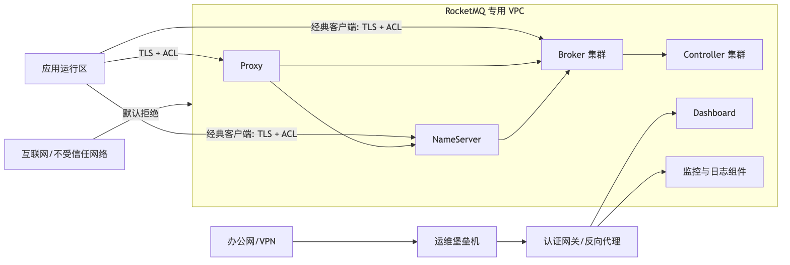
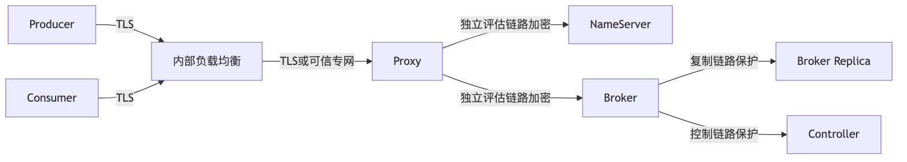
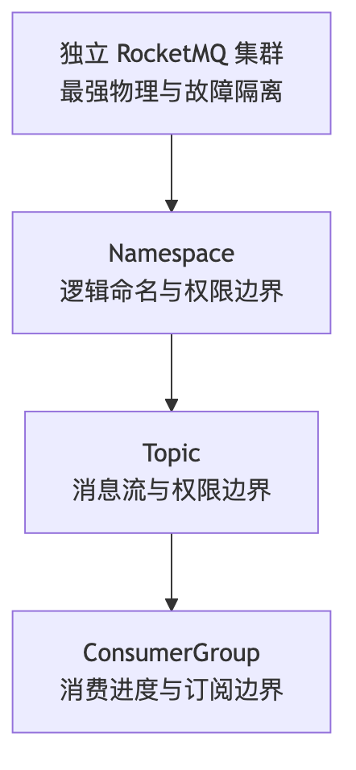
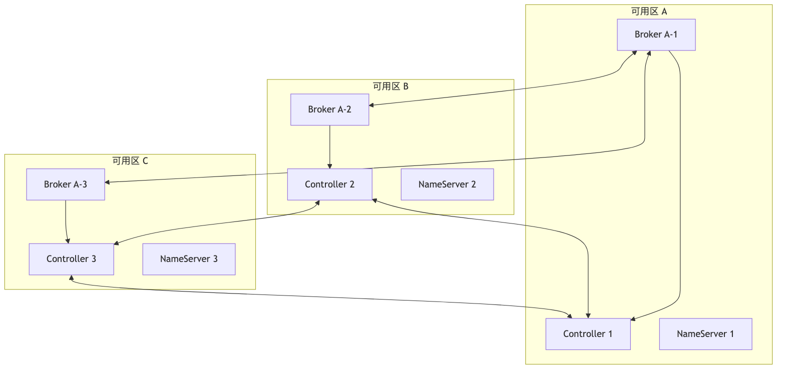
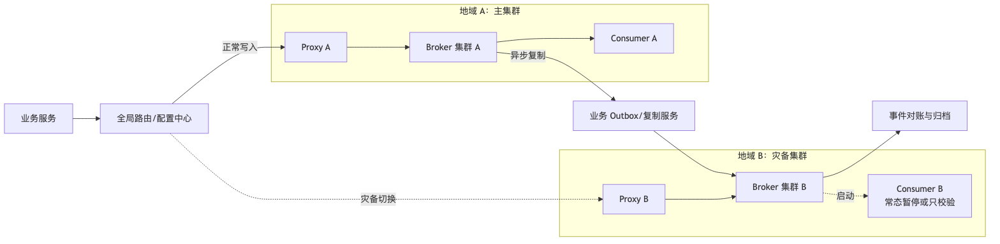
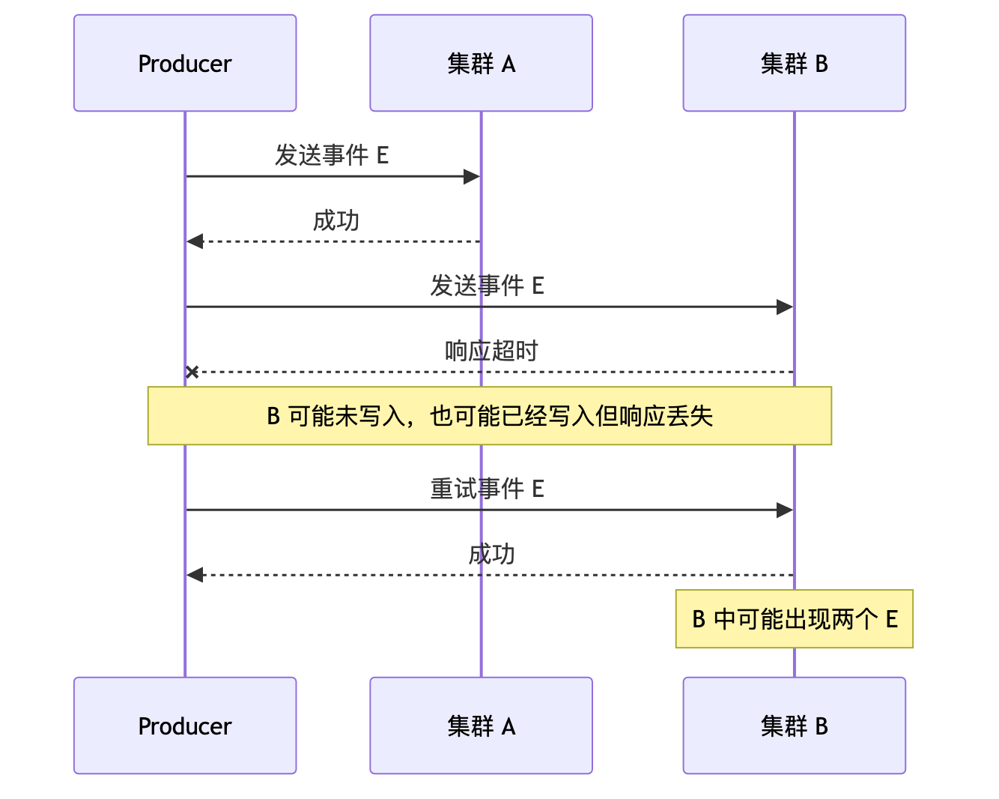

# 第 16 章：RocketMQ 安全、ACL、TLS、多租户隔离与跨集群灾备

> **版本基线**
>
> 截至 2026 年 6 月 20 日，Apache RocketMQ 最新稳定服务端版本为 **5.5.0**，发布于 2026 年 4 月 10 日。ACL 2.0 自 5.3.0 引入，ACL 1.0 已从 5.3.3 起移除，因此新建或升级到当前版本的集群，应直接按 ACL 2.0 设计。([GitHub][1])

## 本章去重边界与跳转

本章是安全、多租户隔离和跨集群灾备主讲章节。基础 HA、资源治理和运维监控不在这里重复铺开，只保留安全与灾备视角下的差异。

| 重复主题 | 本章处理方式 |
| --- | --- |
| Topic、Group、Tag、Key 和资源配额 | 本章只讲权限和隔离；资源治理看 [第 12 章：Topic、Tag、Key、SQL92、MessageQueue 与资源治理](/blog/tech/RocketMQ/12.Topic、Tag、Key、SQL92、MessageQueue与资源治理)。 |
| 主从复制、Controller、RPO/RTO 和故障切换 | 本章讲灾备侧取舍；单集群 HA 机制看 [第 13 章：高可用](/blog/tech/RocketMQ/13.RocketMQ高可用)。 |
| 监控、告警、Runbook 和演练复盘 | 本章只给安全灾备检查点；排障体系看 [第 15 章：可观测性与 Runbook](/blog/tech/RocketMQ/15.RocketMQ可观测性、故障诊断、应急处理与生产Runbook)。 |
| 双写、回放、补偿和业务一致性 | 本章讲灾备风险；业务系统设计看 [第 19 章：业务架构设计](/blog/tech/RocketMQ/19.RocketMQ业务架构设计、技术选型与复杂场景落地)。 |
| 5.x Controller、Proxy 和版本迁移 | 本章只关注安全与灾备影响；版本演进看 [第 17 章：4.x 到 5.x 架构演进](/blog/tech/RocketMQ/17.从RocketMQ4.x到5.x：Proxy、gRPC、POP、Controller与架构演进)。 |

## 16.1 学习目标

学完本章，你应能够：

1. 识别 NameServer、Broker、Proxy、Controller、Dashboard 和管理工具的攻击面。
2. 说明网络隔离、ACL、TLS 和业务数据加密分别解决什么问题。
3. 使用 ACL 2.0 为 Producer、Consumer 和管理员设计最小权限。
4. 区分 Namespace、Topic、Group 与独立集群所提供的隔离强度。
5. 根据 RPO、RTO 设计单集群多可用区和双集群灾备。
6. 解释为什么双写不是天然可靠的跨集群容灾方案。
7. 完成安全基线检查、灾备切换、回切和数据校验。

---

## 16.2 四个结论先行

### 16.2.1 开启 ACL 后能否直接暴露公网？

**不能。**

ACL 只是纵深防御中的一层。公网暴露还会带来端口扫描、暴力认证、凭据重放、版本漏洞利用、拒绝服务、流量攻击和配置错误等风险。生产环境应将 Broker、NameServer、Proxy、Controller 和 Dashboard 放在内网、VPC 或专用网络中，只允许明确的来源访问。

Apache RocketMQ 官方安全基线也明确指出：应启用 ACL 或将端口严格限制在受信任网络，而不是暴露到不受信任网络；Dashboard 等组件应绑定内网，公网运维需要额外叠加 VPN、网关鉴权或 WAF。([RocketMQ][2])

### 16.2.2 TLS 和 ACL 分别解决什么问题？

* **TLS**：保护传输链路的机密性和完整性，并可通过证书验证服务端或客户端身份。
* **ACL**：验证 RocketMQ 用户身份，并判断该用户能否对某个 Topic、Group、Namespace 或 Cluster 执行特定操作。

二者是互补关系：

> TLS 防止“路上被看见或篡改”，ACL 防止“没有权限的人执行操作”。

### 16.2.3 如何实现异地容灾？

推荐从**双集群主备**开始：

* 两个地域部署完全独立的 RocketMQ 集群。
* 业务默认只写主集群。
* 通过应用 Outbox、RocketMQ Connect 或经过验证的复制组件异步复制消息。
* 独立同步 Topic、Group、ACL、Schema 等元数据。
* 使用全局流量入口或配置中心切换生产者、消费者端点。
* 切换前执行旧主集群隔离，防止双主写入。
* 根据消息唯一业务 ID 对账、补发、去重和回切。

### 16.2.4 双写为什么不是天然可靠？

因为两个 RocketMQ 集群之间通常不存在一笔覆盖双方的原子事务：

* A 成功、B 失败；
* A 成功、B 超时但实际已写入；
* 重试造成 B 重复；
* 两边写入顺序不同；
* 一边集群不可达时业务不知道该继续还是失败；
* FIFO、事务消息、定时消息和消费进度很难自然保持一致。

因此，直接双写只是把问题从“是否丢消息”变成“部分成功、重复、乱序和对账”。

---

## 16.3 RocketMQ 的攻击面与威胁模型

安全设计不能只问“是否设置了密码”，而要先回答：

* 保护什么资产？
* 谁可能发起攻击？
* 攻击者能够到达哪些网络边界？
* 哪些操作会产生不可逆影响？
* 哪些控制措施可以降低概率或影响？

### 16.3.1 安全边界图

这张图体现了三个原则：

1. **数据面和管理面分离**：应用访问消息服务，管理员访问管理接口。
2. **公网默认不可达**：公网不能直接连接 RocketMQ 组件。
3. **纵深防御**：网络隔离、TLS、ACL、堡垒机、审计缺一不可。

### 16.3.2 威胁模型表

| 攻击面        | 关键资产                   | 典型威胁                 | 可能后果                | 主要控制措施                   |
| ---------- | ---------------------- | -------------------- | ------------------- | ------------------------ |
| NameServer | Broker 路由、集群拓扑         | 未授权查询、路由投毒、拒绝服务      | 拓扑泄露、客户端无法发现 Broker | VPC 隔离、来源白名单、TLS、升级与限流   |
| Broker     | 消息、Topic、Group、消费位点    | 未授权收发、删除资源、修改配置、流量耗尽 | 数据泄露、消息伪造、业务中断      | ACL 2.0、TLS、最小权限、磁盘与流量保护 |
| Proxy      | gRPC/Remoting 入口、客户端连接 | 凭据暴力尝试、超大请求、连接耗尽     | 入口过载、消息服务不可用        | 内部负载均衡、TLS、ACL、连接和请求限流   |
| Controller | 选主状态、Broker 元数据        | 伪造选主、破坏状态文件、节点接管     | 错误选主、切换能力失效、数据风险    | 独立网络区、三节点以上、主机加固、备份状态    |
| Dashboard  | Topic、Group、消息详情、管理功能  | 弱认证、会话劫持、越权操作        | 数据泄露、重置位点、删除或修改资源   | 内网绑定、SSO/MFA、反向代理、只读账号   |
| mqadmin    | 集群管理权限                 | 管理凭据泄露、命令误操作         | 批量删除或变更资源           | 堡垒机、审批、临时凭据、命令审计         |
| 日志与轨迹      | Key、属性、客户端地址、错误堆栈      | 日志平台越权、敏感字段泄露        | 用户隐私和凭据泄露           | 字段脱敏、日志访问控制、缩短保留期        |
| 消息体        | 订单、支付、个人信息             | Broker 磁盘泄露、运维越权读取   | 业务敏感数据泄露            | 业务侧字段加密、密钥托管、数据最小化       |

Dashboard 不只是“看图工具”，它可以管理 Topic、ConsumerGroup、Broker 配置，查询消息以及重置消费位点，因此应当按高权限管理系统保护，而不是当成普通监控页面。([RocketMQ][3])

---

## 16.4 网络隔离是第一道防线

### 16.4.1 推荐的网络分区

生产环境至少划分以下三个区域：

#### 16.4.1.1 应用区

部署 Producer 和 Consumer，只能访问必要的 Proxy、NameServer 或 Broker 业务端点。

#### 16.4.1.2 中间件区

部署 NameServer、Broker、Proxy 和 Controller。组件之间按照最小通信矩阵放行，禁止来自办公终端或互联网的任意访问。

#### 16.4.1.3 运维区

部署堡垒机、运维代理和监控采集器。Dashboard、mqadmin 和管理端口只能从该区域访问。

| 来源       | 目标                   | 是否允许 | 说明                |
| -------- | -------------------- | ---: | ----------------- |
| 互联网      | 任意 RocketMQ 组件       |    否 | 不建立直接公网暴露         |
| 应用区      | Proxy                |    是 | 5.x gRPC 客户端常用入口  |
| 应用区      | NameServer/Broker    |   按需 | 经典 Remoting 客户端使用 |
| 应用区      | Dashboard/Controller |    否 | 应用无管理需求           |
| 运维区      | Dashboard            |    是 | 经过 VPN、堡垒机、SSO    |
| 运维区      | Broker 管理接口          |    是 | 限定管理员和审批流程        |
| Broker 区 | Controller           |    是 | 只允许 Broker 节点访问   |
| 测试环境     | 生产环境                 |    否 | 防止测试凭据或程序误连生产     |

### 16.4.2 防火墙不是只控制入站

还应控制组件的出站访问：

* Broker 通常不应任意访问互联网。
* Dashboard 不应访问未经批准的外部地址。
* 运维脚本下载依赖应经过制品仓库。
* 日志采集只能发送到指定日志平台。
* DNS 解析和时间同步服务也应限定来源。

这可以降低主机被入侵后横向移动、下载恶意载荷和数据外传的风险。

---

## 16.5 ACL 1.0 与 ACL 2.0

### 16.5.1 当前版本应使用 ACL 2.0

| 对比项   | ACL 1.0     | ACL 2.0           |
| ----- | ----------- | ----------------- |
| 引入版本  | 4.4.0       | 5.3.0             |
| 当前状态  | 5.3.3 起移除   | 当前主线              |
| 用户与权限 | 配置耦合较重      | 用户认证和权限策略分离       |
| 权限模型  | 相对粗粒度       | 主体、资源、操作、环境、决策    |
| 管理操作  | 覆盖有限        | 支持更细的资源管理权限       |
| IP 控制 | 存在全局白名单等旧机制 | 可按策略限制来源地址        |
| 迁移    | 旧配置         | 可通过迁移开关迁入 ACL 2.0 |
| 新系统选择 | 不应再采用       | 推荐                |

官方说明表明，5.3.3 已删除 ACL 1.0 相关能力。迁移时，ACL 1.0 的用户和权限可写入 ACL 2.0，但旧版 IP 白名单不会自动迁移，已有 ACL 2.0 配置也不会被覆盖。([RocketMQ][2])

### 16.5.2 Authentication 与 Authorization

#### 16.5.2.1 Authentication：认证

回答：

> “你是谁？”

例如，客户端携带用户名、访问密钥或签名信息，服务端验证其真实性。

认证失败，说明服务端不能确认请求主体。

#### 16.5.2.2 Authorization：授权

回答：

> “你能做什么？”

即使用户认证成功，也不表示可以访问所有 Topic 或执行管理操作。

例如：

* `order-producer` 可以向订单 Topic 发布消息。
* `inventory-consumer` 可以订阅订单 Topic，并使用自己的 ConsumerGroup。
* `monitor-reader` 只能查询集群状态。
* `platform-admin` 才能创建、修改或删除 Topic。

### 16.5.3 ACL 2.0 权限模型

ACL 2.0 可以抽象为：

[
决策 = f(主体, 资源, 操作, 环境, 策略)
]

主要资源包括：

* `Cluster`
* `Namespace`
* `Topic`
* `Group`

主要操作包括：

* `Pub`：发布消息
* `Sub`：订阅消息
* `Create`
* `Update`
* `Delete`
* `Get`
* `List`
* `All`

拒绝策略的优先级高于允许策略，精确资源的优先级高于通配资源。([RocketMQ][4])

#### 16.5.3.1 推荐权限矩阵

| 身份          | Topic 权限                        | Group 权限                        | 集群管理权限     |
| ----------- | ------------------------------- | ------------------------------- | ---------- |
| 订单 Producer | `OrderEvent: Pub`               | 无                               | 无          |
| 库存 Consumer | `OrderEvent: Sub`               | `InventoryGroup: Sub`           | 无          |
| 只读监控        | 必要的 `Get/List`                  | 必要的 `Get/List`                  | `Get/List` |
| Topic 管理员   | `Create/Update/Delete/Get/List` | 无                               | 必要查询权限     |
| Group 管理员   | 无                               | `Create/Update/Delete/Get/List` | 必要查询权限     |
| 平台超级管理员     | 全部，但仅临时启用                       | 全部                              | 全部         |

消费者通常不仅需要 Topic 的订阅权限，还需要对应 ConsumerGroup 的权限。为消费者授予 `Topic:*` 或 `Group:*` 会扩大越权读取和资源滥用的范围。

### 16.5.4 ACL 2.0 配置注意事项

在当前 5.x 中，不能只看到旧资料里的 `aclEnable` 就认为认证和授权已经生效。应明确检查：

* 认证开关是否启用；
* 授权开关是否启用；
* Authentication Metadata Provider 是否配置；
* Authorization Metadata Provider 是否配置；
* Proxy、Broker 和内部客户端凭据是否一致；
* 新 Broker 扩容后，用户与权限数据是否同步；
* 认证失败和授权拒绝指标是否被监控。

当前官方 ACL 2.0 最佳实践给出了认证、授权 Provider、内部组件凭据、迁移和扩容时复制用户及策略的完整配置要求。([RocketMQ][4])

---

## 16.6 TLS：保护链路，不替代授权

### 16.6.1 TLS 解决什么问题

TLS 主要提供：

1. **机密性**：防止网络中间人直接看到消息体和凭据。
2. **完整性**：防止传输内容被无感篡改。
3. **服务端认证**：客户端可验证连接的是合法服务端。
4. **可选客户端证书认证**：采用双向 TLS 时，服务端也验证客户端证书。

TLS 不负责判断：

* 该用户是否可以向某个 Topic 发消息；
* 是否可以读取某个 ConsumerGroup；
* 是否可以删除 Topic；
* 是否可以重置消费位点。

这些属于 ACL 的职责。

### 16.6.2 TLS 应部署在哪些位置

不能因为在负载均衡器终止了 TLS，就默认内部链路也获得保护。必须逐段检查：

* 客户端到 Proxy；
* 经典客户端到 NameServer；
* 经典客户端到 Broker；
* Proxy 到 Broker；
* Broker 复制链路；
* Broker 到 Controller；
* Dashboard 到浏览器及反向代理。

Proxy 支持 `disabled`、`permissive` 和 `enforcing` 等 TLS 模式。迁移阶段可短暂允许兼容模式，生产稳定后应尽量拒绝非 TLS 连接。([GitHub][5])

### 16.6.3 证书管理

生产证书应由企业 PKI 或受控 CA 签发，并建立：

* 证书用途和责任人清单；
* 域名或地址的 SAN 校验；
* 到期前告警；
* 私钥文件最小权限；
* 双证书或滚动方式轮换；
* CA 变更演练；
* 证书吊销和主机失陷处置流程。

不要把私钥打进镜像、代码仓库或普通配置中心。

---

## 16.7 凭据、管理面与敏感数据保护

### 16.7.1 凭据生命周期

每个应用使用独立身份，禁止多个系统共享同一组管理员凭据。

推荐流程：

1. 在密钥管理系统中创建应用凭据。
2. 只授权应用需要的 Topic 和 Group。
3. 通过工作负载身份或受控 Secret 挂载。
4. 日志不得输出完整密钥。
5. 轮换时先创建新身份或新凭据。
6. 灰度更新客户端。
7. 确认旧凭据无流量后吊销。
8. 审计轮换期间的认证失败和异常请求。

凭据一旦泄露，不能只修改应用配置，还应立即：

* 吊销原身份；
* 查询该身份访问过的 Topic 和管理接口；
* 检查异常消息发送、订阅和配置变更；
* 评估日志或消息内容是否泄露；
* 轮换可能被间接暴露的关联凭据。

### 16.7.2 管理员与应用权限分离

应用账号不得具有以下能力：

* 创建或删除 Topic；
* 修改 Broker 配置；
* 重置其他 ConsumerGroup 的位点；
* 查询任意消息体；
* 创建新 ACL 用户；
* 修改 Controller 或集群配置。

管理员也不应长期使用超级账号。高危操作应采用：

* 临时权限；
* 工单审批；
* MFA；
* 堡垒机；
* 命令录屏；
* 双人复核；
* 变更后自动回收权限。

### 16.7.3 Dashboard 与 mqadmin

Dashboard 应：

* 仅监听内网地址；
* 经反向代理接入企业 SSO；
* 对管理动作启用 MFA；
* 区分只读和变更账号；
* 限制消息体查询权限；
* 记录登录、查询和变更审计。

`mqadmin` 应只在受控运维主机运行。其凭据文件必须限制读取权限，禁止复制到个人电脑、聊天工具或工单正文。

官方安全文档指出，Dashboard 及部分可观测组件默认不具备足够的强认证保护，应绑定内网，并在网关层增加访问控制。([RocketMQ][2])

### 16.7.4 日志、轨迹和消息体

以下内容不应以明文进入日志、Tag、Key 或 Properties：

* AccessKey、SecretKey、Token；
* 身份证号、银行卡号、手机号；
* 完整支付信息；
* 密码和验证码；
* 私钥或加密材料；
* 完整医疗或人事数据。

消息 Key 和 Properties 经常用于查询、轨迹和排障，不能认为“没有放在 Body 里就更安全”。

对敏感消息可采用**信封加密**：

1. 业务生成数据密钥 DEK。
2. 使用 DEK 加密敏感字段或整个消息体。
3. 使用 KMS 主密钥加密 DEK。
4. 消息中保存密文、加密后的 DEK 和 Key ID。
5. 只有授权消费者能够向 KMS 解密。

TLS 只保护传输中的数据，不能阻止拥有磁盘、备份或日志权限的人读取明文消息。因此，官方也建议对敏感消息在业务侧执行字段级或整体加密。([RocketMQ][2])

---

## 16.8 多租户隔离

### 16.8.1 四级隔离模型

| 隔离层级          | 能隔离什么          | 不能隔离什么         | 适用场景           |
| ------------- | -------------- | -------------- | -------------- |
| Namespace     | 名称、ACL 策略、资源归属 | CPU、磁盘、线程池、故障域 | 同一平台下的逻辑租户     |
| Topic         | 消息流、发布订阅权限     | Broker 资源和集群故障 | 同租户不同业务事件      |
| ConsumerGroup | 消费位点、重试和负载均衡   | 消息存储和生产流量      | 不同消费应用         |
| 独立集群          | 容量、故障、权限、变更窗口  | 跨集群运维成本        | 核心租户、强合规、强 SLA |

ACL 2.0 支持 Cluster、Namespace、Topic 和 Group 资源级权限，但这并不意味着 Namespace 自动提供物理资源隔离。([RocketMQ][4])

### 16.8.2 Namespace 不是完整的租户系统

Namespace 更接近逻辑命名和权限边界。多个 Namespace 仍可能共享：

* Broker 磁盘；
* CommitLog；
* 网络带宽；
* 请求线程池；
* Page Cache；
* Proxy 连接资源；
* Controller 和 NameServer；
* 同一个故障域。

因此，对于支付、核心订单、普通通知和不可信外部租户，不应仅靠名称前缀混合部署。

### 16.8.3 噪声邻居问题

一个租户可能通过以下方式影响其他租户：

* 突发大量发送导致磁盘和网络饱和；
* 消费停滞造成长期积压；
* 创建过多 Topic 和队列；
* 大消息增加网络、堆外内存和磁盘压力；
* 高频查询消息或重置位点；
* 大量连接耗尽 Proxy 或 Broker 资源；
* 失败重试形成流量放大。

治理措施包括：

* 按租户限定 TPS、并发连接和消息大小；
* 控制 Topic、Queue、Group 数量；
* 设置积压量和磁盘水位告警；
* 在 Proxy、网关或应用侧实施限流；
* 对超大租户单独扩容或迁移集群；
* 对核心租户预留容量；
* 禁止租户自行创建无限资源。

Apache RocketMQ 开源版提供基础认证、授权和集群能力，但完整的租户计量、配额售卖、自动限流和 SLA 管理通常需要外围平台自行建设。云厂商托管产品可能提供更完整的实例规格、配额、审计和租户控制，但必须按具体产品文档确认。

### 16.8.4 环境隔离

测试、预发和生产至少应做到：

* 不同集群；
* 不同 VPC 或网络段；
* 不同账号和 ACL 身份；
* 不同证书；
* 不同 Dashboard；
* 不同日志索引；
* 不同配置中心路径；
* 不共享管理超级账号。

仅在 Topic 名称中增加 `test_`、`prod_` 前缀，不构成可靠环境隔离。

---

## 16.9 备份、恢复与历史消息回放

### 16.9.1 三类需要保护的数据

#### 16.9.1.1 元数据

包括：

* Topic 和队列配置；
* ConsumerGroup 配置；
* ACL 用户和策略；
* Broker、Proxy、Controller 配置；
* TLS 证书清单；
* 部署版本、启动参数和资源规格；
* Controller 状态目录。

Controller 是有状态组件，其状态目录用于故障恢复，不应随意删除；生产环境通常应部署三个或更多 Controller 副本，以满足多数派容错。([RocketMQ][6])

#### 16.9.1.2 消息存储

Broker 本地存储包括 CommitLog、ConsumeQueue、Index 等数据。不能简单地在 Broker 持续写入时复制部分文件，然后把该副本当成可靠备份。

更稳妥的方式是：

* 使用经过验证的一致性存储快照；
* 对隔离副本进行快照；
* 在受控停写窗口备份；
* 定期做实际恢复验证；
* 将备份保存到与生产权限域不同的位置；
* 对备份启用不可变保留和删除保护。

#### 16.9.1.3 业务事件档案

对于审计、财务或必须长期回放的事件，不应只依赖 RocketMQ 在线保留期。可将标准化业务事件归档到不可变对象存储，并保存：

* 事件唯一 ID；
* 事件类型与版本；
* 业务时间；
* 原始 Topic；
* 分区或队列信息；
* 校验和；
* 加密 Key ID。

### 16.9.2 历史消息回放

RocketMQ 支持按时间或 Offset 进行消息追溯，Dashboard 也提供消费位点重置能力。([GitHub][7])

回放时推荐：

1. 明确回放时间范围。
2. 创建专用回放 ConsumerGroup。
3. 对历史事件执行幂等校验。
4. 禁止重复发短信、扣款等不可逆副作用。
5. 控制回放速率，防止压垮下游。
6. 记录成功、跳过和失败事件。
7. 对失败事件单独补偿。
8. 回放后核对业务数据，而不只核对消费位点。

**副本不是备份，保留期也不是备份。**
主从副本会复制误删除或恶意写入；在线保留数据也可能因磁盘压力、清理策略或权限失陷而不可用。

---

## 16.10 单集群多可用区

单集群多可用区主要解决：

* 单机故障；
* Broker 进程故障；
* 单个机架或可用区故障；
* Master 自动切换。

Controller 提供自动主从切换。官方建议需要容错时部署三个或更多 Controller 副本；`enableElectUncleanMaster=false` 可以避免从数据明显落后的副本中强行选主。同步副本数量和 ACK 策略会直接影响 RPO、可用性与写入延迟。([RocketMQ][6])

单集群多可用区仍不能完全解决：

* 整个地域故障；
* 全局网络中断；
* 集群级错误配置；
* 管理员误删除；
* 凭据泄露后的批量破坏；
* 勒索软件或供应链攻击；
* 软件缺陷影响全部 Broker。

---

## 16.11 双集群与异地灾备

### 16.11.1 RPO 与 RTO

#### 16.11.1.1 RPO：恢复点目标

允许丢失多少时间范围内的数据。

例如：

* RPO = 0：理论上不允许丢失已确认数据。
* RPO ≤ 30 秒：最多接受最近 30 秒未同步数据丢失。
* RPO ≤ 5 分钟：适合低重要性通知类业务。

#### 16.11.1.2 RTO：恢复时间目标

从故障发生到恢复业务服务，允许持续多长时间。

RPO 越低、RTO 越短，系统成本和复杂度通常越高。

### 16.11.2 主备双集群拓扑

推荐的主备方式：

1. 正常时期只有主集群接受业务写入。
2. 灾备集群持续接收复制数据。
3. 灾备消费者暂停、影子消费或只做校验。
4. 主集群故障后，先隔离旧主，再切换端点。
5. 灾备集群提升为新主。
6. 根据复制水位确定实际 RPO。
7. 对丢失或重复事件执行补偿。

### 16.11.3 单集群多可用区与双集群对比

| 维度    | 单集群多可用区     | 双集群异地灾备    |
| ----- | ----------- | ---------- |
| 故障范围  | 节点、机架、可用区   | 地域、集群级故障   |
| 路由    | 同一逻辑集群      | 需要切换客户端端点  |
| 数据复制  | Broker 副本复制 | 跨集群复制或应用复制 |
| 消费位点  | 集群内部维护      | 需单独同步或重建   |
| 运维复杂度 | 中           | 高          |
| 成本    | 中           | 高          |
| RPO   | 可做到较低       | 取决于跨地域复制延迟 |
| RTO   | 自动或较短       | 通常需编排和校验   |
| 防误删除  | 较弱          | 若同步删除仍然较弱  |
| 地域级灾害 | 无法完整覆盖      | 可以覆盖       |

---

## 16.12 同城双活与异地灾备

### 16.12.1 同城双活

“双活”不能只理解为两个集群都启动。

真正的双活需要处理：

* 两边是否都接受写入；
* 同一个业务 Key 由谁负责；
* 跨集群消息如何排序；
* 消费者是否会重复处理；
* 发生网络分区时是否出现双主；
* 恢复后如何合并差异。

更可控的模式是**按业务 Key 或租户划分单写归属**：

* 租户 A 只写集群 A；
* 租户 B 只写集群 B；
* 每个订单或账户始终只有一个主写地域；
* 另一侧保存副本；
* 故障后通过显式接管改变归属。

这样可以做到整体双活，但避免同一条逻辑消息流被两个集群同时写入。

### 16.12.2 异地灾备

跨地域延迟较高，通常更适合：

* 主备模式；
* 异步复制；
* 明确接受非零 RPO；
* 人工确认或半自动切换；
* 业务级对账和补偿。

对于金融扣款等极高一致性业务，不应把 RocketMQ 跨集群复制当成数据库分布式事务。真正的资金状态应由账务数据库或专门的一致性系统确定，消息用于传播状态变化。

---

## 16.13 Apache 开源版的跨集群能力边界

必须区分三类能力。

### 16.13.1 Controller

Controller 解决的是**一个 RocketMQ 逻辑集群内部**的 Broker 选主和自动切换，并不是跨地域双集群复制服务。([RocketMQ][6])

### 16.13.2 RocketMQ Connect

RocketMQ Connect 是独立的数据集成系统，通过 SourceConnector、SinkConnector 和 Task 在 RocketMQ 与其他系统之间复制数据。它可用于构建数据管道，也可以评估相关连接器实现 RocketMQ 间消息传输。([RocketMQ][8])

但根据其公开定位，不能直接推导出它天然提供以下能力：

* 两个集群之间的同步强一致复制；
* 全局统一 Offset；
* FIFO 语义无损迁移；
* 事务消息内部状态完全复制；
* 定时消息状态完全复制；
* RetryTopic、DLQ 和 POP 状态自动一致；
* 自动故障检测和全局流量切换；
* 双主冲突解决；
* 一键无损回切。

这是根据开源组件职责做出的架构判断：Connect 可以成为复制链路的一部分，但生产级跨集群灾备仍需要补充元数据同步、监控、幂等、对账、切换和回切系统。

### 16.13.3 云厂商托管能力

部分云产品可能提供：

* 跨地域复制；
* 全球接入点；
* 托管备份；
* KMS 集成；
* 自动故障切换；
* 跨地域消费；
* 实例级配额和审计；
* SLA 与技术支持。

这些能力属于具体托管产品，不能写成 Apache RocketMQ 开源版默认具备的能力。

---

## 16.14 双写为什么不是天然可靠

假设 Producer 依次写集群 A 和集群 B：

| A 写入结果  | B 写入结果  | 业务看到的情况 | 风险          |
| ------- | ------- | ------- | ----------- |
| 成功      | 成功      | 表面正常    | 两边顺序仍可能不同   |
| 成功      | 失败      | 部分成功    | B 缺消息       |
| 失败      | 成功      | 部分成功    | A 缺消息       |
| 成功      | 超时但实际成功 | 状态不确定   | 重试后 B 重复    |
| 超时但实际成功 | 成功      | 状态不确定   | 重试后 A 重复    |
| 成功      | 长时间阻塞   | 请求延迟升高  | 一个灾备集群拖垮主流程 |
| A、B 均成功 | 消费顺序不同  | 数据都存在   | 业务结果仍可能分歧   |

更可靠的方案是：

1. 业务事务写入数据库。
2. 同一数据库事务写入 Outbox。
3. 发布器从 Outbox 投递到主集群。
4. 复制服务异步同步到灾备集群。
5. 每条事件携带全局唯一 `event_id`。
6. 目标集群消费者执行幂等处理。
7. 复制进度、缺口和重复率可监控、可重放。

这仍然通常是“至少一次复制”，但它把不确定状态变成了可持久化、可重试、可审计的状态。

---

## 16.15 灾备切换与回切

### 16.15.1 切换流程

1. 确认主集群是否真正不可恢复。
2. 停止或隔离旧主写入口。
3. 获取复制服务最后成功水位。
4. 计算实际 RPO。
5. 检查灾备集群 Topic、Group、ACL 和容量。
6. 切换 Producer 端点。
7. 启动灾备消费者。
8. 观察发送失败率、积压和重复率。
9. 补发未复制事件。
10. 对关键业务执行数据校验。

最重要的一步是**隔离旧主**。旧主没有被隔离就启动灾备写入，容易形成 Split Brain。

### 16.15.2 回切流程

回切不是把域名改回去，而是一次新的迁移：

1. 将原主集群修复为干净、可信状态。
2. 比较两个集群的 Topic 和 ACL 元数据。
3. 以当前主集群为真实数据源建立反向复制。
4. 按 `event_id` 比较消息缺口。
5. 补齐缺失事件并过滤重复事件。
6. 校验 FIFO 业务的业务序列号。
7. 校验数据库最终状态。
8. 暂停或限速写入。
9. 隔离当前主集群写入口。
10. 切换到原主集群。
11. 恢复消费者并观察。
12. 保留回切证据和复盘记录。

不要直接用两个集群的消息数量判断一致性。数量相同，内容可能不同；数量不同，也可能只是保留期、重复消息或清理进度不同。

---

## 16.16 安全与灾备演练

### 16.16.1 勒索或主机入侵

演练步骤：

* 隔离受影响 Broker 和运维账号；
* 吊销管理、应用和内部组件凭据；
* 保留磁盘与日志证据；
* 从可信镜像重建新集群；
* 恢复 Topic、Group、ACL 等元数据；
* 从不可变归档回放关键事件；
* 校验消息和业务数据库；
* 禁止直接将可疑节点重新加入集群。

### 16.16.2 误删除 Topic 或 ConsumerGroup

应验证：

* 基础设施即代码能否恢复资源；
* ACL 策略是否可以恢复；
* 消息数据是否仍在保留期内；
* 新 Group 能否从指定时间回放；
* 消费幂等是否有效；
* 删除操作是否留下完整审计。

### 16.16.3 凭据泄露

应验证：

* 能否在分钟级吊销身份；
* 新凭据能否滚动发布；
* 认证失败是否触发告警；
* 能否定位泄露身份访问过的资源；
* 是否存在伪造消息、越权订阅或管理操作；
* 是否能对受影响数据进行范围评估。

### 16.16.4 整个集群不可用

应记录：

* 故障发现时间；
* 决策切换时间；
* 旧主隔离时间；
* 新主恢复写入时间；
* 新主恢复消费时间；
* 实际 RPO；
* 实际 RTO；
* 未复制事件数量；
* 重复事件数量；
* 人工步骤和失败步骤。

---

## 16.17 安全基线检查表

### 16.17.1 网络与主机

* [ ] Broker、NameServer、Proxy、Controller、Dashboard 均未直接暴露公网。
* [ ] 应用区、运维区和中间件区已分段。
* [ ] 安全组采用来源白名单，而不是全网开放。
* [ ] Broker 和 Controller 使用独立低权限操作系统账号。
* [ ] 非必要服务、端口和出站访问已关闭。
* [ ] 操作系统和 RocketMQ 版本处于受支持状态。

### 16.17.2 认证与授权

* [ ] 当前 5.x 集群使用 ACL 2.0。
* [ ] Authentication 与 Authorization 均已实际启用。
* [ ] 每个应用使用独立身份。
* [ ] Producer 只拥有必要 Topic 的 `Pub` 权限。
* [ ] Consumer 只拥有必要 Topic 和 Group 的 `Sub` 权限。
* [ ] 应用账号没有资源管理权限。
* [ ] 管理员使用临时权限和 MFA。
* [ ] 认证失败、授权拒绝和 ACL 变更已告警。

### 16.17.3 TLS 与数据

* [ ] 外部客户端链路强制使用 TLS。
* [ ] 内部链路已逐段评估，未误认为入口 TLS 等于端到端 TLS。
* [ ] 证书到期、轮换和吊销流程已演练。
* [ ] 私钥不在镜像和代码仓库中。
* [ ] 敏感消息字段已加密或脱敏。
* [ ] Key、Tag、Properties 和轨迹中无敏感明文。
* [ ] 日志平台具有访问控制和保留期限。

### 16.17.4 管理面

* [ ] Dashboard 只在内网访问。
* [ ] Dashboard 接入 SSO/MFA 或受控网关。
* [ ] mqadmin 仅在堡垒机运行。
* [ ] 高危命令需要审批和双人复核。
* [ ] Topic 删除、位点重置和 ACL 修改均有审计。

---

## 16.18 灾备演练清单

* [ ] RPO、RTO 已由业务负责人确认。
* [ ] 主集群和灾备集群不存在隐藏的共享单点。
* [ ] Topic、Group、ACL 和客户端配置有自动同步或恢复流程。
* [ ] 跨集群复制延迟有监控。
* [ ] 每条关键事件有全局唯一 ID。
* [ ] 消费者已实现幂等。
* [ ] 旧主隔离步骤已经自动化。
* [ ] 全局路由或端点切换已经演练。
* [ ] 灾备集群容量能够承担完整生产流量。
* [ ] FIFO、事务、定时、重试和死信消息分别验证。
* [ ] 历史消息回放不会触发重复扣款等副作用。
* [ ] 备份存放在独立权限域并具备不可变性。
* [ ] 已完成从备份重建全新集群的演练。
* [ ] 回切时能够执行双向数据对账。
* [ ] 每次演练记录实际 RPO、RTO 和改进项。

---

## 16.19 资深面试题

> **题目去重**：本节作为本章安全灾备自测，只保留 ACL、TLS、多租户隔离、跨集群灾备、RPO/RTO 和回放题。跨章重复题、完整追问链和模拟面试统一跳转到 [第 20 章：资深面试题库、追问链与模拟面试](/blog/tech/RocketMQ/20.RocketMQ资深面试题库、追问链与模拟面试)。

### 1. 开启 ACL 后可以把 Broker 暴露到公网吗？

**标准回答：** 不可以。ACL 只解决身份和权限问题，不能消除漏洞利用、暴力认证、拒绝服务及配置错误风险，仍应使用 VPC、专网和防火墙。
**追问：** 公网运维怎么办？
**易错点：** 把“有密码”理解为“可以安全公网开放”。

### 2. TLS 和 ACL 有什么区别？

**标准回答：** TLS 保护通信机密性、完整性和证书身份；ACL 判断 RocketMQ 用户能否访问具体资源。
**追问：** 开启 TLS 后还需要 ACL 吗？
**易错点：** 认为 TLS 会自动限制 Topic 权限。

### 3. Authentication 和 Authorization 有什么区别？

**标准回答：** Authentication 判断主体是谁，Authorization 判断主体能做什么。
**追问：** 认证成功但发送被拒绝说明什么？
**易错点：** 把认证失败和授权失败混为一谈。

### 4. ACL 1.0 与 ACL 2.0 的关键区别是什么？

**标准回答：** ACL 2.0 分离用户和权限策略，提供更标准的主体、资源、操作、环境和决策模型；ACL 1.0 已从 5.3.3 起移除。
**追问：** 旧 IP 白名单能否自动迁移？
**易错点：** 在当前版本继续设计 ACL 1.0。

### 5. Producer 的最小权限应该怎样配置？

**标准回答：** 只授予目标 Topic 的 `Pub` 权限，不授予 `Sub` 和资源管理权限。
**追问：** 一个应用生产多个 Topic 怎么办？
**易错点：** 直接授予 `Topic:*`。

### 6. Consumer 为什么可能同时需要 Topic 和 Group 权限？

**标准回答：** Topic 表示订阅的数据资源，Group 表示消费身份和进度资源，两者都应受约束。
**追问：** 多个应用能否共用 Group？
**易错点：** 只配置 Topic 权限。

### 7. Dashboard 为什么属于高风险组件？

**标准回答：** 它可查看消息和拓扑，并执行 Topic、Group、Broker 和位点管理操作。
**追问：** 如何实现只读访问？
**易错点：** 把 Dashboard 当作普通监控大屏。

### 8. Namespace 能否提供强租户隔离？

**标准回答：** 它主要提供逻辑命名和权限边界，不隔离 Broker 磁盘、线程池和故障域。
**追问：** 哪些租户应使用独立集群？
**易错点：** 认为 Namespace 等于独立实例。

### 9. 什么是噪声邻居问题？

**标准回答：** 某租户的大流量、积压、大消息或过多连接抢占共享资源，影响其他租户。
**追问：** 应从哪些维度限流？
**易错点：** 只限制 Producer TPS，不限制积压和连接。

### 10. 单集群多可用区和双集群灾备有什么区别？

**标准回答：** 前者处理节点和可用区故障，后者处理地域或整个集群故障。
**追问：** 单集群多可用区能否防误删除？
**易错点：** 把副本复制等同于异地备份。

### 11. Controller 在容灾中解决什么问题？

**标准回答：** Controller 在一个逻辑集群内部维护 Broker 选主和主从自动切换。
**追问：** 为什么通常部署三个 Controller？
**易错点：** 认为 Controller 会自动完成跨地域双集群切换。

### 12. RPO 与 RTO 分别是什么？

**标准回答：** RPO 是允许丢失的数据时间窗口，RTO 是允许的恢复时长。
**追问：** 如何测量真实 RPO？
**易错点：** 只在文档中写目标，不通过演练验证。

### 13. 如何实现 RocketMQ 异地容灾？

**标准回答：** 部署独立双集群，异步复制消息和元数据，建立全局路由、旧主隔离、幂等、对账、补发及回切流程。
**追问：** 消费位点如何处理？
**易错点：** 只复制消息，不同步或重建消费状态。

### 14. 为什么直接双写两个集群不可靠？

**标准回答：** 两次写入没有共同原子事务，会产生部分成功、超时不确定、重复、乱序和结果分歧。
**追问：** 如何改进？
**易错点：** 认为两次都返回成功就不存在顺序和一致性问题。

### 15. RocketMQ Connect 是否等于开箱即用的跨集群灾备？

**标准回答：** 不是。Connect 是数据集成框架，可以参与复制链路，但灾备还需处理元数据、位点、语义、切换和对账。
**追问：** 哪些消息类型要专项验证？
**易错点：** 把数据搬运能力等同于透明灾备。

### 16. 历史回放需要注意什么？

**标准回答：** 使用独立 Group、限定时间范围、控制速率、保证幂等并屏蔽不可逆副作用。
**追问：** 为什么不能只重置生产 Group？
**易错点：** 回放时重复扣款、发送通知或修改库存。

### 17. 灾备切换为什么必须先隔离旧主？

**标准回答：** 防止旧主恢复后与灾备集群同时接受写入，形成双主和数据分叉。
**追问：** 旧主完全失联时如何隔离？
**易错点：** 先改域名，再考虑旧主是否仍可写。

### 18. 为什么回切通常比切换更复杂？

**标准回答：** 回切前必须把故障期间的新数据复制回原集群，并处理缺失、重复、乱序和元数据差异。
**追问：** 对账应以什么为主键？
**易错点：** 只比较消息数量后直接回切。

---

## 16.20 本章总结

RocketMQ 的生产安全不是一个 `aclEnable` 开关，而是一套完整的防御体系：

> 网络隔离是边界，TLS 保护链路，ACL 控制身份和权限，业务加密保护数据，审计和演练验证控制是否真正有效。

多租户方面，Namespace、Topic 和 Group 主要提供逻辑隔离；对于强合规、强 SLA 或高流量租户，独立集群才是更可靠的故障和资源边界。

容灾方面，必须区分：

* Controller 支持的单集群主从自动切换；
* 跨可用区部署；
* 双集群主备；
* 应用级双活；
* 消息备份与长期事件归档。

异地容灾不是“多搭一个集群，然后双写”这么简单。真正可用的方案必须同时具备复制水位、幂等、元数据同步、旧主隔离、全局路由、数据对账、补发和回切能力。

---

## 16.21 官方资料与来源

* Apache RocketMQ 5.5.0 Release Notes。([GitHub][1])
* Apache RocketMQ 官方安全模型与部署基线。([RocketMQ][2])
* Apache RocketMQ ACL 2.0 最佳实践。([RocketMQ][4])
* RIP-68：RocketMQ ACL 2.0 设计。([GitHub][9])
* RIP-77：移除 ACL 1.0 与迁移方案。([GitHub][10])
* Apache RocketMQ TLS 配置说明。([GitHub][5])
* Apache RocketMQ Controller 主从自动切换文档。([RocketMQ][6])
* Apache RocketMQ Dashboard 文档。([RocketMQ][3])
* Apache RocketMQ Connect 概览与核心概念。([RocketMQ][8])

[1]: https://github.com/apache/rocketmq/releases "https://github.com/apache/rocketmq/releases"
[2]: https://rocketmq.apache.org/zh/docs/security/01security/ "https://rocketmq.apache.org/zh/docs/security/01security/"
[3]: https://rocketmq.apache.org/docs/deploymentOperations/04Dashboard/ "RocketMQ Dashboard | RocketMQ"
[4]: https://rocketmq.apache.org/zh/docs/bestPractice/06access/ "访问控制 2.0 | RocketMQ"
[5]: https://github.com/apache/rocketmq/blob/develop/docs/en/Configuration_TLS.md?utm_source=chatgpt.com "rocketmq/docs/en/Configuration_TLS.md at develop"
[6]: https://rocketmq.apache.org/docs/deploymentOperations/03autofailover/ "Master-Slave Automatic Failover Mode | RocketMQ"
[7]: https://github.com/apache/rocketmq?utm_source=chatgpt.com "Apache RocketMQ is a cloud native messaging and ..."
[8]: https://rocketmq.apache.org/docs/connect/01RocketMQ%20Connect%20Overview/ "RocketMQ Connect Overview | RocketMQ"
[9]: https://github.com/apache/rocketmq/issues/7560 "[RIP-68] RocketMQ ACL 2.0 · Issue #7560 · apache/rocketmq · GitHub"
[10]: https://github.com/apache/rocketmq/issues/9362 "RIP-77: Deprecate and Remove ACL 1.0 · Issue #9362 · apache/rocketmq · GitHub"
