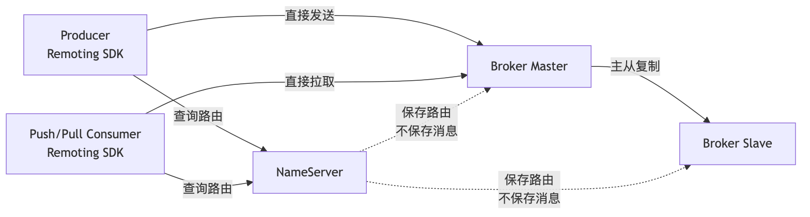
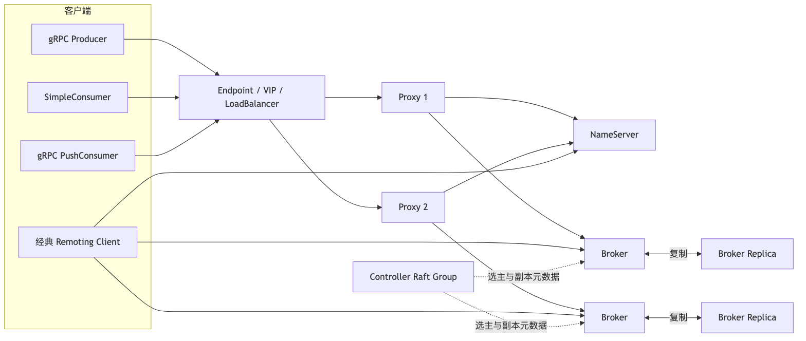
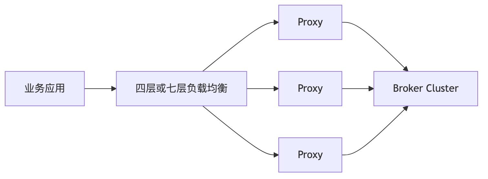
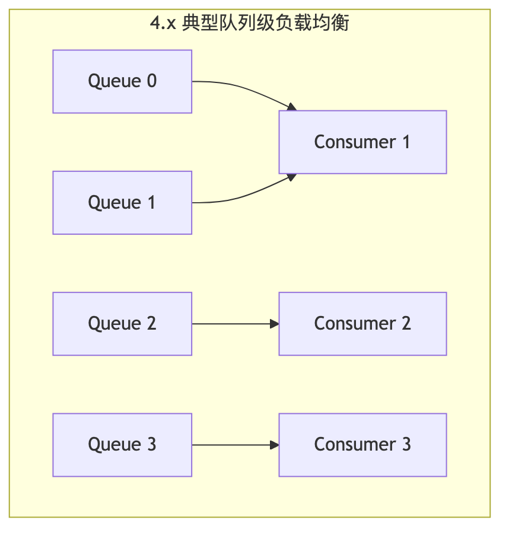
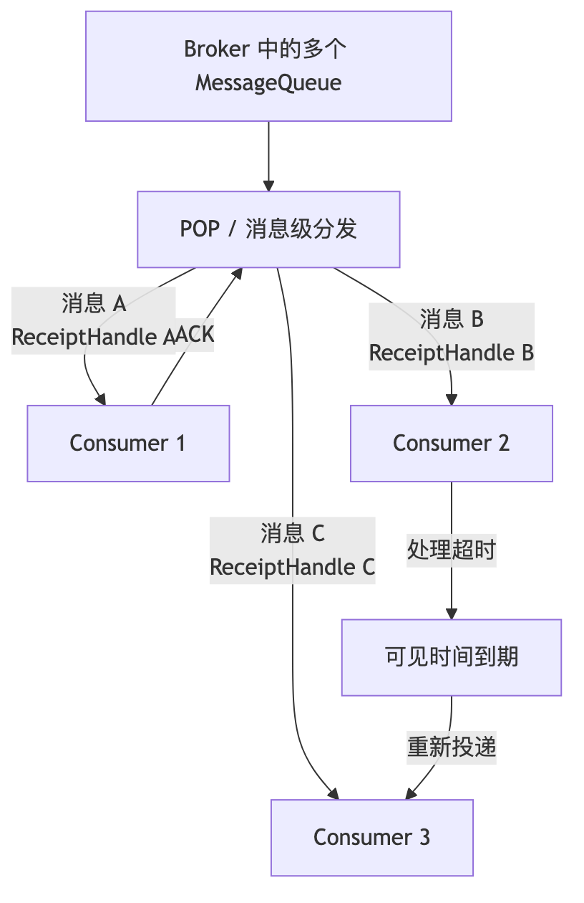
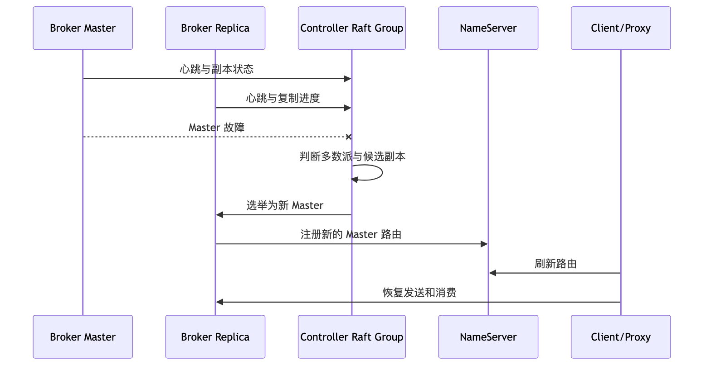
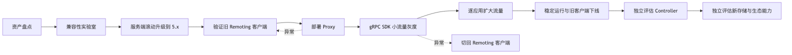

# 第 17 章：从 RocketMQ 4.x 到 5.x：Proxy、gRPC、POP、Controller 与架构演进

> **版本基线**
>
> 截至 **2026 年 6 月 20 日**，Apache RocketMQ 服务端最新正式发布版本为 **5.5.0**，发布时间为 2026 年 4 月 10 日。官方 5.x 多语言客户端仓库中的 Go SDK 当前版本为 **v5.1.4**，发布时间为 2026 年 6 月 17 日，但该版本在 GitHub Release 中仍标记为 **Pre-release**，生产使用前应完成独立认证和回归测试。 ([GitHub][1])

---

## 本章去重边界与跳转

本章是 4.x 到 5.x 架构演进主讲章节，保留 Proxy、gRPC SDK、Endpoint、POP、消息级负载均衡、Controller、Topic MessageType、新存储能力和迁移方案。它不重新讲每个能力的完整业务专题。

| 重复主题 | 本章处理方式 |
| --- | --- |
| 六大组件和领域模型 | 本章只讲版本演进后的变化；基础架构看 [第 2 章：整体架构、核心组件与领域模型](/blog/tech/RocketMQ/02.RocketMQ整体架构、核心组件与领域模型)。 |
| Consumer 类型、POP、ACK 和不可见时间 | 本章讲 5.x 相对 4.x 的变化；消费语义看 [第 5 章：Consumer 完整消费链路](/blog/tech/RocketMQ/05.Consumer类型、长轮询、POP、ACK与完整消费链路)。 |
| Rebalance 与消息级负载均衡 | 本章讲演进原因；位点、Lag 和积压治理看 [第 6 章](/blog/tech/RocketMQ/06.Rebalance、消费位点、负载均衡与消息积压)。 |
| 延迟消息、事务消息、FIFO、存储和 Controller | 本章讲版本差异；专项分别看 [第 10 章](/blog/tech/RocketMQ/10.延迟消息、定时消息与分布式任务调度)、[第 11 章](/blog/tech/RocketMQ/11.事务消息、HalfMessage、事务回查与最终一致性)、[第 9 章](/blog/tech/RocketMQ/09.FIFO顺序消息)、[第 7 章](/blog/tech/RocketMQ/07.RocketMQ存储引擎)、[第 13 章](/blog/tech/RocketMQ/13.RocketMQ高可用)。 |
| 灰度迁移、监控和回滚 | 本章讲迁移步骤；生产排障看 [第 15 章：可观测性与 Runbook](/blog/tech/RocketMQ/15.RocketMQ可观测性、故障诊断、应急处理与生产Runbook)，安全灾备看 [第 16 章](/blog/tech/RocketMQ/16.RocketMQ安全、ACL、TLS、多租户隔离与跨集群灾备)。 |

## 17.1 本章学习目标

完成本章后，应能够：

1. 解释 RocketMQ 为什么从 4.x 的经典架构演进到 5.x。
2. 说明 Proxy、gRPC SDK、Endpoint、POP 和 Controller 的职责。
3. 区分队列级负载均衡和消息级负载均衡。
4. 区分 PushConsumer、SimpleConsumer 和 PullConsumer。
5. 说明 4.x 客户端和 5.x 服务端之间的兼容关系。
6. 使用 Go 将经典 Remoting SDK 迁移到 gRPC SDK。
7. 设计可灰度、可观察、可回滚的 4.x 到 5.x 迁移方案。
8. 判断 RocksDB ConsumeQueue、Tiered Storage、LiteTopic 等能力是否应该进入当前生产系统。

本章中的能力分为三类：

| 分类       | 内容                                                                                      |
| -------- | --------------------------------------------------------------------------------------- |
| **核心必学** | Proxy、gRPC SDK、Endpoint、POP、消息级负载均衡、SimpleConsumer、Controller、Topic MessageType、升级顺序与回滚 |
| **按需选学** | RocksDB ConsumeQueue、分层存储、优先级消息、LiteTopic/Lite Mode                                     |
| **生态了解** | MQTT、EventBridge、Connect、Streams                                                        |

---

## 17.2 为什么需要从 4.x 演进到 5.x

假设一家电商公司正在使用 RocketMQ 4.9.x：

* Java 服务使用经典 PushConsumer；
* Go 服务使用 `rocketmq-client-go/v2`；
* 客户端连接 NameServer 后直接访问 Broker；
* 每个 Topic 预先创建固定数量的 MessageQueue；
* 扩容消费者时频繁发生 Rebalance；
* Master 故障后需要人工介入；
* Go、C++、Java 客户端在功能和语义上并不完全一致。

这套架构并不是不能工作。相反，RocketMQ 4.x 的经典架构经过了大量生产验证，具有链路短、吞吐高、客户端能力丰富等优点。

问题在于，当系统进一步追求云原生、多语言一致性、快速弹性和自动故障切换时，4.x 架构中的一些设计开始成为约束。

### 17.2.1 4.x 经典架构



经典架构具有以下优势：

1. **数据链路短**：客户端获得路由后直接访问 Broker。
2. **性能路径清晰**：NameServer 不位于消息收发主链路。
3. **客户端能力丰富**：路由管理、故障规避、队列选择、重试、Rebalance 等逻辑由客户端完成。
4. **部署组件较少**：核心组件主要是 NameServer、Broker 和客户端。
5. **兼容性和经验积累充分**：大量企业已经形成成熟的运维体系。

但它也有明显局限。

#### 17.2.1.1 富客户端导致多语言实现成本高

经典 Remoting SDK 中包含大量逻辑：

* 路由发现；
* Broker 连接管理；
* 队列选择；
* 消费负载均衡；
* 本地缓存；
* Offset 管理；
* 故障规避；
* 重试与回查；
* 线程池和长轮询。

Java 客户端可以与服务端代码同步演进，但 Go、C++、C# 等语言需要分别重写这些复杂逻辑，很难保证功能、行为和版本完全一致。

#### 17.2.1.2 客户端与 Broker 拓扑耦合较深

客户端必须理解：

* Broker 地址；
* Master 和 Slave；
* MessageQueue；
* BrokerName；
* 队列归属；
* 路由变化；
* Broker 故障。

这不利于统一接入、流量治理和云环境中的网络隔离。

#### 17.2.1.3 队列级负载均衡限制弹性

经典集群消费通常按 MessageQueue 分配消费者。假设一个 Topic 只有 8 个队列，即使启动 30 个消费者，同一个 ConsumerGroup 中通常也只有最多 8 个消费者能够获得队列。

消费者数量、队列数量和并发能力形成了较强耦合。

#### 17.2.1.4 Rebalance 对业务抖动明显

增加或减少消费者实例时，需要重新分配队列。队列所有权发生变化时，可能伴随：

* 本地 ProcessQueue 被撤销；
* 消费暂停；
* Offset 提交竞争；
* 少量消息重复；
* 顺序消费锁迁移；
* 短期负载不均衡。

#### 17.2.1.5 主从切换能力不统一

传统 Master-Slave 模式下，Master 故障后的自动选主能力有限。DLedger 可以提供 Raft 选主，但其存储和部署模式与传统主从并不完全相同，迁移成本较高。

---

## 17.3 RocketMQ 5.x 的演进目标

官方将 5.x 演进目标概括为三个方向：

1. 面向云原生基础设施，提高资源弹性和部署灵活性；
2. 通过统一 API 和多语言 SDK 降低接入复杂度；
3. 扩展事件、流处理和异构数据集成能力。 ([RocketMQ][2])

RocketMQ 5.x 并不是推翻 4.x，而是在兼容经典架构的基础上增加新的接入层、消费模型和高可用控制面。



这里有两个重要结论：

* **5.x 服务端可以继续服务经典 Remoting 客户端。**
* **gRPC 客户端不能直接连接 4.x 服务端，必须连接启用了 Proxy 的 5.0 及以上服务端。**

官方推荐的演进顺序也是先升级服务端，再逐步迁移客户端。 ([RocketMQ][2])

---

## 17.4 Proxy：从富客户端中抽离通用能力

### 17.4.1 Proxy 的职责

RocketMQ 5.x 将部分原本位于客户端或 Broker 接入层中的能力抽离到 Proxy，包括：

* gRPC 协议接入；
* 协议适配；
* 路由查询与转发；
* 客户端连接管理；
* 消费管理；
* POP 请求处理；
* ACK 和可见时间变更请求；
* 身份认证与权限校验的接入；
* 客户端遥测和设置下发。

Broker 因而可以更加专注于：

* 消息写入；
* CommitLog 存储；
* ConsumeQueue 构建；
* 消息查询；
* 副本复制；
* 消息投递状态维护。

官方 5.x 架构说明将 Proxy 描述为无状态接入层，并支持 Local 和 Cluster 两种部署方式。 ([RocketMQ][2])

### 17.4.2 “Proxy 无状态”不等于“Proxy 没有运行时状态”

Proxy 中仍然可能存在：

* TCP/gRPC 连接；
* 路由缓存；
* 客户端设置缓存；
* 长轮询请求；
* 临时请求上下文；
* 限流计数器；
* 消费相关的短生命周期状态。

所谓无状态，主要是指 Proxy 不保存权威的：

* 消息数据；
* CommitLog；
* 持久化消费进度；
* Topic 元数据唯一副本；
* 主从选举状态。

因此，Proxy 节点故障通常会导致连接重建和短期请求失败，而不应导致已持久化消息丢失。

### 17.4.3 Proxy 的部署方式

#### 17.4.3.1 Local 模式

Proxy 与 Broker 在同一个进程或节点中运行：

```text
mqbroker -n <nameserver> --enable-proxy
```

优点：

* 部署简单；
* 网络跳数少；
* 适合从经典集群平滑引入 gRPC；
* Broker 和 Proxy 生命周期统一。

缺点：

* Proxy 扩容与 Broker 扩容耦合；
* 接入流量和存储负载共享资源；
* 单独治理接入层的能力有限。

官方快速开始目前推荐使用 Local 模式完成基础部署。 ([RocketMQ][3])

#### 17.4.3.2 Cluster 模式

Proxy 独立部署为接入集群：



适合以下场景：

* 需要单独扩缩接入层；
* 需要统一 TLS、ACL、审计或限流；
* 客户端和 Broker 位于不同网络区域；
* Broker 不希望直接暴露给应用；
* gRPC 连接数远高于 Broker 节点数。

但独立 Proxy 会增加：

* 一跳网络开销；
* 容量规划工作；
* 连接和负载均衡治理；
* 新的故障域；
* Proxy 与 Broker 版本兼容测试。

---

## 17.5 Endpoint 与 NameServer 地址

这是 Go 客户端迁移时最容易混淆的变化之一。

### 17.5.1 NameServer 地址

经典 Remoting 客户端配置的是 NameServer 地址：

```text
10.0.0.11:9876;10.0.0.12:9876
```

客户端先查询 Topic 路由，再直接连接 Broker。

### 17.5.2 Endpoint

gRPC SDK 配置的是 Endpoint，例如：

```text
rocketmq-proxy.internal:8081
```

Endpoint 是客户端进入 RocketMQ 5.x 接入层的引导地址，通常对应：

* Proxy 地址；
* Proxy 前面的负载均衡地址；
* Local 模式下 Broker 内置 Proxy 暴露的地址；
* 云原生环境中的 Service 或 VIP。

官方 Go gRPC 示例要求服务端至少为 5.0，并启用 Proxy；快速开始中的本地 Endpoint 通常使用 `localhost:8081`。 ([RocketMQ][4])

两者不能简单互换：

| 配置项              | 经典 Remoting SDK | 5.x gRPC SDK           |
| ---------------- | --------------- | ---------------------- |
| 初始地址             | NameServer 地址   | Endpoint               |
| 典型端口             | 9876            | Proxy gRPC 端口，示例为 8081 |
| 客户端是否直接访问 Broker | 是               | 通常通过 Proxy             |
| 客户端是否自行承担大量路由逻辑  | 是               | 部分能力转移给 Proxy          |
| 能否连接 4.x 服务端     | 可以              | 不可以                    |

---

## 17.6 4.x 与 5.x 完整差异矩阵

下表综合了官方迁移文档、SDK 文档、消费者模型和 Controller 文档。实际能力还取决于具体服务端小版本、客户端版本和配置。 ([RocketMQ][2])

| 维度         | RocketMQ 4.x 经典模型        | RocketMQ 5.x 演进模型                        |
| ---------- | ------------------------ | ---------------------------------------- |
| 客户端协议      | 自研 Remoting              | Remoting 与 gRPC 并存                       |
| 客户端仓库      | 各语言独立或与主仓库耦合             | `rocketmq-clients` 多语言统一仓库               |
| 客户端复杂度     | 富客户端                     | gRPC 客户端相对轻量                             |
| 初始接入地址     | NameServer               | Endpoint                                 |
| Broker 访问  | 客户端通常直连 Broker           | gRPC 请求通常经 Proxy                         |
| Proxy      | 非核心组件                    | gRPC 接入的核心组件                             |
| Proxy 状态   | 不适用                      | 无权威持久化状态，可水平扩展                           |
| 消费者类型      | Push、Pull、LitePull 等经典实现 | PushConsumer、SimpleConsumer、PullConsumer |
| 常用业务消费     | PushConsumer             | PushConsumer 或 SimpleConsumer            |
| 消费确认       | 监听器返回状态或提交 Offset        | Push 返回结果；Simple 显式 ACK                  |
| 消息处理中状态    | 本地缓存和队列进度为主              | POP Inflight + InvisibleDuration         |
| 负载均衡       | 主要为队列级                   | 支持消息级和队列级                                |
| 扩容上限       | 易受队列数量限制                 | 消息级模式弱化队列数量约束                            |
| Rebalance  | 客户端队列分配明显                | 消息级分发降低队列所有权耦合                           |
| Master 故障  | 静态主从或 DLedger            | 可使用 Controller 自动选主                      |
| Topic 消息类型 | 主要依赖客户端约定                | Topic 可声明 MessageType                    |
| 类型校验       | 较弱                       | 可启用服务端强制类型校验                             |
| 延迟消息       | 固定延迟级别常见                 | 使用毫秒级投递时间戳                               |
| 事务消息       | Half Message、回查          | 核心语义保留，API 和类型治理统一                       |
| 多语言一致性     | 各 SDK 能力差异较大             | 通过 Protobuf/gRPC 统一协议                    |
| 存储索引       | 文件 ConsumeQueue 为经典实现    | 可选 RocksDB ConsumeQueue 等路径              |
| 冷数据        | 主要依赖本地磁盘保留               | 可选 Tiered Storage                        |
| 新型轻量订阅     | LMQ 等内部或特定能力             | 5.5.0 引入 Lite Mode/LiteTopic             |
| 生态         | 核心消息能力为主                 | MQTT、EventBridge、Connect、Streams         |
| 升级兼容       | 不支持 gRPC 客户端             | 可继续兼容经典 Remoting 客户端                     |
| 推荐迁移顺序     | 不适用                      | 服务端 → Proxy → 客户端 → 可选架构能力               |

---

## 17.7 gRPC SDK 与 Remoting SDK

### 17.7.1 Remoting SDK

经典 Go SDK 坐标为：

```text
github.com/apache/rocketmq-client-go/v2
```

其特点是：

* 可以连接 4.x 和 5.x 服务端；
* 客户端直接访问 NameServer 和 Broker；
* 包含较多路由、Rebalance 和消费状态逻辑；
* API 与 Java 经典客户端风格接近；
* 适合维护现有系统和完成低风险服务端升级。

### 17.7.2 gRPC SDK

5.x Go SDK 坐标为：

```text
github.com/apache/rocketmq-clients/golang/v5
```

其特点是：

* 基于 Protobuf 和 gRPC；
* 需要 5.0 及以上服务端；
* 需要启用 Proxy；
* 使用 Endpoint；
* 支持统一的 Producer、PushConsumer 和 SimpleConsumer API；
* API 与经典 SDK 不兼容，迁移需要修改代码。

官方明确指出，Remoting SDK 可连接 4.x 和 5.x 服务端，而 gRPC SDK只支持 5.0 及以上服务端。切换 SDK 不是替换依赖版本，而是一次 API 和消费语义迁移。 ([RocketMQ][5])

### 17.7.3 选择建议

| 场景                        | 建议                      |
| ------------------------- | ----------------------- |
| 现有 4.x 集群，暂不升级服务端         | 继续使用 Remoting SDK       |
| 服务端升级到 5.x，但优先控制风险        | 暂时保留 Remoting SDK       |
| 新建多语言系统                   | 优先评估 gRPC SDK           |
| 需要 SimpleConsumer 和显式 ACK | 使用 gRPC SDK             |
| 需要短期快速回滚                  | 服务端兼容 Remoting，客户端分阶段迁移 |
| Go SDK 版本仍标记 Pre-release  | 先建立企业内部认证版本，不直接全量上线     |

---

## 17.8 PushConsumer、SimpleConsumer 与 PullConsumer

官方 5.x 消费者模型包括 PushConsumer、SimpleConsumer 和 PullConsumer。PullConsumer 更适合流计算框架、批处理或需要直接控制队列的场景；普通业务系统通常优先选择 PushConsumer 或 SimpleConsumer。 ([RocketMQ][6])

| 类型             | 接口风格        | 并发控制   | ACK         | 负载均衡       | 典型场景        |
| -------------- | ----------- | ------ | ----------- | ---------- | ----------- |
| PushConsumer   | 注册 Listener | SDK 管理 | 返回消费结果      | 5.x 可使用消息级 | 普通在线业务      |
| SimpleConsumer | Receive、Ack | 应用管理   | 显式 ACK      | 消息级        | 需要精确控制拉取和处理 |
| PullConsumer   | 主动拉取队列      | 应用完全管理 | Offset/提交语义 | 队列级        | 流计算、批处理框架   |

### 17.8.1 PushConsumer 并不是真正的服务端主动推送

PushConsumer 对业务代码表现为回调：

```text
消息到达 → SDK 调用 Listener → 返回成功或失败
```

但底层仍然依赖拉取、长轮询或 POP 等机制。所谓 Push，主要表示业务编程接口是事件回调式，而不是服务端对任意客户端进行无状态主动推送。

### 17.8.2 SimpleConsumer

SimpleConsumer 将消费过程拆成显式操作：

1. `Receive`：获取消息；
2. 处理业务；
3. `Ack`：确认成功；
4. `ChangeInvisibleDuration`：延长不可见时间。

它适合：

* 应用需要控制批量大小；
* 需要控制消费并发；
* 需要根据下游容量限速；
* 单条任务可能执行较长时间；
* 需要明确区分“收到消息”和“业务处理成功”。

代价是应用必须正确处理：

* ACK 失败；
* 可见时间过期；
* ReceiptHandle 失效；
* 重复投递；
* 长任务续期；
* 优雅停机。

---

## 17.9 POP 与消息级负载均衡

### 17.9.1 经典队列级负载均衡

假设 Topic 有 4 个队列，ConsumerGroup 中有 3 个消费者：



每个队列在一个 ConsumerGroup 中通常由一个消费者持有。增加消费者后，客户端需要重新计算队列归属。

其优点是：

* 队列所有权清晰；
* 适合批量处理；
* 适合流计算；
* 对同队列顺序和局部状态处理友好。

局限是：

* 并发上限易受队列数约束；
* 单个热点队列可能造成负载倾斜；
* 扩缩容会触发队列迁移；
* 队列数量过多又会增加元数据和存储开销。

### 17.9.2 消息级负载均衡

RocketMQ 5.x 的消息级负载均衡建立在 POP 消费机制之上：



消费者不再长期独占整个 MessageQueue，而是获得一批暂时不可见的消息。

服务端将消息置为：

```text
Ready → Inflight → Commit
```

如果消费者未在 InvisibleDuration 内完成 ACK：

```text
Ready → Inflight → 可见时间到期 → Ready
```

消息可以再次投递给同一消费者或其他消费者。

### 17.9.3 ReceiptHandle

ReceiptHandle 可以理解为本次投递的临时凭证。ACK 的对象不是抽象的 MessageID，而是某次具体投递。

原因是同一条消息可能经历多次投递：

```text
第一次投递：ReceiptHandle-1
第二次投递：ReceiptHandle-2
```

如果第一次处理超时后消息已经重新投递，旧 ReceiptHandle 可能不再有效。因此应用不能长期缓存 ReceiptHandle，也不能将它当作业务主键。

### 17.9.4 InvisibleDuration 如何设置

设置过短：

* 业务尚未处理完，消息已经重新可见；
* 多个消费者并发处理同一业务；
* 重复消费率上升；
* ACK 时 ReceiptHandle 可能过期。

设置过长：

* 消费者崩溃后消息要等待更长时间才能重试；
* 故障恢复速度降低；
* Inflight 消息长期占用。

一般应根据业务处理时间分布设置：

```text
初始不可见时间 > 正常处理耗时 P99 + 网络与 ACK 余量
```

对于时长不可预测的任务，应在处理期间调用 `ChangeInvisibleDuration`，而不是直接设置一个极大的固定值。

### 17.9.5 消息级负载均衡是否完全消除了 Rebalance

没有。

官方文档明确指出，无论消息级还是队列级负载均衡，在消费者增减或 Broker 扩缩容时都可能出现短暂的负载调整，并产生少量重复消费，因此业务仍必须实现幂等。 ([RocketMQ][7])

消息级负载均衡解决的是：

* 降低队列数量对消费实例数的硬约束；
* 减少长期队列所有权迁移；
* 改善热点队列导致的实例负载不均；
* 提高在线业务扩缩容的灵活性。

它并不提供端到端 Exactly-once。

---

## 17.10 Controller 自动主从切换

### 17.10.1 Controller 的职责

Controller 是 RocketMQ 5.x 的高可用控制面，负责：

* Broker 副本元数据管理；
* Master 选举；
* BrokerId 分配；
* 副本存活状态判断；
* Master 故障后的自动切换。

Controller 不负责：

* 存储业务消息；
* 转发生产和消费请求；
* 代替 NameServer 提供 Topic 路由；
* 承载正常消息流量。

NameServer 负责路由发现，Controller 负责副本组控制，两者不能混为一谈。

### 17.10.2 Controller 故障切换流程



官方建议为了容错部署至少 3 个 Controller 节点，以 Raft 多数派维持可用性。Controller 可以独立部署，也可以嵌入 NameServer，但即使嵌入 NameServer，Controller 保存的 Raft 状态仍然是有状态数据。 ([RocketMQ][8])

### 17.10.3 Controller 单节点故障会怎样

当 Controller 集群暂时失去多数派时：

* 已经存在的 Master 通常仍可继续处理消息；
* 现有客户端路由通常仍可使用；
* 但新的自动选主和部分元数据变更能力会受影响。

因此，Controller 不在正常消息数据路径上，但它决定了故障期间是否能够自动恢复。

### 17.10.4 Unclean Master Election

当所有同步充分的副本都不可用时，是否允许选择数据较旧的副本成为 Master，是一个典型的 RPO 与 RTO 权衡。

* 禁止 Unclean Election：优先避免消息丢失，但可能延长不可用时间。
* 允许 Unclean Election：可能更快恢复服务，但可能丢失尚未复制到候选副本的数据。

对于支付、账务、订单等数据一致性要求高的场景，不能为了缩短 RTO 而默认开启不安全选主。

### 17.10.5 DLedger 迁移边界

Controller 模式和 DLedger 模式不是同一套存储形态。

官方迁移说明指出：

* 传统 Master-Slave 迁移到 Controller 时，需要确保 CommitLog 对齐，并严格控制节点启动顺序；
* 带历史数据的 DLedger 集群不能直接视为普通主从原地切换到 Controller，因为存储格式和运行模式存在差异。 ([RocketMQ][8])

因此，Controller 迁移应作为独立项目，不应与服务端大版本升级、客户端协议迁移和存储引擎迁移放在同一变更窗口。

---

## 17.11 Topic MessageType

RocketMQ 5.x 允许为 Topic 声明消息类型，主要包括：

* Normal；
* FIFO；
* Delay；
* Transaction。

一个 Topic 应对应一种主要消息语义。例如：

```text
order-created-normal
order-status-fifo
payment-timeout-delay
payment-transaction
```

而不应在一个 Topic 中同时发送：

* 普通消息；
* FIFO 消息；
* 延迟消息；
* 事务消息。

服务端可以开启 `enableTopicMessageTypeCheck` 强制检查 Topic 类型与消息类型是否一致。为了兼容 4.x 客户端，该检查并非所有升级场景都会自动强制开启，因此迁移时必须显式核对配置。 ([RocketMQ][9])

类型治理的价值不是增加一个字段，而是让以下问题在发送阶段暴露：

* 把事务消息误发到普通 Topic；
* 把带 MessageGroup 的 FIFO 消息发到 Delay Topic；
* 同一 Topic 中混用互斥语义；
* 运维人员无法判断 Topic 应使用何种存储和消费策略。

---

## 17.12 5.x 延迟消息和事务消息变化

### 17.12.1 延迟消息

#### 17.12.1.1 4.x 常见模型

经典 Remoting 客户端通常设置延迟级别：

```text
1s、5s、10s、30s、1m……
```

业务选择的是预定义级别，而不是任意时间点。

#### 17.12.1.2 5.x 模型

5.x gRPC API 使用毫秒级 Unix 时间戳描述预期投递时间：

```text
DeliveryTimestamp = 2026-06-20 18:30:00.000
```

它更适合：

* 订单超时；
* 定时通知；
* 任务预约；
* SLA 检查；
* 指定时间触发。

官方 5.0 文档规定，投递时间必须晚于当前时间并位于允许范围内；文档给出的默认最大延迟范围为 24 小时。超出范围或设置为过去时间时，消息可能被立即投递。 ([RocketMQ][10])

迁移时不能只替换 API，还必须核对：

* 原延迟级别对应的实际时间；
* 客户端与 Broker 时钟；
* 超范围消息行为；
* 延迟消息 Topic 的 MessageType；
* 重启恢复后的投递延迟；
* 是否使用新版本支持的延迟消息撤回能力。

### 17.12.2 事务消息

RocketMQ 5.x 没有改变事务消息的核心目标：

> 保证本地事务结果与消息最终可见状态之间的最终一致性。

其核心过程仍然是：

1. 发送事务预备消息；
2. 执行本地事务；
3. 提交或回滚消息；
4. 状态不明确时由 Broker 发起事务回查。

变化主要体现在：

* gRPC 统一 API；
* Transaction 类型 Topic；
* 更明确的消息类型校验；
* 多语言客户端统一协议；
* 底层事务索引和存储实现持续演进。

事务消息并不等于数据库与消费者之间的全局 ACID，也不保证消费端业务只执行一次。消费端仍需幂等。官方将其定义为消息生产与本地事务之间的最终一致性机制。 ([RocketMQ][11])

---

## 17.13 RocksDB ConsumeQueue、Tiered Storage 与 Lite Mode

这些能力不能因为“版本更新了”就一次性全部启用。

### 17.13.1 RocksDB ConsumeQueue

经典 ConsumeQueue 使用顺序文件构建逻辑索引。RocksDB ConsumeQueue 的目标包括：

* 改善海量 Topic 或轻量队列场景下的索引管理；
* 支持更灵活的索引组织；
* 为 LMQ、POP 等场景提供新的存储路径；
* 降低部分场景中的内存和文件数量压力。

但它不是普通升级的必选项。

RocketMQ 5.3.2 的 Release Notes 将基于 RocksDB 的 POP 实现明确标记为 alpha，同时增强了 RocksDB ConsumeQueue 的迁移方案；之后的 5.4、5.5 版本仍在持续修复 RocksDB、POP、迁移和主从同步相关问题。 ([GitHub][12])

生产原则是：

* 服务端版本升级时先保持原存储路径；
* RocksDB ConsumeQueue 单独压测；
* 验证重启恢复、主从复制、Offset 查询和磁盘放大；
* 验证回退路径；
* 不在同一窗口同时切换客户端协议和 ConsumeQueue 实现。

RocketMQ 5.4.0 还引入了优先级消息，以及 Timer、Transaction、Index 等组件的 RocksDB 实现，但这些版本特性不等于所有生产系统都应立即开启。 ([GitHub][13])

### 17.13.2 Tiered Storage

Tiered Storage 用于将冷消息从本地磁盘转移到更便宜、容量更大的存储介质，从而延长消息保留时间。

适合：

* 历史消息长期保留；
* 审计与追溯；
* 冷数据查询；
* 本地 SSD 成本过高；
* Topic 之间需要不同保留周期。

风险包括：

* 冷读延迟升高；
* 后端对象存储或远程文件系统故障；
* 缓存命中率不稳定；
* 网络费用和带宽成本；
* 删除与保留策略复杂；
* 本地与远端索引一致性；
* 回源查询对 Broker 的影响。

当前官方仓库中的 Tiered Storage README 仍将其标为 **Technical preview**，默认 POSIX Provider 也被描述为示例实现；最新 Release Notes 仍包含多项分层存储修复。因此它应被视为高级可选能力，而不是 4.x 到 5.x 升级的默认步骤。 ([GitHub][14])

### 17.13.3 LiteTopic / Lite Mode

RocketMQ 5.5.0 引入 Lite Mode，面向 AI Agent、会话和海量细粒度订阅等新场景；Go SDK v5.1.4 也加入了 LiteTopic、Lite PushConsumer 等相关能力，但当前 Go Release 仍标为 Pre-release。 ([GitHub][1])

LiteTopic 解决的是：

* 普通 Topic 数量过多时的元数据成本；
* 大量会话或 Agent 需要独立逻辑通道；
* 海量轻量订阅关系；
* 创建完整 Topic 成本过高。

它不应该替代普通 Topic 来承载：

* 订单事件；
* 支付事件；
* 库存流水；
* 核心审计消息；
* 普通微服务领域事件。

对大多数后端工程师而言，应了解它解决的问题和边界；只有业务确实存在海量细粒度通道时，才需要深入评估。

---

## 17.14 MQTT、EventBridge、Connect 与 Streams 的定位

| 组件               | 主要定位                 | 适合场景               | 不应被误解为             |
| ---------------- | -------------------- | ------------------ | ------------------ |
| RocketMQ MQTT    | MQTT 协议接入和终端消息分发     | IoT、设备连接、云边通信      | 普通微服务默认 SDK        |
| EventBridge      | 事件总线、事件路由和外部事件接入     | Serverless、跨系统事件集成 | Broker 核心存储替代品     |
| RocketMQ Connect | Source/Sink 数据连接器运行时 | CDC、ETL、数据库与数据湖同步  | 业务消息消费者的统一替代品      |
| RocketMQ Streams | SDK 形态的轻量流处理         | 过滤、聚合、窗口、简单流任务     | 复杂 Flink 集群的无条件替代品 |

RocketMQ MQTT 通过独立协议计算层完成 MQTT 接入；Connect 是独立、分布式的数据集成系统；Streams 可以作为依赖嵌入应用运行；EventBridge 主要解决事件路由与外部系统适配。 ([RocketMQ][15])

生产系统不应因为 RocketMQ 提供这些组件就全部引入。每增加一个组件，都会增加：

* 部署成本；
* 安全边界；
* 版本兼容矩阵；
* 可观测性要求；
* 故障排查路径；
* 团队学习成本。

---

## 17.15 Go 客户端迁移实战

以下代码展示迁移语义，生产代码还应补充指标、日志、限流、重试边界和优雅停机。当前 gRPC 示例基于 Go v5 API，官方包文档中 `Config` 使用 `Endpoint` 和 `ConsumerGroup`，SimpleConsumer 提供 `Receive`、`Ack` 和 `ChangeInvisibleDuration`。 ([Go Packages][16])

### 17.15.1 经典 Remoting Producer

```go
package main

import (
	"context"
	"fmt"
	"os"
	"strings"

	"github.com/apache/rocketmq-client-go/v2"
	"github.com/apache/rocketmq-client-go/v2/primitive"
	"github.com/apache/rocketmq-client-go/v2/producer"
)

func main() {
	nameServers := strings.Split(os.Getenv("NAMESRV_ADDR"), ",")

	p, err := rocketmq.NewProducer(
		producer.WithNameServer(nameServers),
		producer.WithRetry(2),
	)
	if err != nil {
		panic(err)
	}

	if err := p.Start(); err != nil {
		panic(err)
	}
	defer func() { _ = p.Shutdown() }()

	msg := primitive.NewMessage(
		"order-created",
		[]byte(`{"order_id":"O-10001"}`),
	)

	result, err := p.SendSync(context.Background(), msg)
	if err != nil {
		panic(err)
	}

	fmt.Printf("send status=%s msgID=%s\n", result.Status, result.MsgID)
}
```

它依赖：

```text
NameServer → 查询路由 → 直接发送到 Broker
```

### 17.15.2 gRPC Producer

```go
package main

import (
	"context"
	"fmt"
	"os"
	"time"

	rmq "github.com/apache/rocketmq-clients/golang/v5"
	"github.com/apache/rocketmq-clients/golang/v5/credentials"
)

func main() {
	const topic = "order-created"

	cfg := &rmq.Config{
		Endpoint: os.Getenv("ROCKETMQ_ENDPOINT"),
		Credentials: &credentials.SessionCredentials{
			AccessKey:    os.Getenv("ROCKETMQ_ACCESS_KEY"),
			AccessSecret: os.Getenv("ROCKETMQ_SECRET_KEY"),
		},
	}

	p, err := rmq.NewProducer(
		cfg,
		rmq.WithTopics(topic),
		rmq.WithMaxAttempts(3),
	)
	if err != nil {
		panic(err)
	}

	if err := p.Start(); err != nil {
		panic(err)
	}
	defer func() { _ = p.GracefulStop() }()

	msg := &rmq.Message{
		Topic: topic,
		Body:  []byte(`{"order_id":"O-10001"}`),
	}
	msg.SetKeys("O-10001")
	msg.SetTag("CREATED")

	ctx, cancel := context.WithTimeout(context.Background(), 3*time.Second)
	defer cancel()

	receipts, err := p.Send(ctx, msg)
	if err != nil {
		panic(err)
	}

	for _, receipt := range receipts {
		fmt.Printf("messageID=%s offset=%d\n",
			receipt.MessageID, receipt.Offset)
	}
}
```

主要变化包括：

| 旧 SDK               | 新 SDK             |
| ------------------- | ----------------- |
| `WithNameServer`    | `Config.Endpoint` |
| 客户端直连 Broker        | 经 Proxy 访问        |
| `primitive.Message` | `rmq.Message`     |
| `SendSync`          | `Send`            |
| `Shutdown`          | `GracefulStop`    |
| SDK 自身 Remoting 协议  | Protobuf/gRPC     |
| 依赖队列和 Broker 路由细节   | 统一 Endpoint 和 API |

### 17.15.3 gRPC SimpleConsumer

```go
package main

import (
	"context"
	"errors"
	"log"
	"os"
	"time"

	rmq "github.com/apache/rocketmq-clients/golang/v5"
	"github.com/apache/rocketmq-clients/golang/v5/credentials"
)

func main() {
	ctx := context.Background()

	const (
		topic = "order-created"
		group = "inventory-service"
	)

	c, err := rmq.NewSimpleConsumer(
		&rmq.Config{
			Endpoint:      os.Getenv("ROCKETMQ_ENDPOINT"),
			ConsumerGroup: group,
			Credentials: &credentials.SessionCredentials{
				AccessKey:    os.Getenv("ROCKETMQ_ACCESS_KEY"),
				AccessSecret: os.Getenv("ROCKETMQ_SECRET_KEY"),
			},
		},
		rmq.WithSimpleAwaitDuration(5*time.Second),
		rmq.WithSimpleSubscriptionExpressions(
			map[string]*rmq.FilterExpression{
				topic: rmq.SUB_ALL,
			},
		),
	)
	if err != nil {
		panic(err)
	}

	if err := c.Start(); err != nil {
		panic(err)
	}
	defer func() { _ = c.GracefulStop() }()

	for {
		messages, err := c.Receive(ctx, 16, 30*time.Second)
		if err != nil {
			if errors.Is(err, context.Canceled) {
				return
			}
			log.Printf("receive failed: %v", err)
			time.Sleep(time.Second)
			continue
		}

		for _, msg := range messages {
			if err := updateInventory(msg.GetBody()); err != nil {
				// 暂不 ACK，让消息稍后重新投递。
				// 对长任务应在 ReceiptHandle 有效期内主动续期。
				if changeErr := c.ChangeInvisibleDuration(
					msg,
					30*time.Second,
				); changeErr != nil {
					log.Printf("extend invisible duration failed: %v", changeErr)
				}
				continue
			}

			if err := c.Ack(ctx, msg); err != nil {
				// ACK 失败意味着不能假设消息不会再次投递。
				log.Printf("ack failed, messageID=%s, err=%v",
					msg.GetMessageId(), err)
			}
		}
	}
}

func updateInventory(body []byte) error {
	// 实际业务必须使用订单号、事件 ID 等实现幂等。
	log.Printf("process message: %s", body)
	return nil
}
```

### 17.15.4 ACK 成功不等于业务天然只执行一次

存在如下故障窗口：

```text
数据库更新成功
    ↓
进程崩溃或网络故障
    ↓
ACK 未成功到达 Broker
    ↓
消息重新投递
```

因此正确设计仍然是：

```text
至少一次投递 + 业务幂等 + 可审计补偿
```

---

## 17.16 从 4.x 到 5.x 的生产迁移方案

迁移的核心原则是：

> 一次只改变一个主要变量。

不要在同一个发布窗口同时进行：

* 服务端大版本升级；
* Proxy 架构引入；
* Remoting 到 gRPC 的客户端迁移；
* 静态主从到 Controller；
* RocksDB ConsumeQueue 切换；
* Tiered Storage 启用；
* Topic MessageType 全量强校验。

### 17.16.1 总体流程



### 17.16.2 第一阶段：资产盘点

至少记录以下信息：

| 资产            | 需要盘点的内容                          |
| ------------- | -------------------------------- |
| 服务端           | 版本、部署模式、JDK、Broker 配置、HA 模式      |
| Topic         | 队列数、消息类型、TPS、消息大小、保留时间           |
| ConsumerGroup | 消费者类型、订阅表达式、起始位点、并发数             |
| Producer      | SDK、重试、超时、顺序和事务消息                |
| 客户端           | 语言、SDK 坐标、版本、是否魔改                |
| 网络            | NameServer、Broker、Proxy、防火墙和 DNS |
| 安全            | ACL、TLS、凭据和权限                    |
| 运维            | Dashboard、mqadmin、监控、告警和 Runbook |
| 业务语义          | 幂等键、顺序键、事务回查、DLQ 处理              |

特别要查找：

* 同一个 Group 中订阅表达式不一致；
* 依赖固定 Broker 地址；
* 直接使用 MessageQueue 和 Offset 的业务；
* 自定义 Rebalance；
* 客户端魔改；
* 延迟级别硬编码；
* 依赖消费线程本地状态；
* 对 ACK 和 Offset 语义存在错误假设。

### 17.16.3 第二阶段：兼容性实验室

搭建与生产相同的最小拓扑，验证：

1. 4.x Remoting 客户端连接 5.x 服务端；
2. 正常、FIFO、Delay、Transaction 消息；
3. Producer 超时和重试；
4. 消费失败、重试和 DLQ；
5. Broker 重启；
6. Proxy 重启；
7. 网络断开；
8. 消费者扩缩容；
9. Offset 重置；
10. 消息查询和轨迹；
11. ACL、TLS；
12. Dashboard 与 mqadmin。

### 17.16.4 第三阶段：服务端滚动升级

推荐顺序：

1. 备份配置和元数据；
2. 固化回滚版本和安装包；
3. 逐个升级 NameServer；
4. 按副本组升级 Broker；
5. 优先升级可替换从节点；
6. 验证复制追平后再处理 Master；
7. 每升级一个节点都验证发送、消费和复制；
8. 保留 Remoting 接入；
9. 暂不启用新的存储格式和强制类型校验。

官方迁移文档明确支持 4.x 客户端继续访问 5.x 服务端，因此服务端和客户端不需要在同一时间完成切换。 ([RocketMQ][2])

### 17.16.5 第四阶段：部署 Proxy

先只部署 Proxy，不迁移生产客户端，验证：

* gRPC 端口连通；
* Proxy 到 NameServer 连通；
* Proxy 到所有 Broker 连通；
* DNS 和负载均衡；
* ACL/TLS；
* Proxy CPU、内存、连接数；
* 路由查询延迟；
* Proxy 节点故障后的连接恢复；
* Local 或 Cluster 模式下的容量边界。

### 17.16.6 第五阶段：客户端灰度

推荐灰度顺序：

```text
内部工具
→ 非核心异步任务
→ 可补偿消费者
→ 普通 Producer
→ 核心消费者
→ FIFO、Delay、Transaction
```

每一阶段都应保留：

* 旧版本制品；
* 旧 SDK 配置；
* NameServer 地址；
* 回滚开关；
* 业务幂等；
* 双版本指标对比。

### 17.16.7 不建议直接双写

Producer 同时向旧链路和新链路发送同一业务消息，会产生：

* 重复消息；
* 两边发送结果不一致；
* 顺序分裂；
* 延迟差异；
* 一边成功、一边失败；
* 事务消息无法形成统一状态；
* 回滚时难以确定权威数据源。

更安全的做法是按实例、租户或业务 Key 进行流量切分：

```text
90% 使用 Remoting
10% 使用 gRPC
```

同一业务事件只走一条发送路径。

### 17.16.8 双消费者并存风险

同一 ConsumerGroup 中同时存在不同协议或不同消费模型的消费者时，需要重点验证：

* 订阅表达式是否完全一致；
* 队列级和消息级负载均衡是否混用；
* Offset 与 POP 状态是否符合预期；
* 重试和 DLQ 是否一致；
* 客户端版本是否支持相互切换；
* 是否出现重复处理和短期积压。

官方明确禁止在同一个 Group 中混用 PullConsumer 和其他消费者类型。PushConsumer 与 SimpleConsumer 虽可共享资源定义并进行模型切换，也不应把跨协议并存视为零风险灰度。 ([RocketMQ][6])

需要影子验证时，应使用独立 ConsumerGroup，并关闭真实业务副作用，只比较：

* 消息数量；
* MessageID；
* 业务 Key；
* 消费延迟；
* 过滤结果；
* 解码结果。

### 17.16.9 回滚设计

#### 17.16.9.1 客户端回滚

前提是：

* 服务端仍兼容 Remoting；
* Broker 仍允许经典客户端访问；
* Topic 和 Group 未做不可兼容修改。

回滚动作：

```text
停止 gRPC 实例
→ 启动旧 Remoting 实例
→ 验证消费位点
→ 观察重复与积压
```

#### 17.16.9.2 Proxy 回滚

停止新客户端流量后，可以下线 Proxy，但必须确认没有任何 gRPC 客户端仍依赖该 Endpoint。

#### 17.16.9.3 服务端回滚

服务端回滚风险明显高于客户端回滚。若已经启用：

* 新存储格式；
* 新元数据格式；
* RocksDB ConsumeQueue；
* Controller 模式；
* LiteTopic；
* 新类型消息；
* 新版本写入的数据结构；

则不能假设旧服务端能够安全读取和运行。

因此服务端升级前必须做版本级兼容验证，不能把“替换二进制文件”当作完整回滚方案。

---

## 17.17 灰度期间的关键监控

告警阈值应根据自身基线确定，以下只列出指标维度。

| 层级        | 关键指标                                     |
| --------- | ---------------------------------------- |
| Producer  | 发送成功率、超时率、重试次数、P95/P99 延迟                |
| Proxy     | gRPC 请求量、错误码、连接数、路由查询延迟、CPU、内存           |
| Broker    | PutMessage 延迟、磁盘使用率、CommitLog 写入、请求队列    |
| POP       | Inflight 数量、ACK 失败、ReceiptHandle 过期、重新投递 |
| Consumer  | 消费 TPS、积压、处理耗时、不可见时间续期失败                 |
| Retry/DLQ | 重试增长率、DLQ 新增量、最大重试次数                     |
| HA        | 副本复制延迟、Master 变化、Controller 选举状态         |
| 业务        | 重复率、漏处理核对、幂等冲突、最终状态差异                    |
| 网络        | Proxy 到 Broker 延迟、连接重置、DNS 和 LB 错误       |

灰度成功不能只看“消息能够发送和消费”，还必须证明：

```text
正确性不下降
+ 延迟可接受
+ 重复率可控
+ 故障可以恢复
+ 回滚路径有效
```

---

## 17.18 常见迁移误区

### 17.18.1 误区1：升级到 5.x 就必须迁移 gRPC
错误。5.x 服务端可以继续兼容 Remoting 客户端。服务端升级和客户端协议迁移应分阶段完成。

### 17.18.2 误区2：部署 Proxy 后客户端仍配置 NameServer
gRPC SDK 应配置 Endpoint，而不是把 NameServer 地址直接填入 Endpoint。

### 17.18.3 误区3：Proxy 无状态，所以不需要监控
Proxy 故障虽然通常不丢消息，但可能造成连接中断、请求失败、路由查询异常和消费抖动。

### 17.18.4 误区4：消息级负载均衡不会重复消费
POP 仍然是至少一次投递。超时、ACK 失败、网络抖动和进程崩溃都可能造成重新投递。

### 17.18.5 误区5：InvisibleDuration 越长越安全
过长会延迟故障重试；过短会造成并发重复。应根据业务耗时分布设置，并对长任务续期。

### 17.18.6 误区6：Controller 与 NameServer 是同一个组件
即使 Controller 嵌入 NameServer，它们的逻辑职责仍然不同：NameServer 管路由，Controller 管副本选主。

### 17.18.7 误区7：启用 Controller 后一定零丢失
是否丢失取决于复制进度、确认策略、候选副本状态和是否允许 Unclean Election。

### 17.18.8 误区8：Topic MessageType 会自动修复旧 Topic
升级不会自动纠正旧 Topic 中的混合语义。启用强制检查前必须先完成资产治理。

### 17.18.9 误区9：Tiered Storage 是升级 5.x 的标准配置
当前官方仓库仍将其标为 Technical preview。它是独立存储项目，不是版本升级的前置条件。

### 17.18.10 误区10：5.5.0 有 LiteTopic，所以普通 Topic 应全部迁移
LiteTopic 面向海量轻量通道和细粒度订阅，不是普通领域事件 Topic 的替代品。

---

## 17.19 资深面试题

> **题目去重**：本节作为本章版本演进自测，只保留 Proxy、gRPC、Endpoint、POP、Controller、MessageType 和迁移题。跨章重复题、完整追问链和模拟面试统一跳转到 [第 20 章：资深面试题库、追问链与模拟面试](/blog/tech/RocketMQ/20.RocketMQ资深面试题库、追问链与模拟面试)。

### 1. RocketMQ 5.x 为什么要引入 Proxy？

**标准回答：** 将 gRPC 协议接入、连接管理、消费管理等通用能力从富客户端和 Broker 接入逻辑中抽离，降低多语言 SDK 复杂度，并形成可水平扩展的统一接入层。
**追问：** Proxy 故障会不会丢消息？
**易错点：** 把 Proxy 说成新的消息存储节点。 ([RocketMQ][2])

### 2. Proxy 真的是完全无状态吗？

**标准回答：** 不保存权威消息和持久化消费进度，但有连接、缓存、长轮询等运行时临时状态。
**追问：** Proxy 重启时会发生什么？
**易错点：** 认为无状态意味着无需容量规划和监控。

### 3. 4.x 客户端能连接 5.x 服务端吗？

**标准回答：** 经典 Remoting SDK 可以继续连接 5.x 服务端。
**追问：** 这对迁移有什么价值？
**易错点：** 认为服务端和客户端必须同时升级。 ([RocketMQ][5])

### 4. gRPC 客户端能连接 4.x Broker 吗？

**标准回答：** 不能。gRPC SDK 要求至少 5.0 服务端并启用 Proxy。
**追问：** 应先迁服务端还是客户端？
**易错点：** 只替换 Go Module 后直接上线。 ([RocketMQ][4])

### 5. Endpoint 与 NameServer 地址有什么区别？

**标准回答：** NameServer 是经典客户端的路由发现地址；Endpoint 是 gRPC 客户端进入 Proxy 接入层的引导地址。
**追问：** Endpoint 能否指向负载均衡？
**易错点：** 把 NameServer 的 9876 端口直接作为 gRPC Endpoint。

### 6. PushConsumer 和 SimpleConsumer 如何选择？

**标准回答：** 普通回调式在线业务优先 PushConsumer；需要主动控制拉取、批量、并发和 ACK 时选择 SimpleConsumer。
**追问：** 哪个消费者由应用控制并发？
**易错点：** 认为 PushConsumer 是 Broker 主动推送。 ([RocketMQ][6])

### 7. 什么是 POP 消费？

**标准回答：** Broker 将消息按次投递给消费者，并在 InvisibleDuration 内使其不可见；消费者通过 ReceiptHandle ACK，超时未 ACK 则可重新投递。
**追问：** ReceiptHandle 能否作为业务幂等键？
**易错点：** 把 POP 理解为删除消息。

### 8. 消息级负载均衡解决了什么问题？

**标准回答：** 弱化消费者并发与队列数的耦合，降低长期队列所有权迁移，并改善热点负载。
**追问：** 是否完全没有 Rebalance？
**易错点：** 宣称不再发生重复消费。 ([RocketMQ][7])

### 9. 为什么 4 个队列无法充分利用 20 个经典消费者？

**标准回答：** 队列级负载均衡下，一个 Group 内每个队列通常只分配给一个消费者，额外实例无法获得队列。
**追问：** 是否应该无限增加队列？
**易错点：** 忽略队列元数据、文件和调度成本。

### 10. InvisibleDuration 设置过短会怎样？

**标准回答：** 消息可能在业务尚未完成时重新可见，导致并发重复处理和旧 ReceiptHandle ACK 失败。
**追问：** 长任务如何处理？
**易错点：** 只增加最大重试次数。

### 11. ACK 失败是否意味着业务失败？

**标准回答：** 不一定。业务可能已经成功，只是 ACK 未到达 Broker，因此消息可能再次投递。
**追问：** 如何解决？
**易错点：** ACK 失败后直接回滚已经提交的外部副作用。

### 12. Controller 与 NameServer 的区别是什么？

**标准回答：** NameServer 管理 Topic 路由；Controller 管理 Broker 副本和 Master 选举。
**追问：** Controller 是否位于消息数据路径？
**易错点：** 认为 Controller 保存 CommitLog。 ([RocketMQ][8])

### 13. Controller 集群失去多数派会怎样？

**标准回答：** 已有 Master 通常仍可处理消息，但新的自动选主和控制面变更会受影响。
**追问：** 为什么建议至少部署 3 个节点？
**易错点：** 认为 Controller 故障会立即停止所有发送。

### 14. 什么是 Unclean Master Election？

**标准回答：** 在同步充分的副本不可用时，允许选择数据较旧的副本成为 Master，以较低 RTO 换取潜在数据丢失。
**追问：** 金融场景是否应该默认开启？
**易错点：** 只讨论可用性，不讨论 RPO。

### 15. Topic MessageType 的价值是什么？

**标准回答：** 将 Normal、FIFO、Delay、Transaction 等语义纳入资源治理，并在发送阶段拒绝类型不匹配。
**追问：** 为什么升级后不能立即开启强校验？
**易错点：** 忽略旧 Topic 可能长期混用多种消息类型。 ([RocketMQ][9])

### 16. 4.x 和 5.x 延迟消息的主要区别是什么？

**标准回答：** 4.x 常用预定义延迟级别；5.x gRPC 模型使用毫秒级投递时间戳。
**追问：** 设置过去时间会怎样？
**易错点：** 认为任意未来时间都一定有效。 ([RocketMQ][10])

### 17. 5.x 是否改变了事务消息的本质？

**标准回答：** 没有，仍然通过预备消息、本地事务、提交/回滚和事务回查实现最终一致性；主要变化是统一 API 和消息类型治理。
**追问：** 是否保证消费者业务只执行一次？
**易错点：** 将事务消息称为端到端 Exactly-once。 ([RocketMQ][11])

### 18. RocksDB ConsumeQueue 是否应该随 5.x 升级同时开启？

**标准回答：** 不应该默认同时开启。它涉及存储索引、恢复、复制和回退，应作为独立变更验证。
**追问：** 为什么要验证主从同步和重启恢复？
**易错点：** 把“代码已合入”理解为“适合所有生产场景”。

### 19. Tiered Storage 适合什么场景？

**标准回答：** 适合长期保留和冷数据低成本存储，但需要接受冷读延迟、远端依赖和更复杂的运维。
**追问：** 当前是否属于升级必选项？
**易错点：** 忽略官方仍标注 Technical preview。 ([GitHub][14])

### 20. 4.x 到 5.x 最安全的迁移顺序是什么？

**标准回答：**

```text
资产盘点
→ 兼容性测试
→ 服务端滚动升级
→ 验证旧客户端
→ 部署 Proxy
→ gRPC 客户端灰度
→ 独立迁移 Controller
→ 独立评估新存储能力
```

**追问：** 最容易回滚的是哪一层？
**易错点：** 将协议、HA 和存储迁移合并成一次发布。

---

## 17.20 本章总结

RocketMQ 5.x 的核心价值并不是“多了几个组件”，而是完成了三类解耦：

```text
客户端协议与服务端实现解耦
消费者并发与队列数量解耦
Broker 数据面与高可用控制面解耦
```

其中：

* Proxy 提供统一接入层；
* gRPC SDK 降低多语言实现差异；
* Endpoint 取代 gRPC 客户端对 NameServer 地址的直接依赖；
* POP 和消息级负载均衡提高消费弹性；
* SimpleConsumer 提供显式 Receive、ACK 和可见时间管理；
* Controller 提供自动 Master 选举；
* Topic MessageType 加强消息语义治理；
* RocksDB ConsumeQueue、Tiered Storage 和 LiteTopic 属于按需评估能力；
* MQTT、EventBridge、Connect、Streams 属于生态组件，而非普通 RocketMQ 集群的默认组成部分。

真正成熟的迁移方案不是一次性开启所有新能力，而是：

> **服务端先兼容，Proxy 后引入，客户端逐步迁移，HA 与存储分别治理，任何阶段都具备观察和回滚能力。**

---

## 17.21 官方资料与版本记录
* Apache RocketMQ 服务端 Release：**rocketmq-all-5.5.0，2026-04-10**。 ([GitHub][1])
* Apache RocketMQ Go gRPC SDK：**v5.1.4，2026-06-17，GitHub 标记 Pre-release**。 ([GitHub][17])
* RocketMQ 5.0 架构演进与 4.x 迁移说明。 ([RocketMQ][2])
* Remoting SDK 与 gRPC SDK 官方对比。 ([RocketMQ][5])
* Go gRPC SDK、Proxy 与服务端版本要求。 ([RocketMQ][4])
* PushConsumer、SimpleConsumer、PullConsumer 官方模型。 ([RocketMQ][6])
* 队列级与消息级负载均衡。 ([RocketMQ][7])
* Controller 自动主从切换与迁移说明。 ([RocketMQ][8])
* Topic MessageType、Delay Message、Transaction Message。 ([RocketMQ][9])
* RocksDB、Tiered Storage、Lite Mode 相关版本记录。 ([GitHub][12])

[1]: https://github.com/apache/rocketmq/releases/tag/rocketmq-all-5.5.0 "Release rocketmq-all-5.5.0 · apache/rocketmq · GitHub"
[2]: https://rocketmq.apache.org/version "5.0速览 | RocketMQ"
[3]: https://rocketmq.apache.org/docs/quickStart/01quickstart/ "Run RocketMQ locally | RocketMQ"
[4]: https://rocketmq.apache.org/docs/sdk/05go/ "Go Client SDK | RocketMQ"
[5]: https://rocketmq.apache.org/docs/sdk/01overview/ "Overview | RocketMQ"
[6]: https://rocketmq.apache.org/docs/featureBehavior/06consumertype/?utm_source=chatgpt.com "Consumer Types - Apache RocketMQ"
[7]: https://rocketmq.apache.org/docs/featureBehavior/08consumerloadbalance/?utm_source=chatgpt.com "Consumer Load Balancing - Apache RocketMQ"
[8]: https://rocketmq.apache.org/docs/deploymentOperations/03autofailover/ "Master-Slave Automatic Failover Mode | RocketMQ"
[9]: https://rocketmq.apache.org/docs/domainModel/02topic/?utm_source=chatgpt.com "Topic - Apache RocketMQ"
[10]: https://rocketmq.apache.org/docs/featureBehavior/02delaymessage/?utm_source=chatgpt.com "Delay Message - Apache RocketMQ"
[11]: https://rocketmq.apache.org/docs/featureBehavior/04transactionmessage/?utm_source=chatgpt.com "Transaction Message - Apache RocketMQ"
[12]: https://github.com/apache/rocketmq/releases?utm_source=chatgpt.com "Releases · apache/rocketmq"
[13]: https://github.com/apache/rocketmq/releases/tag/rocketmq-all-5.4.0 "Release rocketmq-all-5.4.0 · apache/rocketmq · GitHub"
[14]: https://github.com/apache/rocketmq/blob/develop/tieredstore/README.md?utm_source=chatgpt.com "rocketmq/tieredstore/README.md at develop"
[15]: https://rocketmq.apache.org/docs/mqtt/01RocketMQMQTTOverview/?utm_source=chatgpt.com "RocketMQ MQTT Overview"
[16]: https://pkg.go.dev/github.com/apache/rocketmq-clients/golang/v5 "golang package - github.com/apache/rocketmq-clients/golang/v5 - Go Packages"
[17]: https://github.com/apache/rocketmq-clients/releases/tag/golang%2Fv5.1.4 "Release golang/v5.1.4 · apache/rocketmq-clients · GitHub"
