# 第 18 章：RocketMQ 源码阅读：发送、存储、消费、事务与高可用调用链

## 本章去重边界与跳转

本章是源码调用链主讲章节，只回答“代码从哪里进、在哪转发、在哪落盘、在哪确认、在哪恢复”。业务语义和工程选型不在这里重复展开，统一跳回对应专题。

| 源码链路 | 概念主讲章节 |
| --- | --- |
| 路由注册、组件职责、领域模型 | [第 2 章：整体架构、核心组件与领域模型](/blog/tech/RocketMQ/02.RocketMQ整体架构、核心组件与领域模型) |
| Producer 发送、重试、路由缓存 | [第 4 章：Producer 发送模型](/blog/tech/RocketMQ/04.Producer发送模型、路由选择、重试机制与底层发送链路) |
| Broker 写入、CommitLog、ConsumeQueue、IndexFile、恢复 | [第 7 章：存储引擎](/blog/tech/RocketMQ/07.RocketMQ存储引擎) |
| POP、ACK、Rebalance、Offset、DLQ | [第 5 章：Consumer 完整消费链路](/blog/tech/RocketMQ/05.Consumer类型、长轮询、POP、ACK与完整消费链路)、[第 6 章：Rebalance 与 Offset](/blog/tech/RocketMQ/06.Rebalance、消费位点、负载均衡与消息积压)、[第 8 章：端到端可靠性](/blog/tech/RocketMQ/08.端到端消息可靠性、重试、死信队列与消费幂等) |
| FIFO、延迟、事务、HA 与 Controller | [第 9 章：FIFO](/blog/tech/RocketMQ/09.FIFO顺序消息)、[第 10 章：延迟消息](/blog/tech/RocketMQ/10.延迟消息、定时消息与分布式任务调度)、[第 11 章：事务消息](/blog/tech/RocketMQ/11.事务消息、HalfMessage、事务回查与最终一致性)、[第 13 章：高可用](/blog/tech/RocketMQ/13.RocketMQ高可用) |
| 4.x 到 5.x 的实现变化 | [第 17 章：4.x 到 5.x 架构演进](/blog/tech/RocketMQ/17.从RocketMQ4.x到5.x：Proxy、gRPC、POP、Controller与架构演进) |

## 18.1 源码基线与学习目标

截至 **2026 年 6 月 20 日**，Apache RocketMQ 官方 Release 页面将 **5.5.0** 标记为最新稳定版本。本章固定使用源码 tag：

```text
rocketmq-all-5.5.0
```

不要直接基于 `master` 阅读和记录调用链：`master` 可能包含尚未发布的重构，类名、配置项和调用关系随时可能变化，最终会造成“源码看懂了，但面试回答与生产版本不一致”。RocketMQ 5.5.0 根 POM 的版本号为 5.5.0，并同时包含 `client`、`common`、`broker`、`store`、`namesrv`、`remoting`、`proxy`、`controller` 等模块。([github.com][1])

本章完成后，应能够：

1. 从客户端 API 一直追踪到 Broker 存储。
2. 区分经典 Remoting 调用链与 5.x gRPC、Proxy 调用链。
3. 解释 CommitLog、ConsumeQueue、IndexFile 的构建关系。
4. 追踪 Pull、POP、ACK、Rebalance、Offset、重试与顺序消费。
5. 解释 Half Message、事务回查、同步复制和 Controller 选主。
6. 面对线上问题时，快速定位入口类、Processor、Store 和后台线程。

---

## 18.2 官方源码模块地图

| 模块           | 主要职责                                  | 阅读重点                                                          |
| ------------ | ------------------------------------- | ------------------------------------------------------------- |
| `common`     | 配置类、消息模型、协议常量、公共工具                    | `BrokerConfig`、`MessageExt`、`MessageConst`、`RequestCode`      |
| `remoting`   | Netty 通信、请求编解码、请求分发                   | `NettyRemotingClient`、`NettyRemotingServer`、`RemotingCommand` |
| `namesrv`    | Broker 注册、路由管理、路由查询、失活剔除              | `NamesrvStartup`、`RouteInfoManager`                           |
| `broker`     | 网络请求处理、元数据管理、消费协调、事务、延迟消息             | 各类 `*Processor`、`BrokerController`                            |
| `store`      | CommitLog、ConsumeQueue、Index、刷盘、恢复、HA | `DefaultMessageStore`、`CommitLog`                             |
| `client`     | 经典 Java Remoting 客户端                  | Producer、PushConsumer、Rebalance、Offset                        |
| `proxy`      | 5.x gRPC 协议入口及协议适配                    | `GrpcMessagingApplication`、各类 `*Activity`                     |
| `controller` | Broker 副本元数据、主从选举、角色切换                | `ControllerManager`、`JRaftController`、`DLedgerController`     |

源码阅读时应注意一个边界：

> `broker` 负责“业务请求的处理与协调”，`store` 负责“数据如何写、读、刷盘、复制和恢复”。

例如，`SendMessageProcessor` 决定消息是否合法、是否属于事务消息、返回什么响应码；真正的顺序追加、刷盘与复制在 `store` 模块完成。

---

## 18.3 本地编译、测试与调试

### 18.3.1 编译固定 tag

```bash
git checkout rocketmq-all-5.5.0

mvn clean install -Dmaven.test.skip=true
```

按模块运行测试：

```bash
mvn -pl namesrv -am test
mvn -pl broker -am test
mvn -pl store -am test
mvn -pl client -am test
mvn -pl proxy -am test
mvn -pl controller -am test
```

官方调试文档给出的基本顺序是：先执行 Maven 构建，配置 `ROCKETMQ_HOME`，再分别运行 `NamesrvStartup`、`BrokerStartup`、Producer、Consumer；调试 Proxy 时运行对应的 Proxy 启动类。

### 18.3.2 推荐的断点矩阵

| 场景            | 第一断点                                         | 第二断点                                     | 第三断点                                 |
| ------------- | -------------------------------------------- | ---------------------------------------- | ------------------------------------ |
| Broker 注册     | `BrokerController.registerBrokerAll`         | `DefaultRequestProcessor.registerBroker` | `RouteInfoManager.registerBroker`    |
| Producer 发送   | `DefaultMQProducerImpl.sendDefaultImpl`      | `SendMessageProcessor.processRequest`    | `CommitLog.asyncPutMessage`          |
| 消息分发          | `ReputMessageService.doReput`                | `DefaultMessageStore.doDispatch`         | ConsumeQueue 或 Index 构建方法            |
| Pull 消费       | `DefaultMQPushConsumerImpl.pullMessage`      | `PullMessageProcessor.processRequest`    | `DefaultMessageStore.getMessage`     |
| POP 消费        | `ReceiveMessageActivity.receiveMessage`      | `PopMessageProcessor.processRequest`     | `AckMessageProcessor.processRequest` |
| 事务回查          | `TransactionalMessageCheckService.onWaitEnd` | Broker-to-client 回查                      | 客户端事务监听器                             |
| 同步复制          | `CommitLog.handleDiskFlushAndHA`             | `GroupTransferService`                   | `DefaultHAConnection`                |
| Controller 切换 | `ControllerManager.onBrokerInactive`         | `electMaster`                            | `ReplicasManager.changeBrokerRole`   |

调试大型异步系统时，不要从 Netty 最底层逐行单步执行。更有效的方法是：

* 对 `RequestCode` 设置条件断点。
* 对 Topic、ConsumerGroup 或 Message Key 设置条件。
* 先记录线程名，再追对应后台服务。
* 对比请求进入时间、CommitLog 写入时间和响应完成时间。
* 同时观察 `queueOffset`、`commitLogOffset`、`reputFromOffset` 和 `confirmOffset`。

---

## 18.4 源码阅读七步法

| 步骤             | 要回答的问题                             |
| -------------- | ---------------------------------- |
| 1. 画状态机        | 对象有哪些状态？状态由什么事件驱动？                 |
| 2. 找入口         | 是公共 API、启动类、网络请求，还是定时任务？           |
| 3. 找 Processor | 请求码由哪个 `NettyRequestProcessor` 处理？ |
| 4. 找 Store     | 数据最终写入或读取哪个存储接口？                   |
| 5. 找后台服务       | 哪个线程推进异步流程？                        |
| 6. 找配置         | 哪些参数改变分支、超时和可靠性？                   |
| 7. 找测试         | 官方测试覆盖了哪些边界和失败场景？                  |

以“发送消息”为例：

```text
状态机：
待发送 → 获取路由 → 选择队列 → 发送中 → Broker 已接收
      → CommitLog 已追加 → 已刷盘/已复制 → 返回结果

入口：
DefaultMQProducer.send

Processor：
SendMessageProcessor

Store：
DefaultMessageStore → CommitLog

后台线程：
FlushRealTimeService / GroupCommitService / HA Service / ReputMessageService

配置：
sendMsgTimeout、retryTimesWhenSendFailed、flushDiskType、
syncFlushTimeout、brokerRole、inSyncReplicas

测试：
Producer、SendMessageProcessor、CommitLog、HA 相关测试
```

---

## 18.5 核心源码索引

| 功能            | 入口类                                          | 核心方法                                                  | 后台线程或服务                                    | 关键配置                                                    |
| ------------- | -------------------------------------------- | ----------------------------------------------------- | ------------------------------------------ | ------------------------------------------------------- |
| NameServer 启动 | `NamesrvStartup`                             | `main0`、`createNamesrvController`                     | Broker 失活扫描任务                              | `listenPort`、`scanNotActiveBrokerInterval`              |
| Broker 启动     | `BrokerStartup`                              | `createBrokerController`、`BrokerController.start`     | 注册、心跳、清理任务                                 | `registerNameServerPeriod`                              |
| 路由注册          | `BrokerController`                           | `registerBrokerAll`、`RouteInfoManager.registerBroker` | Broker 周期注册                                | `heartbeatTimeoutMillis`                                |
| 路由查询          | `MQClientInstance`                           | `updateTopicRouteInfoFromNameServer`                  | 客户端路由刷新任务                                  | `pollNameServerInterval`                                |
| 经典发送          | `DefaultMQProducerImpl`                      | `sendDefaultImpl`、`sendKernelImpl`                    | 客户端网络线程                                    | `sendMsgTimeout`、`retryTimesWhenSendFailed`             |
| gRPC 发送       | `GrpcMessagingApplication`                   | `sendMessage`、`SendMessageActivity.sendMessage`       | Proxy gRPC 执行器                             | Proxy 请求超时配置                                            |
| Broker 写入     | `SendMessageProcessor`                       | `sendMessage`、`asyncPutMessage`                       | Flush、Commit 服务                            | `flushDiskType`、`syncFlushTimeout`                      |
| CQ/Index 分发   | `DefaultMessageStore`                        | `ReputMessageService.doReput`、`doDispatch`            | `ReputMessageService`                      | `enableBuildConsumeQueueConcurrently`                   |
| Pull 消费       | `DefaultMQPushConsumerImpl`                  | `pullMessage`、`pullKernelImpl`                        | `PullMessageService`、长轮询服务                 | `longPollingEnable`                                     |
| POP/ACK       | `ReceiveMessageActivity`                     | `popMessage`、`AckMessageProcessor.processRequest`     | `PopLongPollingService`、`PopReviveService` | `reviveQueueNum`、`appendAckAsync`                       |
| Rebalance     | `RebalanceService`                           | `doRebalance`、`rebalanceByTopic`                      | `RebalanceService`                         | `rocketmq.client.rebalance.waitInterval`                |
| Offset        | `RemoteBrokerOffsetStore`                    | `persistAll`、`commitOffset`                           | Offset 周期持久化                               | `persistConsumerOffsetInterval`                         |
| 重试与 DLQ       | `ConsumeMessageConcurrentlyService`          | `processConsumeResult`、`sendMessageBack`              | 消费线程池                                      | `maxReconsumeTimes`、`retryDelayLevel`                   |
| 延迟消息          | `ScheduleMessageService`、`TimerMessageStore` | 定时扫描、入轮、出轮                                            | 多个 Timer Service                           | `messageDelayLevel`、`timerWheelEnable`                  |
| 事务消息          | `EndTransactionProcessor`                    | `commitMessage`、`rollbackMessage`、`check`             | `TransactionalMessageCheckService`         | `transactionTimeOut`、`transactionCheckMax`              |
| HA 复制         | `CommitLog`、`DefaultHAService`               | `handleHA`、`putRequest`                               | HA Client、读写线程                             | `brokerRole`、`haListenPort`、`slaveTimeout`              |
| Controller    | `ControllerManager`                          | `electMaster`、`changeBrokerRole`                      | 心跳与元数据同步任务                                 | `enableControllerMode`、`controllerType`                 |
| 恢复与清理         | `DefaultMessageStore`                        | `load`、`recover`、删除过期文件                               | Clean CommitLog/CQ Service                 | `deleteWhen`、`fileReservedTime`、`diskMaxUsedSpaceRatio` |

这些入口与后台服务在 5.5.0 中仍然是主干结构；其中 POP、Proxy、Controller、Broker 侧分配及可选 RocksDB 存储，是相较经典 4.x 面试链路最明显的扩展。

---

## 18.6 NameServer 启动、注册与路由查询

### 18.6.1 NameServer 启动链

```text
NamesrvStartup.main
  → NamesrvStartup.main0
    → parseCommandlineAndConfigFile
    → createNamesrvController
      → new NamesrvController
    → NamesrvStartup.start
      → NamesrvController.initialize
        → loadConfig
        → initiateNetworkComponents
        → initiateThreadExecutors
        → registerProcessor
        → startScheduleService
      → NamesrvController.start
        → remotingServer.start
        → routeInfoManager.start
```

`NamesrvController.registerProcessor` 将 `GET_ROUTEINFO_BY_TOPIC` 注册给 `ClientRequestProcessor`，其他注册、心跳、管理类请求主要由 `DefaultRequestProcessor` 处理。NameServer 还会定期扫描不活跃 Broker。

### 18.6.2 Broker 启动链

```text
BrokerStartup.main
  → createBrokerController
    → 解析 BrokerConfig / MessageStoreConfig
    → new BrokerController
  → BrokerController.initialize
    → 加载 Topic、Group、Offset 等元数据
    → 创建 DefaultMessageStore
    → messageStore.load
    → 初始化 RemotingServer
    → registerProcessor
    → 初始化事务、延迟、POP、定时任务
  → BrokerController.start
    → messageStore.start
    → remotingServer.start
    → registerBrokerAll
    → 周期注册到 NameServer
```

`BrokerController.registerProcessor` 是理解 Broker 的核心入口表：发送请求映射到 `SendMessageProcessor`，Pull 映射到 `PullMessageProcessor`，POP 映射到 `PopMessageProcessor`，ACK 映射到 `AckMessageProcessor`，Offset 请求映射到 `ConsumerManageProcessor`，事务结束请求映射到 `EndTransactionProcessor`。

### 18.6.3 路由注册与查询

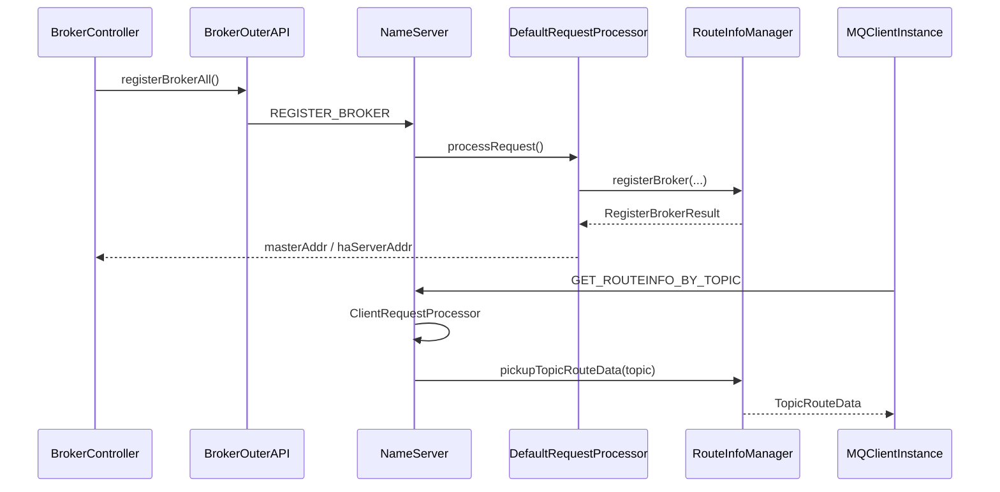

`RouteInfoManager` 的核心内存表包括：

* `topicQueueTable`：Topic 到队列数据。
* `brokerAddrTable`：BrokerName 到 Broker 地址。
* `clusterAddrTable`：集群到 BrokerName 集合。
* `brokerLiveTable`：Broker 活跃信息。
* Filter Server、Topic 队列映射等附加结构。

Broker 注册时，NameServer 更新 Broker、集群、存活状态和 Topic 队列信息；客户端查询时，`ClientRequestProcessor.getRouteInfoByTopic` 调用 `pickupTopicRouteData` 组装路由。

---

## 18.7 Producer 发送调用链

### 18.7.1 经典 Remoting 发送链

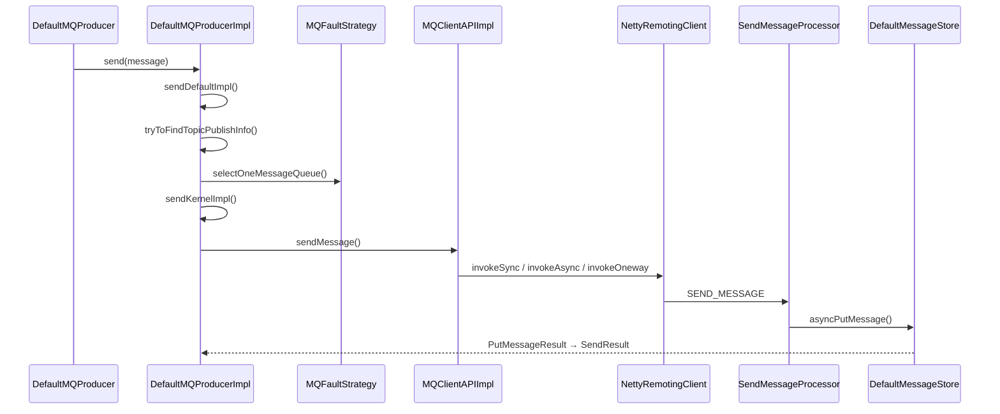

关键方法如下：

```text
DefaultMQProducerImpl.sendDefaultImpl
  → tryToFindTopicPublishInfo
    → MQClientInstance.updateTopicRouteInfoFromNameServer
  → MQFaultStrategy.selectOneMessageQueue
  → sendKernelImpl
    → 获取 Broker 地址
    → 设置 uniqId、压缩、事务和延迟属性
    → 构造 SendMessageRequestHeader
    → MQClientAPIImpl.sendMessage
```

`sendDefaultImpl` 负责重试循环和总超时预算，`sendKernelImpl` 负责单次实际发送。因此，阅读重试时看前者，阅读报文构造和网络调用时看后者。

### 为什么发送超时会产生重复消息

典型情况是：

1. Broker 已经完成 CommitLog 追加。
2. Broker 返回响应时网络中断。
3. Producer 未收到成功响应。
4. Producer 选择另一个队列或 Broker 重试。
5. 同一业务消息被写入两次。

所以客户端超时只表示：

> 在超时预算内，没有获得可确认的成功结果。

它不表示 Broker 一定没有收到消息。业务侧仍需以 Message Key、业务主键或幂等表去重。

### 18.7.2 5.x gRPC、Proxy 发送链

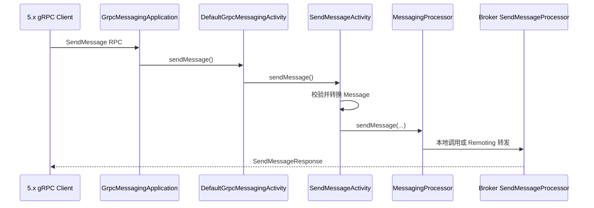

Proxy 入口不是 `SendMessageProcessor`。它首先进入：

```text
GrpcMessagingApplication.sendMessage
  → DefaultGrpcMessagingActivity.sendMessage
    → SendMessageActivity.sendMessage
      → MessagingProcessor.sendMessage
        → Broker SendMessageProcessor
```

Proxy 的职责是协议适配、认证、路由选择、请求校验和响应转换；最终存储仍由 Broker 完成。经典 Remoting 客户端则不必经过 Proxy。

---

## 18.8 Broker 写入、刷盘、复制与索引分发

### 18.8.1 写入主链

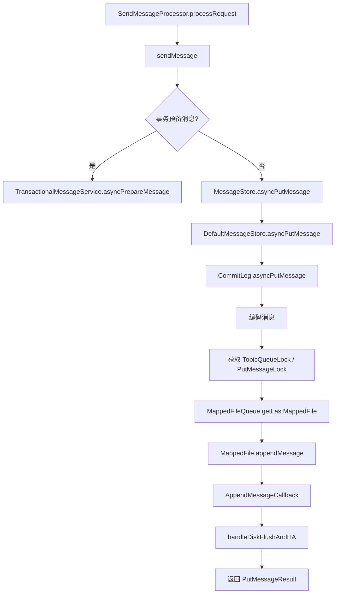

`SendMessageProcessor` 完成权限、Topic、Queue、重试次数、DLQ 和事务标记等检查，然后调用 `MessageStore`。在异步路径中，普通消息进入 `MessageStore.asyncPutMessage`，事务预备消息进入事务服务。

`DefaultMessageStore.asyncPutMessage` 执行 Put Hook 后调用 `CommitLog.asyncPutMessage`。CommitLog 会：

1. 编码消息。
2. 对 Topic-Queue 维度加细粒度锁。
3. 获取全局追加锁。
4. 获取或创建最后一个 `MappedFile`。
5. 调用 `MappedFile.appendMessage`。
6. 更新逻辑队列 Offset。
7. 组合刷盘和 HA 复制结果。

5.5.0 中最后一步集中在 `handleDiskFlushAndHA`：刷盘 Future 与复制 Future 组合后，才得到最终 `PutMessageResult`。

### 18.8.2 刷盘链

```text
CommitLog.handleDiskFlushAndHA
  → handleDiskFlush
    → flushManager.handleDiskFlush
      → ASYNC_FLUSH:
           FlushRealTimeService
           可选 CommitRealTimeService
      → SYNC_FLUSH:
           GroupCommitService
           等待 GroupCommitRequest 完成
```

必须区分三个概念：

| 概念              | 含义                          |
| --------------- | --------------------------- |
| Write Position  | 消息已经复制到 MappedFile 对应内存区域   |
| Commit Position | 使用堆外瞬时池时，数据已提交到 FileChannel |
| Flush Position  | 数据已要求刷入磁盘                   |

`PUT_OK`、`FLUSH_DISK_TIMEOUT` 和 `FLUSH_SLAVE_TIMEOUT` 不是“消息有或没有”的简单二值关系。后两者通常表示等待确认超时，消息仍可能已经写入本机或副本。

### 18.8.3 ConsumeQueue 与 IndexFile 分发

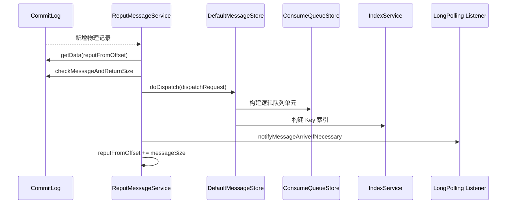

CommitLog 是消息本体的物理顺序日志；ConsumeQueue 主要记录：

```text
CommitLog 物理偏移
消息大小
Tag Hash 或扩展信息
```

IndexFile 根据 Message Key 建立哈希索引，用于按 Key 查询。

经典源码题经常描述：

```text
CommitLogDispatcherBuildConsumeQueue
CommitLogDispatcherBuildIndex
```

在 5.5.0 中还应注意 `CommitLogDispatchStore` 抽象：`DefaultMessageStore.load` 会注册 ConsumeQueue Store、IndexService，以及可选的 RocksDB Index、事务 RocksDB Store。`ReputMessageService.doReput` 从 CommitLog 读取消息并调用 `doDispatch`。

---

## 18.9 经典 Pull 消费调用链

RocketMQ 经典 PushConsumer 的“Push”并不是 Broker 主动建立无限推送流，而是客户端内部持续发起 Pull，并结合 Broker 长轮询模拟实时推送。

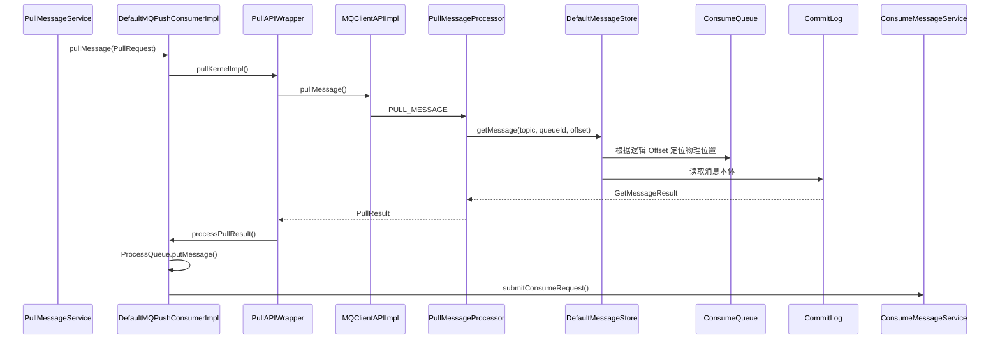

当没有新消息且请求允许挂起时，Broker 将请求交给长轮询服务；Reput 分发新消息后触发到达通知，再唤醒对应请求。客户端获得消息后放入本地 `ProcessQueue`，再由并发或顺序消费服务提交给业务监听器。

### 为什么先查 ConsumeQueue 再读 CommitLog

如果每次消费都从 CommitLog 顺序扫描：

* 无法快速定位某个 Topic 的某个 Queue。
* 无法根据 QueueOffset 直接跳转。
* 不同 Topic 的消息混在物理日志中，筛选成本高。

ConsumeQueue 相当于按 Topic 和 Queue 建立的稀疏逻辑索引；找到物理偏移后，再读取 CommitLog 中的完整消息。

---

## 18.10 5.x POP、ReceiveMessage 与 ACK

### 18.10.1 ReceiveMessage 链

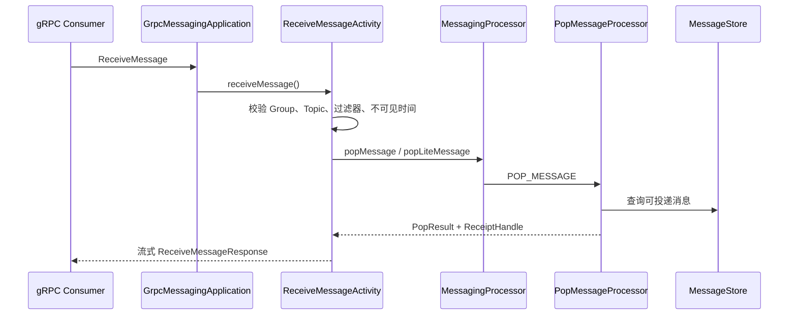

`ReceiveMessageActivity` 根据客户端类型进入 `popMessage` 或 `popLiteMessage`，并处理长轮询时间、不可见时间、过滤表达式、FIFO 标记和 ReceiptHandle。

POP 的语义是：

1. Broker 选取一批可见消息。
2. 为其创建消费检查点。
3. 在不可见时间内不再投递给其他消费者。
4. 客户端处理成功后发送 ACK。
5. 未 ACK 且不可见时间到期后，消息重新可见或进入重试流程。

### 18.10.2 ACK 链

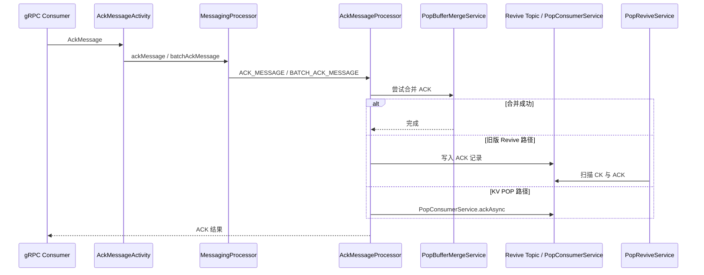

`AckMessageProcessor` 支持单条和批量 ACK。旧路径会先尝试写入 `PopBufferMergeService`，无法合并时将 ACK 作为延迟记录写入 Revive Topic；5.5.0 还存在 `popConsumerKVServiceEnable` 分支，进入 `PopConsumerService.ackAsync`。

经典 Pull 和 POP 的主要差别：

| 维度     | 经典 Pull                 | POP                              |
| ------ | ----------------------- | -------------------------------- |
| 进度核心   | 连续 ConsumerOffset       | ReceiptHandle、检查点和不可见时间          |
| 成功确认   | 提交下一消费 Offset           | ACK 指定消息                         |
| 失败处理   | Send Back 到 Retry Topic | 不 ACK、修改不可见时间或 Revive            |
| 批次乱序完成 | 较难跳过中间消息                | 可以逐条 ACK                         |
| 典型客户端  | 经典 Push/Pull Consumer   | 5.x SimpleConsumer、gRPC Consumer |

---

## 18.11 Rebalance 与 Offset

### 18.11.1 Rebalance 主链

```text
RebalanceService.run
  → MQClientInstance.doRebalance
    → DefaultMQPushConsumerImpl.doRebalance
      → RebalanceImpl.doRebalance
        → 对每个订阅 Topic：
          ├─ rebalanceByTopic
          │   → 获取 MessageQueue 集合
          │   → 获取 Consumer ID 集合
          │   → AllocateMessageQueueStrategy.allocate
          │   → updateProcessQueueTableInRebalance
          │   → 创建 ProcessQueue 与 PullRequest
          └─ getRebalanceResultFromBroker
              → queryAssignment
              → updateMessageQueueAssignment
```

5.5.0 源码中同时存在两种路径：

* 客户端获取队列和消费者列表后自行分配。
* 从 Broker 查询 Assignment，再更新本地 ProcessQueue 或 PopProcessQueue。

`RebalanceService` 默认通过系统属性读取等待间隔，平衡失败时会使用更短的最小间隔重试。

`updateProcessQueueTableInRebalance` 做三件事：

1. 将不再属于当前实例的 `ProcessQueue` 标记为 dropped。
2. 持久化旧队列进度并移除。
3. 为新队列计算起始 Offset，创建 `ProcessQueue` 和 `PullRequest`。

对于顺序消费，还必须先获得 Broker 侧队列锁。

### 18.11.2 Offset 提交链

```text
消费成功
  → OffsetStore.updateOffset(nextOffset)
  → RemoteBrokerOffsetStore.persist / persistAll
  → MQClientAPIImpl.updateConsumerOffsetOneway
  → Broker ConsumerManageProcessor.updateConsumerOffset
  → ConsumerOffsetManager.commitOffset
  → Broker 周期持久化
```

集群消费一般使用 `RemoteBrokerOffsetStore`；广播消费通常使用 `LocalFileOffsetStore`。

最容易答错的是 Offset 的含义：

> 提交值通常是“下一条准备消费的消息位置”，而不是“刚消费完成那条消息的位置”。

`RemoteBrokerOffsetStore` 先在客户端内存维护 Offset，周期性调用 `persistAll`；Broker 的 `ConsumerManageProcessor` 收到请求后调用 `ConsumerOffsetManager.commitOffset`。

---

## 18.12 重试、DLQ 与顺序消费

### 18.12.1 经典并发消费重试

```text
ConsumeMessageConcurrentlyService.processConsumeResult
  → 判断成功条数和消费状态
  → sendMessageBack
    → DefaultMQPushConsumerImpl.sendMessageBack
      → MQClientAPIImpl.consumerSendMessageBack
        → Broker SendMessageProcessor.consumerSendMsgBack
          → reconsumeTimes + 1
          → 写入 %RETRY%ConsumerGroup
          → 超过最大次数：
             写入 %DLQ%ConsumerGroup
```

重试消息不是在原 Topic 原 Queue 中原地等待，而是被重新构造成消息并写入重试 Topic。达到最大重试次数后进入死信 Topic。Broker 对重试次数、Topic 是否存在、队列选择和延迟级别进行处理。

POP 失败则更多依赖不可见时间和 Revive 流程，不应直接套用经典 `CONSUMER_SEND_MSG_BACK` 的解释。

### 18.12.2 顺序消费链

```text
相同业务 ShardingKey
  → Producer 选择同一 MessageQueue
  → Rebalance 获得队列所有权
  → Broker 侧 lockBatchMQ
  → ConsumeMessageOrderlyService
  → 锁定本地 ProcessQueue
  → 串行调用业务监听器
  → 连续成功后更新 Offset
```

顺序消息需要同时满足：

* 发送顺序：同一业务键进入同一 Queue。
* 存储顺序：Broker 对该 Queue 的 Offset 顺序追加。
* 消费顺序：同一 Queue 在同一时刻由一个消费实例处理。
* 失败顺序：前一条失败时，不能直接越过它提交后续 Offset。

RocketMQ 保证的是 **Queue 级局部顺序**，不是跨 Queue 的全局顺序。

---

## 18.13 延迟消息源码链

### 18.13.1 经典延迟级别

```text
SendMessageProcessor / Put Hook
  → 保存真实 Topic、Queue 属性
  → 改写为 SCHEDULE_TOPIC_XXXX
  → 根据 delayLevel 写入对应 Queue
  → ScheduleMessageService
    → DeliverDelayedMessageTimerTask
    → 扫描对应 ConsumeQueue
    → 判断 deliverTimestamp
    → messageTimeUp
    → 恢复真实 Topic、Queue
    → 再次写入 MessageStore
```

`ScheduleMessageService` 为每个延迟级别维护 Delay Time 与消费进度，启动时为各级别创建投递任务，并周期持久化 Delay Offset。

### 18.13.2 5.x Timer Wheel

```text
定时消息写入
  → Timer Topic
  → TimerEnqueueGetService
  → TimerEnqueuePutService
  → TimerLog + TimerWheel
  → 到达目标槽位
  → TimerDequeueGetService
  → TimerDequeueGetMessageService
  → TimerDequeuePutMessageService
  → 恢复并重新写入真实 Topic
```

`TimerMessageStore` 内部包含：

* `TimerWheel`
* `TimerLog`
* `TimerCheckpoint`
* `TimerEnqueueGetService`
* `TimerEnqueuePutService`
* `TimerDequeueGetService`
* `TimerDequeuePutMessageService`
* `TimerFlushService`

这条链解决了经典固定延迟级别不够灵活的问题，但本质仍不是“消息在 CommitLog 中睡眠后自动变可见”，而是经过定时索引和到期重新投递。

---

## 18.14 事务消息：Half、EndTransaction 与 Check

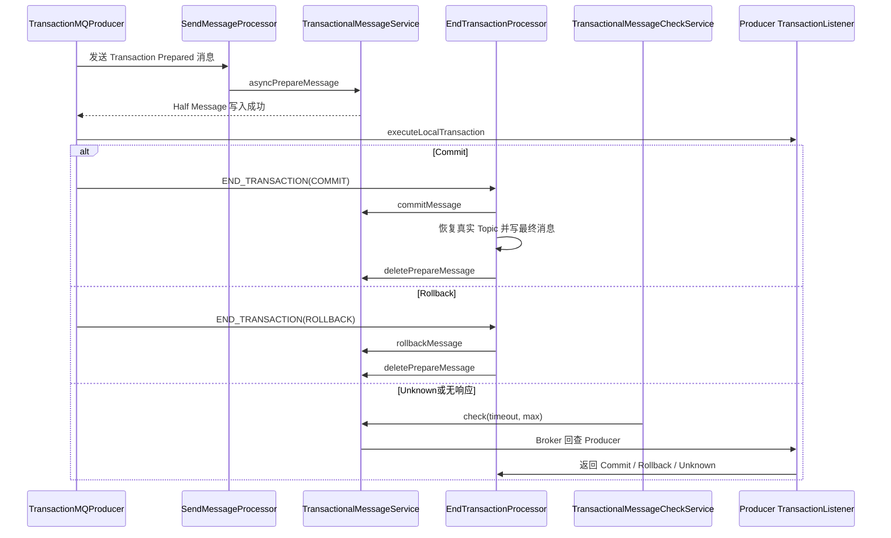

事务发送可拆成三个阶段：

### 阶段一：Half Message

Producer 给消息设置事务预备标志。Broker 的 `SendMessageProcessor` 识别后进入：

```text
TransactionalMessageService.asyncPrepareMessage
```

Half Message 写入内部事务 Topic，普通消费者无法从原业务 Topic 看到它。

### 阶段二：EndTransaction

Producer 执行本地事务后，发送 Commit、Rollback 或 Unknown：

```text
EndTransactionProcessor.processRequest
  → commitMessage / rollbackMessage
```

Commit 时，Broker 校验 ProducerGroup、事务状态表 Offset 和 CommitLog Offset，恢复真实 Topic、Queue 并写入最终消息；Rollback 时删除或标记 Half Message。

### 阶段三：事务回查

`TransactionalMessageCheckService` 周期执行：

```text
TransactionalMessageService.check(
    transactionTimeOut,
    transactionCheckMax,
    transactionalMessageCheckListener
)
```

随后 Broker 向 Producer 发起事务状态回查。Producer 根据本地事务记录返回 Commit、Rollback 或 Unknown。

事务消息保证的是：

> Broker 消息最终状态与 Producer 本地事务状态能够通过回查收敛。

它不会自动保证消费者数据库操作幂等，也不能替代业务补偿机制。

---

## 18.15 HA 复制调用链

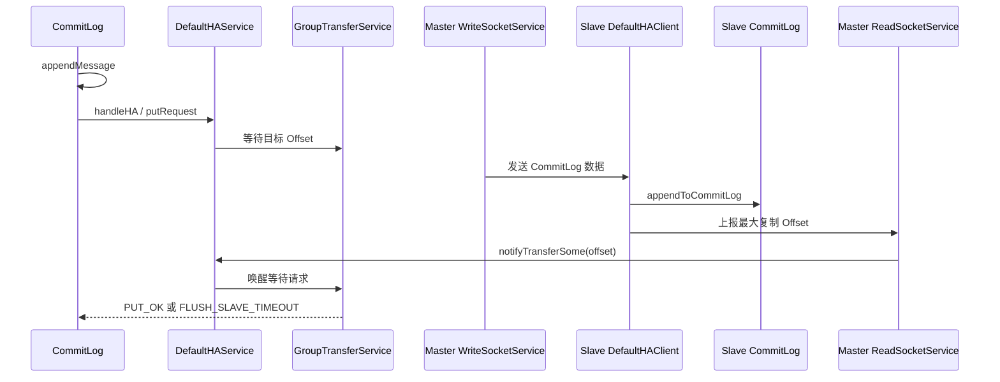

`DefaultHAService` 初始化：

* `AcceptSocketService`
* `GroupTransferService`
* Slave 角色下的 `DefaultHAClient`
* HA 连接状态通知服务

Master 接受 Slave 连接后创建 `DefaultHAConnection`。连接中的写线程将 CommitLog 数据发送给 Slave，读线程接收 Slave 的确认 Offset。`notifyTransferSome` 更新 `push2SlaveMaxOffset` 并唤醒等待复制的请求。

### ASYNC_MASTER 与 SYNC_MASTER

| 模式             | Producer 返回条件                  | 主要风险                     |
| -------------- | ------------------------------ | ------------------------ |
| `ASYNC_MASTER` | 本机写入和相应刷盘条件完成                  | Master 突然故障时，尚未复制的数据可能丢失 |
| `SYNC_MASTER`  | 还需等待副本确认或超时                    | 副本慢会增加发送延迟               |
| Controller 模式  | 结合 SyncStateSet、Epoch 和最小同步副本数 | 配置不合理可能降低可用性或可靠性         |

5.5.0 的 `CommitLog` 会根据 `inSyncReplicas`、`minInSyncReplicas`、Controller 模式和 SyncStateSet 计算需要的确认数量，然后将刷盘 Future 和 HA Future 合并。

---

## 18.16 Controller 选主与 Broker 角色切换

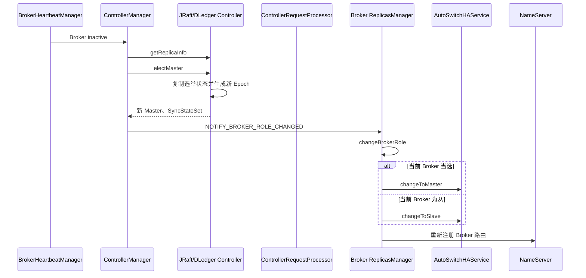

`ControllerManager.initialize` 根据配置创建：

* `JRaftController`
* 或 `DLedgerController`

同时初始化 Broker 心跳管理器、生命周期监听器和 `ControllerRequestProcessor`。当心跳管理器发现失活 Broker 恰好是 Master 时，`ControllerManager.onBrokerInactive` 触发 `electMaster`，成功后通知存活 Broker。

Broker 侧由 `ReplicasManager` 维护状态机：

```text
INITIAL
  → FIRST_TIME_SYNC_CONTROLLER_METADATA_DONE
  → REGISTER_TO_CONTROLLER_DONE
  → RUNNING
  → SHUTDOWN
```

收到新角色后：

```text
ReplicasManager.changeBrokerRole
  → changeToMaster
      → AutoSwitchHAService.changeToMaster
      → brokerId 改为 Master
      → 启动 Master 专属服务
  或
  → changeToSlave
      → 停止 Master 专属服务
      → AutoSwitchHAService.changeToSlave
      → 连接新 Master
  → registerBrokerWhenRoleChange
```

Controller 与 NameServer 解决的问题不同：

| 组件              | 核心职责                                 |
| --------------- | ------------------------------------ |
| NameServer      | 发布当前 Broker 和 Topic 路由               |
| Controller      | 维护副本组元数据、Master、Epoch 和 SyncStateSet |
| HA Service      | 在 Broker 间实际传输 CommitLog             |
| ReplicasManager | 在 Broker 内执行角色变化                     |

---

## 18.17 文件恢复与清理

### 18.17.1 正常和异常恢复

```text
DefaultMessageStore.load
  → 判断 abort 临时文件是否存在
  → CommitLog.load
  → ConsumeQueueStore.load
  → IndexService.load
  → recover(lastExitOK)
    → ConsumeQueueStore.recover
    → 计算最小 dispatchFromPhyOffset
    → lastExitOK:
         CommitLog.recoverNormally
      否则:
         CommitLog.recoverAbnormally
    → recoverTopicQueueTable
```

正常关闭时，Broker 删除 abort 文件；异常退出时该文件保留。启动后据此选择正常或异常恢复。异常恢复会从靠后的 CommitLog 文件扫描消息结构、Magic Code、长度和 CRC，找到最后一个有效位置，并截断无效数据。随后清理超出有效物理位置的 ConsumeQueue 数据。

恢复完成后，`ReputMessageService` 从确定的物理位置继续分发，补齐 ConsumeQueue 和 Index。Broker 在 Reput 落后量未追平时，不应过早对外提供完全一致的读服务。

### 18.17.2 文件清理

核心后台服务包括：

```text
CleanCommitLogService
CleanConsumeQueueService
```

触发条件通常包括：

* 到达 `deleteWhen` 指定时段。
* 文件超过 `fileReservedTime`。
* 磁盘使用率超过 `diskMaxUsedSpaceRatio`。
* 磁盘进入强制清理阈值。
* 管理命令触发手动清理。

删除顺序必须遵循物理依赖：

1. 删除过期 CommitLog。
2. 得到新的最小物理 Offset。
3. 删除引用更早物理 Offset 的 ConsumeQueue 和 Index。
4. 通过引用计数和延迟机制处理仍被读取的 MappedFile。

磁盘满不是单纯“清理线程没运行”。还要检查文件保留时间、删除时段、引用未释放、磁盘挂载、权限、冷数据策略和分发落后量。

---

## 18.18 使用 Go 实现四个简化教学模型

以下代码只表达核心思想，不是 RocketMQ 的完整实现。

### 18.18.1 路由缓存

```go
type Route struct {
	Brokers   []string
	QueueNum  int
	ExpiresAt time.Time
}

type RouteCache struct {
	mu    sync.RWMutex
	ttl   time.Duration
	items map[string]Route
}

func (c *RouteCache) Get(
	ctx context.Context,
	topic string,
	load func(context.Context, string) (Route, error),
) (Route, error) {
	c.mu.RLock()
	r, ok := c.items[topic]
	c.mu.RUnlock()

	if ok && time.Now().Before(r.ExpiresAt) {
		return r, nil
	}

	r, err := load(ctx, topic)
	if err != nil {
		return Route{}, err
	}
	r.ExpiresAt = time.Now().Add(c.ttl)

	c.mu.Lock()
	c.items[topic] = r
	c.mu.Unlock()
	return r, nil
}
```

生产实现还应增加 singleflight、失败回退、路由版本比较和 Broker 地址变更处理。

### 18.18.2 Append Log

```go
type AppendLog struct {
	mu  sync.Mutex
	f   *os.File
	pos int64
}

func (l *AppendLog) Append(body []byte, syncFlush bool) (int64, error) {
	record := make([]byte, 8+len(body))
	binary.BigEndian.PutUint32(record[0:4], uint32(len(body)))
	binary.BigEndian.PutUint32(record[4:8], crc32.ChecksumIEEE(body))
	copy(record[8:], body)

	l.mu.Lock()
	defer l.mu.Unlock()

	offset := l.pos
	n, err := l.f.WriteAt(record, offset)
	if err != nil {
		return 0, err
	}
	if n != len(record) {
		return 0, io.ErrShortWrite
	}

	l.pos += int64(n)
	if syncFlush {
		if err := l.f.Sync(); err != nil {
			return 0, err
		}
	}
	return offset, nil
}
```

这个模型体现了 CommitLog 的三个关键点：顺序追加、记录完整性和刷盘策略。

### 18.18.3 消费 Offset

```go
type Queue struct {
	Topic string
	ID    int
}

type OffsetStore struct {
	mu        sync.Mutex
	current   map[Queue]int64
	committed map[Queue]int64
}

func (s *OffsetStore) MarkNext(q Queue, next int64) {
	s.mu.Lock()
	defer s.mu.Unlock()

	if next > s.current[q] {
		s.current[q] = next
	}
}

func (s *OffsetStore) Commit(
	q Queue,
	save func(Queue, int64) error,
) error {
	s.mu.Lock()
	next := s.current[q]
	s.mu.Unlock()

	if err := save(q, next); err != nil {
		return err
	}

	s.mu.Lock()
	s.committed[q] = next
	s.mu.Unlock()
	return nil
}
```

正确顺序应是：业务处理成功，再更新待提交 Offset；远端保存成功后，才更新 committed 状态。

### 18.18.4 简化 Rebalance

```go
func AllocateAverage(
	queues []Queue,
	consumers []string,
	me string,
) []Queue {
	sort.Slice(queues, func(i, j int) bool {
		if queues[i].Topic == queues[j].Topic {
			return queues[i].ID < queues[j].ID
		}
		return queues[i].Topic < queues[j].Topic
	})
	sort.Strings(consumers)

	index := sort.SearchStrings(consumers, me)
	if index >= len(consumers) || consumers[index] != me {
		return nil
	}

	base := len(queues) / len(consumers)
	extra := len(queues) % len(consumers)

	size := base
	if index < extra {
		size++
	}

	start := index*base + min(index, extra)
	end := min(start+size, len(queues))
	return append([]Queue(nil), queues[start:end]...)
}
```

所有实例必须基于同一份已排序 Queue 和 Consumer 列表执行确定性算法，否则会出现同一 Queue 被多个实例同时认为属于自己的情况。

---

## 18.19 两周源码阅读清单

| 天数 | 阅读主题                                         | 必须输出                  |
| -: | -------------------------------------------- | --------------------- |
|  1 | 根 POM、模块结构、配置类                               | 模块依赖图                 |
|  2 | `NamesrvStartup`、`NamesrvController`         | NameServer 启动图        |
|  3 | `RouteInfoManager`、两个 RequestProcessor       | 注册和查询时序图              |
|  4 | `BrokerStartup`、`BrokerController`           | Broker 初始化阶段表         |
|  5 | `DefaultMQProducerImpl`                      | 发送重试状态机               |
|  6 | `SendMessageProcessor`、`DefaultMessageStore` | Processor 到 Store 调用链 |
|  7 | `CommitLog`、`MappedFileQueue`、`MappedFile`   | 单条消息物理布局              |
|  8 | Reput、ConsumeQueue、Index                     | 异步分发图                 |
|  9 | `PullAPIWrapper`、`PullMessageProcessor`      | Pull 与长轮询图            |
| 10 | POP、ReceiveMessage、ACK                       | ReceiptHandle 生命周期    |
| 11 | Rebalance、Offset、Retry、Orderly               | 队列所有权状态机              |
| 12 | Schedule、Timer、Transaction                   | 延迟与事务对比图              |
| 13 | HA、Controller、ReplicasManager                | 故障切换时间线               |
| 14 | Recovery、Clean、测试用例                          | 一份源码面试讲稿              |

每天遵守三个输出要求：

* 画一张调用链图。
* 写出五个关键方法。
* 用一句话解释该模块的核心不变量。

例如 CommitLog 的核心不变量可以写成：

> 所有消息按物理 Offset 顺序追加，已确认的有效位置之前不能出现无法解析的记录。

---

## 18.20 源码面试题

> **题目去重**：本节作为本章源码自测，只保留调用链、模块入口、关键类和源码阅读方法题。跨章重复题、完整追问链和模拟面试统一跳转到 [第 20 章：资深面试题库、追问链与模拟面试](/blog/tech/RocketMQ/20.RocketMQ资深面试题库、追问链与模拟面试)。

|  # | 问题与回答要点                                                                                                                                  | 面试官真正考察的能力   |
| -: | ---------------------------------------------------------------------------------------------------------------------------------------- | ------------ |
|  1 | **为什么读 tag 而不是 master？** 固定版本才能保证类名、配置和生产行为一致。                                                                                           | 工程严谨性        |
|  2 | **NameServer 为什么可以无状态部署？** 各节点独立接收 Broker 注册，路由主要在内存维护，客户端可配置多个节点。                                                                       | 路由架构理解       |
|  3 | **Broker 注册入口在哪里？** `BrokerController.registerBrokerAll` 经 `BrokerOuterAPI` 到 `DefaultRequestProcessor.registerBroker`。                  | 跨模块追踪        |
|  4 | **路由查询入口在哪里？** `ClientRequestProcessor.getRouteInfoByTopic` 调用 `RouteInfoManager.pickupTopicRouteData`。                                  | 请求码定位        |
|  5 | **Producer 路由缓存失效怎么办？** 发送发现无路由或 Broker 地址不存在时重新向 NameServer 拉取。                                                                         | 缓存一致性        |
|  6 | **`sendDefaultImpl` 和 `sendKernelImpl` 有何区别？** 前者管理重试和总超时，后者完成单次发送。                                                                      | 分层抽象         |
|  7 | **发送超时是否等于发送失败？** 不等于，Broker 可能已写入但响应丢失。                                                                                                 | 分布式不确定性      |
|  8 | **为什么重试可能换 Queue？** 故障规避和队列选择会避开失败 Broker，因此会破坏未显式约束的发送顺序。                                                                               | 重试副作用        |
|  9 | **`SendMessageProcessor` 为什么不直接写文件？** Processor 处理协议与业务规则，Store 封装存储语义。                                                                  | 模块边界         |
| 10 | **CommitLog 为什么适合顺序写？** 所有 Topic 消息合并成物理顺序日志，减少随机写。                                                                                      | 存储原理         |
| 11 | **CommitLog 写入为什么仍需锁？** 需要保证物理位置、QueueOffset 和消息编码一致地推进。                                                                                 | 并发正确性        |
| 12 | **同步刷盘和异步刷盘的源码差异？** 同步通过 GroupCommit 请求等待 Flush，异步由后台 Flush 服务推进。                                                                        | Future 与线程模型 |
| 13 | **`FLUSH_DISK_TIMEOUT` 是否说明消息没写入？** 不一定，只说明等待刷盘确认超时。                                                                                     | 状态码语义        |
| 14 | **ConsumeQueue 为什么异步构建？** 将主写链保持为 CommitLog 顺序追加，逻辑索引可由 Reput 后台补建。                                                                      | 写放大权衡        |
| 15 | **Reput 落后有什么后果？** 消息已经在 CommitLog，但消费、索引查询或长轮询通知可能暂时不可见。                                                                                | 最终一致性        |
| 16 | **IndexFile 能否替代数据库索引？** 不能，它用于消息 Key 定位，存在哈希冲突和保留周期约束。                                                                                  | 使用边界         |
| 17 | **PushConsumer 是否由 Broker 主动 Push？** 经典实现本质是客户端 Pull 加 Broker 长轮询。                                                                       | 名称与实现区分      |
| 18 | **长轮询请求如何被唤醒？** Reput 分发后触发消息到达监听器，唤醒挂起的 Pull 请求。                                                                                        | 异步联动         |
| 19 | **POP 与 Pull 最大区别是什么？** POP 使用检查点、ReceiptHandle 和不可见时间进行逐条确认。                                                                            | 5.x 消费模型     |
| 20 | **ACK 为什么还要写 Revive 记录？** 需要可靠关联 POP 检查点与成功确认，避免 Broker 重启后状态丢失。                                                                         | ACK 可靠性      |
| 21 | **Rebalance 的入口线程是什么？** `RebalanceService` 周期调用 `MQClientInstance.doRebalance`。                                                          | 后台线程定位       |
| 22 | **为什么分配前要排序？** 确保所有消费者在相同输入下得到确定性结果。                                                                                                     | 分布式确定性       |
| 23 | **消费者多于 Queue 会怎样？** 多出的消费者分不到 Queue，处于空闲状态。                                                                                             | 并发度上限        |
| 24 | **移除 ProcessQueue 前为什么持久化 Offset？** 避免新所有者从旧位置重复消费过多消息。                                                                                  | 所有权转移        |
| 25 | **提交 Offset 是当前消息还是下一条？** 通常提交下一条待消费位置。                                                                                                  | Offset 语义    |
| 26 | **重试消息如何进入 DLQ？** Send Back 时增加重试次数，超过上限后改写到 `%DLQ%Group`。                                                                               | 失败状态机        |
| 27 | **顺序消费为什么需要 Broker 锁和本地锁？** 前者保证 Queue 所有权，后者保证实例内串行处理。                                                                                  | 多层并发控制       |
| 28 | **延迟级别和 Timer Wheel 有什么不同？** 前者是固定级别扫描，后者按时间轮和 TimerLog 管理更精确时间。                                                                         | 版本演进         |
| 29 | **Half Message 为什么业务消费者不可见？** 它先写内部事务 Topic，Commit 后才恢复真实 Topic。                                                                         | 事务隔离         |
| 30 | **事务回查能否保证本地事务一定成功？** 不能，只能询问并收敛 Broker 消息状态，业务仍要记录事务结果。                                                                                 | 最终一致性边界      |
| 31 | **同步复制等待什么？** 等待副本确认 Offset 达到消息结束位置，而不是仅等待 TCP 写成功。                                                                                     | 复制确认语义       |
| 32 | **Controller 是否传输消息数据？** 不传，数据复制由 HA Service 完成，Controller 管理副本元数据和选主。                                                                   | 控制面与数据面      |
| 33 | **为什么需要 Master Epoch？** 防止旧 Master 或过期角色继续以合法 Master 身份写入。                                                                               | 脑裂防护         |
| 34 | **异常恢复为什么要截断 ConsumeQueue？** CQ 可能引用 CommitLog 已被截断的无效物理位置。                                                                              | 多文件一致性       |
| 35 | **清理 CommitLog 时为什么不能立即删除所有过期文件？** 文件可能仍被读取或引用，需要引用计数和强制销毁等待期。                                                                           | 资源生命周期       |
| 36 | **4.x 经典源码题在 5.x 最大变化是什么？** 新增 Proxy/gRPC、POP、Broker Assignment、Timer Wheel、Controller 和更多可插拔存储，但 CommitLog、Processor、Rebalance 等经典主干仍在。 | 版本迁移能力       |

---

## 18.21 本章总结

RocketMQ 源码可以归纳为四条主线：

```text
控制面：
NameServer 路由 + Controller 选主

写入面：
Producer → Processor → MessageStore → CommitLog → Flush/HA

索引面：
CommitLog → Reput → ConsumeQueue/Index → 消息到达通知

消费面：
Pull 或 POP → 本地处理 → Offset 或 ACK → Retry/DLQ
```

面试中最有价值的不是背出所有类名，而是能沿着以下框架稳定回答：

```text
入口是什么？
RequestCode 由谁处理？
数据进入哪个 Store？
异步流程由哪个线程推进？
成功条件由哪些 Offset 决定？
失败后状态如何收敛？
哪些配置会改变这条路径？
```

只要能够将一条消息从客户端 API 追踪到 CommitLog，再从 CommitLog 追踪到 ConsumeQueue、消费者、Offset 或 ACK，并进一步解释刷盘、复制、恢复和选主，就已经具备了从“会使用 RocketMQ”进入“能够分析 RocketMQ”的源码能力。

## 18.22 本章源码基线与官方来源

* 稳定版本：`Apache RocketMQ 5.5.0`
* 源码 tag：`rocketmq-all-5.5.0`
* 根 POM 与模块列表。
* NameServer：`NamesrvStartup`、`NamesrvController`、`RouteInfoManager`。
* Broker：`BrokerStartup`、`BrokerController`、各类 Processor。
* 存储：`DefaultMessageStore`、`CommitLog`、`ReputMessageService`。
* Proxy/gRPC：`GrpcMessagingApplication`、`ReceiveMessageActivity`、`AckMessageActivity`。
* Controller：`ControllerManager`、`ReplicasManager`。

[1]: https://github.com/apache/rocketmq/releases?utm_source=chatgpt.com "Releases · apache/rocketmq"
