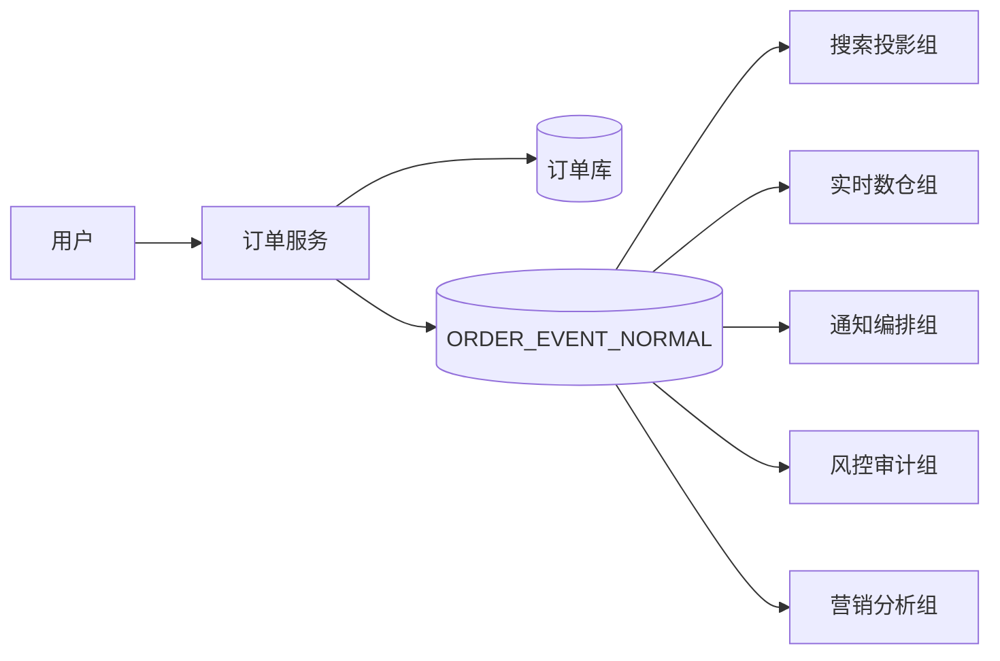
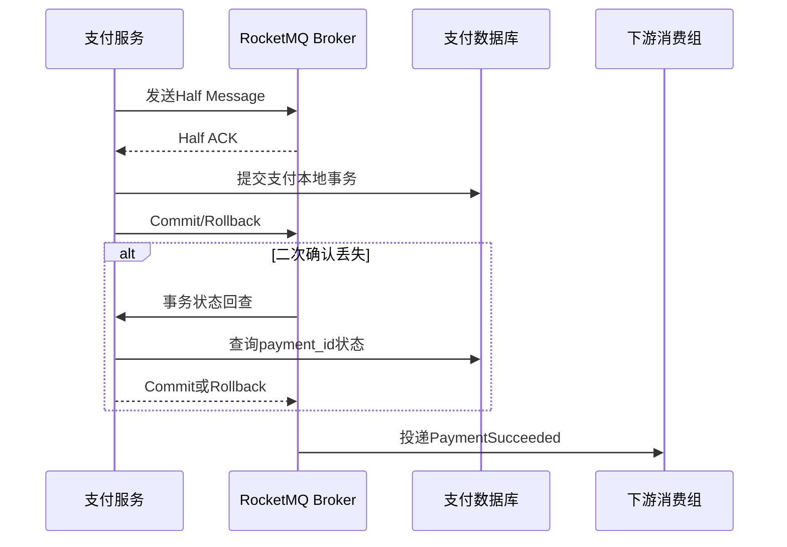
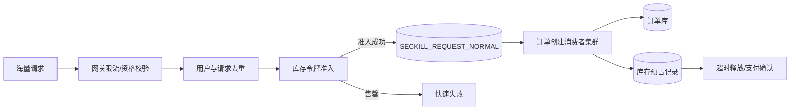
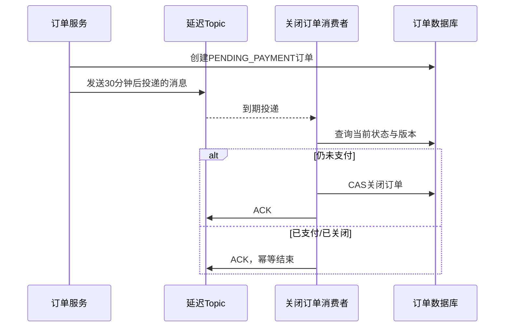
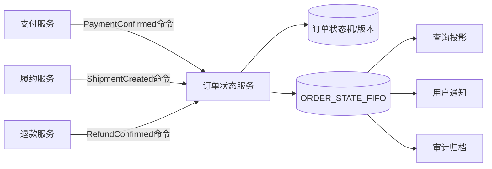
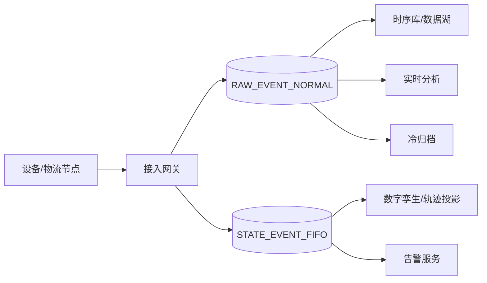
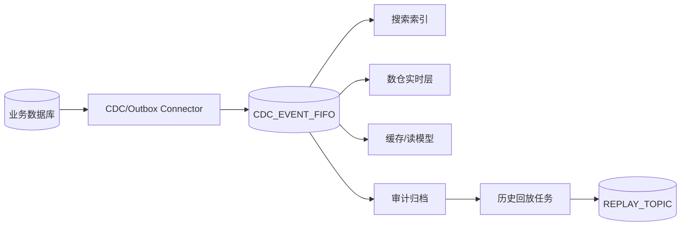
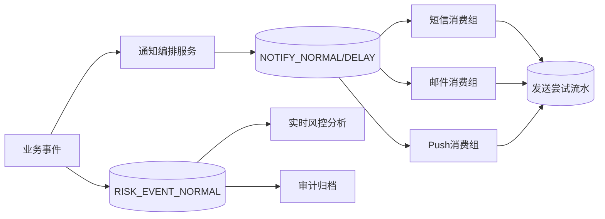
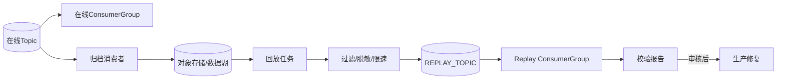
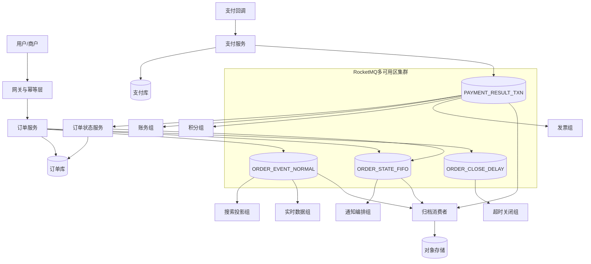

# 第 19 章：RocketMQ 业务架构设计、技术选型与复杂场景落地

> 本章技术基线为 **2026 年 6 月 20 日**：Apache RocketMQ 服务端最新发布版为 5.5.0；5.x Go 客户端仓库最新列出的 `golang/v5.1.4` 为预发布版本。生产系统应锁定经过压测、故障演练和兼容性验证的具体版本，而不是机械追随最新标签。

## 本章去重边界与跳转

本章是业务架构设计和复杂场景落地主讲章节，重点是“如何把前面能力组合成可上线方案”。基础概念、机制细节和源码不在这里重复展开。

| 重复主题 | 本章处理方式 |
| --- | --- |
| MQ 基础、选型和领域模型 | 本章只用于架构决策；基础看 [第 1 章](/blog/tech/RocketMQ/01.消息队列基础、业务价值与RocketMQ技术定位) 与 [第 2 章](/blog/tech/RocketMQ/02.RocketMQ整体架构、核心组件与领域模型)。 |
| Topic、Tag、Key、MessageGroup、ConsumerGroup | 本章只做方案规划；资源治理看 [第 12 章：资源治理](/blog/tech/RocketMQ/12.Topic、Tag、Key、SQL92、MessageQueue与资源治理)。 |
| 不丢、幂等、重试、DLQ、Outbox/Inbox | 本章只放业务闭环；机制细节看 [第 8 章：端到端可靠性](/blog/tech/RocketMQ/08.端到端消息可靠性、重试、死信队列与消费幂等)。 |
| 顺序、延迟、事务 | 本章只做场景组合；专项看 [第 9 章](/blog/tech/RocketMQ/09.FIFO顺序消息)、[第 10 章](/blog/tech/RocketMQ/10.延迟消息、定时消息与分布式任务调度)、[第 11 章](/blog/tech/RocketMQ/11.事务消息、HalfMessage、事务回查与最终一致性)。 |
| 容量、可观测性、安全与灾备 | 本章只给评审清单；专项看 [第 14 章](/blog/tech/RocketMQ/14.RocketMQ性能优化、流控、压测与容量规划)、[第 15 章](/blog/tech/RocketMQ/15.RocketMQ可观测性、故障诊断、应急处理与生产Runbook)、[第 16 章](/blog/tech/RocketMQ/16.RocketMQ安全、ACL、TLS、多租户隔离与跨集群灾备)。 |

## 19.1 学习目标：从“会用 MQ”升级为“会设计消息系统”

资深工程师面对消息系统时，首先问的不是“用普通消息还是事务消息”，而是以下问题：

1. **业务事实是什么**：消息代表已经发生的事件，还是要求下游执行的命令？
2. **一致性边界在哪里**：哪些状态必须同步成功，哪些允许最终一致？
3. **顺序范围是什么**：全局有序、订单内有序、用户内有序，还是根本不需要顺序？
4. **失败后谁负责收敛**：Broker 重试、业务补偿、人工介入分别处理什么错误？
5. **峰值而非日均是多少**：入口 TPS、Broker 写入量、消费放大量和存储量分别是多少？
6. **最坏故障是什么**：客户端超时、消费者宕机、单机房故障、跨地域灾难发生时，RPO 与 RTO 是多少？


### 19.1.1 “需求—消息能力—技术方案”决策表

| 业务需求 | 关键约束 | 消息能力 | 推荐技术方案 |
|---|---|---|---|
| 下单后异步通知多个系统 | 下游彼此独立 | 发布订阅、普通消息 | 一个业务事件，多个独立 ConsumerGroup |
| 本地事务与发消息一致 | 不能出现“库成功、消息永久缺失” | 事务消息或 Outbox | RocketMQ 事务消息；或本地 Outbox + CDC |
| 同一订单状态不能倒退 | 订单维度有序 | FIFO、版本号 | MessageGroup=`orderId`，并以状态版本做二次校验 |
| 30 分钟未支付关闭 | 定时触发但允许少量迟到 | 延迟消息 | 投递时间戳 + 消费时重新读取订单状态 |
| 秒杀削峰 | 瞬时流量远大于数据库能力 | 缓冲、限速 | 入口先准入，再用普通消息按数据库能力消费 |
| 防止超卖 | 原子扣减 | MQ 不能替代原子性 | Redis Lua、数据库条件更新或库存令牌；MQ 负责异步编排 |
| 多下游支付通知 | 高可靠、可独立重试 | 发布订阅、事务消息 | 支付结果事务消息 + 每个下游独立消费组 |
| CDC/日志汇聚 | 高吞吐、可回放 | 持久日志、分区 | 运营事件可用 RocketMQ；长保留分析链路优先评估 Kafka/Pulsar |
| 短信、邮件、Push | 外部供应商易失败 | 重试、DLQ、限流 | 渠道隔离、错误分类、幂等发送、供应商熔断 |
| 审计事件 | 不可遗漏、长期留存 | 可靠传输 | MQ 只做传输，最终写入不可变存储或审计库 |
| 历史数据补偿 | 可控回放 | 新消费进度或重放 Topic | 独立 Replay Group/Topic，限速且保留原始事件 ID |
| 强同步查询 | 用户必须立刻得到结果 | 请求响应 | 直接 RPC/数据库事务，不应为了“架构先进”强行上 MQ |

## 19.2 消息资源设计：名称不是重点，边界才是重点

RocketMQ 5.x 将 Topic 声明为 Normal、FIFO、Delay、Transaction 等消息类型，并建议不同消息类型使用不同 Topic。Topic 应按**业务域、消息语义、可靠性等级和环境**拆分，而不是按某个消费者拆分。一个可维护的命名示例是：

```text
ECOM_ORDER_EVENT_NORMAL_V1
ECOM_ORDER_STATE_FIFO_V1
ECOM_PAYMENT_RESULT_TXN_V1
ECOM_ORDER_CLOSE_DELAY_V1
```

### 19.2.1 Topic、Tag、Key 与 MessageGroup

- **Topic**：存储与权限隔离的一级边界。同一业务域但消息类型不同，应拆成不同 Topic；核心交易与海量日志也应隔离，避免噪声邻居。
- **Tag**：稳定、低基数的事件子类型，例如 `CREATED`、`PAID`、`CANCELLED`。不要把订单号、用户号放进 Tag。
- **Key**：用于定位消息的业务索引。优先设置全局唯一 `eventId`；`orderId`、`paymentId` 等放入属性和消息体，便于按业务维度追踪。
- **MessageGroup**：FIFO 的有序单元。订单状态用 `orderId`，物流轨迹用 `trackingNo`。分组过粗会制造热点，分组过细又无法表达顺序约束。
- **MessageQueue**：物理并行与负载分布单元。不要为了“绝对可控”长期手工固定某个队列；应通过高基数分组和足够队列数获得均衡。

RocketMQ 5.x 领域模型中的 Producer 是轻量、匿名实体，不再把 ProducerGroup 作为普通生产者必须规划的业务资源。因此，本章所说“生产者组设计”主要指**生产应用身份、权限、指标维度以及 4.x Remoting/事务生产者兼容场景**。不要把 4.x 的 ProducerGroup 概念生搬硬套到所有 5.x gRPC 客户端。

### 19.2.2 ConsumerGroup 的设计原则

ConsumerGroup 代表一套独立的消费进度、重试策略和业务职责。同组实例必须执行相同逻辑；不同职责必须分组。例如支付成功事件可由以下消费组独立订阅：

```text
CG_ORDER_SETTLEMENT_V1
CG_LEDGER_POSTING_V1
CG_INVOICE_CREATE_V1
CG_POINTS_GRANT_V1
CG_PAYMENT_NOTIFY_V1
CG_RISK_AUDIT_V1
```

不能只建一个“万能消费组”，在一个处理函数里串行调用订单、积分、发票和短信服务。那样会把所有下游的可用性重新耦合在一起，也无法独立扩容、回放和设置重试策略。

### 19.2.3 统一事件信封

```go
type EventEnvelope[T any] struct {
    EventID          string    `json:"event_id"`
    EventType        string    `json:"event_type"`
    SchemaVersion    int       `json:"schema_version"`
    AggregateID      string    `json:"aggregate_id"`
    AggregateVersion int64     `json:"aggregate_version"`
    OccurredAt       time.Time `json:"occurred_at"`
    TraceID          string    `json:"trace_id"`
    Source           string    `json:"source"`
    Payload          T         `json:"payload"`
}
```

`EventID` 用于幂等和追踪；`AggregateVersion` 用于阻止状态倒退；`SchemaVersion` 用于兼容演进。消息应传递完成业务所需的最小事实，而不是塞入巨大的数据库对象。RocketMQ 官方参数建议消息体小于 4 MB；图片、文件和大快照应存对象存储，消息只携带地址、摘要和版本。

### 19.2.4 可靠性闭环

端到端可靠性不是一个 Broker 参数，而是一组互相咬合的机制：

1. **生产可靠**：事务消息、Outbox、发送结果落库、超时结果核查。
2. **传输可靠**：合理刷盘与副本策略、多可用区部署、发送重试。
3. **消费可靠**：业务提交成功后再 ACK；消费者允许重复投递。
4. **幂等可靠**：唯一约束、状态机 CAS、外部接口幂等键。
5. **异常收敛**：有限重试、DLQ、补偿任务、对账和人工工作台。

消费重试只适合偶发、可恢复错误。业务分流不能靠“故意消费失败”，限流也不能靠让大量消息反复进入重试链路。永久性参数错误应尽快隔离；库存售罄、优惠券过期等正常业务结果应返回成功并记录结果，而不是无限重试。

### 19.2.5 容量估算公式

```text
入口消息TPS = 业务峰值TPS × 每笔业务产生的消息数
消费投递TPS = Σ(某Topic入口TPS × 独立消费组数量)
入口带宽 = 入口TPS × 平均消息大小
存储量 = 日消息数 × 平均大小 × 保留天数 × 副本系数 × 存储开销系数
最低并行度 ≈ 峰值TPS ÷ 单队列经压测可承载TPS
```

日均只能用于估算成本，不能用于定队列数和机器数。真正决定容量的是峰值系数、消息大小分布、消费放大、重试比例、保留周期和故障时的降级能力。

### 19.2.6 架构评审清单

进入开发前，评审人应能从设计文档中直接找到以下答案：谁是业务事实源；生产成功的判定点在哪里；发送结果未知如何核查；重复消息靠什么唯一约束消除；顺序是否缩小到最小聚合；消费者失败是暂时错误还是永久错误；DLQ 由谁值守；补偿依据什么事实判断缺失；扩容受队列、数据库还是外部配额限制；单可用区和跨地域故障分别如何恢复。任何一个问题只有“Broker 会保证”而没有业务机制，都说明可靠性闭环尚未完成。

## 19.3 完整案例一：订单异步解耦、支付通知与最终一致性

### 19.3.1 订单创建事件

订单核心事务只做必须同步完成的动作：校验请求、生成订单、落库并形成可靠消息。搜索索引、推荐特征、BI、通知等非核心动作异步执行。



**设计卡：**

| 维度 | 方案 |
|---|---|
| 为什么需要 MQ | 将非核心下游从下单延迟和可用性中剥离，允许独立扩缩容与回放 |
| 是否选择 RocketMQ | 适合；属于典型低延迟业务事件与多消费组场景 |
| 消息类型 | 普通消息；订单状态严格流转另用 FIFO Topic |
| Topic/Tag/Key | `ECOM_ORDER_EVENT_NORMAL_V1`；Tag=`CREATED`；Key=`eventId`；属性含 `orderId` |
| Queue/Group | 普通消息不设置 MessageGroup，由客户端均衡路由 |
| 生产/消费身份 | 订单服务生产；搜索、BI、通知、审计各自独立 ConsumerGroup |
| 顺序 | 大多数投影不要求；需要防倒退时校验 `aggregateVersion` |
| 幂等 | 消费表唯一键 `(consumer_group,event_id)`；投影表按版本 CAS |
| 重试与 DLQ | 网络、数据库暂时故障重试；结构错误直接隔离；超过上限进入 DLQ |
| 补偿 | 定期比较订单主表与各投影水位，缺失记录生成补偿事件 |
| 扩容 | 增加队列与消费者实例；高流量下游不得共用同一消费组 |
| 监控 | 发送成功率、最老未消费时间、各组积压、处理 P99、DLQ 增量 |
| 容灾与容量 | 核心交易 Topic 多可用区部署；按订单峰值而不是日均配置 |

### 19.3.2 支付成功后的多下游通知

支付成功是一个已经发生的业务事实，应该广播 `PaymentSucceeded`，而不是由支付服务依次调用订单、账务、积分、发票和短信。



这里优先选择事务消息，使“支付记录落库”和“支付事件最终可见”收敛；事务回查只查询本地支付事实，不能调用不稳定的远程系统。事务消息保证的是生产端本地事务与消息发布的最终一致，并不保证下游业务自动成功，因此每个下游仍须幂等、重试和补偿。

积分和优惠券属于最终一致性分支：积分账本以 `(source_type,source_id,rule_version)` 建唯一约束；优惠券发放以 `paymentId+campaignId` 为幂等键。失败进入各自 DLQ，不得因为积分系统故障阻塞订单结算。每日对账任务比较支付成功记录、订单支付状态、积分账本和优惠券发放记录，并只补缺失分支。

**支付分支设计卡：**

| 维度 | 方案 |
|---|---|
| 为什么需要 MQ | 支付主链路只确认支付事实，不同步等待账务、积分、发票和通知 |
| 是否选择 RocketMQ | 适合，事务消息、发布订阅和消费重试正好覆盖关键约束 |
| 消息类型 | `PAYMENT_RESULT_TXN` 使用事务消息；下游派生任务通常使用普通消息 |
| Topic/Tag/Key | Tag=`SUCCEEDED/REFUNDED`；Key=`paymentEventId`；属性含 `paymentId,orderId` |
| Queue/Group | 支付成功本身通常不要求 FIFO；订单状态由订单状态服务写入 FIFO Topic |
| 生产/消费身份 | 支付服务负责事务回查；订单、账务、积分、发票、通知各自独立消费组 |
| 顺序 | 支付与退款存在先后时，使用支付聚合版本或按 `paymentId` 发布有序状态 |
| 幂等 | 支付流水唯一；账务分录、积分流水、发票申请均以来源业务键建唯一约束 |
| 重试与 DLQ | 短暂依赖故障重试；参数和规则错误隔离；财务类 DLQ 必须有人值守 |
| 补偿 | 支付渠道账单、支付库、订单库和账务分录四方对账，按差异定向修复 |
| 扩容 | 每个下游独立扩容；账务数据库写能力不足时允许本组积压，不拖累其他组 |
| 监控 | 事务回查率、半消息滞留、支付到订单生效时延、各组积压和差异账数量 |
| 容灾与容量 | 支付 Topic 使用最高可靠等级；容量按支付峰值乘消费组放大倍数核算 |

## 19.4 完整案例二：库存扣减、超卖控制与秒杀削峰

MQ 能缓冲流量，却不能凭空解决超卖。超卖控制必须落在库存权威存储的原子操作上，例如数据库条件更新 `available >= quantity`、Redis Lua、库存令牌或按仓库分片的单写模型。



**设计卡：**

| 维度 | 方案 |
|---|---|
| 为什么需要 MQ | 把准入后的尖峰削平成数据库可承受的写入速率 |
| 是否选择 RocketMQ | 适合运营型秒杀和交易命令；若主要目标是长期流式分析，应另评估 Kafka/Pulsar |
| 消息类型 | 秒杀请求用普通消息；库存预占、确认、释放可按 `reservationId` 使用 FIFO |
| Topic/Tag/Key | 活动独立 `ECOM_SECKILL_REQUEST_NORMAL_V1`；Key=`requestId`；属性含 `userId,skuId` |
| Queue/Group | 不用 `skuId` 做全局 FIFO，否则热门 SKU 会被串行化；按普通队列并行消费 |
| 生产/消费身份 | 网关准入服务生产；订单创建组消费；活动与常规交易隔离 |
| 顺序 | 创建请求无需顺序；同一预占记录的确认/释放按版本或 MessageGroup 保序 |
| 幂等 | `requestId` 唯一、用户活动资格唯一、订单创建唯一、库存流水唯一 |
| 重试与 DLQ | 数据库超时可重试；“售罄”是成功处理的业务结果；脏数据进入隔离队列 |
| 补偿 | 扫描超时预占、无订单库存流水、已支付未确认库存并做定向修复 |
| 扩容 | 入口先限流；消费者按数据库容量扩容；热门活动独立 Topic/集群 |
| 监控 | 原始请求、准入率、MQ 最老积压、创建成功率、库存漂移、重复率 |
| 容灾与容量 | MQ 故障时停止新增准入或返回排队中，不能在应用内无限堆积；容量按准入 TPS 估算 |

秒杀系统最重要的容量结论是：**Broker 不应直接承接全部攻击流量**。假设入口一百万请求/秒，而真实库存和订单系统只允许五万请求/秒，则网关、资格和令牌层必须先把流量压到五万以内，MQ 只对“已准入业务流量”负责。

## 19.5 完整案例三：未支付订单延迟关闭与订单状态有序流转

### 19.5.1 延迟关闭

创建订单时发送一条投递时间为“创建时间 + 30 分钟”的延迟消息。到期后消费者必须重新查询订单状态并执行条件更新：只有 `PENDING_PAYMENT` 才能变为 `CLOSED`。延迟消息只是唤醒信号，订单数据库才是事实源。



同一秒创建的大量订单若设置完全相同的投递时刻，会形成定时洪峰。可以在业务允许范围内加入小幅抖动、按时间桶分散，或确保消费容量能覆盖集中到期峰值。数据库扫描任务仍应保留，负责发现超过关闭时间但消息未成功收敛的订单。

### 19.5.2 订单状态顺序

`CREATED → PAID → FULFILLING → SHIPPED → COMPLETED` 需要订单维度有序，使用 `ECOM_ORDER_STATE_FIFO_V1`，MessageGroup=`orderId`。但仅设置相同 MessageGroup 仍不够：RocketMQ 无法推断多个独立生产者的真实先后关系。应由订单状态服务统一接受支付、履约、退款命令，写入状态机并分配单调递增版本，再串行发布状态事件。



FIFO 消费者必须遵循“接收—处理—确认”，不要收到后再扔给无序线程池。处理函数要短，外部慢调用最好转成后续普通消息；否则一个毒消息可能阻塞同组后续状态。消费者仍要检查状态版本，因为顺序保证不能替代业务状态机。

**延迟与有序状态设计卡：**

| 维度 | 方案 |
|---|---|
| 为什么需要 MQ | 用分布式定时触发替代高频全表扫描，并把状态变化可靠分发给多个投影 |
| 是否选择 RocketMQ | 适合；Delay 与按 MessageGroup 的 FIFO 都是核心需求 |
| 消息类型 | 关闭任务用 Delay；状态事实用 FIFO；状态派生通知可再转普通消息 |
| Topic/Tag/Key | `ORDER_CLOSE_DELAY` Key=`closeTaskId`；`ORDER_STATE_FIFO` Key=`eventId` |
| Queue/Group | 状态 MessageGroup=`orderId`；延迟任务无需按订单串行等待 |
| 生产/消费身份 | 订单状态服务统一生产；关闭、查询投影、通知、审计分别消费 |
| 顺序 | 状态服务单入口、串行赋版本；消费者拒绝小于等于当前版本的旧事件 |
| 幂等 | 关闭操作使用状态+版本条件更新；投影记录最后应用版本 |
| 重试与 DLQ | 延迟关闭的数据库暂时故障可重试；FIFO 重试次数受控，防止长期阻塞 |
| 补偿 | 扫描超时仍未关闭订单；按订单事件日志重建异常状态投影 |
| 扩容 | MessageGroup 高基数使订单间并行；绝不按商户或全站做单一有序组 |
| 监控 | 定时投递迟到、超期未关闭、状态拒绝次数、FIFO 最老积压和阻塞组 |
| 容灾与容量 | 按“延迟窗口内在途订单数”和集中到期峰值估算，不只看发送 TPS |

## 19.6 完整案例四：物流轨迹与设备事件

物流轨迹适合以 `trackingNo` 作为 MessageGroup；设备状态适合以 `deviceId` 作为聚合键。但设备网络可能在消息进入 Broker 之前就乱序，因此消息体必须携带设备序列号和采集时间，消费端依据 `deviceSeq` 去重、拒绝旧状态或进入乱序缓冲。



**设计卡：**

| 维度 | 方案 |
|---|---|
| 为什么需要 MQ | 解耦高并发接入与多种存储、告警、分析下游 |
| 是否选择 RocketMQ | 低延迟业务告警、按键有序状态更新适合；超长保留和大规模流分析应比较 Kafka/Pulsar |
| 消息类型 | 原始遥测普通消息；状态变化或轨迹 FIFO；计划任务另用 Delay |
| Topic/Tag/Key | 原始与状态分 Topic；Tag 表示事件类别；Key=`deviceId+seq` 或全局事件 ID |
| Queue/Group | MessageGroup=`deviceId`/`trackingNo`，避免按租户做超大热组 |
| 生产/消费身份 | 接入网关生产；告警、投影、时序库、归档独立组 |
| 顺序 | 只保证单设备/单运单；跨设备不要求；消费端校验源序列 |
| 幂等 | `(deviceId,deviceSeq)` 或 `(trackingNo,nodeCode,eventTime)` 唯一 |
| 重试与 DLQ | 存储暂时失败重试；非法协议、无法解析数据进入隔离 Topic |
| 补偿 | 原始事件归档后可按设备或时间段重放；投影按快照重建 |
| 扩容 | 高基数分组、足够队列；冷热设备和大客户可做资源隔离 |
| 监控 | 端到端事件年龄、乱序率、重复率、告警延迟、各消费组积压 |
| 容灾与容量 | 原始数据写冷存储作为跨集群重建来源；按设备上报频率与消息大小估算 |

## 19.7 完整案例五：CDC、Binlog、日志与数据集成

CDC 的核心不是“把 Binlog 丢进 MQ”，而是定义源位点、事务边界、顺序粒度、Schema 演进和重放语义。典型事件 ID 可以由 `serverUUID + binlogFile + position + rowIndex` 组成；同一主键的变更以 `table+primaryKey` 为 MessageGroup，消费端记录最后应用版本。



**设计卡：**

| 维度 | 方案 |
|---|---|
| 为什么需要 MQ | 让数据库变更被多个异构下游独立消费，并提供缓冲和回放窗口 |
| 是否选择 RocketMQ | 业务操作型同步、低延迟和按键有序可选；长保留、Connector/流计算生态是首要需求时优先比较 Kafka/Pulsar |
| 消息类型 | 主键内变更 FIFO；无顺序日志普通消息 |
| Topic/Tag/Key | 按数据库域和数据等级拆分；Tag=`INSERT/UPDATE/DELETE`；Key=源位点事件 ID |
| Queue/Group | MessageGroup=`schema.table.pk`；跨多行事务不能仅靠单主键分组恢复原子性 |
| 生产/消费身份 | CDC 连接器生产；索引、数仓、缓存、审计独立组 |
| 顺序 | 主键内顺序；跨表事务需携带 `transactionId` 并由下游显式处理 |
| 幂等 | 源位点唯一、目标表版本比较、Upsert 或变更流水唯一约束 |
| 重试与 DLQ | 网络故障重试；Schema 不兼容隔离；不能跳过错误后悄悄推进位点 |
| 补偿 | 保存源位点和快照；先全量快照，再从一致位点增量追平 |
| 扩容 | 按库表或主键哈希分片；大表快照与实时增量使用不同通道 |
| 监控 | 源端采集延迟、Broker 延迟、应用延迟、位点停滞、Schema 错误 |
| 容灾与容量 | MQ 保留期内可新建消费组回放；更长历史写数据湖/对象存储 |

日志和核心支付消息不应混在同一资源池。日志吞吐巨大、可丢弃等级和保留策略不同，容易挤占磁盘与网络。数据集成集群可以追求吞吐，交易集群则优先关注尾延迟、可靠性和故障隔离。

## 19.8 完整案例六：短信、邮件、Push、风控与审计



通知消息的幂等键应包含 `businessId + channel + recipient + templateVersion`。供应商返回限流、超时可重试；号码非法、模板不存在属于永久错误，应进入异常工作台。定时营销通知用 Delay Topic，而不是让消费者睡眠等待。短信、邮件和 Push 的供应商限额、时延和成本不同，流量较大时应拆 Topic 或至少拆消费组与限流器。

风控要区分同步和异步：支付前必须立即阻断的决策应走低延迟 RPC、本地规则或缓存；MQ 适合采集行为事件、异步模型计算、事后审计和规则效果回流。审计消息最终必须写入不可变审计库、WORM 存储或对象存储，MQ 不是永久合规档案。

容量评估不能只算消息数，还要算外部供应商配额。若通知消费能力大于短信供应商 QPS，消费者应主动限速并允许积压，而不是不断失败触发重试风暴。监控至少包括发送成功率、供应商错误码、排队年龄、重复发送率、成本和渠道降级比例。

**通知、风控与审计设计卡：**

| 维度 | 方案 |
|---|---|
| 为什么需要 MQ | 隔离外部供应商波动，汇聚行为事件，并让审计归档独立于在线交易 |
| 是否选择 RocketMQ | 通知调度和实时业务事件适合；长期审计仍需外部持久档案 |
| 消息类型 | 即时通知和风控事件用 Normal；预约发送用 Delay |
| Topic/Tag/Key | 通知按渠道或等级拆分；Tag=`SMS/EMAIL/PUSH`；Key=`notificationId` |
| Queue/Group | 通常无需顺序；同用户频控依赖限流状态而不是全用户 FIFO |
| 生产/消费身份 | 通知编排生产；渠道消费组独立；风控实时组和审计归档组独立 |
| 顺序 | 审计以事件时间和业务版本排序；不能把 Broker 到达顺序当全部事实顺序 |
| 幂等 | 业务、渠道、收件人、模板版本组成唯一发送键；每次尝试另有 attemptId |
| 重试与 DLQ | 按供应商错误码分类；限流、超时重试，永久错误进入工作台 |
| 补偿 | 查询发送流水和供应商回执；缺失回执可查询、切换渠道或人工处理 |
| 扩容 | 渠道分别扩容和限速；大促营销与验证码、交易通知资源隔离 |
| 监控 | 排队年龄、供应商成功率、切换率、重复率、费用、审计归档水位 |
| 容灾与容量 | 核心验证码可双供应商；容量上限取 MQ、消费者和供应商配额最小值 |

## 19.9 完整案例七：批处理、回放与历史补偿



在 RocketMQ 保留期内，需要全量重算时可以创建新的 ConsumerGroup 并从指定时间点开始；需要筛选、跨保留期或改变处理逻辑时，应从归档读取并发布到专用 Replay Topic。绝不能随意重置线上消费组进度。

回放消息保留原始 `eventId`，另加 `replayId`、`replayReason` 和 `replayBatch`。消费者默认仍按原始事件 ID 幂等；确需重复执行的业务必须使用新的业务命令和审批流程。通知、扣款、发券等有外部副作用的消费者应识别 `replay=true`，先进入影子模式或人工审核。

回放必须限速、可暂停、可追踪，且与在线流量隔离。容量按“在线剩余能力”而非机器理论峰值确定；监控回放进度、失败样本、对线上 P99 的影响和修复前后差异。

**回放与补偿设计卡：**

| 维度 | 方案 |
|---|---|
| 为什么需要 MQ | 把历史数据按在线消费者熟悉的事件接口重新送达，并保留节流能力 |
| 是否选择 RocketMQ | 保留期内回放和业务补偿适合；超长历史应从归档系统读取 |
| 消息类型 | 回放通常用普通消息；不要复用原延迟时间或盲目复刻事务消息 |
| Topic/Tag/Key | 专用 `REPLAY_TOPIC`；Key 保留原事件 ID；属性记录 ReplayID 与原因 |
| Queue/Group | 仅确需重建顺序投影时保留原 MessageGroup，否则优先并行 |
| 生产/消费身份 | 受控回放任务生产；专用 Replay ConsumerGroup 消费 |
| 顺序 | 按聚合版本排序后发布；跨聚合无需全局有序 |
| 幂等 | 默认按原事件 ID 去重；需要重新执行时生成经审批的新业务命令 |
| 重试与 DLQ | 回放失败使用独立重试/DLQ，不能污染在线故障统计 |
| 补偿 | 先影子校验、输出差异，再对确认差异执行修复 |
| 扩容 | 设全局和分消费组限速，可暂停；在线 P99 恶化时自动降速 |
| 监控 | 批次进度、成功率、失败样本、在线资源影响、差异收敛率 |
| 容灾与容量 | 回放清单和进度持久化；容量取在线系统可让渡余量 |

## 19.10 RocketMQ、Kafka、RabbitMQ、Pulsar 的场景化选型

| 场景 | RocketMQ | Kafka | RabbitMQ | Pulsar | 建议 |
|---|---|---|---|---|---|
| 支付、订单、延迟关闭、事务通知 | 原生事务、FIFO、Delay、重试/DLQ契合 | 可实现但需更多业务封装 | 路由灵活，事务型大规模链路需谨慎评估 | 能力较全但运维体系更复杂 | 国内交易型业务优先评估 RocketMQ |
| CDC、日志、流计算、长时间回放 | 可做运营数据链路 | 生态成熟、分区日志模型突出 | 不以超大规模持久流为主要长项 | 存储计算分离、分区与多租户能力突出 | Kafka/Pulsar通常更匹配 |
| 复杂路由、工作队列、小规模任务 | Tag/SQL过滤够用 | 路由模型相对简单 | Exchange、Binding、DLX 非常灵活 | Subscription 模型丰富 | 复杂 AMQP 路由优先 RabbitMQ |
| 多地域、多租户、大量 Topic | 可通过集群和权限规划实现 | 需结合生态方案 | 跨地域通常依赖 Federation/Shovel | 原生 Namespace、多租户、Geo-replication较强 | 大规模云原生多租户可重点评估 Pulsar |
| 团队已有成熟平台 | 技术匹配但迁移有成本 | 同左 | 同左 | 同左 | 组织能力、工具链和故障经验常比单项功能更重要 |

选型不能只看 TPS。还要比较顺序粒度、事务与延迟语义、消费模式、保留时间、跨地域、生态、扩缩容复杂度、故障恢复、人员经验和总成本。任何对比结论都应通过真实消息大小、真实消费者和故障注入压测验证。

## 19.11 什么时候不使用 MQ

以下场景通常有更简单的替代方案：

- 一个服务内即可完成的强一致更新：使用本地数据库事务。
- 用户必须立即得到结果：使用 RPC，并明确超时与幂等。
- 低频、允许分钟级延迟的后台任务：数据库任务表 + 租约抢占可能更经济。
- 复杂长事务、人工节点和可视化编排：工作流引擎比消息嵌套更合适。
- 只为避免一次可靠双写：Outbox 表 + 定时投递在小规模系统中足够。
- 单体早期业务且下游很少：先保持简单，等解耦和削峰收益大于运维成本再引入 MQ。

## 19.12 常见反模式

1. **数据库与 MQ 裸双写**：任一步失败都会形成不一致，应使用事务消息或 Outbox。
2. **消息嵌套成调用链**：A 消费后发 B、B 再发 C，最终形成不可观察的分布式流程；复杂流程应有状态机或编排器。
3. **把完整文件塞入消息**：超大消息放大网络、内存、重试和磁盘压力；文件放对象存储。
4. **无界重试**：永久错误永远不会因“再试一次”自动变好，只会制造重试风暴。
5. **把重试当限流**：正确方式是消费并发控制、令牌桶和积压保护。
6. **所有业务共用一个 Topic**：权限、保留、容量、故障和 Schema 无法隔离。
7. **一个 Topic 一个消费者**：Topic 应按业务事实设计，消费者用 ConsumerGroup 隔离。
8. **追求全局顺序**：全局串行会摧毁吞吐；绝大多数业务只需订单、用户或设备维度有序。
9. **ACK 后异步处理**：一旦进程崩溃，Broker 认为已成功；必须在业务提交后确认。
10. **直接把 DLQ 重灌生产 Topic**：未修复根因就回放只会再次失败，甚至触发外部重复副作用。

## 19.13 系统设计题：日订单量 1 亿的电商消息系统

### 19.13.1 需求澄清

假设日订单量一亿，峰值系数 20；支付成功必须与本地支付记录最终一致；订单状态按订单号有序；核心消息允许至少一次投递，业务侧必须幂等；同城单可用区故障 RPO 接近 0、RTO 分钟级；跨地域灾难采用异步灾备，允许明确的非零 RPO；交易消息在线保留 3 天，长期审计进入对象存储。

### 19.13.2 容量估算

- 平均订单 TPS：`100,000,000 ÷ 86,400 ≈ 1,157`。
- 20 倍峰值：约 `23,148` 单/秒。
- 假设每单平均产生 6 条 Broker 入口消息：每天约 6 亿条，峰值约 13.9 万条/秒。
- 加 30% 重试、回放和增长余量：按约 18 万条/秒设计。
- 按每条含属性后 1.5 KB 估算，峰值入口带宽约 270 MB/s。
- 每日原始数据约 0.9 TB；保留 3 天、双副本、1.3 倍存储开销，再留 30% 空间，集群有效磁盘预算约 9 TB 以上。
- 一个消息可能被 5～8 个消费组读取，消费投递量远大于 Broker 入口量，必须逐组核算下游容量。

队列数依据压测结果确定。若单队列在目标 P99 下稳定处理 1,500 条/秒，18 万峰值至少需要 120 个并行单元，可从 128 个队列起步；FIFO 处理更慢时应给订单状态 Topic 更多并行度。队列数不是越多越好，最终要平衡路由、重平衡、文件和运维开销。

### 19.13.3 总体架构



### 19.13.4 Topic 规划

| Topic | 类型 | Key/MessageGroup | 主要消费组 | 说明 |
|---|---|---|---|---|
| `ECOM_ORDER_EVENT_NORMAL_V1` | Normal | Key=`eventId` | 搜索、BI、审计 | 非严格顺序的订单事实 |
| `ECOM_ORDER_STATE_FIFO_V1` | FIFO | Group=`orderId` | 查询投影、通知、审计 | 状态服务统一分配版本并发布 |
| `ECOM_PAYMENT_RESULT_TXN_V1` | Transaction | Key=`paymentEventId` | 订单、账务、积分、发票 | 支付本地事务与事件最终一致 |
| `ECOM_ORDER_CLOSE_DELAY_V1` | Delay | Key=`closeTaskId` | 关闭订单组 | 到期后条件更新，不盲目关闭 |
| `ECOM_SECKILL_REQUEST_NORMAL_V1` | Normal | Key=`requestId` | 秒杀订单组 | 与日常交易隔离 |
| `ECOM_NOTIFY_NORMAL_V1` | Normal | Key=`notificationId` | 短信、邮件、Push | 各渠道独立限速和重试 |
| `ECOM_REPLAY_NORMAL_V1` | Normal | 原事件ID+ReplayID | 回放专用组 | 与在线流量隔离并限速 |

### 19.13.5 高可用与容灾

同城部署三个 NameServer/Proxy 实例和三节点 Controller 仲裁组；Broker 划分多个 BrokerGroup，副本跨三个可用区。Controller 负责组内主从选举，至少三副本才能用多数派容错，且默认不应从同步集合之外选举落后副本。支付、订单状态等核心 Topic 采用更严格的刷盘和副本确认策略，日志类 Topic 可采用较宽松策略。

Controller 解决的是集群内主从自动切换，不等于跨地域灾备。跨地域应建立独立集群，通过事件归档、数据库灾备和受控复制形成恢复链路；切换时必须处理双写冲突、消费进度和 DNS/客户端路由。所有 RPO、RTO 都必须通过演练证明。

### 19.13.6 关键故障处理

| 故障 | 处理方式 |
|---|---|
| 发送超时、结果未知 | 使用同一 `eventId` 重试；通过业务表/消息查询确认；消费者幂等 |
| 支付库已提交但二次确认丢失 | Broker 回查支付本地事务，返回 Commit/Rollback |
| 消费者副作用成功后宕机 | 再投递时由幂等表或业务唯一约束拦截 |
| FIFO 毒消息阻塞 | 有限重试，记录失败上下文，转补偿流程；处理函数避免远程长调用 |
| 消费积压 | 按消费组扩容，降低非核心流量，检查下游数据库和外部配额 |
| DLQ 增长 | 告警、分类、修复根因、审批后定向回放，不得一键全量重灌 |
| 单可用区故障 | Controller 选主，客户端刷新路由并重试 |
| 跨地域灾难 | 启用灾备集群，从数据库与归档事件恢复，按既定 RPO 做对账 |

### 19.13.7 扩容方案

1. **消费者扩容**：先确认瓶颈在消费 CPU，而不是数据库锁、外部接口配额或热键。
2. **队列扩容**：增加 Topic 队列后，新消息可分布到新队列；历史积压不会自动搬迁，应提前规划。
3. **Broker 扩容**：增加 BrokerGroup 并重新分配新 Topic/新队列，避免单组热点。
4. **业务隔离**：秒杀、日志、回放、通知大促流量拆独立 Topic，必要时拆独立集群。
5. **Schema 扩容**：新增字段保持向后兼容；破坏性变化创建 V2 Topic，双写、双读、校验后切换。

### 19.13.8 监控与 SLO

RocketMQ 指标之外，还要建立业务指标。平台层关注发送成功率与耗时、Ready 消息数、最老消息年龄、消费处理耗时、本地缓存、重试和 DLQ；交易层关注支付成功但订单未支付、超时未关闭订单、库存漂移、重复积分、通知迟到。告警优先看“最老消息年龄”，因为仅看积压条数无法区分正常高吞吐和真正停滞。

### 19.13.9 上线前故障演练

容量压测通过并不代表系统具备生产可靠性。上线前至少完成以下演练：在 Producer 收到超时但 Broker 实际成功时重复发送，验证消费者不产生重复副作用；在消费者完成数据库提交但尚未 ACK 时强制杀进程，验证重新投递可被幂等拦截；让支付事务二次确认丢失，验证回查只依据本地支付事实；注入一个持续失败的 FIFO 消息，观察同组阻塞、告警和补偿转移；关闭一个 Broker 主节点，记录 Controller 选主期间的发送和消费抖动；将某消费组数据库限速，验证积压只影响该组；模拟磁盘高水位，确认发送保护、扩容和清理预案；从归档中抽取一批事件回放，验证限速、影子比较和外部副作用开关。演练报告必须记录实际 RPO、RTO、消息重复数、最大积压年龄和人工操作步骤，不能只写“切换成功”。

## 19.14 Go 边界设计：生产、消费、幂等与补偿

```go
type Message struct {
    Topic        string
    Tag          string
    Key          string
    MessageGroup string
    DeliverAt    time.Time
    Body         []byte
    Properties   map[string]string
}

type Producer interface {
    Publish(ctx context.Context, msg Message) (messageID string, err error)
}

type IdempotencyStore interface {
    TryStart(ctx context.Context, consumerGroup, eventID string) (started bool, err error)
    MarkSucceeded(ctx context.Context, consumerGroup, eventID string) error
    MarkFailed(ctx context.Context, consumerGroup, eventID, reason string) error
}

type BusinessHandler interface {
    Handle(ctx context.Context, event EventEnvelope[json.RawMessage]) error
}

func ConsumeOnce(
    ctx context.Context,
    group string,
    event EventEnvelope[json.RawMessage],
    idem IdempotencyStore,
    handler BusinessHandler,
) error {
    started, err := idem.TryStart(ctx, group, event.EventID)
    if err != nil {
        return err // 暂时故障，让Broker重试
    }
    if !started {
        return nil // 已成功或正在处理，幂等结束
    }

    if err := handler.Handle(ctx, event); err != nil {
        _ = idem.MarkFailed(ctx, group, event.EventID, err.Error())
        return err
    }
    return idem.MarkSucceeded(ctx, group, event.EventID)
}

type ReconciliationJob interface {
    ScanInconsistent(ctx context.Context, from, to time.Time, limit int) ([]string, error)
    Repair(ctx context.Context, businessID string) error
}
```

生产接口屏蔽具体 SDK；业务服务不直接散落 Topic 名称和重试参数。幂等层必须与业务副作用处于同一事务边界，或由业务唯一约束提供最终防线。补偿任务只扫描“可证明不一致”的记录，不能全表无差别重发。

## 19.15 系统设计面试题与回答框架

> **题目去重**：本节作为本章系统设计自测，只保留业务边界、容量、顺序、可靠性、补偿和架构评审题。跨章重复题、完整追问链和模拟面试统一跳转到 [第 20 章：资深面试题库、追问链与模拟面试](/blog/tech/RocketMQ/20.RocketMQ资深面试题库、追问链与模拟面试)。

1. **如何设计支付成功通知？** 回答框架：先明确本地事务边界；再选择事务消息或 Outbox；最后说明多消费组、幂等、对账和 DLQ。
2. **RocketMQ 能否保证不重复？** 回答框架：说明至少一次语义和重复产生位置；给出事件 ID、唯一约束、状态机和外部幂等键。
3. **如何保证订单状态有序？** 回答框架：限定到订单维度；统一状态写入口；MessageGroup=`orderId`；消费端再校验版本。
4. **多个服务同时发送同一订单消息还能有序吗？** 回答框架：指出跨生产者真实顺序不可推断；引入状态服务、序列号或业务状态机。
5. **延迟关闭订单如何避免误关已支付订单？** 回答框架：延迟消息只是触发器；消费时查状态并 CAS；数据库扫描兜底。
6. **秒杀为何不能只靠 MQ 防超卖？** 回答框架：MQ 只缓冲；库存原子性由 Redis/数据库/令牌保证；售罄不是重试错误。
7. **如何估算 Topic 队列数？** 回答框架：峰值 TPS、单队列压测能力、消费者并行度、故障余量和重平衡成本共同决定。
8. **消费积压先扩容消费者对吗？** 回答框架：先定位瓶颈；可能是数据库、外部配额、热键或锁；扩容只对 CPU/并行不足有效。
9. **DLQ 如何治理？** 回答框架：分类、告警、根因修复、样本验证、审批回放；禁止无脑重灌。
10. **事务消息等于分布式强一致吗？** 回答框架：说明 Half Message、二次确认和回查；强调只保证生产端最终一致，下游仍需幂等补偿。
11. **为什么一个业务事件要有多个 ConsumerGroup？** 回答框架：独立进度、扩容、重试、SLO 和回放；避免万能消费者重新耦合。
12. **Tag、Key、MessageGroup 如何区分？** 回答框架：Tag 分类过滤，Key 定位，MessageGroup 定义 FIFO 边界；给出订单示例。
13. **何时使用 Outbox 而不是事务消息？** 回答框架：比较中间件绑定、审计、CDC 能力、表膨胀、实时性和运维复杂度。
14. **CDC 如何保证不重复、不乱序？** 回答框架：源位点事件 ID、主键分组、目标版本、快照加增量、Schema 隔离。
15. **日志为什么不应与支付共集群？** 回答框架：吞吐、保留、可靠等级和故障域不同；说明噪声邻居与磁盘水位风险。
16. **通知系统如何处理供应商限流？** 回答框架：本地令牌桶、渠道消费组、允许积压、错误分类、供应商切换；不能靠失败重试限流。
17. **如何安全回放历史消息？** 回答框架：独立组或 Replay Topic、保留原事件 ID、限速、影子验证、外部副作用保护。
18. **如何设计跨地域容灾？** 回答框架：区分集群内选主和地域灾备；定义 RPO/RTO；复制、归档、数据库恢复和切换演练。
19. **RocketMQ、Kafka、RabbitMQ、Pulsar 如何选？** 回答框架：从语义、保留、路由、生态、跨地域、多租户、团队能力和总成本比较，而非只比 TPS。
20. **什么时候坚决不用 MQ？** 回答框架：本地强一致、同步响应、低频简单任务或工作流编排；说明引入 MQ 的可靠性和运维成本。

## 19.16 总结

成熟的 RocketMQ 架构不是“所有业务都发消息”，而是把消息系统放在正确的一致性边界上：事件描述事实，命令表达意图；Topic 隔离业务与消息类型；ConsumerGroup 隔离职责；MessageGroup 只约束必要的局部顺序；事务消息或 Outbox 解决可靠生产；幂等、有限重试、DLQ、补偿和对账形成消费闭环；容量、高可用和监控则决定方案能否真正进入生产。

系统设计面试中，最有价值的回答不是背诵 RocketMQ 功能，而是能够说明：**为什么这样拆、失败在哪里、重复如何处理、状态如何收敛、峰值如何计算、故障后如何恢复。**

## 19.17 官方来源
1. [Apache RocketMQ 5.5.0 Release](https://github.com/apache/rocketmq/releases/tag/rocketmq-all-5.5.0)
2. [Apache RocketMQ 5.x Clients Releases](https://github.com/apache/rocketmq-clients/releases)
3. [RocketMQ Domain Model](https://rocketmq.apache.org/docs/domainModel/01main/)
4. [RocketMQ Topic](https://rocketmq.apache.org/docs/domainModel/02topic/)
5. [RocketMQ Normal Message](https://rocketmq.apache.org/docs/featureBehavior/01normalmessage/)
6. [RocketMQ Delay Message](https://rocketmq.apache.org/docs/featureBehavior/02delaymessage/)
7. [RocketMQ FIFO Message](https://rocketmq.apache.org/docs/featureBehavior/03fifomessage/)
8. [RocketMQ Transaction Message](https://rocketmq.apache.org/docs/featureBehavior/04transactionmessage/)
9. [RocketMQ Consumption Retry](https://rocketmq.apache.org/docs/featureBehavior/10consumerretrypolicy/)
10. [RocketMQ Parameter Constraints and Suggestions](https://rocketmq.apache.org/docs/introduction/03limits/)
11. [RocketMQ Metrics](https://rocketmq.apache.org/docs/observability/01metrics/)
12. [RocketMQ Master-Slave Automatic Failover](https://rocketmq.apache.org/docs/deploymentOperations/03autofailover/)
13. [Apache Kafka Documentation](https://kafka.apache.org/documentation/)
14. [RabbitMQ Exchanges](https://www.rabbitmq.com/docs/exchanges)
15. [RabbitMQ Quorum Queues](https://www.rabbitmq.com/docs/quorum-queues)
16. [Apache Pulsar Messaging](https://pulsar.apache.org/docs/next/concepts-messaging/)
17. [Apache Pulsar Geo-replication](https://pulsar.apache.org/docs/next/administration-geo/)
