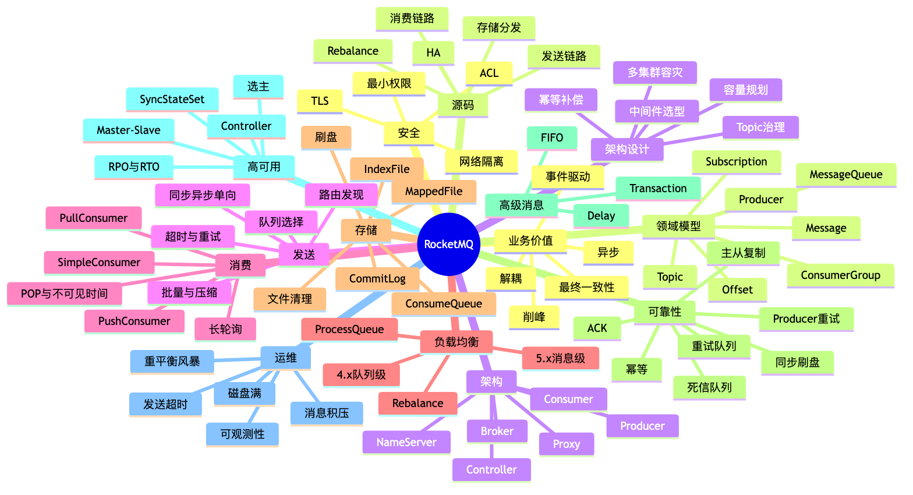

# 第 20 章：RocketMQ 资深面试题库、追问链与模拟面试

> **版本基线**：截至 2026 年 6 月 20 日，Apache RocketMQ 服务端最新发布版为 5.5.0。本章以 RocketMQ 5.x 为主，保留 4.x 经典 Remoting 客户端、队列级 Rebalance、CommitLog 等高频面试内容；涉及版本差异时均显式标注。RocketMQ 5.x 官方模型包含 Normal、FIFO、Delay、Transaction 四类消息，以及 PushConsumer、SimpleConsumer、PullConsumer 三类消费者。([GitHub][1])

---

## 本章去重边界与跳转

本章是全系列的面试题库、追问链和模拟面试汇总，不再作为概念主讲章节。遇到重复题目时，本章负责给出答题骨架和追问路线；完整概念解释跳回对应章节。

| 题目类型 | 概念主讲章节 |
| --- | --- |
| MQ 基础、投递语义、选型 | [第 1 章：消息队列基础、业务价值与技术定位](/blog/tech/RocketMQ/01.消息队列基础、业务价值与RocketMQ技术定位) |
| 组件职责、领域模型、架构图 | [第 2 章：整体架构、核心组件与领域模型](/blog/tech/RocketMQ/02.RocketMQ整体架构、核心组件与领域模型) |
| 发送、消费、Rebalance、Offset | [第 4 章：Producer](/blog/tech/RocketMQ/04.Producer发送模型、路由选择、重试机制与底层发送链路)、[第 5 章：Consumer](/blog/tech/RocketMQ/05.Consumer类型、长轮询、POP、ACK与完整消费链路)、[第 6 章：Rebalance 与 Offset](/blog/tech/RocketMQ/06.Rebalance、消费位点、负载均衡与消息积压) |
| 存储、可靠性、顺序、延迟、事务、高可用 | [第 7 章：存储](/blog/tech/RocketMQ/07.RocketMQ存储引擎)、[第 8 章：可靠性](/blog/tech/RocketMQ/08.端到端消息可靠性、重试、死信队列与消费幂等)、[第 9 章：FIFO](/blog/tech/RocketMQ/09.FIFO顺序消息)、[第 10 章：延迟消息](/blog/tech/RocketMQ/10.延迟消息、定时消息与分布式任务调度)、[第 11 章：事务消息](/blog/tech/RocketMQ/11.事务消息、HalfMessage、事务回查与最终一致性)、[第 13 章：高可用](/blog/tech/RocketMQ/13.RocketMQ高可用) |
| 资源治理、性能、可观测性、安全、版本演进、源码、系统设计 | [第 12 章：资源治理](/blog/tech/RocketMQ/12.Topic、Tag、Key、SQL92、MessageQueue与资源治理)、[第 14 章：性能容量](/blog/tech/RocketMQ/14.RocketMQ性能优化、流控、压测与容量规划)、[第 15 章：可观测性](/blog/tech/RocketMQ/15.RocketMQ可观测性、故障诊断、应急处理与生产Runbook)、[第 16 章：安全灾备](/blog/tech/RocketMQ/16.RocketMQ安全、ACL、TLS、多租户隔离与跨集群灾备)、[第 17 章：架构演进](/blog/tech/RocketMQ/17.从RocketMQ4.x到5.x：Proxy、gRPC、POP、Controller与架构演进)、[第 18 章：源码阅读](/blog/tech/RocketMQ/18.RocketMQ源码阅读：发送、存储、消费、事务与高可用调用链)、[第 19 章：业务架构设计](/blog/tech/RocketMQ/19.RocketMQ业务架构设计、技术选型与复杂场景落地) |

## 20.1 资深面试的答题结构
资深候选人的回答不能只停留在“是什么”。建议使用六层结构：

| 层次       | 回答内容            | 示例                                             |
| -------- | --------------- | ---------------------------------------------- |
| 1. 结论    | 先用一句话回答问题       | “RocketMQ 通常采用至少一次投递，因此消费者必须幂等。”               |
| 2. 主链路   | 说明请求经过哪些组件      | Producer → Proxy/Broker → CommitLog → Consumer |
| 3. 保证边界  | 明确中间件保证什么、不保证什么 | Broker 可保证重投，但不能保证业务数据库只更新一次                   |
| 4. 版本差异  | 区分 4.x 与 5.x    | 4.x 经典消费以队列级分配为主；5.x Push/Simple 支持消息级负载均衡     |
| 5. 故障场景  | 主动讨论超时、宕机、重试、切换 | ACK 丢失会导致重复消费                                  |
| 6. 指标与取舍 | 给出监控、容量、RPO/RTO | 关注发送失败率、消费延迟、磁盘水位和切换时间                         |

**高分回答公式：**

> 场景目标 → 正常链路 → 异常链路 → 保证边界 → 版本差异 → 指标 → 取舍。

---

## 20.2 RocketMQ 完整知识地图


RocketMQ 的消息生命周期可概括为生产、存储、消费三阶段；Topic 由多个 MessageQueue 组成，ConsumerGroup 表示一组共享消费行为和进度的消费者。([RocketMQ][2])

---

## 20.3 84 道分层面试题库
### 20.3.1 基础概念

|     编号 | 问题                                             | 答题主线                                   |
| -----: | ---------------------------------------------- | -------------------------------------- |
|      1 | 消息队列解决什么问题？                                    | 解耦、异步、削峰、数据分发、最终一致性；代价是重复、乱序、积压及运维复杂度。 |
| **2★** | At-most-once、At-least-once、Exactly-once 有什么区别？ | 分别允许丢失、允许重复、处理效果恰好一次；业务系统通常采用至少一次加幂等。  |
|      3 | 为什么不能轻易宣称端到端 Exactly-once？                     | MQ、网络、消费者和业务数据库跨越多个故障域，单个中间件无法替业务事务兜底。 |
|      4 | 消息、事件和命令有什么区别？                                 | 命令表达意图，事件表达已经发生的事实；消息是承载二者的传输载体。       |
|      5 | 哪些场景不应该使用 MQ？                                  | 强同步返回、低流量简单调用、严格实时一致且无法补偿、团队无运维能力时。    |

### 20.3.2 整体架构

|     编号 | 问题                                         | 答题主线                                          |
| -----: | ------------------------------------------ | --------------------------------------------- |
|      6 | NameServer、Broker、Proxy、Controller 分别负责什么？ | 路由、数据存储、协议接入、自动选主；不要把控制面与数据面混为一谈。             |
|      7 | NameServer 为什么可以相对轻量？                      | 主要维护 Broker 路由和心跳信息，不保存业务消息。                  |
| **8★** | 一条消息的完整生命周期是什么？                            | 路由发现、发送、Broker 存储、逻辑索引分发、拉取消费、ACK、过期清理。       |
|      9 | Proxy 是否保存消息？Controller 是否参与消息读写？          | 通常都不持久化业务消息；Proxy 接入转发，Controller 负责副本与主节点管理。 |
|     10 | Topic、MessageQueue、ConsumerGroup 的关系是什么？   | Topic 是业务容器，队列是并行与顺序单元，消费组是独立订阅与进度单元。         |

官方 5.x 领域模型把 Topic、MessageQueue、ConsumerGroup、Subscription 和 Offset 分别定义为存储、并行、消费身份及进度管理单元。([RocketMQ][3])

### 20.3.3 Producer

|      编号 | 问题                          | 答题主线                                    |
| ------: | --------------------------- | --------------------------------------- |
|      11 | 同步、异步和单向发送如何选择？             | 同步便于确认；异步提高并发；单向不等待结果，只适合可丢或有其他恢复机制的场景。 |
| **12★** | Producer 发送超时是否等于发送失败？      | 不等于；消息可能已写入 Broker，但响应在返回途中丢失。          |
|      13 | Producer 如何选择 MessageQueue？ | 普通消息负载均衡；顺序消息根据业务键稳定选择队列或消息组。           |
|      14 | Producer 重试为什么会产生重复消息？      | 首次写入成功但响应丢失，客户端重试后产生第二次写入。              |
|      15 | 如何看待批量、压缩和超大消息？             | 批量提高吞吐，压缩节省网络；超大消息增加内存、网络、刷盘和重试成本。      |

### 20.3.4 Consumer

|      编号 | 问题                                             | 答题主线                                               |
| ------: | ---------------------------------------------- | -------------------------------------------------- |
|      16 | PushConsumer 真的是 Broker 主动推送吗？                 | 不是；经典实现本质上仍是客户端长轮询拉取，再通过回调模拟推送。                    |
| **17★** | PushConsumer、SimpleConsumer、PullConsumer 如何选择？ | Push 简单同步回调；Simple 适合自定义异步、批量和处理时间；Pull 主要面向流处理集成。 |
|      18 | 集群消费与广播消费有什么区别？                                | 集群内分摊消息；广播让多个独立订阅者分别处理完整消息集。                       |
|      19 | ACK 与不可见时间有什么关系？                               | 消息被取出后暂时不可见；成功后 ACK，超时未 ACK 则重新投递。                 |
|      20 | 为什么不能在 PushConsumer 回调中异步派发后立即返回成功？            | SDK 会认为消息已成功，后续异步任务失败时无法自动重试。                      |

RocketMQ 5.x 官方将 PushConsumer、SimpleConsumer 和 PullConsumer 区分为不同控制粒度；SimpleConsumer 提供 Receive、Ack 和修改不可见时间等原子操作。([RocketMQ][4])

### 20.3.5 Rebalance

|      编号 | 问题                       | 答题主线                                   |
| ------: | ------------------------ | -------------------------------------- |
|      21 | 哪些事件会触发 Rebalance？       | 消费者上下线、订阅变化、队列数量变化、路由变化及故障恢复。          |
| **22★** | Rebalance 为什么可能引发重复消费？   | 旧消费者尚有在途消息，新消费者已接管；提交进度与业务完成之间也可能存在窗口。 |
|      23 | 为什么 4.x 中消费者数超过队列数会出现空闲？ | 队列级分配要求一条队列在同一消费组内主要由一个消费者持有。          |
|      24 | 5.x 消息级负载均衡有什么价值？        | 消息按需分配，减少队列数与消费者数不匹配造成的倾斜和空闲。          |

5.x PushConsumer 和 SimpleConsumer 默认采用消息级负载均衡；经典 4.x 消费模式主要是队列级负载均衡。([RocketMQ][5])

### 20.3.6 Offset

|      编号 | 问题                                               | 答题主线                                                |
| ------: | ------------------------------------------------ | --------------------------------------------------- |
|      25 | CommitLogOffset、QueueOffset、ConsumerOffset 有何不同？ | 分别表示物理位置、队列逻辑位置及消费组处理进度。                            |
| **26★** | 有 ConsumerOffset 为什么仍会重复消费？                      | Offset 只是进度记录，无法与外部数据库事务原子提交。                       |
|      27 | 重置 Offset 有什么风险？                                 | 向前会重放，向后可能跳过；操作前必须确认幂等、时间范围和影响消费组。                  |
|      28 | 消费积压如何计算？                                        | 经典模型常看 MaxOffset−ConsumerOffset；同时结合在途消息、消费速率和消息年龄。 |

RocketMQ 使用 ConsumerOffset 管理消费进度，但消息不会因为某个消费者完成处理而立即物理删除。([RocketMQ][6])

### 20.3.7 存储

|      编号 | 问题                                      | 答题主线                                                           |
| ------: | --------------------------------------- | -------------------------------------------------------------- |
|      29 | CommitLog、ConsumeQueue、IndexFile 分别做什么？ | 主体数据、Topic/Queue 逻辑索引、Key 查询索引。                                |
| **30★** | Broker 的消息写入链路是什么？                      | 请求校验 → CommitLog 顺序追加 → 刷盘/复制 → 异步分发 ConsumeQueue 和 IndexFile。 |
|      31 | 为什么 RocketMQ 顺序写 CommitLog？             | 降低随机 I/O，充分利用操作系统页缓存和磁盘顺序写能力。                                  |
|      32 | 同步刷盘和同步复制解决的是同一个问题吗？                    | 不是；刷盘解决单节点掉电，复制解决节点故障。                                         |
|      33 | Broker 重启如何恢复数据？                        | 检查文件完整性、恢复有效物理位置、重建或校正逻辑索引和进度。                                 |
|      34 | 已消费消息为何仍占磁盘？                            | 消费确认与存储清理解耦，消息按保留周期和磁盘策略批量清理。                                  |

官方文档说明消息按保留时长和磁盘条件清理，而不是消费完成即删除；源码中的 CommitLog、ConsumeQueue 和 IndexFile 分别承担主体与索引职责。([RocketMQ][7])

### 20.3.8 可靠性

|      编号 | 问题                      | 答题主线                                    |
| ------: | ----------------------- | --------------------------------------- |
| **35★** | 如何设计端到端“不丢消息”？          | 生产确认与补偿、Broker 持久化与复制、消费重试与幂等、监控对账缺一不可。 |
|      36 | Producer 超时后应不应该立即无限重试？ | 不应该；应有限重试、退避、唯一业务键和发送记录补偿。              |
|      37 | 收到 SEND_OK 是否代表业务最终成功？  | 只代表达到对应 Broker 存储确认条件，不代表消费者业务执行成功。     |
|      38 | 消费成功但 ACK 丢失会怎样？        | Broker 会重新投递，因此业务处理必须幂等。                |
|      39 | 重试队列和死信队列的职责是什么？        | 重试处理暂时性失败；死信隔离长期失败，必须告警、诊断和人工或自动重放。     |
|      40 | 常见幂等方案有哪些？              | 唯一索引、去重表、状态机条件更新、业务版本号、Inbox 表和幂等令牌。    |

消费重试用于应对暂时性处理失败，不应被当作流量控制或正常业务分支机制。([RocketMQ][8])

### 20.3.9 FIFO 顺序消息

|      编号 | 问题                  | 答题主线                                               |
| ------: | ------------------- | -------------------------------------------------- |
| **41★** | RocketMQ 如何保证顺序？    | 相同业务键进入同一有序单元，并在消费侧串行确认前序消息。                       |
|      42 | 为什么通常只保证局部顺序？       | 全局单队列会牺牲吞吐、扩展能力和故障隔离。                              |
|      43 | 顺序消息失败重试有什么影响？      | 前序消息未成功时，后续同组消息可能被阻塞。                              |
|      44 | 4.x 与 5.x 顺序语义如何表达？ | 4.x 常以队列选择和顺序监听器实现；5.x 强调 MessageGroup/FIFO Topic。 |

FIFO 的顺序范围是消息组或有序队列，而不是整个集群天然全局有序。([RocketMQ][9])

### 20.3.10 延迟消息

|      编号 | 问题                   | 答题主线                                   |
| ------: | -------------------- | -------------------------------------- |
| **45★** | 4.x 与 5.x 延迟消息有什么区别？ | 4.x 经典模式主要使用固定延迟级别；5.x 支持按投递时间戳表达定时投递。 |
|      46 | 延迟消息能否做到绝对准时？        | 不能；只能保证不早于目标时间附近可见，实际受负载、调度和网络影响。      |
|      47 | 业务如何取消延迟任务？          | 不要依赖物理删除；使用状态表或版本号，在消费时检查任务是否仍有效。      |
|      48 | 延迟消息能完全替代调度平台吗？      | 不能；复杂编排、周期任务、依赖关系和可视化治理仍适合专业调度系统。      |

5.x 延迟消息以目标投递时间表达定时触发，适合订单超时和分布式定时事件。([RocketMQ][10])

### 20.3.11 事务消息

|      编号 | 问题                    | 答题主线                                       |
| ------: | --------------------- | ------------------------------------------ |
| **49★** | RocketMQ 事务消息完整流程是什么？ | 发送事务消息 → 执行本地事务 → 提交或回滚 → 状态不明时 Broker 回查。 |
|      50 | 事务消息是否等于分布式强一致事务？     | 不是；它保证本地事务与消息可见性的最终一致，不锁住所有下游。             |
|      51 | 事务回查接口应该如何实现？         | 查询可持久化的本地事务事实，必须幂等、快速，不能依赖易失内存。            |
|      52 | 使用事务消息后消费者为何仍需幂等？     | 消费链路依然可能重试，事务消息只解决生产端本地事务与发送的一致性。          |
|      53 | Outbox 与事务消息如何选择？     | Outbox 更数据库通用；事务消息减少扫描，但依赖中间件协议及回查设计。      |

事务消息通过事务检查器处理状态未知场景，目标是生产端本地事务与消息发布的最终一致性。([RocketMQ][11])

### 20.3.12 高可用

|      编号 | 问题                                           | 答题主线                                  |
| ------: | -------------------------------------------- | ------------------------------------- |
| **54★** | Controller 如何实现自动主从切换？                       | 管理副本状态和主节点选举，故障后选择合适副本成为新主并通知相关组件。    |
|      55 | 同步刷盘与同步复制如何组合？                               | 前者降低单机掉电风险，后者降低主节点故障风险；可靠性越高，写延迟通常越大。 |
|      56 | 如何定义 RocketMQ 集群的 RPO 和 RTO？                 | RPO 看允许丢失的数据量；RTO 看从故障到恢复生产消费的时间。     |
|      57 | 为什么要谨慎启用不洁选主？                                | 落后副本成为主节点可能导致已确认数据暂时不可见或丢失。           |
|      58 | Broker、NameServer、Proxy、Controller 故障影响有何不同？ | 分别影响数据分片、路由发现、客户端接入和自动切换能力。           |

Controller 可以独立部署或内嵌于 NameServer；为获得自身容错能力，官方建议部署三个及以上副本并遵循多数派机制。([RocketMQ][12])

### 20.3.13 性能与容量

|      编号 | 问题           | 答题主线                                   |
| ------: | ------------ | -------------------------------------- |
| **59★** | 如何做容量估算？     | 峰值 TPS、平均消息体、保留时长、副本数、索引开销、增长率和安全余量。   |
|      60 | 队列数是不是越多越好？  | 不是；过少限制并行度，过多增加路由、文件、调度和 Rebalance 成本。 |
|      61 | 批量与压缩如何影响性能？ | 减少 RPC 和网络字节，但增加端到端延迟、CPU 和单批失败影响面。    |
|      62 | 如何处理热点业务键？   | 重新设计分片键、拆分超热点实体、限流或接受局部串行的吞吐上限。        |

### 20.3.14 生产运维

|      编号 | 问题                 | 答题主线                                        |
| ------: | ------------------ | ------------------------------------------- |
| **63★** | 消息积压如何排查？          | 判断生产突增还是消费下降，再查消费者存活、错误、下游依赖、热点队列和磁盘。       |
|      64 | 发送超时如何排查？          | 分解 DNS/连接、路由、网络、Broker 排队、刷盘、复制和响应返回各阶段。    |
|      65 | Broker 磁盘满怎么办？     | 先保护写入和业务，扩容或迁移，再分析保留周期、积压和异常大消息。            |
|      66 | 如何避免 Rebalance 风暴？ | 稳定实例、优雅上下线、减少频繁扩缩容、统一订阅并限制抖动。               |
|      67 | 核心监控指标有哪些？         | 发送成功率与延迟、消费 TPS、积压量与年龄、重试/DLQ、磁盘、复制差距和节点状态。 |

### 20.3.15 安全

|      编号 | 问题                     | 答题主线                                    |
| ------: | ---------------------- | --------------------------------------- |
| **68★** | RocketMQ 生产安全基线是什么？    | 网络隔离、ACL 最小权限、TLS、密钥轮换、管理面保护和审计。        |
|      69 | Dashboard 为什么不能直接暴露公网？ | 可能泄露集群、Topic、消费进度等元数据，且默认保护能力有限。        |
|      70 | 如何实现多租户治理？             | Topic/Group 命名空间、独立凭证、权限矩阵、配额、审计和故障域隔离。 |

RocketMQ 官方安全指南明确建议使用 ACL 或可信网络隔离，并为敏感场景启用 TLS；5.3.x 后应重点关注 ACL 2.0。([RocketMQ][13])

### 20.3.16 5.x 架构演进

|      编号 | 问题                                | 答题主线                                                            |
| ------: | --------------------------------- | --------------------------------------------------------------- |
| **71★** | RocketMQ 5.x 的关键演进是什么？            | Proxy 与 gRPC SDK、消息级负载均衡、SimpleConsumer、POP、Controller 和消息类型治理。 |
|      72 | gRPC SDK 与经典 Remoting SDK 的差异是什么？ | 接入协议、部署拓扑、消费语义及 API 模型不同，迁移不能只替换依赖包。                            |
|      73 | 4.x 升级 5.x 应如何规划？                 | 先服务端兼容升级，再按业务迁移客户端；灰度验证消息类型、消费和运维链路。                            |
|      74 | 5.5.0 的 Lite Mode 应如何回答？          | 它是面向轻量订阅场景的新能力；面试中应说明版本前提，不能当成所有 5.x 都具备。                       |

5.5.0 发布说明新增了 Lite Mode，并继续增强 Broker、Proxy 和客户端组件。([GitHub][1])

### 20.3.17 源码

|      编号 | 问题                      | 答题主线                                                                                  |
| ------: | ----------------------- | ------------------------------------------------------------------------------------- |
| **75★** | 经典 Producer 发送源码从哪里看？   | `DefaultMQProducerImpl` 的路由、重试、`sendDefaultImpl`、`sendKernelImpl`。                    |
|      76 | 存储与分发链路看哪些类？            | `SendMessageProcessor`、`DefaultMessageStore`、`CommitLog`、ConsumeQueue 与 IndexService。 |
|      77 | Rebalance 源码重点是什么？      | `RebalanceImpl#doRebalance`、队列增删、ProcessQueue、Offset 和拉取请求分发。                         |
|      78 | 事务消息源码看哪些模块？            | 事务消息服务、Half/Op 处理、本地事务结果和回查任务。                                                        |
|      79 | Controller 与 HA 源码如何阅读？ | 从 `ControllerManager`、Broker 心跳、选主请求和角色变更通知串联。                                        |

源码中的 `sendDefaultImpl` 会完成路由选择和重试，并进入 `sendKernelImpl`；`RebalanceImpl` 负责队列或 POP 分配的增删与拉取请求更新。([GitHub][14])

### 20.3.18 系统设计

|      编号 | 问题                             | 答题主线                               |
| ------: | ------------------------------ | ---------------------------------- |
| **80★** | 如何设计订单与支付消息系统？                 | 事务一致性、订单维度有序、消费者幂等、补偿对账、高可用和容量治理。  |
|      81 | 如何设计秒杀消息链路？                    | 前置限流、快速入队、库存分片、异步落单、幂等和过载保护。       |
|      82 | 如何用 RocketMQ 做 CDC 分发？         | 变更顺序键、Schema 演进、断点、重放、下游幂等和审计。     |
|      83 | 如何设计跨集群容灾？                     | 明确主备模式、复制方向、切换条件、消费进度处理及防止双写。      |
|      84 | 如何治理数千个 Topic 和 ConsumerGroup？ | 生命周期、命名规范、配额、权限、Owner、SLA、告警和下线流程。 |

---

## 20.4 18 道重点题的五层回答
### 20.4.1 如何理解三种投递语义？——第 2 题

**30 秒回答：**
At-most-once 可能丢但不重；At-least-once 不轻易丢但可能重复；Exactly-once 要求处理效果恰好一次。生产系统更现实的方案是“至少一次投递＋业务幂等”。

**3 分钟回答主线：**
Producer 重试、Broker 复制、Consumer ACK 都可能产生不确定窗口。例如消费者已经写库，但 ACK 丢失，Broker 会重投。MQ 无法自动知道数据库更新是否发生，因此端到端 Exactly-once 必须由消息系统和业务存储共同参与。

**深度要点：** 区分“投递一次”“处理一次”和“业务效果一次”。

**追问：** 幂等表写成功但业务更新失败怎么办？

**错误答案：** “RocketMQ 默认就是 Exactly-once。”

---

### 20.4.2 一条消息如何端到端流转？——第 8 题

**30 秒回答：**
Producer 获取路由并发送，Broker 将消息写入 CommitLog，经刷盘和复制后返回结果；后台生成 ConsumeQueue 等索引，Consumer 获取消息、处理并提交 ACK 或进度。

**3 分钟回答主线：**
4.x 客户端通常向 NameServer 获取 Broker 路由并直接访问 Broker；5.x gRPC 客户端通常通过 Proxy 接入。消息主体进入 Broker 存储后才具备可靠性基础，消费成功不等于立即物理删除。

**深度要点：** ACK 返回时机、逻辑索引滞后、路由缓存和故障重试。

**追问：** CommitLog 成功但 ConsumeQueue 尚未生成会怎样？

**错误答案：** “消息直接写入某个 Topic 文件。”

---

### 20.4.3 发送超时如何处理？——第 12 题

**30 秒回答：**
超时表示结果未知，不表示 Broker 一定没收到。应使用业务唯一键、有限重试、发送记录和补偿查询。

**3 分钟回答主线：**
超时可能发生在连接、请求排队、刷盘、同步复制或响应返回阶段。首次写入成功但响应丢失时，重试会产生重复消息，所以消费者仍需幂等。资金类场景还应保存本地发送状态并由后台任务补偿。

**深度要点：** 区分明确失败、明确成功和结果未知。

**追问：** 如何避免补偿任务重复发送？

**错误答案：** “超时就换 Broker 无限重试。”

---

### 20.4.4 如何选择 Consumer？——第 17 题

**30 秒回答：**
处理逻辑短且同步时用 PushConsumer；需要异步分发、批量或动态延长处理时间时用 SimpleConsumer；PullConsumer 主要用于流处理框架。

**3 分钟回答主线：**
PushConsumer 由 SDK 管理拉取、并发和重试，回调返回值就是消费结果；SimpleConsumer 将 Receive、Ack 和不可见时间交给业务控制。不可把 PushConsumer 消息扔给线程池后立即返回成功。

**深度要点：** 可控性与封装程度的取舍。

**追问：** 消费时间偶尔超过不可见时间怎么办？

**错误答案：** “PushConsumer 是服务器主动推送。”

---

### 20.4.5 Rebalance 为什么会重复？——第 22 题

**30 秒回答：**
队列或消息所有权变更存在过渡窗口，旧消费者的在途任务可能尚未结束，新消费者已经开始处理。

**3 分钟回答主线：**
消费者上下线会重新计算分配。旧实例停止拉取、提交进度和新实例接管不是跨节点原子事务；若业务完成与 Offset 提交之间发生故障，也会重放。解决方向是幂等、优雅停机、缩短在途批次和监控重平衡频率。

**深度要点：** ProcessQueue、在途消息、Offset 提交顺序。

**追问：** 顺序消费 Rebalance 时如何避免并发处理同一队列？

**错误答案：** “同一队列任何时候绝不可能被两个消费者短暂处理。”

---

### 20.4.6 Offset 为什么不能消除重复？——第 26 题

**30 秒回答：**
Offset 只记录“消费到哪里”，不能与业务数据库更新自动形成原子事务。

**3 分钟回答主线：**
先提交 Offset 后写库，宕机会丢业务；先写库后提交 Offset，宕机会重复。通常选择后者，并用业务唯一键或状态机保证重复执行没有副作用。

**深度要点：** 消息进度与业务事实是两个存储系统。

**追问：** 能否把 Offset 存进业务数据库？

**错误答案：** “手动提交 Offset 就不会重复。”

---

### 20.4.7 Broker 如何写消息？——第 30 题

**30 秒回答：**
Broker 校验请求后将消息顺序追加到 CommitLog，再根据配置完成刷盘和复制；后台服务生成 ConsumeQueue 和 Key 索引。

**3 分钟回答主线：**
CommitLog 保存完整消息；ConsumeQueue 保存 Topic、Queue 到物理位置的轻量映射；IndexFile 提供 Key 到物理偏移的哈希索引。消费时先查逻辑索引，再根据物理偏移读取主体。

**深度要点：** 顺序写、页缓存、MappedFile、分发滞后和异常恢复。

**追问：** IndexFile 哈希冲突如何处理？

**错误答案：** “每个 Topic 都有独立 CommitLog。”

---

### 20.4.8 如何真正保证消息不丢？——第 35 题

**30 秒回答：**
没有一个配置能单独解决问题，必须覆盖 Producer、Broker、Consumer 和业务对账四层。

**3 分钟回答主线：**

1. Producer 检查发送结果，结果未知时有限重试并落发送记录。
2. Broker 根据 SLA 选择刷盘和复制策略。
3. Consumer 成功完成业务后再 ACK，失败进入重试。
4. 所有消费逻辑幂等。
5. 使用消息轨迹、业务对账和补偿任务发现静默丢失。

**深度要点：** 可靠性、延迟和吞吐之间存在直接取舍。

**追问：** 同步刷盘加同步复制是否绝对不丢？

**错误答案：** “设置同步刷盘就完成端到端可靠性设计。”

---

### 20.4.9 如何保证订单状态顺序？——第 41 题

**30 秒回答：**
使用订单 ID 作为顺序键，使同一订单事件进入同一有序单元，并在消费侧按前序成功后再处理后序。

**3 分钟回答主线：**
顺序通常是局部顺序。生产端必须稳定路由；消费端不能异步越过前序消息；重试会阻塞同组后续消息，因此还要控制毒消息、处理耗时和补偿策略。

**深度要点：** 顺序键基数、热点订单、扩容和状态机校验。

**追问：** 扩容队列后哈希映射变化怎么办？

**错误答案：** “使用一个 Topic 就天然有序。”

---

### 20.4.10 4.x 与 5.x 延迟消息如何比较？——第 45 题

**30 秒回答：**
4.x 经典模型主要使用预定义延迟级别；5.x 支持按目标投递时间表达更灵活的定时消息。

**3 分钟回答主线：**
延迟消息适合超时检查，不应把消息本身当作最终业务事实。订单关闭时必须再次检查订单状态，避免支付成功后旧延迟消息仍将订单关闭。

**深度要点：** 时间误差、重复触发、取消语义和容量峰值。

**追问：** 大量消息在同一秒到期如何保护下游？

**错误答案：** “延迟消息到点一定毫秒级准时执行。”

---

### 20.4.11 事务消息如何保证最终一致？——第 49 题

**30 秒回答：**
Broker 先保存暂不可见的事务消息，Producer 执行本地事务并提交结果；状态未知时 Broker 通过事务回查确认提交或回滚。

**3 分钟回答主线：**
本地事务必须保存可查询的事务事实。回查不能根据内存状态判断，更不能重复执行本地事务。消息提交后，下游仍采用至少一次消费，因此仍需幂等、重试和补偿。

**深度要点：** Half Message、回查次数、超时、事务事实表。

**追问：** 本地事务成功，但进程在返回 Commit 前崩溃怎么办？

**错误答案：** “事务消息把所有下游服务放进同一个事务。”

---

### 20.4.12 Controller 如何完成切换？——第 54 题

**30 秒回答：**
Controller 维护 Broker 副本状态，在主节点不可用时选择合适副本成为新主，并推动角色和路由更新。

**3 分钟回答主线：**
Controller 属于控制面，不负责保存业务消息。其自身应采用多副本多数派部署。单个 Controller 故障通常主要影响后续自动切换能力，而不是立即中断已有数据面读写。

**深度要点：** 副本同步状态、不洁选主、切换期间写可用性和客户端路由刷新。

**追问：** 落后副本能否被选为新主？

**错误答案：** “Controller 就是新的 NameServer。”

---

### 20.4.13 如何估算容量？——第 59 题

**30 秒回答：**

```text
日写入量 ≈ 峰值TPS × 平均消息大小 × 有效持续时间
磁盘需求 ≈ 日写入量 × 保留天数 × 副本系数 × 开销系数
```

**3 分钟回答主线：**
还要考虑属性与索引、重试消息、延迟消息、流量增长、压缩率、磁盘水位保护和故障期间的积压。容量不能只按平均 TPS 计算，应按峰值及故障降级后的单机承载能力计算。

**深度要点：** 网络、磁盘吞吐和消费能力必须分别估算。

**追问：** 两台 Broker 故障后剩余节点是否还能承接峰值？

**错误答案：** “只看 Broker 官方压测 TPS。”

---

### 20.4.14 消息积压如何处理？——第 63 题

**30 秒回答：**
先判定生产变快还是消费变慢，再定位消费者、下游依赖、热点队列和 Broker 资源，最后决定限流、扩容或离线追赶。

**3 分钟回答主线：**

1. 查看积压总量和最老消息年龄。
2. 对比生产与消费速率。
3. 检查实例数、错误率、GC、线程池和下游数据库。
4. 判断是否只有个别队列热点。
5. 在保证幂等的前提下扩容或部署专用追赶消费者。
6. 控制重试风暴，防止失败消息反复挤占正常流量。

**深度要点：** 扩消费者不一定有效，4.x 还受队列数量限制。

**追问：** 消费 TPS 已提高，积压为何仍持续增加？

**错误答案：** “积压直接把消费者扩十倍。”

---

### 20.4.15 生产安全基线是什么？——第 68 题

**30 秒回答：**
Broker、NameServer、Proxy 和管理面必须处于可信网络，启用 ACL 最小权限；敏感链路使用 TLS，凭证定期轮换并保留审计。

**3 分钟回答主线：**
业务应用不能使用管理员凭证；Topic 和 Group 权限分开；Dashboard、Exporter 通过 VPN、网关认证或 IP 白名单保护；敏感字段最好由业务侧加密，避免明文长期落盘。

**深度要点：** 安全是网络、身份、传输、主机和数据的组合，而不是只打开一个配置。

**追问：** TLS 是否能替代 ACL？

**错误答案：** “RocketMQ 部署在内网，所以不需要鉴权。”

---

### 20.4.16 5.x 的本质变化是什么？——第 71 题

**30 秒回答：**
5.x 不只是增加 Proxy，而是对客户端协议、消费语义、消息类型治理和高可用控制面进行了系统演进。

**3 分钟回答主线：**
gRPC 客户端通常通过 Proxy 接入；Push/Simple 采用消息级负载均衡和 ACK/不可见时间语义；Controller 支持自动主从切换。迁移时需要同时验证 Topic 类型、客户端 API、消费模型和运维工具。

**深度要点：** 服务端升级与客户端迁移可以分阶段，但不能混淆语义。

**追问：** 经典 Remoting 客户端能否继续连接 5.x Broker？

**错误答案：** “5.x 只是给 4.x 套了一层 gRPC。”

---

### 20.4.17 如何讲清发送源码？——第 75 题

**30 秒回答：**
从 `DefaultMQProducerImpl#sendDefaultImpl` 开始，依次看路由获取、队列选择、重试、`sendKernelImpl`、网络请求以及 Broker 的 `SendMessageProcessor`。

**3 分钟回答主线：**
`sendDefaultImpl` 管理总超时、重试次数和故障规避；`sendKernelImpl` 构建请求并调用客户端网络层；Broker 接收后进入 MessageStore 和 CommitLog。源码回答必须说明版本和调用链，不能只背类名。

**深度要点：** 路由缓存刷新、延迟故障策略、Hook、压缩和事务消息分支。

**追问：** 首次没有 Topic 路由时如何刷新？

**错误答案：** “Producer 每次发送都实时查询 NameServer。”

---

### 20.4.18 如何设计订单支付消息系统？——第 80 题

**30 秒回答：**
以订单 ID 保证局部顺序，以事务消息或 Outbox 保证支付状态与事件最终一致；消费者使用状态机和唯一键幂等，并通过对账补偿发现异常。

**3 分钟回答主线：**

* `order-status-event`：按订单 ID 有序。
* `payment-result-event`：支付事实，要求高可靠。
* `order-timeout-check`：延迟消息，只触发状态复核。
* 每个下游使用独立 ConsumerGroup。
* Broker 多副本，Controller 自动切换。
* 指标覆盖发送成功率、积压年龄、DLQ、支付对账差异和切换时间。
* 容灾时明确 RPO、RTO 和主备写入规则。

**深度要点：** 不能把支付成功完全建立在一次消息回调上，必须保留支付渠道和本地账务事实。

**追问：** 支付成功事件先到，订单创建事件后到怎么办？

**错误答案：** “开启顺序消息即可解决所有一致性问题。”

---

## 20.5 20 条连续追问链
1. **如何保证消息不丢？**
   → Producer 超时怎么办
   → Broker 是否已经写入
   → 是否完成刷盘
   → 副本是否同步
   → Consumer ACK 丢失怎么办
   → 如何对账补偿

2. **如何避免重复消费？**
   → 重复从哪里产生
   → ACK 丢失怎么办
   → Rebalance 是否会重复
   → 幂等键是什么
   → 幂等记录与业务事务如何一致

3. **Producer 发送超时怎么办？**
   → 能否立即重试
   → 如何识别结果未知
   → MessageKey 是否等于去重键
   → 补偿任务如何避免重复
   → 如何查询最终发送状态

4. **SEND_OK 代表什么？**
   → 是否写入内存还是磁盘
   → 是否同步到副本
   → 主节点马上宕机会怎样
   → 消费者是否已经收到
   → 业务是否已经完成

5. **为什么消息会重复？**
   → Producer 重试
   → Broker 重投
   → Consumer 超时
   → ACK 丢失
   → Offset 提交失败
   → 如何验证幂等方案

6. **如何保证顺序？**
   → 顺序范围是什么
   → 分片键如何选择
   → 队列扩容怎么办
   → 消费失败是否阻塞
   → 热点键如何处理

7. **事务消息如何工作？**
   → Half Message 是否可见
   → 本地事务失败怎么办
   → 状态未知如何回查
   → 回查依据存在哪里
   → 下游为何仍需幂等

8. **延迟消息适合什么场景？**
   → 4.x 与 5.x 有何差异
   → 到期是否绝对准时
   → 如何取消任务
   → 同时到期产生峰值怎么办
   → 是否需要兜底扫描

9. **消息积压怎么办？**
   → 生产增速还是消费降速
   → 是否个别队列热点
   → 扩消费者是否有效
   → 队列数是否足够
   → 下游数据库是否成为瓶颈

10. **发送延迟突然升高怎么办？**
    → 网络还是 Broker
    → Page Cache 是否抖动
    → 刷盘是否变慢
    → 同步复制是否等待
    → 磁盘和 GC 指标如何变化

11. **出现 No route info 怎么办？**
    → Topic 是否创建
    → NameServer 地址是否正确
    → Broker 是否注册
    → 权限是否允许
    → 路由缓存是否刷新

12. **Broker 磁盘满怎么办？**
    → 是否停止写入
    → 哪些 Topic 占用最多
    → 是否有长期积压
    → 能否直接删除文件
    → 如何扩容和迁移

13. **主 Broker 宕机怎么办？**
    → 是否配置自动切换
    → Controller 是否可用
    → 哪个副本可被选主
    → RPO 是多少
    → 客户端多久刷新路由

14. **Controller 宕机怎么办？**
    → 现有读写是否继续
    → 自动切换是否受影响
    → Controller 是否多副本
    → 多数派是否存活
    → 如何演练恢复

15. **Rebalance 为什么抖动？**
    → 实例是否频繁重启
    → 订阅是否一致
    → 心跳是否超时
    → 是否频繁弹性扩缩容
    → 在途消息如何处理

16. **如何重置 Offset？**
    → 按时间还是按位置
    → 是否停止消费者
    → 重放是否幂等
    → 延迟和事务消息如何处理
    → 如何验证重置结果

17. **热点队列怎么办？**
    → 分片键是否倾斜
    → 是否要求严格顺序
    → 能否拆分业务实体
    → 是否需要限流
    → 扩 Broker 是否真正有效

18. **如何做安全治理？**
    → 是否启用 ACL
    → 业务账号是否最小权限
    → 是否启用 TLS
    → Dashboard 如何保护
    → 密钥如何轮换和审计

19. **4.x 如何迁移 5.x？**
    → 服务端是否先兼容升级
    → 是否部署 Proxy
    → 客户端 API 有何变化
    → 消费语义是否改变
    → 如何灰度和回滚

20. **如何设计亿级订单消息系统？**
    → 峰值 TPS 是多少
    → 哪些消息要求顺序
    → 哪些操作要求最终一致
    → 如何估算磁盘和副本
    → 如何处理积压和容灾
    → 选择 RocketMQ 的依据是什么

---

## 20.6 四场完整模拟面试
### 20.6.1 第一场：中级基础面

|  # | 面试问题                       | 主要观察点            |
| -: | -------------------------- | ---------------- |
|  1 | 为什么要使用消息队列？                | 能否同时说出收益和代价      |
|  2 | 画出 RocketMQ 基础架构           | 组件职责是否准确         |
|  3 | Topic 与 MessageQueue 有何区别？ | 业务容器与并行单元        |
|  4 | ConsumerGroup 的作用是什么？      | 独立订阅和进度          |
|  5 | 同步发送与异步发送如何选择？             | 可靠性、延迟、吞吐        |
|  6 | PushConsumer 是否是真推送？       | 长轮询本质            |
|  7 | ConsumerOffset 有什么作用？      | 进度而非删除标记         |
|  8 | 为什么会重复消费？                  | 至少说出 ACK 丢失和重试   |
|  9 | 重试与死信有什么区别？                | 暂时失败与隔离治理        |
| 10 | 如何实现消费者幂等？                 | 唯一索引或状态机         |
| 11 | 顺序消息的顺序范围是什么？              | 局部顺序             |
| 12 | 延迟消息适合什么场景？                | 超时检查而非业务事实       |
| 13 | 事务消息解决什么问题？                | 生产端最终一致          |
| 14 | 消息积压如何发现？                  | 数量、年龄、速率         |
| 15 | RocketMQ 与 Kafka 如何初步选择？   | 场景与团队能力，而非只看 TPS |

**评分标准：**

* 60 分：概念基本正确，但只会定义。
* 75 分：能解释主链路和常见故障。
* 90 分：主动说明至少一次、幂等、版本差异及监控。
* 严重扣分：声称“绝不重复”“消费后立即删除”“事务消息等于强一致”。

---

### 20.6.2 第二场：高级原理面

|  # | 面试问题                      | 主要观察点            |
| -: | ------------------------- | ---------------- |
|  1 | Producer 如何获取并缓存路由？       | NameServer 与本地缓存 |
|  2 | 发送超时为何结果未知？               | 请求和响应的故障窗口       |
|  3 | 4.x 队列级 Rebalance 如何工作？   | 队列、消费者、分配策略      |
|  4 | 5.x 消息级负载均衡有何变化？          | 消息锁定和按需分配        |
|  5 | SimpleConsumer 的不可见时间是什么？ | ACK 与重投          |
|  6 | CommitLog 为什么采用顺序写？       | 磁盘和页缓存           |
|  7 | ConsumeQueue 保存什么？        | 物理偏移、大小及过滤信息     |
|  8 | 同步刷盘与同步复制有何区别？            | 单机与节点故障          |
|  9 | Broker 重启如何恢复？            | 文件校验和索引恢复        |
| 10 | IndexFile 如何支持 Key 查询？    | 哈希槽、索引项、冲突       |
| 11 | 事务回查为何必须查询持久化事实？          | 进程崩溃后可恢复         |
| 12 | 顺序消息失败为何会阻塞？              | 前序确认约束           |
| 13 | 队列数过多有什么代价？               | 文件、路由、调度和重平衡     |
| 14 | Controller 如何选主？          | 副本状态和多数派         |
| 15 | 如何根据 RPO/RTO 选择部署方式？      | 业务损失与恢复目标        |

**评分标准：**

| 维度         | 分值 |
| ---------- | -: |
| 原理准确性      | 30 |
| 故障窗口分析     | 25 |
| 4.x/5.x 区分 | 15 |
| 性能与可靠性取舍   | 20 |
| 表达结构       | 10 |

低于 60 分通常只会背结论；80 分以上应能从存储、复制和消费三个阶段解释故障。

---

### 20.6.3 第三场：源码与故障面

|  # | 面试问题                             | 主要观察点                  |
| -: | -------------------------------- | ---------------------- |
|  1 | 从 Producer `send` 开始讲调用链         | 是否能找到实现入口              |
|  2 | 没有本地路由时如何处理？                     | 路由刷新路径                 |
|  3 | `sendDefaultImpl` 负责什么？          | 超时、重试、队列选择             |
|  4 | Broker 接收发送请求的入口在哪里？             | `SendMessageProcessor` |
|  5 | 消息如何进入 CommitLog？                | MessageStore 与追加       |
|  6 | CommitLog 如何分发到 ConsumeQueue？    | 后台分发服务                 |
|  7 | 异常重启后如何确定有效写入位置？                 | 文件恢复思路                 |
|  8 | PushConsumer 的拉取和消费如何解耦？         | 拉取服务、缓存、消费线程           |
|  9 | `RebalanceImpl#doRebalance` 做什么？ | 删除旧分配、增加新分配            |
| 10 | Offset 计算错误会表现为什么？               | 重复、跳过或拉取异常             |
| 11 | No route info 如何沿源码定位？           | 路由表、刷新、NameServer      |
| 12 | 磁盘慢为什么会导致发送超时？                   | 刷盘、排队和同步复制             |
| 13 | ACK 已发送但客户端超时怎么办？                | 重复与幂等                  |
| 14 | Controller 单点故障有什么影响？            | 数据面与切换能力分离             |
| 15 | 给出一次 Broker 宕机故障树                | 检测、选主、路由、恢复            |

**评分标准：**

* 调用链与关键类：30 分。
* 能将日志、指标和源码对应：25 分。
* 能构造故障时间线：25 分。
* 能说明版本或配置差异：10 分。
* 不依赖背诵行号：10 分。

**一票否决式表现：**只罗列类名，无法说明数据如何变化；把 `send` 返回、刷盘、复制、消费成功混成一个阶段。

---

### 20.6.4 第四场：架构设计面

**题目：**

> 设计一个日订单量 1 亿、峰值流量显著、要求支付最终一致和订单状态有序的电商消息系统。

|  # | 面试问题            | 主要观察点                |
| -: | --------------- | -------------------- |
|  1 | 先澄清哪些需求？        | 峰值、消息大小、顺序范围、RPO/RTO |
|  2 | 如何估算峰值 TPS？     | 峰值系数与业务事件数           |
|  3 | 如何划分 Topic？     | 领域边界和 SLA            |
|  4 | 顺序键选择什么？        | 订单 ID，避免用户级热点        |
|  5 | 支付成功如何保证最终一致？   | 事务消息或 Outbox         |
|  6 | 消费幂等如何设计？       | 唯一键、状态机、事务           |
|  7 | 延迟关闭订单如何实现？     | 延迟事件＋状态复核            |
|  8 | 重试和死信如何治理？      | 分级重试、告警、重放           |
|  9 | Broker 集群如何部署？  | 多分片、多副本、Controller   |
| 10 | 单机房故障怎么办？       | 主备、复制和流量切换           |
| 11 | 如何监控？           | 积压年龄、错误率、对账差异        |
| 12 | 如何规划容量？         | 写入量、保留期、副本和余量        |
| 13 | 如何处理大促扩容？       | 提前扩容、压测、限流、预案        |
| 14 | 如何灰度升级？         | 服务端、Proxy、客户端分层      |
| 15 | 为什么选择 RocketMQ？ | 事务、FIFO、延迟及团队经验      |

**评分标准：**

| 维度     | 分值 |
| ------ | -: |
| 需求澄清   | 15 |
| 容量估算   | 15 |
| 一致性与幂等 | 20 |
| 顺序与分片  | 15 |
| 高可用与容灾 | 15 |
| 运维与安全  | 10 |
| 取舍表达   | 10 |

高分候选人会主动指出：顺序、有序扩容、支付事实、延迟事件和跨集群切换之间存在冲突，必须明确优先级。

---

## 20.7 五类白板题的画图顺序
### 20.7.1 RocketMQ 整体架构

1. 先画业务侧 Producer 和 Consumer。
2. 中间画 NameServer 或 5.x Proxy 接入层。
3. 画至少两个 Broker 分片及其副本。
4. 在控制面画 Controller。
5. 补充路由注册、路由发现、消息发送和消费箭头。
6. 最后标注“谁有状态、谁保存消息、谁可水平扩容”。

**不要一开始画大量线程和端口。白板题首先考查架构边界。**

### 20.7.2 消息写入与存储

1. Producer 发请求。
2. Broker 请求处理器完成校验。
3. 追加 CommitLog。
4. 标出刷盘和副本复制。
5. 后台构建 ConsumeQueue 与 IndexFile。
6. Consumer 根据 ConsumeQueue 找到物理消息。
7. 标出 ACK、重试和文件清理。

### 20.7.3 Consumer Rebalance

1. 画一个 Topic 的多条队列。
2. 画同一 ConsumerGroup 内多个消费者。
3. 画分配前的队列归属。
4. 新增或移除消费者。
5. 重新计算分配。
6. 标出旧 ProcessQueue 丢弃、新拉取请求创建。
7. 标注在途消息与重复消费窗口。

### 20.7.4 事务消息

1. Producer 向 Broker 发送事务消息。
2. Broker 保存暂不可见消息。
3. Producer 执行本地事务。
4. 返回 Commit、Rollback 或 Unknown。
5. Commit 后消息对消费者可见。
6. Unknown 时 Broker 发起回查。
7. 回查根据本地事务事实决定最终状态。

### 20.7.5 Controller 主从切换

1. 画一个 Broker 复制组及当前 Master。
2. 画多副本 Controller。
3. Broker 周期报告副本和主节点状态。
4. Master 故障。
5. Controller 根据同步状态选择新 Master。
6. 通知 Broker 角色变化。
7. 更新路由，客户端刷新并恢复发送。
8. 标注 RPO、RTO 和不洁选主开关。

---

## 20.8 容易被追问击穿的回答
| 薄弱回答                        | 为什么会被击穿                   | 改进方式                                           |
| --------------------------- | ------------------------- | ---------------------------------------------- |
| “RocketMQ 能保证消息不丢。”         | 没有说明 Producer、刷盘、复制、消费和对账 | 分阶段说明可靠性，并明确故障边界                               |
| “消费成功就不会重复。”                | ACK 可能丢失                  | 强调业务成功与 ACK 是两个动作                              |
| “顺序消息就是单线程。”                | 未说明生产路由和顺序范围              | 说明相同业务键、同一有序单元和串行确认                            |
| “事务消息保证分布式事务。”              | 混淆最终一致和强一致                | 说明本地事务、消息可见性、回查和下游幂等                           |
| “积压就扩消费者。”                  | 可能受队列数、热点或下游瓶颈限制          | 先比较生产消费速率并定位瓶颈                                 |
| “主从会自动切换。”                  | 4.x 不同部署模式能力不同            | 说明 Controller 或其他选主方案及版本                       |
| “Kafka 吞吐更高，RocketMQ 功能更多。” | 过于笼统，无业务标准                | 从顺序、事务、路由、流生态、运维和团队能力比较                        |
| “5.x 只是增加 Proxy。”           | 忽略消费模型和控制面变化              | 补充 gRPC、POP、SimpleConsumer、消息级负载均衡和 Controller |

---

## 20.9 RocketMQ、Kafka、RabbitMQ、Pulsar 选型答题框架
| 产品       | 优先考虑的场景                 | 面试中应强调的能力                                          | 主要审查点                   |
| -------- | ----------------------- | -------------------------------------------------- | ----------------------- |
| RocketMQ | 电商、支付、订单、业务事件           | FIFO、事务消息、延迟消息、重试与死信、业务型治理                         | 版本、Proxy、Topic 类型、高可用配置 |
| Kafka    | 事件流、日志、CDC、流计算生态        | 分区日志、消费组、重放、流处理生态                                  | 分区顺序、再均衡、事务边界和延迟需求      |
| RabbitMQ | 灵活路由、任务队列、协议集成          | Exchange、Binding、Routing Key、ACK、Publisher Confirm | 队列拓扑、确认模式、堆积和集群队列类型     |
| Pulsar   | 多租户、大量 Topic、跨地域和存算分离诉求 | Tenant/Namespace、BookKeeper、订阅类型、Geo-replication   | 组件数量、运维复杂度、团队成熟度        |

Kafka 官方将其定位为分布式事件流平台；RabbitMQ 通过 Exchange 和 Binding 将消息路由到队列，并分别提供 Publisher Confirm 与 Consumer ACK；Pulsar 原生提供租户/命名空间和跨集群复制，其 Broker、BookKeeper 与元数据组件也意味着通常需要更成熟的运维体系。([Apache Kafka][15])

**选型回答顺序：**

1. 业务是在线事件、离线日志、任务队列还是流计算。
2. 是否需要事务、延迟、复杂路由或局部顺序。
3. 峰值吞吐、消息大小和端到端延迟目标。
4. 消息保留、回放和跨地域需求。
5. SDK、生态及现有基础设施。
6. 团队运维能力和故障演练成熟度。
7. 最后再给出产品结论。

不要回答“某产品在所有场景下最好”。

---

## 20.10 “项目中使用 RocketMQ”经验模板
> 模板只能填入真实经历；没有做过的内容应明确写成“参与了解”或“方案设计”，不能伪造成亲自实施。

```text
项目名称：[项目或业务域]

业务背景：
- 日均消息量：[真实数值或范围]
- 峰值 TPS：[真实数值或范围]
- 平均消息大小：[数值]
- 核心 SLA：[延迟、可用性、RPO、RTO]

为什么选择 RocketMQ：
- 原有问题：[同步链路长、削峰、最终一致等]
- 关键能力：[事务/FIFO/延迟/重试]
- 未选择其他方案的原因：[真实取舍]

资源设计：
- Topic：[命名与领域划分]
- ConsumerGroup：[每个下游独立消费组]
- Queue 数量：[依据峰值与并行度]
- 消息 Key：[订单号、支付单号等]
- Tag：[粗粒度业务分类]

可靠性设计：
- Producer：[超时、重试、发送记录]
- Broker：[刷盘、复制、Controller]
- Consumer：[业务完成后 ACK、幂等]
- 补偿：[扫描、对账、重放]
- 死信：[告警、责任人和处置流程]

性能与容量：
- 容量估算公式：[填写]
- 生产/消费峰值：[填写]
- 保留周期：[填写]
- 扩容方式：[Broker、Queue、Consumer]

可观测性：
- 发送成功率和 P99
- 消费延迟与最老消息年龄
- 重试与死信数量
- 磁盘水位和复制差距
- 业务对账差异

遇到的真实问题：
- 现象：[填写]
- 定位过程：[日志、指标、链路]
- 根因：[填写]
- 处置：[填写]
- 后续改进：[填写]

最终效果：
- 延迟变化：[填写]
- 可用性变化：[填写]
- 成本变化：[填写]
- 尚未解决的问题：[填写]
```

---

## 20.11 资深候选人应该主动提到什么
### 20.11.1 边界条件

* 消息多大、处理多久、保留多久。
* 顺序是订单级、用户级还是全局。
* 重复可以接受到什么程度。
* 下游是否支持幂等。
* 故障期间是否允许暂停写入。

### 20.11.2 版本差异

* 4.x Remoting 与 5.x gRPC。
* 队列级与消息级负载均衡。
* 固定延迟级别与定时时间戳。
* 手工主从、DLedger 与 Controller 模式。
* 不要把某个新版本功能说成所有版本默认具备。

### 20.11.3 故障场景

* Producer 超时。
* Broker 宕机。
* ACK 丢失。
* Consumer 重启。
* Rebalance。
* 磁盘满。
* Controller 不可用。
* 跨机房网络分区。

### 20.11.4 指标

* 生产 TPS、失败率和 P99。
* 消费 TPS、积压量和最老消息年龄。
* 重试、死信及超时数。
* 磁盘利用率和磁盘写延迟。
* 主从复制差距。
* 选主和恢复时间。
* 业务对账差异。

### 20.11.5 RPO 与 RTO

* RPO：故障时最多允许丢失多少已确认数据。
* RTO：从故障发生到服务恢复需要多久。
* 不能只说“高可用”，必须把高可用转化为可验证目标。

### 20.11.6 取舍

* 同步刷盘提高可靠性但增加延迟。
* 严格顺序降低并行度。
* 更多队列提高并行度但增加治理成本。
* 更长保留周期提高重放能力但增加存储成本。
* 自动切换提高可用性，但不当选主可能扩大数据风险。

---

## 20.12 最终自测评分表
| 能力项                    |      分值 | 自测标准                                     |
| ---------------------- | ------: | ---------------------------------------- |
| 基础概念与架构                |      10 | 能在 3 分钟内画出并解释组件                          |
| Producer 与 Consumer    |      15 | 能讲路由、重试、ACK 和消费者选型                       |
| Rebalance 与 Offset     |      10 | 能解释重复窗口和进度边界                             |
| 存储与源码                  |      15 | 能讲 CommitLog、ConsumeQueue、IndexFile 及调用链 |
| 可靠性与幂等                 |      15 | 能给出端到端方案，而非只讲 Broker                     |
| FIFO、Delay、Transaction |      10 | 能说明语义、版本和限制                              |
| 高可用与运维                 |      10 | 能讨论 Controller、RPO/RTO 和故障排查             |
| 容量与性能                  |       5 | 能进行基础容量估算                                |
| 架构设计与选型                |       5 | 能说明需求、方案和取舍                              |
| 表达与追问应对                |       5 | 先结论、再机制、最后边界                             |
| **总计**                 | **100** |                                          |

**结果判断：**

* **60 分以下**：知识点零散，优先补齐主链路。
* **60～75 分**：可应对中级岗位，但故障和源码不足。
* **75～85 分**：具备高级后端面试竞争力。
* **85 分以上**：能够主动讨论边界、指标和架构取舍。
* **95 分以上**：不仅能回答，还能纠正题目中的错误前提。

---

## 20.13 7 天面试复习安排
|    天数 | 复习主题                   | 口述题                | 画图题     | 场景题         |
| ----: | ---------------------- | ------------------ | ------- | ----------- |
| 第 1 天 | 架构与领域模型                | 一条消息生命周期           | 整体架构    | 订单异步解耦      |
| 第 2 天 | Producer 与 Consumer    | 超时、重试、ACK          | 发送与消费时序 | 消息重复处理      |
| 第 3 天 | Rebalance 与 Offset     | 重平衡为何重复            | 队列分配变化  | 消费组扩缩容      |
| 第 4 天 | 存储与源码                  | CommitLog/CQ/Index | 写入和分发链路 | Broker 异常恢复 |
| 第 5 天 | FIFO、Delay、Transaction | 三类消息语义             | 事务消息时序  | 支付最终一致      |
| 第 6 天 | HA、性能与运维               | Controller、RPO/RTO | 主从切换    | 积压与磁盘满      |
| 第 7 天 | 系统设计与模拟面试              | 20 条追问链            | 亿级订单架构  | 完整模拟面试      |

每天至少完成：

1. **10 道口述题**：每题先答 30 秒，再答 3 分钟。
2. **1 张白板图**：限时 5 分钟完成。
3. **1 道故障题**：按时间线定位。
4. **1 次录音复盘**：删除“绝对不会”“肯定不丢”等无边界表达。

---

## 20.14 官方资料索引
* Apache RocketMQ 5.5.0 发布信息与源码仓库。([GitHub][1])
* RocketMQ 5.x 核心概念与领域模型。([RocketMQ][3])
* Consumer 类型、负载均衡与消费进度。([RocketMQ][4])
* FIFO、Delay、Transaction 和消费重试。([RocketMQ][9])
* 消息存储与清理。([RocketMQ][7])
* Controller 自动主从切换。([RocketMQ][12])
* RocketMQ 安全基线。([RocketMQ][13])
* Producer、CommitLog、Rebalance、IndexFile 与 Controller 源码入口。([GitHub][14])

---

## 20.15 面试前最后 30 分钟检查清单
* [ ] 能在 30 秒内说明为什么使用 MQ，以及引入 MQ 的代价。
* [ ] 能画出 Producer、NameServer、Proxy、Broker、Consumer、Controller。
* [ ] 能明确区分 4.x 经典 Remoting 与 5.x gRPC 模型。
* [ ] 能解释 PushConsumer 为什么本质上仍使用拉取或长轮询。
* [ ] 能解释发送超时为何属于“结果未知”。
* [ ] 能解释为什么至少一次投递必须配合消费幂等。
* [ ] 能区分 CommitLogOffset、QueueOffset 与 ConsumerOffset。
* [ ] 能讲清 CommitLog、ConsumeQueue、IndexFile 的关系。
* [ ] 能说明同步刷盘与同步复制解决不同故障。
* [ ] 能解释 Rebalance、ACK 丢失和 Offset 窗口为什么会导致重复。
* [ ] 能说明顺序只在业务键或消息组范围内成立。
* [ ] 能说明延迟消息到期后仍需检查最新业务状态。
* [ ] 能完整画出事务消息的本地事务、提交、回滚和回查。
* [ ] 能用 RPO、RTO 描述 Controller 切换目标。
* [ ] 能列出发送失败率、P99、积压年龄、磁盘和死信等核心指标。
* [ ] 能按“生产增速—消费降速—热点—下游—资源”排查积压。
* [ ] 能给出容量估算公式，而不是只引用官方 TPS。
* [ ] 能从真实需求而不是品牌偏好比较 RocketMQ、Kafka、RabbitMQ、Pulsar。
* [ ] 项目经验中的规模、故障和收益全部真实可解释。
* [ ] 回答时先给结论，再讲机制，主动补充版本、边界、故障和取舍。

[1]: https://github.com/apache/rocketmq/releases?utm_source=chatgpt.com "Releases · apache/rocketmq"
[2]: https://rocketmq.apache.org/docs/domainModel/01main/ "Domain Model | RocketMQ"
[3]: https://rocketmq.apache.org/docs/introduction/02concepts/ "Concepts | RocketMQ"
[4]: https://rocketmq.apache.org/docs/featureBehavior/06consumertype/ "Consumer Types | RocketMQ"
[5]: https://rocketmq.apache.org/docs/featureBehavior/08consumerloadbalance/ "Consumer Load Balancing | RocketMQ"
[6]: https://rocketmq.apache.org/docs/featureBehavior/09consumerprogress/ "Consumer Progress Management | RocketMQ"
[7]: https://rocketmq.apache.org/docs/featureBehavior/11messagestorepolicy/ "Message Storage and Cleanup | RocketMQ"
[8]: https://rocketmq.apache.org/docs/featureBehavior/10consumerretrypolicy/ "Consumption Retry | RocketMQ"
[9]: https://rocketmq.apache.org/docs/featureBehavior/03fifomessage/ "Ordered Message | RocketMQ"
[10]: https://rocketmq.apache.org/docs/featureBehavior/02delaymessage/ "Delay Message | RocketMQ"
[11]: https://rocketmq.apache.org/docs/featureBehavior/04transactionmessage/ "Transaction Message | RocketMQ"
[12]: https://rocketmq.apache.org/docs/deploymentOperations/03autofailover/ "Master-Slave Automatic Failover Mode | RocketMQ"
[13]: https://rocketmq.apache.org/docs/security/01security/?utm_source=chatgpt.com "Security - Apache RocketMQ"
[14]: https://github.com/apache/rocketmq/blob/master/client/src/main/java/org/apache/rocketmq/client/impl/producer/DefaultMQProducerImpl.java "rocketmq/client/src/main/java/org/apache/rocketmq/client/impl/producer/DefaultMQProducerImpl.java at master · apache/rocketmq · GitHub"
[15]: https://kafka.apache.org/documentation/?utm_source=chatgpt.com "Introduction | Apache Kafka"
