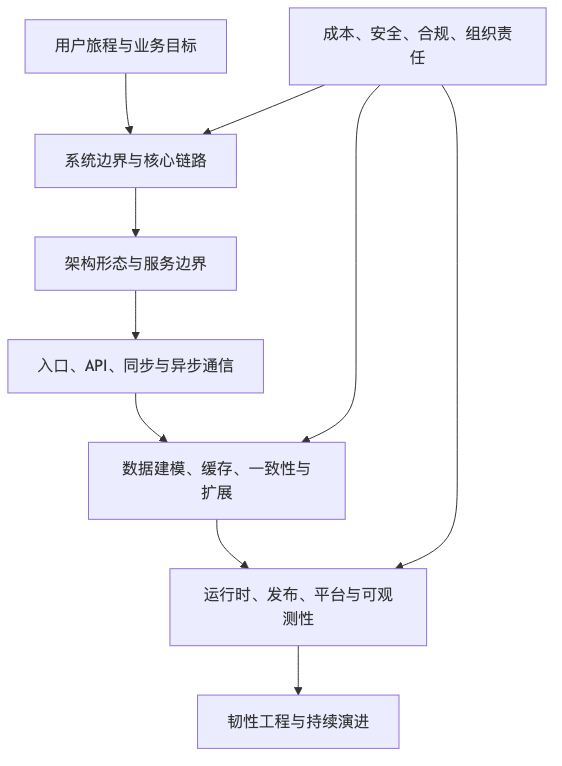

# 系统设计专栏导读

这个专栏不是为了背缓存、消息队列、分库分表、微服务这些技术名词，而是为了建立一套能进入真实生产系统的设计语言。

现代互联网系统不是一张组件图。它是用户旅程、数据流、控制流、异步任务、第三方依赖、后台操作、观测链路和故障传播路径共同组成的协作网络。

每一章都会按同一条问题驱动的节奏展开：先说原来的工程状态遇到了什么问题，再说明引入什么机制解决它，最后指出这个机制留下了什么新问题，以及下一层设计为什么会出现。

所以这个专栏会围绕几个核心问题往前展开：

```text
系统到底在设计什么？
边界应该从哪里画起？
哪些链路必须强可靠，哪些链路可以异步或降级？
一个设计上线后，如何被验证、观测、恢复和演进？
AI、RAG、第三方 API 和云服务进入系统后，失败模式发生了什么变化？
```



## 阅读路径

### 第一篇：系统设计的基本坐标

1. [现代互联网系统设计导论](/blog/tech/SystemDesign/01.现代互联网系统设计导论)  
   从约束、参与者、失败来源、设计输入输出、可靠性、可观测性、成本、安全、组织责任和系统边界开始，建立系统设计的基本坐标。

2. [需求、约束与架构决策](/blog/tech/SystemDesign/02.需求、约束与架构决策)  
   从业务目标、功能需求、非功能约束、SLO、RTO/RPO、ADR 和成本边界出发，说明生产级系统设计应该如何定义问题和记录决策。

3. [从用户旅程看系统边界](/blog/tech/SystemDesign/03.从用户旅程看系统边界)  
   从用户角色、核心动作、请求链路、数据链路、后台链路、观测链路和故障链路出发，说明系统边界应该如何被推导出来。

### 第二篇：架构形态的演进

4. [从单体到模块化单体](/blog/tech/SystemDesign/04.从单体到模块化单体)  
   解释为什么单体不是原罪，如何用模块化单体保留交付速度，同时让代码边界、数据边界和未来服务拆分变得可控。

5. [SOA、微服务与服务边界](/blog/tech/SystemDesign/05.SOA、微服务与服务边界)  
   从业务能力、数据所有权、通信方式和团队责任出发，判断服务边界如何形成，以及伪微服务为什么比单体更危险。

6. [云原生、Serverless 与后微服务时代](</blog/tech/SystemDesign/06.云原生、Serverless 与后微服务时代>)  
   从微服务运行复杂度出发，梳理云原生、Serverless、托管服务和平台工程如何降低变化成本，以及它们带来的成本、锁定和治理边界。

7. [边缘、全球化与多区域架构](/blog/tech/SystemDesign/07.边缘、全球化与多区域架构)  
   从 CDN、边缘计算、Multi-AZ、Multi-Region、Active-Passive 和 Active-Active 出发，解释全球化系统为什么必须重新设计流量、数据、合规和故障边界。

### 第三篇：互联网系统的核心路径

8. [客户端、前端与用户体验系统](/blog/tech/SystemDesign/08.客户端、前端与用户体验系统)  
   把客户端纳入系统设计视角，分析多端一致性、BFF、弱网重试、Feature Flag、RUM、Token 管理和用户体验链路。

9. [入口层：DNS、CDN、WAF、API Gateway](</blog/tech/SystemDesign/09.入口层：DNS、CDN、WAF、API Gateway>)  
   解释请求进入系统前会穿过哪些入口组件，以及入口层如何承担路由、安全、限流、缓存、灰度和故障隔离职责。

10. [API 设计：REST、GraphQL、gRPC 与契约治理](</blog/tech/SystemDesign/10.API 设计：REST、GraphQL、gRPC 与契约治理>)  
    从长期契约而不是接口格式出发，比较 REST、GraphQL、gRPC，梳理版本管理、幂等、错误码和 CI/CD 契约治理。

11. [同步通信与可靠调用](/blog/tech/SystemDesign/11.同步通信与可靠调用)  
    解释同步服务调用如何避免把局部故障放大成系统雪崩，并给出超时、重试、熔断、限流、隔离和观测的设计方法。

12. [异步通信、消息队列与事件驱动](/blog/tech/SystemDesign/12.异步通信、消息队列与事件驱动)  
    梳理消息、事件、命令、Outbox、Inbox、死信、回放、积压监控和事件版本治理，说明异步不是银弹。

### 第四篇：分布式系统的硬骨头

13. [数据建模与存储系统](/blog/tech/SystemDesign/13.数据建模与存储系统)  
    从核心对象、访问模式、一致性、生命周期、租户边界和多存储组合出发，解释数据系统设计为什么不只是数据库选型。

14. [缓存、索引与读路径优化](/blog/tech/SystemDesign/14.缓存、索引与读路径优化)  
    围绕缓存层级、索引设计、热点 Key、缓存击穿、雪崩、更新策略和读一致性，说明读路径如何被系统化治理。

15. [事务、一致性与分布式数据](/blog/tech/SystemDesign/15.事务、一致性与分布式数据)  
    解释本地事务、分布式事务、Saga、TCC、Outbox、对账和一致性模型如何服务不同业务损失边界。

16. [分库分表、复制与扩展](/blog/tech/SystemDesign/16.分库分表、复制与扩展)  
    从分片键、读写分离、复制延迟、在线迁移、全局 ID、热点治理和分布式数据库边界出发，梳理数据扩展设计。

17. [搜索、推荐、Feed 与实时数据](</blog/tech/SystemDesign/17.搜索、推荐、Feed 与实时数据>)  
    解释搜索索引、推荐特征、Feed、CDC、流处理、实时数仓和数据质量治理如何从事实源派生出高价值读路径。

18. [分布式协调、共识与时间](/blog/tech/SystemDesign/18.分布式协调、共识与时间)  
    梳理 ZooKeeper、etcd、Consul、Kubernetes 控制面、分布式锁、lease、fencing token、共识和物理时间的边界。

### 第五篇：云原生与平台工程

19. [容器、Kubernetes 与运行时抽象](</blog/tech/SystemDesign/19.容器、Kubernetes 与运行时抽象>)  
    从镜像、Pod、Deployment、Service、Probe、requests/limits 和 Stateful Workload 出发，解释 Kubernetes 抽象了哪些运行时问题，又没有替应用解决什么。

20. [发布系统、灰度与实验平台](</blog/tech/SystemDesign/20.发布系统、灰度与实验平台>)  
    从构建、部署、灰度、回滚、Feature Flag、A/B 实验和数据库变更出发，梳理发布系统如何控制线上变化风险。

21. [平台工程与内部开发者平台](/blog/tech/SystemDesign/21.平台工程与内部开发者平台)  
    解释 DevOps、SRE 与平台工程的关系，并从服务目录、自服务门户、模板、权限、成本和治理出发设计内部开发者平台。

22. [可观测性：从日志到因果诊断](/blog/tech/SystemDesign/22.可观测性：从日志到因果诊断)  
    从日志、指标、Trace、事件、Profiling、eBPF、RUM、Synthetic Monitoring 和 SLO 告警出发，解释可观测性如何帮助系统定位因果。

23. [韧性工程、混沌工程与事故管理](/blog/tech/SystemDesign/23.韧性工程、混沌工程与事故管理)  
    从超时、重试、熔断、降级、隔离、背压、GameDay、Runbook、事故响应和无责复盘出发，梳理系统韧性如何落地。

---

GitHub 地址: [00.专栏导读.md](https://github.com/LienJack/learn-agent/blob/main/src/content/blog/zh/tech/SystemDesign/00.专栏导读.md)
