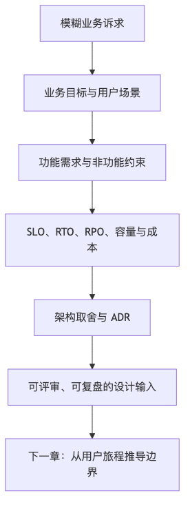

# 第 2 章：需求、约束与架构决策

## 本章的问题链

先看原始问题：架构讨论最容易在一开始就跑偏：大家直接画服务、选数据库、估 QPS，却没有先定义成功标准、失败边界和业务优先级。这样的设计即使看起来完整，也很难解释为什么是这个方案。

为了解决这个问题，本章用业务目标、用户场景、SLO、RTO/RPO、容量估算、成本边界和 ADR，把“想做一个系统”拆成一组可以讨论、验证和留下记录的约束。

但这不是终点：约束清楚以后，还不能立刻拆服务。新的问题是：系统边界到底从哪里划，哪些链路属于核心系统，哪些其实是外部依赖、后台流程或故障传播路径。

所以本章会按“问题 -> 机制 -> 新问题”的顺序展开：先把眼前的工程压力说清楚，再看对应机制解决了什么，最后讨论它留下的边界和下一步。



## 1. 本章解决什么问题

架构设计真正的起点不是“选框架”，而是识别约束。很多系统失败，并不是因为技术不够先进，而是因为团队在需求还没有拆清楚时就开始做不可逆决策。

一个常见场景是：业务说“我们要做一个订单系统”。工程团队很快开始讨论：

* 要不要拆微服务？
* 用 MySQL 还是 PostgreSQL？
* 要不要 Kafka？
* 要不要 Redis？
* 上不上 Kubernetes？
* 要不要做 CQRS？
* 要不要先接入风控模型？

这些问题都可能重要，但此时直接回答它们太早了。“订单系统”不是需求，而是一团混合了业务目标、用户流程、数据状态、可靠性要求、支付风险、库存一致性、履约时效、客服操作和财务对账的复杂约束集合。

本章要讲的是：如何把模糊需求拆成可评审、可验证、可落地的工程目标；如何用 SLI、SLO、SLA、错误预算、RTO、RPO、成本边界、安全合规、团队能力和迁移约束来驱动架构决策；如何用设计文档和 ADR 记录决策，避免架构评审变成“凭资历拍脑袋”。

## 2. 问题在小系统里为什么不明显

小系统里，很多约束被低流量和低复杂度掩盖了。

一个早期订单系统可能只有几百个用户、几十个 SKU、一个支付通道、一个仓库、一个开发团队。此时你可以：

* 一个服务写完所有逻辑；
* 一个数据库存所有表；
* 同步调用所有依赖；
* 手工查日志排障；
* 线上出问题后开发直接连库修数据；
* 没有严格 SLO；
* 没有专门值班；
* 没有复杂灰度。

这并不一定错误。小系统最重要的约束往往是验证业务、快速迭代、减少认知成本。为了未来可能出现的巨大规模，过早引入复杂架构，反而会拖慢产品验证。

但问题在于：早期的简化如果没有边界，就会变成未来的债务。比如订单表随便加字段，支付状态和订单状态混在一起，库存扣减没有幂等键，第三方支付没有对账，后台可以随意改订单状态。低流量时这些都能靠人兜住；高流量、多团队、多地区、多渠道之后，它们会变成系统性风险。

## 3. 大规模系统里约束如何变成故障、成本或组织问题

当系统规模扩大，模糊需求会以几种方式反噬团队。

### 3.1 “高可用”没定义，导致所有人理解不同

产品说“订单系统不能挂”。
业务说“支付不能失败”。
研发说“我们做了多副本”。
SRE 说“告警看的是 CPU”。
客服说“用户付款成功但看不到订单就是挂了”。

如果没有明确 SLO，团队无法判断系统是否达标。Google SRE 对 SLI、SLO、SLA 的区分非常适合作为工程共同语言：SLI 是服务水平某一方面的定量指标，SLO 是由 SLI 衡量的目标值或范围，SLA 则是与用户之间带有后果的协议；SRE 还强调，SLI 应尽量反映用户真正关心的行为，而不是只测容易采集的服务端指标。([Google SRE][2])

### 3.2 延迟目标没定义，导致优化方向混乱

“接口要快”不是目标。
是平均延迟快？P95 快？P99 快？客户端感知快？服务端处理快？弱网下快？大促峰值快？单租户快还是全局快？

如果只看平均值，长尾延迟可能被掩盖。Google SRE 在讨论 SLI 聚合时也提醒，平均延迟会掩盖尾延迟，百分位指标更能描述请求分布形状。([Google SRE][2])

### 3.3 一致性没定义，导致业务损失不可控

“订单、库存、支付要一致”听起来正确，但不同对象的一致性要求不同。

* 支付金额错了，通常是严重事故；
* 库存短暂显示不准，可能可以接受；
* 积分晚几分钟到账，通常可以接受；
* 推荐结果不一致，通常影响体验但不影响资金；
* 风控结果延迟，可能影响风险敞口。

如果不区分，团队可能对所有数据都追求强一致，导致复杂度和延迟过高；也可能对资金链路使用最终一致，导致对账压力和资金风险。

### 3.4 成本边界没定义，导致“技术正确但商业错误”

一个系统可以通过多区域多活、全链路高采样 Trace、强模型全量调用、实时特征全量计算，把体验做到很好，但成本可能超过业务毛利。架构不是实验室设计，它必须在商业模型里成立。

### 3.5 团队能力没定义，导致系统没人能维护

微服务、Kubernetes、事件驱动、分布式事务、多区域架构都需要团队能力。一个 5 人团队如果同时维护 40 个服务、3 套消息集群、复杂服务网格和自建 K8s，很容易把研发变成消防队。

架构设计必须尊重组织现实。团队人数、值班能力、平台能力、自动化程度、事故响应经验，都是架构约束。

## 4. 核心概念

### 4.1 功能性需求

功能性需求描述系统必须提供的行为。比如订单系统：

* 用户可以创建订单；
* 用户可以取消未支付订单；
* 用户可以支付订单；
* 商家可以发货；
* 用户可以申请退款；
* 客服可以查询和修改异常订单；
* 系统可以发送订单状态通知。

好的功能性需求应该包含角色、动作、输入、输出、状态变化和异常情况，而不只是“支持下单”。

### 4.2 非功能性需求

非功能性需求描述质量属性：

* 延迟；
* 吞吐；
* 可用性；
* 耐久性；
* 一致性；
* 安全；
* 合规；
* 成本；
* 可观测性；
* 可维护性；
* 可扩展性；
* 可迁移性。

非功能性需求最容易被忽略，因为它们不直接出现在 UI 上。但生产事故通常都发生在这里。

### 4.3 SLI、SLO、SLA 与错误预算

SLI，Service Level Indicator，是服务水平指标，例如请求成功率、P99 延迟、数据处理延迟、消息积压时间、订单创建成功率。

SLO，Service Level Objective，是目标。例如“过去 30 天内，99.9% 的订单创建请求在 500ms 内成功返回”。

SLA，Service Level Agreement，是对外协议或承诺，通常包含违约后果，例如赔付、服务积分、合同责任。SLA 是产品和商业决策，不只是技术指标。

错误预算是允许系统在一个周期内“不满足 SLO”的空间。例如 99.9% 可用性意味着 0.1% 的错误预算。错误预算的价值在于把可靠性和迭代速度放到同一个讨论框架里：当预算消耗过快，团队应减少高风险发布，优先修复可靠性问题；当预算充足，可以承受更多变化。Google SRE 明确把错误预算作为 SLO 没有被满足时的可管理空间，并建议避免追求 100% 这类不现实目标。([Google SRE][2])

### 4.4 可用性目标的真实含义

以 30 天为一个月粗略计算：

| 可用性目标   | 每月最多不可用时间 |  每年最多不可用时间 | 工程含义                  |
| ------- | --------: | ---------: | --------------------- |
| 99%     |  约 7.2 小时 |   约 3.65 天 | 适合非核心内部系统或早期产品        |
| 99.9%   | 约 43.2 分钟 |  约 8.76 小时 | 常见生产系统目标，需要基本冗余、监控、值班 |
| 99.99%  | 约 4.32 分钟 | 约 52.56 分钟 | 需要更严格自动化、故障隔离、变更控制    |
| 99.999% |  约 25.9 秒 |  约 5.26 分钟 | 极高代价，通常只适用于少数关键基础设施   |

这里有两个常见误区。

第一，把云服务 SLA 当作自己业务 SLA。你的系统可用性是所有关键依赖共同作用的结果，不会因为数据库服务承诺高可用，你的订单链路就自动高可用。

第二，把服务端可用性当作用户可用性。如果 DNS、CDN、客户端、网关、登录服务、支付通道任何一环失败，用户都可能认为系统不可用。

### 4.5 RTO 与 RPO

RTO，Recovery Time Objective，指故障后业务恢复到可接受状态所允许的最大时间。RPO，Recovery Point Objective，指故障后可接受的数据丢失窗口。AWS Well-Architected 的可靠性支柱明确建议根据业务需求设定 RTO/RPO，并选择满足目标的灾备策略；它也提醒灾备策略需要考虑中断概率、恢复成本、工作负载位置、功能和数据等因素。([AWS 文档][3])

例如：

* 一个内容推荐缓存系统，RTO 可以是 30 分钟，RPO 可以是几小时；
* 一个订单数据库，RTO 可能要求 10 分钟，RPO 可能要求接近 0；
* 一个 BI 报表系统，RTO 可以是几小时，RPO 可以是一天；
* 一个支付账务系统，RPO 通常非常严格，需要对账和多层备份。

灾备方案也有成本阶梯。AWS 把常见灾备策略从备份恢复、pilot light、warm standby 到多区域 active-active 按成本和复杂度递增、RTO/RPO 递减来讨论，并提醒不要选择比业务目标更严格的策略，否则会承担不必要成本。([AWS 文档][4])

### 4.6 数据一致性要求

一致性不是越强越好，而是要匹配业务损失模型。设计时至少要区分：

* 强一致：写入成功后，后续读取必须看到；
* 最终一致：一段时间后收敛；
* 读己之写：用户自己的后续读取能看到自己的写入；
* 会话一致：同一会话内结果符合用户预期；
* 对账一致：短期可能不一致，但最终通过对账修复。

订单、库存、支付、积分、优惠券、推荐、搜索索引，各自适合不同一致性模型。

### 4.7 安全与合规约束

安全和合规不是上线前补一层。它们影响数据模型、权限系统、日志系统、缓存策略、备份、删除、审计和运维流程。

例如多租户 SaaS 必须从第一天就设计租户隔离。否则一旦租户 ID 在查询条件中漏掉，可能造成跨租户数据泄露。再比如隐私删除要求会影响主库、缓存、搜索索引、数据仓库、备份和日志，不是一个 `DELETE FROM users` 能解决的。

### 4.8 团队能力、时间与迁移约束

架构必须适配团队。

* 团队是否有 24/7 值班能力？
* 是否有成熟 CI/CD？
* 是否有服务治理平台？
* 是否有数据库迁移经验？
* 是否能维护消息队列？
* 是否有 SRE 或平台团队支持？
* 是否能做压测和故障演练？
* 是否要兼容旧系统？
* 是否需要不中断迁移？

很多“正确架构”在错误团队和错误阶段会变成错误方案。

## 5. 如何把模糊需求变成工程目标

以“我要做一个订单系统”为例。

### 5.1 原始需求

“用户可以购买商品，生成订单并支付。”

这句话太粗。我们需要逐步追问。

### 5.2 业务目标

* 是自营电商、平台电商，还是企业采购？
* 订单系统承担收入闭环还是只是预约登记？
* 首期目标是验证业务，还是承接大促？
* 订单失败的业务损失是什么？
* 是否涉及资金、发票、履约、售后？

### 5.3 用户与场景

* C 端用户创建订单；
* 商家处理订单；
* 客服查询异常订单；
* 财务对账；
* 运营配置活动；
* 仓库履约；
* 风控审核高风险订单。

### 5.4 功能拆解

第一版必须有：

* 创建订单；
* 查询订单；
* 取消未支付订单；
* 支付结果回调；
* 基础库存校验；
* 基础订单状态机；
* 后台查询。

可以延后：

* 复杂优惠叠加；
* 拆单；
* 跨境税费；
* 多仓履约；
* 自动售后；
* 实时推荐；
* 高级风控模型。

### 5.5 非功能目标

示例目标可以写成：

* 峰值订单创建请求 500 QPS，活动峰值 2000 QPS；
* P99 延迟在正常流量下小于 800ms，活动峰值下小于 1500ms；
* 订单创建月度成功率 SLO 为 99.9%；
* 已创建订单数据不能丢失；
* 支付状态最终必须与支付通道一致；
* 支付回调处理支持重复通知和乱序；
* 库存扣减必须避免超卖；
* 订单查询允许读写延迟 1 秒以内；
* 通知、积分、推荐、数据分析可异步；
* 第三方支付不可用时允许用户稍后重试；
* 单笔订单链路可观测，必须有 Trace ID；
* 单订单创建成本要可估算；
* 第一版由 6 人团队维护，不自建复杂中间件。

### 5.6 架构影响

这些需求会推导出一些设计方向：

* 订单状态机必须清晰；
* 创建订单接口必须幂等；
* 支付回调必须幂等；
* 支付状态需要对账；
* 库存扣减与订单创建要设计一致性策略；
* 通知、积分、数据分析可走事件；
* 核心订单写入优先使用成熟关系数据库；
* 第一版不宜拆过细微服务；
* 需要明确后台操作审计；
* 需要为后续活动峰值保留缓存和异步扩展空间。

这才是从需求到架构的推导，而不是从技术名词倒推需求。

## 6. 常见架构方案与适用边界

### 6.1 简单单体

适合早期产品、团队小、业务边界还不稳定的场景。优点是开发快、部署简单、事务边界清晰。代价是模块边界容易腐化，后期协作和发布会变难。

### 6.2 模块化单体

适合业务增长但尚未达到必须拆服务的阶段。通过领域模块、内部 API、依赖规则、数据库边界约束，为未来拆分做准备。它通常是比“立刻微服务”更稳的增长期选择。

### 6.3 微服务

适合业务边界稳定、团队按业务能力组织、不同模块变更节奏差异大、平台能力足够成熟的场景。代价是分布式调用、数据一致性、部署、测试、观测和治理复杂度显著上升。

### 6.4 事件驱动

适合多下游订阅、异步解耦、削峰、最终一致可接受的场景。代价是重复、乱序、积压、回放、事件版本和排障复杂度。

### 6.5 托管服务优先

适合团队希望减少基础设施运维，把精力放在业务上的场景。代价是成本模型、供应商边界、故障透明度和迁移风险。

没有哪个方案天然先进。关键是业务阶段、团队能力、故障模型和成本模型是否匹配。

## 7. System Design 文档模板

下面是一份可直接用于团队评审的模板。

```markdown
# 系统设计文档：<系统名称>

## 1. 背景与目标
- 为什么要做？
- 业务目标是什么？
- 成功指标是什么？
- 不做会有什么影响？

## 2. 范围与非范围
### 范围内
- 本次设计包含哪些能力？

### 范围外
- 哪些能力明确不做？
- 哪些留到后续阶段？

## 3. 用户与核心场景
- 用户角色
- 核心用户旅程
- 管理后台场景
- 异常场景

## 4. 需求
### 功能性需求
- ...

### 非功能性需求
- 延迟目标
- 吞吐目标
- 可用性目标
- 一致性要求
- 安全与合规
- 成本边界
- 可观测性要求

## 5. 约束
- 团队能力
- 时间约束
- 迁移约束
- 技术栈约束
- 第三方依赖
- 云资源限制
- 合规限制

## 6. 总体架构
- 系统上下文图
- 核心组件
- 外部依赖
- 部署拓扑

## 7. 核心链路
### 读路径
### 写路径
### 异步路径
### 控制路径
### 故障路径

## 8. 数据设计
- 核心实体
- 状态机
- 索引
- 分区/分片策略
- 数据生命周期
- 备份与恢复
- 删除与合规

## 9. API 与事件契约
- API 定义
- 错误码
- 幂等策略
- 版本兼容
- 事件模型
- 消息重试与死信

## 10. 容量与成本估算
- 当前流量
- 峰值流量
- 增长预期
- 存储估算
- 网络估算
- 单请求/单用户/单租户成本

## 11. 一致性与事务策略
- 哪些需要强一致？
- 哪些允许最终一致？
- 如何补偿？
- 如何对账？

## 12. 可靠性设计
- SLI/SLO
- 错误预算
- 超时
- 重试
- 限流
- 熔断
- 降级
- 灾备
- RTO/RPO

## 13. 安全与权限
- 身份模型
- 鉴权
- 授权
- 租户隔离
- 审计
- 敏感数据保护

## 14. 可观测性
- 日志
- 指标
- Trace
- 业务监控
- 告警
- Dashboard
- Runbook

## 15. 发布、迁移与回滚
- 灰度策略
- 数据库变更策略
- 配置发布
- 回滚/前滚方案
- 新旧系统并行
- 数据校验

## 16. 风险与替代方案
- 主要风险
- 替代设计
- 为什么不选其他方案？
- 决策后果

## 17. 演进路线
- 第一版
- 增长期
- 成熟期
- 未来可能拆分点

## 18. Open Questions
- 尚未确定的问题
- 需要业务/安全/平台确认的问题

## 19. Owner 与行动项
- 系统 owner
- 依赖 owner
- 值班责任
- 后续行动项
```

这份模板不是让每个项目都写成长篇论文。轻量项目可以裁剪，但关键问题不能逃避。

## 8. ADR 模板

ADR 适合记录“重要但可能被遗忘的架构决策”。例如：

* 为什么第一版选择模块化单体而不是微服务；
* 为什么订单事件采用 at-least-once 投递；
* 为什么支付回调采用异步对账；
* 为什么暂不使用多区域 active-active；
* 为什么选择某个云数据库；
* 为什么 RAG 检索必须做权限过滤。

模板如下：

```markdown
# ADR-0007：订单事件采用 at-least-once 投递并要求消费者幂等

## 状态
Proposed / Accepted / Superseded by ADR-xxxx

## 日期
2026-xx-xx

## 背景
我们需要在订单创建后通知库存、履约、通知、数据分析等系统。
当前团队需要支持活动峰值削峰，并允许下游独立扩展。
消息系统可能出现重复投递，消费者也可能在处理成功后提交 offset 前崩溃。

## 决策
订单事件采用 at-least-once 投递语义。
所有消费者必须基于 event_id 或 business_id 实现幂等消费。
订单服务使用 Outbox Pattern 保证数据库状态与事件发送的一致性。
不承诺 exactly-once 业务语义。

## 备选方案
1. 同步调用所有下游
   - 优点：流程直观
   - 缺点：耦合强，下游故障影响订单创建

2. 使用 at-most-once
   - 优点：不会重复
   - 缺点：消息可能丢失，不适合订单事件

3. 追求 exactly-once
   - 优点：语义看似简单
   - 缺点：实现复杂，跨系统仍需业务幂等

## 后果
正面：
- 订单创建与下游处理解耦
- 下游可独立扩展
- 系统可以削峰

负面：
- 所有消费者必须处理重复
- 排障需要关联 event_id
- 需要死信队列和人工修复流程

## 重新评估条件
- 订单事件量增长 10 倍
- 下游消费者超过 20 个
- 出现多次因幂等缺失导致的数据事故
```

ADR 的重点不是形式，而是把“当时为什么这么选”留给未来。没有 ADR 的团队，半年后常常只剩下“这里一直就是这么写的”。

## 9. 架构评审如何避免“凭资历拍脑袋”

架构评审容易变成资深工程师表达偏好。有人喜欢微服务，有人喜欢单体；有人喜欢 Kafka，有人喜欢数据库事务；有人讨厌 GraphQL，有人讨厌 RPC。偏好不是不可以有，但不能替代约束分析。

好的评审应该围绕以下问题：

* 需求是否清楚？
* 非功能目标是否可测量？
* 容量估算是否有依据？
* 核心链路是否足够简单？
* 失败路径是否设计过？
* 数据一致性是否匹配业务损失？
* 安全和权限是否内建？
* 成本是否可接受？
* 团队是否能维护？
* 是否有替代方案比较？
* 关键决策是否可逆？
* 不可逆决策是否足够谨慎？
* 是否有上线、回滚、迁移方案？
* 是否有 owner 和后续行动项？

评审结论也应该结构化：

```text
结论：通过 / 有条件通过 / 需要重审

必须修改：
- ...

上线前必须完成：
- ...

可以后续优化：
- ...

需要 ADR 记录：
- ...

风险接受人：
- 产品 owner / 技术 owner / 安全 owner / 运维 owner
```

“我觉得不行”不是评审意见。
“在 2000 QPS 峰值下，库存服务同步调用没有超时和降级，会把订单创建链路拖垮；建议把库存校验拆成下单前读缓存 + 创建时原子扣减 + 失败可解释返回，并补充压测数据”，这才是评审意见。

## 10. 错误示例：需求没拆清楚就直接上微服务、Kafka、K8s

某团队要做一个 B2B 订货系统。第一版只有 3 个开发、预计 20 家客户、每天几千单。因为团队成员希望“架构先进”，一开始就拆成用户、商品、订单、库存、支付、通知、报表 7 个微服务，使用 Kafka 做事件流，全部部署到自建 Kubernetes。

上线前看起来很专业：

```text
API Gateway
  |
  +--> user-service
  +--> product-service
  +--> order-service
  +--> inventory-service
  +--> payment-service
  +--> notification-service
  +--> report-service
        |
       Kafka
        |
      MySQL / Redis
```

上线后问题陆续出现：

* 订单创建要同步调用商品、库存、支付配置，任一下游慢都会导致超时；
* Kafka 消费失败没人处理，报表数据经常不准；
* 服务拆分后本地调试困难，新人无法快速理解完整流程；
* 每次改一个字段要改多个服务和事件；
* K8s 集群证书、Ingress、资源限制、日志采集都需要维护；
* 没有成熟 Trace，事故时只能在多个服务日志里搜索订单号；
* 数据库仍然共享，所谓微服务只是“分布式单体”；
* 团队没有专职平台/SRE，业务开发时间被基础设施吞掉。

正确做法可能是：

* 第一版使用模块化单体；
* 按订单、商品、库存、客户、报表划分内部模块；
* 保持清晰模块边界和内部接口；
* 订单主链路先用本地事务保证清晰；
* 通知和报表可以用轻量队列或数据库 Outbox；
* 部署先使用托管容器平台或简单 VM；
* 先建立日志、指标、Trace、灰度和备份；
* 当某个模块出现独立扩展、独立发布、团队边界稳定后，再拆服务。

这个例子的教训是：**复杂架构本身不会带来工程成熟度。复杂架构只会放大团队已有的工程能力；如果能力不足，它放大的就是混乱。**

## 11. 设计 Checklist

* 是否把一句话需求拆成角色、场景、状态、异常和边界？
* 是否明确哪些功能第一版必须做，哪些明确不做？
* 是否为核心用户旅程定义了 SLI？
* 是否为关键链路定义了 SLO？
* 是否区分内部 SLO 和对外 SLA？
* 是否计算了错误预算？
* 是否明确延迟目标是平均、P95、P99 还是端到端？
* 是否定义当前吞吐、峰值吞吐和未来增长？
* 是否估算存储、带宽、计算、日志、消息、AI Token 等成本？
* 是否明确可用性目标对应的不可用时间？
* 是否定义 RTO 和 RPO？
* 是否区分强一致、最终一致、读己之写和对账一致？
* 是否明确安全、隐私、合规约束？
* 是否把团队能力和运维能力作为架构约束？
* 是否识别迁移约束和兼容窗口？
* 是否比较至少两个替代方案？
* 是否记录关键 ADR？
* 是否说明哪些决策可逆，哪些不可逆？
* 是否有上线、灰度、回滚、观测和事故处理方案？
* 是否明确 owner 和后续行动项？

## 12. 本章小结

需求不是一句业务口号，架构也不是技术偏好。生产级系统设计的第一步，是把模糊需求转化为可评审、可验证、可落地的工程目标。

SLI、SLO、SLA、错误预算、RTO、RPO、成本边界、安全合规、团队能力和迁移约束，都是架构输入。缺失这些输入时，设计讨论很容易退化成“我喜欢什么技术”。

设计文档和 ADR 的价值，不在于制造文档，而在于让团队对约束、权衡和后果形成共同理解。架构评审也不是资历比赛，而是用结构化方式提前暴露风险。

## 13. 本章最重要的 5 个判断

1. **架构设计的起点是约束识别，不是技术选型。**

2. **同一个技术方案在不同业务阶段可能完全正确，也可能完全错误。**

3. **非功能性需求必须量化，否则无法评审、验证和运维。**

4. **ADR 记录的不是“用了什么”，而是“为什么在当时约束下这么选，以及代价是什么”。**

5. **架构评审应围绕风险和证据，而不是围绕个人偏好和资历。**

---

[1]: https://www.cognitect.com/blog/2011/11/15/documenting-architecture-decisions "
    
    Documenting Architecture Decisions
    
  "
[2]: https://sre.google/sre-book/service-level-objectives/ "Google SRE - Defining slo: service level objective meaning"
[3]: https://docs.aws.amazon.com/wellarchitected/latest/reliability-pillar/plan-for-disaster-recovery-dr.html "Plan for Disaster Recovery (DR) - Reliability Pillar"
[4]: https://docs.aws.amazon.com/wellarchitected/latest/reliability-pillar/rel_planning_for_recovery_disaster_recovery.html "REL13-BP02 Use defined recovery strategies to meet the recovery objectives - Reliability Pillar"
[5]: https://c4model.com/ "Home | C4 model"
